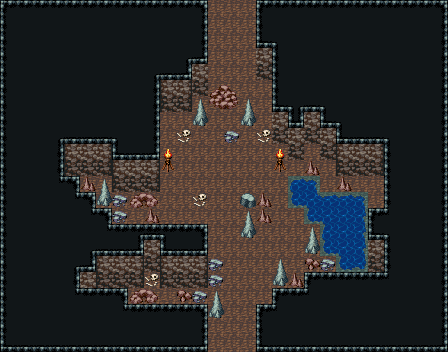

# 자연 동굴 · 보스방

둥근 결전장. 북쪽 굴길 앞 거대한 바위와 석순 둘, 그 앞 뼈 무더기가 보스가 버티는 자리이고 좌우 화로 둘이 비춘다. 동남쪽에 불규칙한 샘, 서북쪽엔 석순 숲, 벽에서 튀어나온 바위 둘이 몸을 숨길 자리. 보스 뒤 북쪽 굴길이 이긴 뒤 나가는 길. 28×22, tilesetId=oprn_dungeon_cave. 입구 (14,21), 주인·보스 자리 (14,10). 통행 검사 목표 [[14,10],[14,0],[18,14]].

출구: (14,21) → dungeon-cave-fork (15,0) 남쪽 → 갈림길 · (14,0) → deeper 북쪽 굴길 → 동굴 깊은 곳(보스를 이긴 뒤)



## 놓은 소품 (저작 순서)
(x,y)는 왼쪽 위, tiles는 행 단위 번호. 이식 칸(480~)은 공통 규칙 문서의 이식표.
```json
[
  {
    "prop": "회색 석순",
    "x": 12,
    "y": 6,
    "w": 1,
    "h": 2,
    "layer": "upper",
    "tiles": [
      [
        261
      ],
      [
        291
      ]
    ]
  },
  {
    "prop": "회색 석순",
    "x": 15,
    "y": 6,
    "w": 1,
    "h": 2,
    "layer": "upper",
    "tiles": [
      [
        261
      ],
      [
        291
      ]
    ]
  },
  {
    "prop": "큰 갈색 바위",
    "x": 13,
    "y": 5,
    "w": 2,
    "h": 2,
    "layer": "upper",
    "tiles": [
      [
        318,
        319
      ],
      [
        348,
        349
      ]
    ]
  },
  {
    "prop": "해골과 뼈",
    "x": 11,
    "y": 8,
    "w": 1,
    "h": 1,
    "layer": "upper",
    "tiles": [
      [
        299
      ]
    ]
  },
  {
    "prop": "해골과 뼈",
    "x": 16,
    "y": 8,
    "w": 1,
    "h": 1,
    "layer": "upper",
    "tiles": [
      [
        299
      ]
    ]
  },
  {
    "prop": "잔돌 더미",
    "x": 14,
    "y": 8,
    "w": 1,
    "h": 1,
    "layer": "upper",
    "tiles": [
      [
        383
      ]
    ]
  },
  {
    "prop": "화로",
    "x": 10,
    "y": 9,
    "w": 1,
    "h": 2,
    "layer": "upper",
    "tiles": [
      [
        263
      ],
      [
        293
      ]
    ]
  },
  {
    "prop": "화로",
    "x": 17,
    "y": 9,
    "w": 1,
    "h": 2,
    "layer": "upper",
    "tiles": [
      [
        263
      ],
      [
        293
      ]
    ]
  },
  {
    "prop": "작은 갈색 석순",
    "x": 9,
    "y": 13,
    "w": 1,
    "h": 1,
    "layer": "upper",
    "tiles": [
      [
        288
      ]
    ]
  },
  {
    "prop": "회색 석순",
    "x": 17,
    "y": 16,
    "w": 1,
    "h": 2,
    "layer": "upper",
    "tiles": [
      [
        261
      ],
      [
        291
      ]
    ]
  },
  {
    "prop": "작은 갈색 석순",
    "x": 18,
    "y": 17,
    "w": 1,
    "h": 1,
    "layer": "upper",
    "tiles": [
      [
        288
      ]
    ]
  },
  {
    "prop": "해골과 뼈",
    "x": 9,
    "y": 17,
    "w": 1,
    "h": 1,
    "layer": "upper",
    "tiles": [
      [
        299
      ]
    ]
  },
  {
    "prop": "작은 갈색 석순",
    "x": 21,
    "y": 11,
    "w": 1,
    "h": 1,
    "layer": "upper",
    "tiles": [
      [
        288
      ]
    ]
  },
  {
    "prop": "작은 갈색 석순",
    "x": 5,
    "y": 11,
    "w": 1,
    "h": 1,
    "layer": "upper",
    "tiles": [
      [
        288
      ]
    ]
  },
  {
    "prop": "작은 갈색 석순",
    "x": 19,
    "y": 10,
    "w": 1,
    "h": 1,
    "layer": "upper",
    "tiles": [
      [
        288
      ]
    ]
  },
  {
    "prop": "해골과 뼈",
    "x": 12,
    "y": 12,
    "w": 1,
    "h": 1,
    "layer": "upper",
    "tiles": [
      [
        299
      ]
    ]
  },
  {
    "kind": "outcrops",
    "note": "넓은 맨바닥을 가르는 바위 기둥(허공 덩이 + 벽면 두 줄)",
    "blobs": [
      {
        "at": [
          9,
          14
        ],
        "cells": 7
      },
      {
        "at": [
          6,
          8
        ],
        "cells": 13
      },
      {
        "at": [
          21,
          8
        ],
        "cells": 2
      },
      {
        "at": [
          17,
          5
        ],
        "cells": 9
      }
    ]
  },
  {
    "kind": "dressing",
    "note": "무너진 벽 곁·모서리에 몰아 둔 잔해 덩이(1~3곳) — 통로는 막지 않음",
    "clumps": [
      {
        "kind": "prop",
        "x": 19,
        "y": 14,
        "tiles": [
          [
            0,
            0,
            261
          ],
          [
            0,
            1,
            291
          ]
        ]
      },
      {
        "kind": "prop",
        "x": 19,
        "y": 16,
        "tiles": [
          [
            0,
            0,
            412
          ]
        ]
      },
      {
        "kind": "prop",
        "x": 20,
        "y": 16,
        "tiles": [
          [
            0,
            0,
            383
          ]
        ]
      },
      {
        "kind": "prop",
        "x": 13,
        "y": 18,
        "tiles": [
          [
            0,
            0,
            261
          ],
          [
            0,
            1,
            291
          ]
        ]
      },
      {
        "kind": "prop",
        "x": 8,
        "y": 18,
        "tiles": [
          [
            0,
            0,
            259
          ],
          [
            1,
            0,
            260
          ]
        ]
      },
      {
        "kind": "prop",
        "x": 11,
        "y": 18,
        "tiles": [
          [
            0,
            0,
            412
          ]
        ]
      },
      {
        "kind": "prop",
        "x": 12,
        "y": 18,
        "tiles": [
          [
            0,
            0,
            383
          ]
        ]
      },
      {
        "kind": "prop",
        "x": 13,
        "y": 17,
        "tiles": [
          [
            0,
            0,
            383
          ]
        ]
      },
      {
        "kind": "prop",
        "x": 13,
        "y": 16,
        "tiles": [
          [
            0,
            0,
            383
          ]
        ]
      },
      {
        "kind": "prop",
        "x": 6,
        "y": 11,
        "tiles": [
          [
            0,
            0,
            261
          ],
          [
            0,
            1,
            291
          ]
        ]
      },
      {
        "kind": "prop",
        "x": 7,
        "y": 12,
        "tiles": [
          [
            0,
            0,
            383
          ]
        ]
      },
      {
        "kind": "prop",
        "x": 7,
        "y": 13,
        "tiles": [
          [
            0,
            0,
            383
          ]
        ]
      },
      {
        "kind": "prop",
        "x": 8,
        "y": 12,
        "tiles": [
          [
            0,
            0,
            259
          ],
          [
            1,
            0,
            260
          ]
        ]
      },
      {
        "kind": "prop",
        "x": 15,
        "y": 13,
        "tiles": [
          [
            0,
            0,
            261
          ],
          [
            0,
            1,
            291
          ]
        ]
      },
      {
        "kind": "prop",
        "x": 16,
        "y": 13,
        "tiles": [
          [
            0,
            0,
            288
          ]
        ]
      },
      {
        "kind": "prop",
        "x": 15,
        "y": 12,
        "tiles": [
          [
            0,
            0,
            290
          ]
        ]
      },
      {
        "kind": "prop",
        "x": 16,
        "y": 12,
        "tiles": [
          [
            0,
            0,
            288
          ]
        ]
      }
    ]
  }
]
```

전체 두 레이어는 다음 배열 문서가 정답이다.
