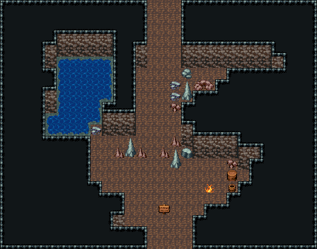

# 자연 동굴 · 입구

바깥에서 들어오는 굴 어귀. 서쪽에 불규칙한 지하 샘과 석순, 동쪽 벽에서 바위 턱이 튀어나와 그 아래가 무너진 옆굴(큰 바위·잔돌·희생자 해골). 어귀 안쪽엔 앞선 모험가의 야영 흔적(모닥불·나무통·물통)과 경고 표지판, 북쪽 굴길로 이어진다. 28×22, tilesetId=oprn_dungeon_cave. 입구 (15,21). 통행 검사 목표 [[8,12],[19,14],[16,14]].

출구: (13,0) → dungeon-cave-fork (15,22) 북쪽 굴길 → 갈림길 · (15,21) → outside 남쪽 굴 어귀 → 바깥



## 놓은 소품 (저작 순서)
(x,y)는 왼쪽 위, tiles는 행 단위 번호. 이식 칸(480~)은 공통 규칙 문서의 이식표.
```json
[
  {
    "prop": "회색 석순",
    "x": 11,
    "y": 12,
    "w": 1,
    "h": 2,
    "layer": "upper",
    "tiles": [
      [
        261
      ],
      [
        291
      ]
    ]
  },
  {
    "prop": "작은 갈색 석순",
    "x": 12,
    "y": 13,
    "w": 1,
    "h": 1,
    "layer": "upper",
    "tiles": [
      [
        288
      ]
    ]
  },
  {
    "prop": "작은 갈색 석순",
    "x": 10,
    "y": 13,
    "w": 1,
    "h": 1,
    "layer": "upper",
    "tiles": [
      [
        288
      ]
    ]
  },
  {
    "prop": "바닥 불길",
    "x": 18,
    "y": 16,
    "w": 1,
    "h": 1,
    "layer": "upper",
    "tiles": [
      [
        207
      ]
    ]
  },
  {
    "prop": "나무통",
    "x": 20,
    "y": 15,
    "w": 1,
    "h": 1,
    "layer": "upper",
    "tiles": [
      [
        417
      ]
    ]
  },
  {
    "prop": "물통",
    "x": 20,
    "y": 16,
    "w": 1,
    "h": 1,
    "layer": "upper",
    "tiles": [
      [
        419
      ]
    ]
  },
  {
    "prop": "표지판",
    "x": 14,
    "y": 18,
    "w": 1,
    "h": 1,
    "layer": "upper",
    "tiles": [
      [
        298
      ]
    ]
  },
  {
    "kind": "outcrops",
    "note": "넓은 맨바닥을 가르는 바위 기둥(허공 덩이 + 벽면 두 줄)",
    "blobs": [
      {
        "at": [
          10,
          5
        ],
        "cells": 9
      },
      {
        "at": [
          9,
          9
        ],
        "cells": 6
      },
      {
        "at": [
          17,
          11
        ],
        "cells": 2
      }
    ]
  },
  {
    "kind": "dressing",
    "note": "무너진 벽 곁·모서리에 몰아 둔 잔해 덩이(1~3곳) — 통로는 막지 않음",
    "clumps": [
      {
        "kind": "prop",
        "x": 20,
        "y": 14,
        "tiles": [
          [
            0,
            0,
            412
          ]
        ]
      },
      {
        "kind": "prop",
        "x": 8,
        "y": 11,
        "tiles": [
          [
            0,
            0,
            383
          ]
        ]
      },
      {
        "kind": "prop",
        "x": 16,
        "y": 7,
        "tiles": [
          [
            0,
            0,
            261
          ],
          [
            0,
            1,
            291
          ]
        ]
      },
      {
        "kind": "prop",
        "x": 15,
        "y": 8,
        "tiles": [
          [
            0,
            0,
            383
          ]
        ]
      },
      {
        "kind": "prop",
        "x": 17,
        "y": 7,
        "tiles": [
          [
            0,
            0,
            259
          ],
          [
            1,
            0,
            260
          ]
        ]
      },
      {
        "kind": "prop",
        "x": 15,
        "y": 7,
        "tiles": [
          [
            0,
            0,
            383
          ]
        ]
      },
      {
        "kind": "prop",
        "x": 16,
        "y": 6,
        "tiles": [
          [
            0,
            0,
            382
          ]
        ]
      },
      {
        "kind": "prop",
        "x": 15,
        "y": 9,
        "tiles": [
          [
            0,
            0,
            412
          ]
        ]
      },
      {
        "kind": "prop",
        "x": 16,
        "y": 13,
        "tiles": [
          [
            0,
            0,
            290
          ]
        ]
      },
      {
        "kind": "prop",
        "x": 15,
        "y": 13,
        "tiles": [
          [
            0,
            0,
            261
          ],
          [
            0,
            1,
            291
          ]
        ]
      },
      {
        "kind": "prop",
        "x": 15,
        "y": 12,
        "tiles": [
          [
            0,
            0,
            288
          ]
        ]
      },
      {
        "kind": "prop",
        "x": 14,
        "y": 13,
        "tiles": [
          [
            0,
            0,
            288
          ]
        ]
      }
    ]
  }
]
```

전체 두 레이어는 다음 배열 문서가 정답이다.
