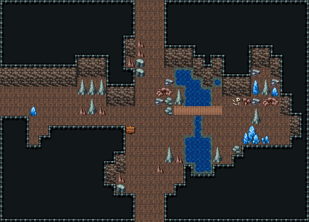

# 자연 동굴 · 갈림길

세 갈래 길. 가운데 표지판이 서쪽 보물방·북쪽 보스방을 가리키고, 동쪽은 지하 개울을 나무 다리로 건너는 수정 샘굴(막다른 곳, 큰 수정·수정 기둥·쓰러진 광부 해골). 수정은 샘굴과 서쪽 굴길 두 곳에 나뉘어 자란다. 32×23, tilesetId=oprn_dungeon_cave. 입구 (15,22). 통행 검사 목표 [[27,11],[2,9]].

출구: (15,0) → dungeon-cave-boss (14,21) 북쪽 → 보스방 · (0,9) → dungeon-cave-treasure (21,8) 서쪽 → 보물방 · (15,22) → dungeon-cave-entrance (13,0) 남쪽 → 입구



## 놓은 소품 (저작 순서)
(x,y)는 왼쪽 위, tiles는 행 단위 번호. 이식 칸(480~)은 공통 규칙 문서의 이식표.
```json
[
  {
    "prop": "표지판",
    "x": 13,
    "y": 13,
    "w": 1,
    "h": 1,
    "layer": "upper",
    "tiles": [
      [
        298
      ]
    ]
  },
  {
    "prop": "회색 석순",
    "x": 17,
    "y": 15,
    "w": 1,
    "h": 2,
    "layer": "upper",
    "tiles": [
      [
        261
      ],
      [
        291
      ]
    ]
  },
  {
    "prop": "작은 갈색 석순",
    "x": 18,
    "y": 16,
    "w": 1,
    "h": 1,
    "layer": "upper",
    "tiles": [
      [
        288
      ]
    ]
  },
  {
    "prop": "작은 갈색 석순",
    "x": 16,
    "y": 17,
    "w": 1,
    "h": 1,
    "layer": "upper",
    "tiles": [
      [
        288
      ]
    ]
  },
  {
    "prop": "회색 석순",
    "x": 9,
    "y": 10,
    "w": 1,
    "h": 2,
    "layer": "upper",
    "tiles": [
      [
        261
      ],
      [
        291
      ]
    ]
  },
  {
    "prop": "작은 갈색 석순",
    "x": 10,
    "y": 11,
    "w": 1,
    "h": 1,
    "layer": "upper",
    "tiles": [
      [
        288
      ]
    ]
  },
  {
    "prop": "작은 갈색 석순",
    "x": 8,
    "y": 11,
    "w": 1,
    "h": 1,
    "layer": "upper",
    "tiles": [
      [
        288
      ]
    ]
  },
  {
    "prop": "회색 석순",
    "x": 26,
    "y": 11,
    "w": 1,
    "h": 2,
    "layer": "upper",
    "tiles": [
      [
        261
      ],
      [
        291
      ]
    ]
  },
  {
    "prop": "푸른 수정 기둥",
    "x": 26,
    "y": 8,
    "w": 1,
    "h": 2,
    "layer": "upper",
    "tiles": [
      [
        262
      ],
      [
        292
      ]
    ]
  },
  {
    "prop": "작은 푸른 수정",
    "x": 28,
    "y": 9,
    "w": 1,
    "h": 1,
    "layer": "upper",
    "tiles": [
      [
        289
      ]
    ]
  },
  {
    "prop": "큰 푸른 수정",
    "x": 25,
    "y": 13,
    "w": 2,
    "h": 2,
    "layer": "upper",
    "tiles": [
      [
        320,
        321
      ],
      [
        350,
        351
      ]
    ]
  },
  {
    "prop": "수정 무더기",
    "x": 27,
    "y": 14,
    "w": 1,
    "h": 1,
    "layer": "upper",
    "tiles": [
      [
        413
      ]
    ]
  },
  {
    "prop": "해골과 뼈",
    "x": 24,
    "y": 10,
    "w": 1,
    "h": 1,
    "layer": "upper",
    "tiles": [
      [
        299
      ]
    ]
  },
  {
    "prop": "작은 푸른 수정",
    "x": 3,
    "y": 11,
    "w": 1,
    "h": 1,
    "layer": "upper",
    "tiles": [
      [
        289
      ]
    ]
  },
  {
    "kind": "outcrops",
    "note": "넓은 맨바닥을 가르는 바위 기둥(허공 덩이 + 벽면 두 줄)",
    "blobs": [
      {
        "at": [
          11,
          7
        ],
        "cells": 10
      },
      {
        "at": [
          23,
          6
        ],
        "cells": 10
      }
    ]
  },
  {
    "kind": "dressing",
    "note": "무너진 벽 곁·모서리에 몰아 둔 잔해 덩이(1~3곳) — 통로는 막지 않음",
    "clumps": [
      {
        "kind": "prop",
        "x": 22,
        "y": 15,
        "tiles": [
          [
            0,
            0,
            261
          ],
          [
            0,
            1,
            291
          ]
        ]
      },
      {
        "kind": "prop",
        "x": 24,
        "y": 15,
        "tiles": [
          [
            0,
            0,
            382
          ]
        ]
      },
      {
        "kind": "prop",
        "x": 18,
        "y": 9,
        "tiles": [
          [
            0,
            0,
            261
          ],
          [
            0,
            1,
            291
          ]
        ]
      },
      {
        "kind": "prop",
        "x": 17,
        "y": 10,
        "tiles": [
          [
            0,
            0,
            382
          ]
        ]
      },
      {
        "kind": "prop",
        "x": 16,
        "y": 9,
        "tiles": [
          [
            0,
            0,
            259
          ],
          [
            1,
            0,
            260
          ]
        ]
      },
      {
        "kind": "prop",
        "x": 17,
        "y": 8,
        "tiles": [
          [
            0,
            0,
            383
          ]
        ]
      },
      {
        "kind": "prop",
        "x": 16,
        "y": 10,
        "tiles": [
          [
            0,
            0,
            383
          ]
        ]
      },
      {
        "kind": "prop",
        "x": 17,
        "y": 11,
        "tiles": [
          [
            0,
            0,
            382
          ]
        ]
      },
      {
        "kind": "prop",
        "x": 27,
        "y": 8,
        "tiles": [
          [
            0,
            0,
            261
          ],
          [
            0,
            1,
            291
          ]
        ]
      },
      {
        "kind": "prop",
        "x": 28,
        "y": 8,
        "tiles": [
          [
            0,
            0,
            383
          ]
        ]
      },
      {
        "kind": "prop",
        "x": 26,
        "y": 7,
        "tiles": [
          [
            0,
            0,
            383
          ]
        ]
      },
      {
        "kind": "prop",
        "x": 27,
        "y": 10,
        "tiles": [
          [
            0,
            0,
            259
          ],
          [
            1,
            0,
            260
          ]
        ]
      },
      {
        "kind": "prop",
        "x": 26,
        "y": 10,
        "tiles": [
          [
            0,
            0,
            383
          ]
        ]
      },
      {
        "kind": "prop",
        "x": 25,
        "y": 10,
        "tiles": [
          [
            0,
            0,
            412
          ]
        ]
      },
      {
        "kind": "prop",
        "x": 12,
        "y": 19,
        "tiles": [
          [
            0,
            0,
            290
          ]
        ]
      },
      {
        "kind": "prop",
        "x": 12,
        "y": 18,
        "tiles": [
          [
            0,
            0,
            288
          ]
        ]
      },
      {
        "kind": "prop",
        "x": 10,
        "y": 8,
        "tiles": [
          [
            0,
            0,
            261
          ],
          [
            0,
            1,
            291
          ]
        ]
      },
      {
        "kind": "prop",
        "x": 9,
        "y": 8,
        "tiles": [
          [
            0,
            0,
            261
          ],
          [
            0,
            1,
            291
          ]
        ]
      },
      {
        "kind": "prop",
        "x": 8,
        "y": 8,
        "tiles": [
          [
            0,
            0,
            261
          ],
          [
            0,
            1,
            291
          ]
        ]
      },
      {
        "kind": "prop",
        "x": 13,
        "y": 6,
        "tiles": [
          [
            0,
            0,
            288
          ]
        ]
      },
      {
        "kind": "prop",
        "x": 14,
        "y": 6,
        "tiles": [
          [
            0,
            0,
            290
          ]
        ]
      },
      {
        "kind": "prop",
        "x": 14,
        "y": 5,
        "tiles": [
          [
            0,
            0,
            288
          ]
        ]
      },
      {
        "kind": "prop",
        "x": 14,
        "y": 7,
        "tiles": [
          [
            0,
            0,
            290
          ]
        ]
      },
      {
        "kind": "prop",
        "x": 14,
        "y": 4,
        "tiles": [
          [
            0,
            0,
            288
          ]
        ]
      }
    ]
  }
]
```

전체 두 레이어는 다음 배열 문서가 정답이다.
