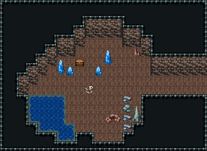

# 자연 동굴 · 보물방

막다른 보물방. 안쪽 벽 아래 닫힌 보물상자를 수정 기둥 둘과 작은 수정이 두르고, 상자 앞에 먼저 온 모험가의 해골. 서남쪽에 불규칙한 지하 샘, 동쪽 짧은 굴길 하나로만 들어온다. 22×16, tilesetId=oprn_dungeon_cave. 입구 (21,8). 통행 검사 목표 [[8,7],[5,8]].

출구: (21,8) → dungeon-cave-fork (0,9) 동쪽 → 갈림길



## 놓은 소품 (저작 순서)
(x,y)는 왼쪽 위, tiles는 행 단위 번호. 이식 칸(480~)은 공통 규칙 문서의 이식표.
```json
[
  {
    "prop": "보물상자",
    "x": 8,
    "y": 6,
    "w": 1,
    "h": 1,
    "layer": "upper",
    "tiles": [
      [
        480
      ]
    ]
  },
  {
    "prop": "푸른 수정 기둥",
    "x": 6,
    "y": 6,
    "w": 1,
    "h": 2,
    "layer": "upper",
    "tiles": [
      [
        262
      ],
      [
        292
      ]
    ]
  },
  {
    "prop": "푸른 수정 기둥",
    "x": 11,
    "y": 5,
    "w": 1,
    "h": 2,
    "layer": "upper",
    "tiles": [
      [
        262
      ],
      [
        292
      ]
    ]
  },
  {
    "prop": "작은 푸른 수정",
    "x": 7,
    "y": 7,
    "w": 1,
    "h": 1,
    "layer": "upper",
    "tiles": [
      [
        289
      ]
    ]
  },
  {
    "prop": "작은 푸른 수정",
    "x": 10,
    "y": 7,
    "w": 1,
    "h": 1,
    "layer": "upper",
    "tiles": [
      [
        289
      ]
    ]
  },
  {
    "prop": "해골과 뼈",
    "x": 9,
    "y": 9,
    "w": 1,
    "h": 1,
    "layer": "upper",
    "tiles": [
      [
        299
      ]
    ]
  },
  {
    "prop": "작은 갈색 석순",
    "x": 14,
    "y": 5,
    "w": 1,
    "h": 1,
    "layer": "upper",
    "tiles": [
      [
        288
      ]
    ]
  },
  {
    "prop": "돌무더기",
    "x": 11,
    "y": 12,
    "w": 2,
    "h": 1,
    "layer": "upper",
    "tiles": [
      [
        259,
        260
      ]
    ]
  },
  {
    "kind": "dressing",
    "note": "무너진 벽 곁·모서리에 몰아 둔 잔해 덩이(1~3곳) — 통로는 막지 않음",
    "clumps": [
      {
        "kind": "prop",
        "x": 14,
        "y": 11,
        "tiles": [
          [
            0,
            0,
            261
          ],
          [
            0,
            1,
            291
          ]
        ]
      },
      {
        "kind": "prop",
        "x": 13,
        "y": 12,
        "tiles": [
          [
            0,
            0,
            383
          ]
        ]
      },
      {
        "kind": "prop",
        "x": 13,
        "y": 11,
        "tiles": [
          [
            0,
            0,
            382
          ]
        ]
      },
      {
        "kind": "prop",
        "x": 13,
        "y": 13,
        "tiles": [
          [
            0,
            0,
            383
          ]
        ]
      },
      {
        "kind": "prop",
        "x": 13,
        "y": 10,
        "tiles": [
          [
            0,
            0,
            383
          ]
        ]
      }
    ]
  }
]
```

전체 두 레이어는 다음 배열 문서가 정답이다.
