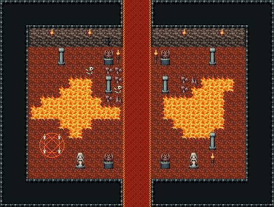

# 마왕성 · 보스방 앞

왕좌의 방 바로 앞 전실. 카펫이 남쪽에서 북쪽 문까지 가로지르고 좌우로 갈라진 용암 틈이 방을 둘로 가른다. 북쪽 문 양옆 가고일·화로, 모서리 석주 넷, 남서쪽에 결전 전 마지막 마법진(회복 자리), 남동쪽 화로. 북쪽 출구 좌표는 판타지 장소 「마왕성 왕좌의 방」 입구(14,24)와 맞춘다. 29×22, tilesetId=oprn_dungeon_stone. 입구 (14,21), 주인·보스 자리 (14,1). 통행 검사 목표 [[14,0],[5,16],[24,7]].

출구: (14,21) → dungeon-demon-trap (14,0) 남쪽 → 함정방 · (14,0) → fantasy-demon-throne (14,24) 북쪽 → 마왕성 왕좌의 방(판타지 장소)



## 놓은 소품 (저작 순서)
(x,y)는 왼쪽 위, tiles는 행 단위 번호. 이식 칸(480~)은 공통 규칙 문서의 이식표.
```json
[
  {
    "prop": "가고일 석상",
    "x": 11,
    "y": 5,
    "w": 1,
    "h": 2,
    "layer": "upper",
    "tiles": [
      [
        146
      ],
      [
        176
      ]
    ]
  },
  {
    "prop": "가고일 석상",
    "x": 17,
    "y": 5,
    "w": 1,
    "h": 2,
    "layer": "upper",
    "tiles": [
      [
        146
      ],
      [
        176
      ]
    ]
  },
  {
    "prop": "화로",
    "x": 12,
    "y": 5,
    "w": 1,
    "h": 2,
    "layer": "upper",
    "tiles": [
      [
        263
      ],
      [
        293
      ]
    ]
  },
  {
    "prop": "화로",
    "x": 16,
    "y": 5,
    "w": 1,
    "h": 2,
    "layer": "upper",
    "tiles": [
      [
        263
      ],
      [
        293
      ]
    ]
  },
  {
    "prop": "석주",
    "x": 6,
    "y": 5,
    "w": 1,
    "h": 2,
    "layer": "upper",
    "tiles": [
      [
        446
      ],
      [
        476
      ]
    ]
  },
  {
    "prop": "석주",
    "x": 22,
    "y": 5,
    "w": 1,
    "h": 2,
    "layer": "upper",
    "tiles": [
      [
        446
      ],
      [
        476
      ]
    ]
  },
  {
    "prop": "석주",
    "x": 6,
    "y": 14,
    "w": 1,
    "h": 2,
    "layer": "upper",
    "tiles": [
      [
        446
      ],
      [
        476
      ]
    ]
  },
  {
    "prop": "석주",
    "x": 22,
    "y": 14,
    "w": 1,
    "h": 2,
    "layer": "upper",
    "tiles": [
      [
        446
      ],
      [
        476
      ]
    ]
  },
  {
    "prop": "석주",
    "x": 11,
    "y": 8,
    "w": 1,
    "h": 2,
    "layer": "upper",
    "tiles": [
      [
        446
      ],
      [
        476
      ]
    ]
  },
  {
    "prop": "석주",
    "x": 17,
    "y": 8,
    "w": 1,
    "h": 2,
    "layer": "upper",
    "tiles": [
      [
        446
      ],
      [
        476
      ]
    ]
  },
  {
    "prop": "벽 횃불",
    "x": 5,
    "y": 3,
    "w": 1,
    "h": 1,
    "layer": "upper",
    "tiles": [
      [
        264
      ]
    ]
  },
  {
    "prop": "벽 횃불",
    "x": 23,
    "y": 3,
    "w": 1,
    "h": 1,
    "layer": "upper",
    "tiles": [
      [
        264
      ]
    ]
  },
  {
    "prop": "벽 횃불",
    "x": 9,
    "y": 3,
    "w": 1,
    "h": 1,
    "layer": "upper",
    "tiles": [
      [
        264
      ]
    ]
  },
  {
    "prop": "벽 횃불",
    "x": 19,
    "y": 3,
    "w": 1,
    "h": 1,
    "layer": "upper",
    "tiles": [
      [
        264
      ]
    ]
  },
  {
    "prop": "벽 균열",
    "x": 11,
    "y": 4,
    "w": 1,
    "h": 1,
    "layer": "upper",
    "tiles": [
      [
        267
      ]
    ]
  },
  {
    "prop": "붉은 마법진",
    "x": 4,
    "y": 14,
    "w": 3,
    "h": 3,
    "layer": "upper",
    "tiles": [
      [
        441,
        442,
        443
      ],
      [
        471,
        472,
        473
      ],
      [
        27,
        28,
        29
      ]
    ]
  },
  {
    "prop": "해골과 뼈",
    "x": 9,
    "y": 7,
    "w": 1,
    "h": 1,
    "layer": "upper",
    "tiles": [
      [
        299
      ]
    ]
  },
  {
    "prop": "화로",
    "x": 22,
    "y": 16,
    "w": 1,
    "h": 2,
    "layer": "upper",
    "tiles": [
      [
        263
      ],
      [
        293
      ]
    ]
  },
  {
    "prop": "가고일 석상",
    "x": 11,
    "y": 16,
    "w": 1,
    "h": 2,
    "layer": "upper",
    "tiles": [
      [
        146
      ],
      [
        176
      ]
    ]
  },
  {
    "prop": "가고일 석상",
    "x": 17,
    "y": 16,
    "w": 1,
    "h": 2,
    "layer": "upper",
    "tiles": [
      [
        146
      ],
      [
        176
      ]
    ]
  },
  {
    "prop": "여신 석상",
    "x": 8,
    "y": 16,
    "w": 1,
    "h": 2,
    "layer": "upper",
    "tiles": [
      [
        145
      ],
      [
        175
      ]
    ]
  },
  {
    "prop": "여신 석상",
    "x": 20,
    "y": 16,
    "w": 1,
    "h": 2,
    "layer": "upper",
    "tiles": [
      [
        145
      ],
      [
        175
      ]
    ]
  },
  {
    "kind": "dressing",
    "note": "무너진 벽 곁·모서리에 몰아 둔 잔해 덩이(1~3곳) — 통로는 막지 않음",
    "clumps": [
      {
        "kind": "prop",
        "x": 20,
        "y": 8,
        "tiles": [
          [
            0,
            0,
            288
          ]
        ]
      },
      {
        "kind": "prop",
        "x": 19,
        "y": 8,
        "tiles": [
          [
            0,
            0,
            412
          ]
        ]
      },
      {
        "kind": "prop",
        "x": 19,
        "y": 9,
        "tiles": [
          [
            0,
            0,
            412
          ]
        ]
      },
      {
        "kind": "prop",
        "x": 12,
        "y": 10,
        "tiles": [
          [
            0,
            0,
            288
          ]
        ]
      },
      {
        "kind": "prop",
        "x": 11,
        "y": 10,
        "tiles": [
          [
            0,
            0,
            412
          ]
        ]
      },
      {
        "kind": "prop",
        "x": 12,
        "y": 9,
        "tiles": [
          [
            0,
            0,
            299
          ]
        ]
      },
      {
        "kind": "prop",
        "x": 12,
        "y": 8,
        "tiles": [
          [
            0,
            0,
            412
          ]
        ]
      },
      {
        "kind": "prop",
        "x": 12,
        "y": 7,
        "tiles": [
          [
            0,
            0,
            412
          ]
        ]
      },
      {
        "kind": "prop",
        "x": 11,
        "y": 7,
        "tiles": [
          [
            0,
            0,
            412
          ]
        ]
      }
    ]
  }
]
```

전체 두 레이어는 다음 배열 문서가 정답이다.
