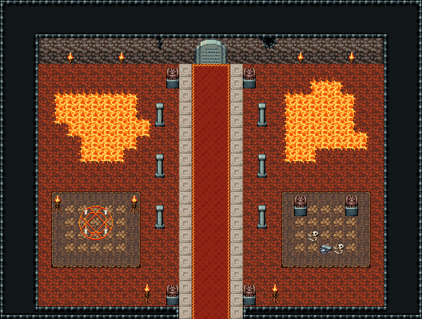

# 마왕성 · 정문 홀

마왕성 성문을 들어서면 나오는 정문 홀. 남쪽 성문 틈에서 무늬 석판 위 붉은 카펫이 북쪽 벽 석조 아치까지 곧게 가고, 양옆 석주 세 쌍이 줄지어 선다. 카펫 양쪽에 모양이 다른 용암 못 둘, 그 아래 갈색 단 둘 — 서쪽 단엔 화로 둘 사이 소환 마법진, 동쪽 단엔 가고일 둘이 지키는 뼈 무더기. 성문 안쪽과 아치 앞을 가고일이 지키고, 북쪽 벽엔 횃불과 금. 33×25, tilesetId=oprn_dungeon_stone. 입구 (16,24). 통행 검사 목표 [[16,5],[7,21],[25,21],[5,13],[27,13]].

출구: (16,24) → outdoor-demon-castle (30,34) 남쪽 성문 틈 → 마왕성 외관 · 재의 성채 정문 앞 · (16,5) → dungeon-demon-hall (17,16) 북쪽 벽 아치 → 1층 복도 남쪽 문



## 놓은 소품 (저작 순서)
(x,y)는 왼쪽 위, tiles는 행 단위 번호. 이식 칸(480~)은 공통 규칙 문서의 이식표.
```json
[
  {
    "prop": "석조 아치 문",
    "x": 15,
    "y": 3,
    "w": 3,
    "h": 2,
    "layer": "upper",
    "tiles": [
      [
        438,
        439,
        440
      ],
      [
        468,
        469,
        470
      ]
    ]
  },
  {
    "prop": "가고일 석상",
    "x": 13,
    "y": 5,
    "w": 1,
    "h": 2,
    "layer": "upper",
    "tiles": [
      [
        146
      ],
      [
        176
      ]
    ]
  },
  {
    "prop": "가고일 석상",
    "x": 19,
    "y": 5,
    "w": 1,
    "h": 2,
    "layer": "upper",
    "tiles": [
      [
        146
      ],
      [
        176
      ]
    ]
  },
  {
    "prop": "석주",
    "x": 12,
    "y": 8,
    "w": 1,
    "h": 2,
    "layer": "upper",
    "tiles": [
      [
        446
      ],
      [
        476
      ]
    ]
  },
  {
    "prop": "석주",
    "x": 20,
    "y": 8,
    "w": 1,
    "h": 2,
    "layer": "upper",
    "tiles": [
      [
        446
      ],
      [
        476
      ]
    ]
  },
  {
    "prop": "석주",
    "x": 12,
    "y": 12,
    "w": 1,
    "h": 2,
    "layer": "upper",
    "tiles": [
      [
        446
      ],
      [
        476
      ]
    ]
  },
  {
    "prop": "석주",
    "x": 20,
    "y": 12,
    "w": 1,
    "h": 2,
    "layer": "upper",
    "tiles": [
      [
        446
      ],
      [
        476
      ]
    ]
  },
  {
    "prop": "석주",
    "x": 12,
    "y": 16,
    "w": 1,
    "h": 2,
    "layer": "upper",
    "tiles": [
      [
        446
      ],
      [
        476
      ]
    ]
  },
  {
    "prop": "석주",
    "x": 20,
    "y": 16,
    "w": 1,
    "h": 2,
    "layer": "upper",
    "tiles": [
      [
        446
      ],
      [
        476
      ]
    ]
  },
  {
    "prop": "가고일 석상",
    "x": 13,
    "y": 22,
    "w": 1,
    "h": 2,
    "layer": "upper",
    "tiles": [
      [
        146
      ],
      [
        176
      ]
    ]
  },
  {
    "prop": "가고일 석상",
    "x": 19,
    "y": 22,
    "w": 1,
    "h": 2,
    "layer": "upper",
    "tiles": [
      [
        146
      ],
      [
        176
      ]
    ]
  },
  {
    "prop": "화로",
    "x": 11,
    "y": 22,
    "w": 1,
    "h": 2,
    "layer": "upper",
    "tiles": [
      [
        263
      ],
      [
        293
      ]
    ]
  },
  {
    "prop": "화로",
    "x": 21,
    "y": 22,
    "w": 1,
    "h": 2,
    "layer": "upper",
    "tiles": [
      [
        263
      ],
      [
        293
      ]
    ]
  },
  {
    "prop": "붉은 마법진",
    "x": 6,
    "y": 16,
    "w": 3,
    "h": 3,
    "layer": "upper",
    "tiles": [
      [
        441,
        442,
        443
      ],
      [
        471,
        472,
        473
      ],
      [
        27,
        28,
        29
      ]
    ]
  },
  {
    "prop": "화로",
    "x": 4,
    "y": 15,
    "w": 1,
    "h": 2,
    "layer": "upper",
    "tiles": [
      [
        263
      ],
      [
        293
      ]
    ]
  },
  {
    "prop": "화로",
    "x": 10,
    "y": 15,
    "w": 1,
    "h": 2,
    "layer": "upper",
    "tiles": [
      [
        263
      ],
      [
        293
      ]
    ]
  },
  {
    "prop": "가고일 석상",
    "x": 23,
    "y": 15,
    "w": 1,
    "h": 2,
    "layer": "upper",
    "tiles": [
      [
        146
      ],
      [
        176
      ]
    ]
  },
  {
    "prop": "가고일 석상",
    "x": 27,
    "y": 15,
    "w": 1,
    "h": 2,
    "layer": "upper",
    "tiles": [
      [
        146
      ],
      [
        176
      ]
    ]
  },
  {
    "prop": "해골과 뼈",
    "x": 24,
    "y": 18,
    "w": 1,
    "h": 1,
    "layer": "upper",
    "tiles": [
      [
        299
      ]
    ]
  },
  {
    "prop": "해골과 뼈",
    "x": 26,
    "y": 19,
    "w": 1,
    "h": 1,
    "layer": "upper",
    "tiles": [
      [
        299
      ]
    ]
  },
  {
    "prop": "잔돌 더미",
    "x": 25,
    "y": 19,
    "w": 1,
    "h": 1,
    "layer": "upper",
    "tiles": [
      [
        383
      ]
    ]
  },
  {
    "prop": "벽 횃불",
    "x": 5,
    "y": 4,
    "w": 1,
    "h": 1,
    "layer": "upper",
    "tiles": [
      [
        264
      ]
    ]
  },
  {
    "prop": "벽 횃불",
    "x": 9,
    "y": 4,
    "w": 1,
    "h": 1,
    "layer": "upper",
    "tiles": [
      [
        264
      ]
    ]
  },
  {
    "prop": "벽 횃불",
    "x": 23,
    "y": 4,
    "w": 1,
    "h": 1,
    "layer": "upper",
    "tiles": [
      [
        264
      ]
    ]
  },
  {
    "prop": "벽 횃불",
    "x": 27,
    "y": 4,
    "w": 1,
    "h": 1,
    "layer": "upper",
    "tiles": [
      [
        264
      ]
    ]
  },
  {
    "prop": "벽 균열",
    "x": 12,
    "y": 3,
    "w": 1,
    "h": 1,
    "layer": "upper",
    "tiles": [
      [
        267
      ]
    ]
  },
  {
    "prop": "벽 균열 큰",
    "x": 20,
    "y": 3,
    "w": 2,
    "h": 1,
    "layer": "upper",
    "tiles": [
      [
        268,
        269
      ]
    ]
  }
]
```

전체 두 레이어는 다음 배열 문서가 정답이다.
