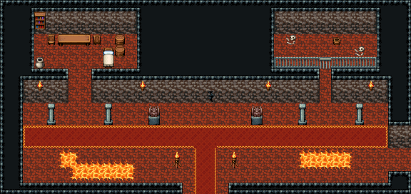

# 마왕성 · 1층 복도

정문으로 들어서면 동서로 긴 복도. 붉은 러너 양옆에 석주와 가고일, 남쪽 벽 아래 바닥이 갈라져 용암이 비치고, 카펫 끝 남쪽 문 틈(화로 둘)이 정문 홀로 나간다. 서쪽 문은 경비실(탁자·간이 침대·나무통), 북동쪽 문은 창살 감옥(안쪽은 막힘), 동쪽 끝이 함정방으로 가는 길. 36×17, tilesetId=oprn_dungeon_stone. 입구 (17,16). 통행 검사 목표 [[4,5],[28,7],[30,12],[3,12]].

출구: (17,16) → dungeon-demon-front (16,5) 남쪽 문 틈 → 마왕성 정문 홀 북쪽 아치 · (35,13) → dungeon-demon-trap (0,12) 동쪽 끝 → 함정방

닫힌 곳: 북동쪽 감옥 칸은 쇠창살 너머라 복도에서 닿지 않는다(창살 문을 여는 건 이벤트 몫)



## 놓은 소품 (저작 순서)
(x,y)는 왼쪽 위, tiles는 행 단위 번호. 이식 칸(480~)은 공통 규칙 문서의 이식표.
```json
[
  {
    "prop": "가고일 석상",
    "x": 13,
    "y": 9,
    "w": 1,
    "h": 2,
    "layer": "upper",
    "tiles": [
      [
        146
      ],
      [
        176
      ]
    ]
  },
  {
    "prop": "가고일 석상",
    "x": 22,
    "y": 9,
    "w": 1,
    "h": 2,
    "layer": "upper",
    "tiles": [
      [
        146
      ],
      [
        176
      ]
    ]
  },
  {
    "prop": "석주",
    "x": 4,
    "y": 9,
    "w": 1,
    "h": 2,
    "layer": "upper",
    "tiles": [
      [
        446
      ],
      [
        476
      ]
    ]
  },
  {
    "prop": "석주",
    "x": 9,
    "y": 9,
    "w": 1,
    "h": 2,
    "layer": "upper",
    "tiles": [
      [
        446
      ],
      [
        476
      ]
    ]
  },
  {
    "prop": "석주",
    "x": 26,
    "y": 9,
    "w": 1,
    "h": 2,
    "layer": "upper",
    "tiles": [
      [
        446
      ],
      [
        476
      ]
    ]
  },
  {
    "prop": "석주",
    "x": 31,
    "y": 9,
    "w": 1,
    "h": 2,
    "layer": "upper",
    "tiles": [
      [
        446
      ],
      [
        476
      ]
    ]
  },
  {
    "prop": "화로",
    "x": 15,
    "y": 13,
    "w": 1,
    "h": 2,
    "layer": "upper",
    "tiles": [
      [
        263
      ],
      [
        293
      ]
    ]
  },
  {
    "prop": "화로",
    "x": 20,
    "y": 13,
    "w": 1,
    "h": 2,
    "layer": "upper",
    "tiles": [
      [
        263
      ],
      [
        293
      ]
    ]
  },
  {
    "prop": "벽 횃불",
    "x": 12,
    "y": 7,
    "w": 1,
    "h": 1,
    "layer": "upper",
    "tiles": [
      [
        264
      ]
    ]
  },
  {
    "prop": "벽 횃불",
    "x": 23,
    "y": 7,
    "w": 1,
    "h": 1,
    "layer": "upper",
    "tiles": [
      [
        264
      ]
    ]
  },
  {
    "prop": "벽 횃불",
    "x": 3,
    "y": 7,
    "w": 1,
    "h": 1,
    "layer": "upper",
    "tiles": [
      [
        264
      ]
    ]
  },
  {
    "prop": "벽 횃불",
    "x": 32,
    "y": 7,
    "w": 1,
    "h": 1,
    "layer": "upper",
    "tiles": [
      [
        264
      ]
    ]
  },
  {
    "prop": "벽 균열",
    "x": 18,
    "y": 8,
    "w": 1,
    "h": 1,
    "layer": "upper",
    "tiles": [
      [
        267
      ]
    ]
  },
  {
    "prop": "긴 탁자",
    "x": 5,
    "y": 3,
    "w": 3,
    "h": 1,
    "layer": "upper",
    "tiles": [
      [
        385,
        386,
        387
      ]
    ]
  },
  {
    "prop": "의자(왼쪽 보기)",
    "x": 4,
    "y": 3,
    "w": 1,
    "h": 1,
    "layer": "upper",
    "tiles": [
      [
        327
      ]
    ]
  },
  {
    "prop": "의자(오른쪽 보기)",
    "x": 8,
    "y": 3,
    "w": 1,
    "h": 1,
    "layer": "upper",
    "tiles": [
      [
        328
      ]
    ]
  },
  {
    "prop": "나무통",
    "x": 10,
    "y": 3,
    "w": 1,
    "h": 1,
    "layer": "upper",
    "tiles": [
      [
        417
      ]
    ]
  },
  {
    "prop": "나무통",
    "x": 10,
    "y": 4,
    "w": 1,
    "h": 1,
    "layer": "upper",
    "tiles": [
      [
        417
      ]
    ]
  },
  {
    "prop": "항아리",
    "x": 3,
    "y": 5,
    "w": 1,
    "h": 1,
    "layer": "upper",
    "tiles": [
      [
        418
      ]
    ]
  },
  {
    "prop": "침대",
    "x": 9,
    "y": 4,
    "w": 1,
    "h": 2,
    "layer": "upper",
    "tiles": [
      [
        384
      ],
      [
        414
      ]
    ]
  },
  {
    "prop": "책장",
    "x": 3,
    "y": 1,
    "w": 1,
    "h": 2,
    "layer": "upper",
    "tiles": [
      [
        329
      ],
      [
        359
      ]
    ]
  },
  {
    "prop": "쇠창살 왼끝",
    "x": 24,
    "y": 5,
    "w": 1,
    "h": 1,
    "layer": "upper",
    "tiles": [
      [
        234
      ]
    ]
  },
  {
    "prop": "쇠창살",
    "x": 25,
    "y": 5,
    "w": 1,
    "h": 1,
    "layer": "upper",
    "tiles": [
      [
        235
      ]
    ]
  },
  {
    "prop": "쇠창살",
    "x": 26,
    "y": 5,
    "w": 1,
    "h": 1,
    "layer": "upper",
    "tiles": [
      [
        235
      ]
    ]
  },
  {
    "prop": "쇠창살",
    "x": 27,
    "y": 5,
    "w": 1,
    "h": 1,
    "layer": "upper",
    "tiles": [
      [
        235
      ]
    ]
  },
  {
    "prop": "창살 문",
    "x": 28,
    "y": 5,
    "w": 1,
    "h": 1,
    "layer": "upper",
    "tiles": [
      [
        205
      ]
    ]
  },
  {
    "prop": "쇠창살",
    "x": 29,
    "y": 5,
    "w": 1,
    "h": 1,
    "layer": "upper",
    "tiles": [
      [
        235
      ]
    ]
  },
  {
    "prop": "쇠창살",
    "x": 30,
    "y": 5,
    "w": 1,
    "h": 1,
    "layer": "upper",
    "tiles": [
      [
        235
      ]
    ]
  },
  {
    "prop": "쇠창살",
    "x": 31,
    "y": 5,
    "w": 1,
    "h": 1,
    "layer": "upper",
    "tiles": [
      [
        235
      ]
    ]
  },
  {
    "prop": "쇠창살 오른끝",
    "x": 32,
    "y": 5,
    "w": 1,
    "h": 1,
    "layer": "upper",
    "tiles": [
      [
        236
      ]
    ]
  },
  {
    "prop": "해골과 뼈",
    "x": 25,
    "y": 3,
    "w": 1,
    "h": 1,
    "layer": "upper",
    "tiles": [
      [
        299
      ]
    ]
  },
  {
    "prop": "해골과 뼈",
    "x": 31,
    "y": 4,
    "w": 1,
    "h": 1,
    "layer": "upper",
    "tiles": [
      [
        299
      ]
    ]
  },
  {
    "prop": "물통",
    "x": 29,
    "y": 3,
    "w": 1,
    "h": 1,
    "layer": "upper",
    "tiles": [
      [
        419
      ]
    ]
  }
]
```

전체 두 레이어는 다음 배열 문서가 정답이다.
