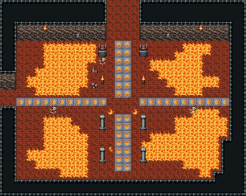

# 마왕성 · 함정방

모양과 크기가 다른 용암 못 넷, 가운데 십자 길에 방향 화살표 판(서쪽 줄은 동쪽으로, 가운데 줄은 북쪽·남쪽으로 민다)이 깔린 함정방. 길목에 바닥 불길과 석주, 벽에 레버 둘, 쓰러진 해골. 함정 동작은 없는 그림만의 배치 — 이벤트는 나중에. 30×24, tilesetId=oprn_dungeon_stone. 입구 (0,12). 통행 검사 목표 [[14,1],[26,12],[15,21],[3,6]].

출구: (0,12) → dungeon-demon-hall (35,13) 서쪽 → 복도 · (14,0) → dungeon-demon-antechamber (14,21) 북쪽 → 보스방 앞



## 놓은 소품 (저작 순서)
(x,y)는 왼쪽 위, tiles는 행 단위 번호. 이식 칸(480~)은 공통 규칙 문서의 이식표.
```json
[
  {
    "prop": "바닥 불길",
    "x": 13,
    "y": 13,
    "w": 1,
    "h": 1,
    "layer": "upper",
    "tiles": [
      [
        207
      ]
    ]
  },
  {
    "prop": "바닥 불길",
    "x": 16,
    "y": 13,
    "w": 1,
    "h": 1,
    "layer": "upper",
    "tiles": [
      [
        207
      ]
    ]
  },
  {
    "prop": "바닥 불길 작은",
    "x": 13,
    "y": 18,
    "w": 1,
    "h": 1,
    "layer": "upper",
    "tiles": [
      [
        209
      ]
    ]
  },
  {
    "prop": "벽 레버",
    "x": 20,
    "y": 4,
    "w": 1,
    "h": 1,
    "layer": "upper",
    "tiles": [
      [
        266
      ]
    ]
  },
  {
    "prop": "벽 레버",
    "x": 9,
    "y": 4,
    "w": 1,
    "h": 1,
    "layer": "upper",
    "tiles": [
      [
        266
      ]
    ]
  },
  {
    "prop": "벽 횃불",
    "x": 5,
    "y": 3,
    "w": 1,
    "h": 1,
    "layer": "upper",
    "tiles": [
      [
        264
      ]
    ]
  },
  {
    "prop": "벽 횃불",
    "x": 24,
    "y": 3,
    "w": 1,
    "h": 1,
    "layer": "upper",
    "tiles": [
      [
        264
      ]
    ]
  },
  {
    "prop": "가고일 석상",
    "x": 12,
    "y": 5,
    "w": 1,
    "h": 2,
    "layer": "upper",
    "tiles": [
      [
        146
      ],
      [
        176
      ]
    ]
  },
  {
    "prop": "가고일 석상",
    "x": 17,
    "y": 5,
    "w": 1,
    "h": 2,
    "layer": "upper",
    "tiles": [
      [
        146
      ],
      [
        176
      ]
    ]
  },
  {
    "prop": "석주",
    "x": 12,
    "y": 14,
    "w": 1,
    "h": 2,
    "layer": "upper",
    "tiles": [
      [
        446
      ],
      [
        476
      ]
    ]
  },
  {
    "prop": "석주",
    "x": 17,
    "y": 14,
    "w": 1,
    "h": 2,
    "layer": "upper",
    "tiles": [
      [
        446
      ],
      [
        476
      ]
    ]
  },
  {
    "prop": "석주",
    "x": 12,
    "y": 18,
    "w": 1,
    "h": 2,
    "layer": "upper",
    "tiles": [
      [
        446
      ],
      [
        476
      ]
    ]
  },
  {
    "prop": "석주",
    "x": 17,
    "y": 18,
    "w": 1,
    "h": 2,
    "layer": "upper",
    "tiles": [
      [
        446
      ],
      [
        476
      ]
    ]
  },
  {
    "prop": "화로",
    "x": 12,
    "y": 9,
    "w": 1,
    "h": 2,
    "layer": "upper",
    "tiles": [
      [
        263
      ],
      [
        293
      ]
    ]
  },
  {
    "prop": "화로",
    "x": 17,
    "y": 9,
    "w": 1,
    "h": 2,
    "layer": "upper",
    "tiles": [
      [
        263
      ],
      [
        293
      ]
    ]
  },
  {
    "prop": "해골과 뼈",
    "x": 6,
    "y": 13,
    "w": 1,
    "h": 1,
    "layer": "upper",
    "tiles": [
      [
        299
      ]
    ]
  },
  {
    "prop": "해골과 뼈",
    "x": 23,
    "y": 13,
    "w": 1,
    "h": 1,
    "layer": "upper",
    "tiles": [
      [
        299
      ]
    ]
  },
  {
    "kind": "dressing",
    "note": "무너진 벽 곁·모서리에 몰아 둔 잔해 덩이(1~3곳) — 통로는 막지 않음",
    "clumps": [
      {
        "kind": "prop",
        "x": 11,
        "y": 8,
        "tiles": [
          [
            0,
            0,
            288
          ]
        ]
      },
      {
        "kind": "prop",
        "x": 12,
        "y": 7,
        "tiles": [
          [
            0,
            0,
            299
          ]
        ]
      },
      {
        "kind": "prop",
        "x": 11,
        "y": 10,
        "tiles": [
          [
            0,
            0,
            412
          ]
        ]
      }
    ]
  }
]
```

전체 두 레이어는 다음 배열 문서가 정답이다.
