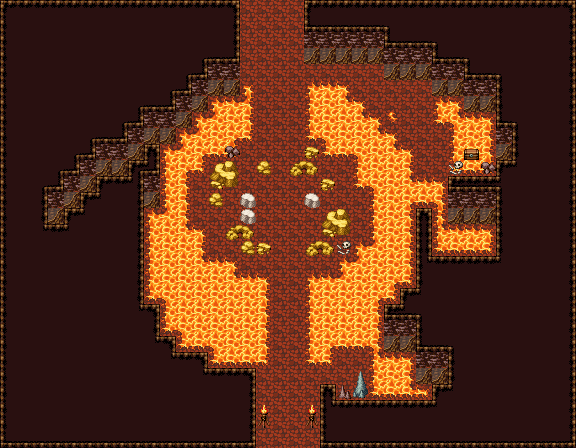

# 용의 둥지 · 황금 더미

불규칙한 용암 해자가 두른 둥지 섬. 용이 앉는 자리를 둘러 황금 더미와 금화가 쌓이고 그 사이 커다란 알 셋. 해자는 남·북 바위 둑으로만 건넌다. 귀퉁이에 용암 웅덩이, 석순 무리 둘, 동쪽 벽 아래 먼저 온 기사의 해골과 보물상자. 황금·알은 이 장소 전용으로 다시 칠한 칸(259·260·322·323·352·353·382·383 금, 290 알). 36×28, tilesetId=oprn_dungeon_lair. 입구 (17,27), 주인·보스 자리 (17,12). 통행 검사 목표 [[17,12],[27,9],[16,1],[25,6]].

출구: (17,27) → outside 남쪽 → 화산 굴길 · (16,0) → sky 북쪽 → 용이 드나드는 하늘 구멍



## 놓은 소품 (저작 순서)
(x,y)는 왼쪽 위, tiles는 행 단위 번호. 이식 칸(480~)은 공통 규칙 문서의 이식표.
```json
[
  {
    "prop": "큰 회색 바위",
    "x": 13,
    "y": 10,
    "w": 2,
    "h": 2,
    "layer": "upper",
    "tiles": [
      [
        322,
        323
      ],
      [
        352,
        353
      ]
    ]
  },
  {
    "prop": "큰 회색 바위",
    "x": 20,
    "y": 13,
    "w": 2,
    "h": 2,
    "layer": "upper",
    "tiles": [
      [
        322,
        323
      ],
      [
        352,
        353
      ]
    ]
  },
  {
    "prop": "돌무더기",
    "x": 18,
    "y": 10,
    "w": 2,
    "h": 1,
    "layer": "upper",
    "tiles": [
      [
        259,
        260
      ]
    ]
  },
  {
    "prop": "돌무더기",
    "x": 14,
    "y": 14,
    "w": 2,
    "h": 1,
    "layer": "upper",
    "tiles": [
      [
        259,
        260
      ]
    ]
  },
  {
    "prop": "회색 자갈",
    "x": 16,
    "y": 10,
    "w": 1,
    "h": 1,
    "layer": "upper",
    "tiles": [
      [
        382
      ]
    ]
  },
  {
    "prop": "잔돌 더미",
    "x": 20,
    "y": 11,
    "w": 1,
    "h": 1,
    "layer": "upper",
    "tiles": [
      [
        383
      ]
    ]
  },
  {
    "prop": "회색 자갈",
    "x": 13,
    "y": 12,
    "w": 1,
    "h": 1,
    "layer": "upper",
    "tiles": [
      [
        382
      ]
    ]
  },
  {
    "prop": "잔돌 더미",
    "x": 16,
    "y": 15,
    "w": 1,
    "h": 1,
    "layer": "upper",
    "tiles": [
      [
        383
      ]
    ]
  },
  {
    "prop": "둥근 돌",
    "x": 15,
    "y": 12,
    "w": 1,
    "h": 1,
    "layer": "upper",
    "tiles": [
      [
        290
      ]
    ]
  },
  {
    "prop": "둥근 돌",
    "x": 15,
    "y": 13,
    "w": 1,
    "h": 1,
    "layer": "upper",
    "tiles": [
      [
        290
      ]
    ]
  },
  {
    "prop": "둥근 돌",
    "x": 19,
    "y": 12,
    "w": 1,
    "h": 1,
    "layer": "upper",
    "tiles": [
      [
        290
      ]
    ]
  },
  {
    "prop": "해골과 뼈",
    "x": 21,
    "y": 15,
    "w": 1,
    "h": 1,
    "layer": "upper",
    "tiles": [
      [
        299
      ]
    ]
  },
  {
    "prop": "회색 자갈",
    "x": 15,
    "y": 15,
    "w": 1,
    "h": 1,
    "layer": "upper",
    "tiles": [
      [
        382
      ]
    ]
  },
  {
    "prop": "잔돌 더미",
    "x": 19,
    "y": 9,
    "w": 1,
    "h": 1,
    "layer": "upper",
    "tiles": [
      [
        383
      ]
    ]
  },
  {
    "prop": "돌무더기",
    "x": 19,
    "y": 15,
    "w": 2,
    "h": 1,
    "layer": "upper",
    "tiles": [
      [
        259,
        260
      ]
    ]
  },
  {
    "prop": "갈색 잔돌",
    "x": 14,
    "y": 9,
    "w": 1,
    "h": 1,
    "layer": "upper",
    "tiles": [
      [
        412
      ]
    ]
  },
  {
    "prop": "보물상자",
    "x": 29,
    "y": 9,
    "w": 1,
    "h": 1,
    "layer": "upper",
    "tiles": [
      [
        480
      ]
    ]
  },
  {
    "prop": "해골과 뼈",
    "x": 28,
    "y": 10,
    "w": 1,
    "h": 1,
    "layer": "upper",
    "tiles": [
      [
        299
      ]
    ]
  },
  {
    "prop": "갈색 잔돌",
    "x": 30,
    "y": 10,
    "w": 1,
    "h": 1,
    "layer": "upper",
    "tiles": [
      [
        412
      ]
    ]
  },
  {
    "prop": "회색 석순",
    "x": 22,
    "y": 23,
    "w": 1,
    "h": 2,
    "layer": "upper",
    "tiles": [
      [
        261
      ],
      [
        291
      ]
    ]
  },
  {
    "prop": "작은 갈색 석순",
    "x": 21,
    "y": 24,
    "w": 1,
    "h": 1,
    "layer": "upper",
    "tiles": [
      [
        288
      ]
    ]
  },
  {
    "prop": "바닥 불길 작은",
    "x": 24,
    "y": 7,
    "w": 1,
    "h": 1,
    "layer": "upper",
    "tiles": [
      [
        209
      ]
    ]
  },
  {
    "prop": "화로",
    "x": 16,
    "y": 25,
    "w": 1,
    "h": 2,
    "layer": "upper",
    "tiles": [
      [
        263
      ],
      [
        293
      ]
    ]
  },
  {
    "prop": "화로",
    "x": 19,
    "y": 25,
    "w": 1,
    "h": 2,
    "layer": "upper",
    "tiles": [
      [
        263
      ],
      [
        293
      ]
    ]
  }
]
```

전체 두 레이어는 다음 배열 문서가 정답이다.
