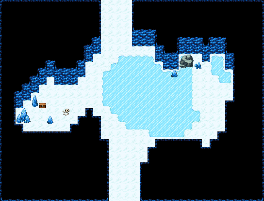

# 얼음 동굴 · 얼어붙은 호수

가운데 가장자리가 불규칙한 얼어붙은 호수(미끄러운 얼음판, 위에는 아무것도 없다)와 동쪽의 작은 얼음 웅덩이. 서쪽은 얼음 바위 뒤 수정 샘굴(큰 수정·수정 기둥 사이 보물상자, 얼어붙은 모험가), 북쪽 벽 아래 푸른 얼음 틈과 부서진 얼음. 남쪽 입구에서 북쪽 굴길로는 호수를 건너거나 가장자리를 돌아간다. 34×26, tilesetId=oprn_dungeon_stone. 입구 (15,25). 통행 검사 목표 [[14,1],[6,12],[28,12],[18,18]].

출구: (15,25) → outside 남쪽 → 설산 · (14,0) → deeper 북쪽 굴길 → 더 깊은 곳



## 놓은 소품 (저작 순서)
(x,y)는 왼쪽 위, tiles는 행 단위 번호. 이식 칸(480~)은 공통 규칙 문서의 이식표.
```json
[
  {
    "prop": "푸른 수정 기둥",
    "x": 4,
    "y": 12,
    "w": 1,
    "h": 2,
    "layer": "upper",
    "tiles": [
      [
        262
      ],
      [
        292
      ]
    ]
  },
  {
    "prop": "큰 푸른 수정",
    "x": 2,
    "y": 14,
    "w": 2,
    "h": 2,
    "layer": "upper",
    "tiles": [
      [
        320,
        321
      ],
      [
        350,
        351
      ]
    ]
  },
  {
    "prop": "작은 푸른 수정",
    "x": 6,
    "y": 15,
    "w": 1,
    "h": 1,
    "layer": "upper",
    "tiles": [
      [
        289
      ]
    ]
  },
  {
    "prop": "보물상자",
    "x": 5,
    "y": 13,
    "w": 1,
    "h": 1,
    "layer": "upper",
    "tiles": [
      [
        480
      ]
    ]
  },
  {
    "prop": "해골과 뼈",
    "x": 8,
    "y": 14,
    "w": 1,
    "h": 1,
    "layer": "upper",
    "tiles": [
      [
        299
      ]
    ]
  },
  {
    "prop": "큰 회색 바위",
    "x": 23,
    "y": 7,
    "w": 2,
    "h": 2,
    "layer": "upper",
    "tiles": [
      [
        322,
        323
      ],
      [
        352,
        353
      ]
    ]
  },
  {
    "prop": "수정 무더기",
    "x": 25,
    "y": 8,
    "w": 1,
    "h": 1,
    "layer": "upper",
    "tiles": [
      [
        413
      ]
    ]
  },
  {
    "prop": "작은 푸른 수정",
    "x": 22,
    "y": 9,
    "w": 1,
    "h": 1,
    "layer": "upper",
    "tiles": [
      [
        289
      ]
    ]
  }
]
```

전체 두 레이어는 다음 배열 문서가 정답이다.
