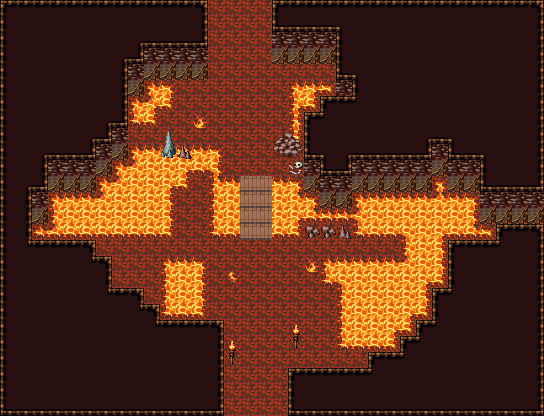

# 용암 동굴 · 불의 강

굽이치는 불의 강이 동굴을 동서로 가르고 가운데 판자 다리 하나로만 건넌다. 북서쪽·남동쪽·남서쪽에 가장자리가 불규칙한 용암 웅덩이, 강 건너 북쪽엔 큰 바위 곁에 쓰러진 모험가의 해골, 강가에 바닥 불길. 입구 양옆 화로. 34×26, tilesetId=oprn_dungeon_stone. 입구 (15,25). 통행 검사 목표 [[14,1],[24,15],[12,5]].

출구: (15,25) → outside 남쪽 → 화산 기슭 · (14,0) → deeper 북쪽 → 화산 심장부



## 놓은 소품 (저작 순서)
(x,y)는 왼쪽 위, tiles는 행 단위 번호. 이식 칸(480~)은 공통 규칙 문서의 이식표.
```json
[
  {
    "prop": "큰 갈색 바위",
    "x": 17,
    "y": 8,
    "w": 2,
    "h": 2,
    "layer": "upper",
    "tiles": [
      [
        318,
        319
      ],
      [
        348,
        349
      ]
    ]
  },
  {
    "prop": "해골과 뼈",
    "x": 18,
    "y": 10,
    "w": 1,
    "h": 1,
    "layer": "upper",
    "tiles": [
      [
        299
      ]
    ]
  },
  {
    "prop": "바닥 불길",
    "x": 12,
    "y": 7,
    "w": 1,
    "h": 1,
    "layer": "upper",
    "tiles": [
      [
        207
      ]
    ]
  },
  {
    "prop": "회색 석순",
    "x": 10,
    "y": 8,
    "w": 1,
    "h": 2,
    "layer": "upper",
    "tiles": [
      [
        261
      ],
      [
        291
      ]
    ]
  },
  {
    "prop": "작은 갈색 석순",
    "x": 11,
    "y": 9,
    "w": 1,
    "h": 1,
    "layer": "upper",
    "tiles": [
      [
        288
      ]
    ]
  },
  {
    "prop": "바닥 불길",
    "x": 19,
    "y": 16,
    "w": 1,
    "h": 1,
    "layer": "upper",
    "tiles": [
      [
        207
      ]
    ]
  },
  {
    "prop": "바닥 불길 작은",
    "x": 14,
    "y": 17,
    "w": 1,
    "h": 1,
    "layer": "upper",
    "tiles": [
      [
        209
      ]
    ]
  },
  {
    "prop": "화로",
    "x": 14,
    "y": 21,
    "w": 1,
    "h": 2,
    "layer": "upper",
    "tiles": [
      [
        263
      ],
      [
        293
      ]
    ]
  },
  {
    "prop": "화로",
    "x": 18,
    "y": 20,
    "w": 1,
    "h": 2,
    "layer": "upper",
    "tiles": [
      [
        263
      ],
      [
        293
      ]
    ]
  },
  {
    "kind": "dressing",
    "note": "무너진 벽 곁·모서리에 몰아 둔 잔해 덩이(1~3곳) — 통로는 막지 않음",
    "clumps": [
      {
        "kind": "prop",
        "x": 21,
        "y": 14,
        "tiles": [
          [
            0,
            0,
            288
          ]
        ]
      },
      {
        "kind": "prop",
        "x": 20,
        "y": 14,
        "tiles": [
          [
            0,
            0,
            412
          ]
        ]
      },
      {
        "kind": "prop",
        "x": 19,
        "y": 14,
        "tiles": [
          [
            0,
            0,
            412
          ]
        ]
      }
    ]
  }
]
```

전체 두 레이어는 다음 배열 문서가 정답이다.
