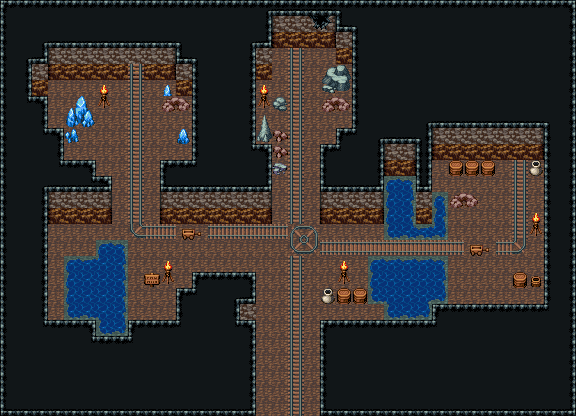

# 광산 · 레일 갱도

입구에서 막장까지 레일 본선이 곧게 뻗고, 운반장 가운데 회전대에서 서쪽 지선(광맥 방)과 동쪽 지선(물 찬 균열 위 레일 다리 → 창고 광차 차고)이 갈라진다. 광맥 방은 큰 수정·캐다 만 돌무더기, 막장은 무너진 돌과 드러난 광맥, 운반장 서남쪽 침수 수갱 옆 경고 표지판. 36×26, tilesetId=oprn_dungeon_cave. 입구 (17,25). 통행 검사 목표 [[18,4],[7,6],[30,13],[10,16]].

출구: (17,25) → outside 남쪽 입구 갱도 → 바깥



## 놓은 소품 (저작 순서)
(x,y)는 왼쪽 위, tiles는 행 단위 번호. 이식 칸(480~)은 공통 규칙 문서의 이식표.
```json
[
  {
    "kind": "rail",
    "cells": 59,
    "pieces": "직선 116(가로)·144(세로), 굽이 54(→↓)·55(←↓)·84(↑→)·85(↑←)"
  },
  {
    "prop": "큰 회색 바위",
    "x": 20,
    "y": 4,
    "w": 2,
    "h": 2,
    "layer": "upper",
    "tiles": [
      [
        322,
        323
      ],
      [
        352,
        353
      ]
    ]
  },
  {
    "prop": "돌무더기",
    "x": 20,
    "y": 6,
    "w": 2,
    "h": 1,
    "layer": "upper",
    "tiles": [
      [
        259,
        260
      ]
    ]
  },
  {
    "prop": "벽 균열 큰",
    "x": 19,
    "y": 1,
    "w": 2,
    "h": 1,
    "layer": "upper",
    "tiles": [
      [
        268,
        269
      ]
    ]
  },
  {
    "prop": "화로",
    "x": 16,
    "y": 5,
    "w": 1,
    "h": 2,
    "layer": "upper",
    "tiles": [
      [
        263
      ],
      [
        293
      ]
    ]
  },
  {
    "prop": "큰 푸른 수정",
    "x": 4,
    "y": 6,
    "w": 2,
    "h": 2,
    "layer": "upper",
    "tiles": [
      [
        320,
        321
      ],
      [
        350,
        351
      ]
    ]
  },
  {
    "prop": "푸른 수정 기둥",
    "x": 10,
    "y": 5,
    "w": 1,
    "h": 2,
    "layer": "upper",
    "tiles": [
      [
        262
      ],
      [
        292
      ]
    ]
  },
  {
    "prop": "수정 무더기",
    "x": 4,
    "y": 8,
    "w": 1,
    "h": 1,
    "layer": "upper",
    "tiles": [
      [
        413
      ]
    ]
  },
  {
    "prop": "작은 푸른 수정",
    "x": 11,
    "y": 8,
    "w": 1,
    "h": 1,
    "layer": "upper",
    "tiles": [
      [
        289
      ]
    ]
  },
  {
    "prop": "돌무더기",
    "x": 10,
    "y": 6,
    "w": 2,
    "h": 1,
    "layer": "upper",
    "tiles": [
      [
        259,
        260
      ]
    ]
  },
  {
    "prop": "화로",
    "x": 6,
    "y": 5,
    "w": 1,
    "h": 2,
    "layer": "upper",
    "tiles": [
      [
        263
      ],
      [
        293
      ]
    ]
  },
  {
    "prop": "화로",
    "x": 10,
    "y": 16,
    "w": 1,
    "h": 2,
    "layer": "upper",
    "tiles": [
      [
        263
      ],
      [
        293
      ]
    ]
  },
  {
    "prop": "화로",
    "x": 21,
    "y": 16,
    "w": 1,
    "h": 2,
    "layer": "upper",
    "tiles": [
      [
        263
      ],
      [
        293
      ]
    ]
  },
  {
    "prop": "광차",
    "x": 11,
    "y": 14,
    "w": 2,
    "h": 1,
    "layer": "upper",
    "tiles": [
      [
        481,
        482
      ]
    ]
  },
  {
    "prop": "표지판",
    "x": 9,
    "y": 17,
    "w": 1,
    "h": 1,
    "layer": "upper",
    "tiles": [
      [
        298
      ]
    ]
  },
  {
    "prop": "나무통",
    "x": 21,
    "y": 18,
    "w": 1,
    "h": 1,
    "layer": "upper",
    "tiles": [
      [
        417
      ]
    ]
  },
  {
    "prop": "나무통",
    "x": 22,
    "y": 18,
    "w": 1,
    "h": 1,
    "layer": "upper",
    "tiles": [
      [
        417
      ]
    ]
  },
  {
    "prop": "항아리",
    "x": 20,
    "y": 18,
    "w": 1,
    "h": 1,
    "layer": "upper",
    "tiles": [
      [
        418
      ]
    ]
  },
  {
    "prop": "광차",
    "x": 29,
    "y": 15,
    "w": 2,
    "h": 1,
    "layer": "upper",
    "tiles": [
      [
        481,
        482
      ]
    ]
  },
  {
    "prop": "나무통",
    "x": 28,
    "y": 10,
    "w": 1,
    "h": 1,
    "layer": "upper",
    "tiles": [
      [
        417
      ]
    ]
  },
  {
    "prop": "나무통",
    "x": 29,
    "y": 10,
    "w": 1,
    "h": 1,
    "layer": "upper",
    "tiles": [
      [
        417
      ]
    ]
  },
  {
    "prop": "나무통",
    "x": 30,
    "y": 10,
    "w": 1,
    "h": 1,
    "layer": "upper",
    "tiles": [
      [
        417
      ]
    ]
  },
  {
    "prop": "항아리",
    "x": 33,
    "y": 10,
    "w": 1,
    "h": 1,
    "layer": "upper",
    "tiles": [
      [
        418
      ]
    ]
  },
  {
    "prop": "돌무더기",
    "x": 28,
    "y": 12,
    "w": 2,
    "h": 1,
    "layer": "upper",
    "tiles": [
      [
        259,
        260
      ]
    ]
  },
  {
    "prop": "물통",
    "x": 33,
    "y": 17,
    "w": 1,
    "h": 1,
    "layer": "upper",
    "tiles": [
      [
        419
      ]
    ]
  },
  {
    "prop": "나무통",
    "x": 32,
    "y": 17,
    "w": 1,
    "h": 1,
    "layer": "upper",
    "tiles": [
      [
        417
      ]
    ]
  },
  {
    "prop": "화로",
    "x": 33,
    "y": 13,
    "w": 1,
    "h": 2,
    "layer": "upper",
    "tiles": [
      [
        263
      ],
      [
        293
      ]
    ]
  },
  {
    "kind": "dressing",
    "note": "무너진 벽 곁·모서리에 몰아 둔 잔해 덩이(1~3곳) — 통로는 막지 않음",
    "clumps": [
      {
        "kind": "prop",
        "x": 16,
        "y": 7,
        "tiles": [
          [
            0,
            0,
            261
          ],
          [
            0,
            1,
            291
          ]
        ]
      },
      {
        "kind": "prop",
        "x": 17,
        "y": 8,
        "tiles": [
          [
            0,
            0,
            412
          ]
        ]
      },
      {
        "kind": "prop",
        "x": 17,
        "y": 9,
        "tiles": [
          [
            0,
            0,
            412
          ]
        ]
      },
      {
        "kind": "prop",
        "x": 17,
        "y": 6,
        "tiles": [
          [
            0,
            0,
            382
          ]
        ]
      },
      {
        "kind": "prop",
        "x": 17,
        "y": 10,
        "tiles": [
          [
            0,
            0,
            383
          ]
        ]
      }
    ]
  }
]
```

전체 두 레이어는 다음 배열 문서가 정답이다.
