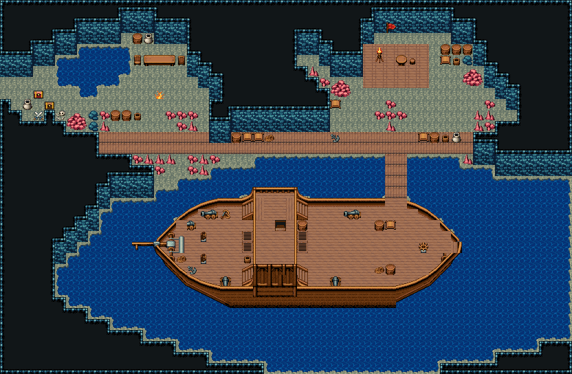

# 해적 소굴 · 숨은 선착장

동쪽 바다로 트인 물굽이에 진짜 범선(「푸른물결항」의 배 — 대포·닻·조타륜·선실 지붕을 그대로, 선미는 좌우 반전)이 떠 있는 해적 소굴. 서쪽 굴길로 들어오면 북서쪽 굴에 야영지(탁자·의자·모닥불·침대 둘)와 조수 웅덩이, 그 서쪽 구석에 두목의 보물(붉은 상자·나무 상자·항아리)과 지키다 죽은 해적, 북쪽 물가를 따라 널판 부두가 뻗고 부두 위에 부린 짐(통·상자·밧줄·닻). 부두 가운데서 널판이 물 위로 내려가 뱃전 난간을 틔운 틈으로 갑판에 오른다. 북동쪽 굴은 바다 어귀를 내려다보는 망루(화로·의자·깃발)와 화약통 더미. 52×34, tilesetId=oprn_dungeon_sea. 입구 (0,7). 통행 검사 목표 [[14,6],[30,11],[30,22],[17,22],[38,7],[4,8]].

출구: (0,7) → outside 서쪽 굴길 → 해안 절벽



## 놓은 소품 (저작 순서)
(x,y)는 왼쪽 위, tiles는 행 단위 번호. 이식 칸(480~)은 공통 규칙 문서의 이식표.
```json
[
  {
    "prop": "긴 탁자",
    "x": 13,
    "y": 5,
    "w": 3,
    "h": 1,
    "layer": "upper",
    "tiles": [
      [
        385,
        386,
        387
      ]
    ]
  },
  {
    "prop": "의자(왼쪽 보기)",
    "x": 12,
    "y": 5,
    "w": 1,
    "h": 1,
    "layer": "upper",
    "tiles": [
      [
        327
      ]
    ]
  },
  {
    "prop": "의자(오른쪽 보기)",
    "x": 16,
    "y": 5,
    "w": 1,
    "h": 1,
    "layer": "upper",
    "tiles": [
      [
        328
      ]
    ]
  },
  {
    "prop": "바닥 불길",
    "x": 14,
    "y": 8,
    "w": 1,
    "h": 1,
    "layer": "upper",
    "tiles": [
      [
        207
      ]
    ]
  },
  {
    "prop": "나무통",
    "x": 12,
    "y": 3,
    "w": 1,
    "h": 1,
    "layer": "upper",
    "tiles": [
      [
        417
      ]
    ]
  },
  {
    "prop": "항아리",
    "x": 13,
    "y": 3,
    "w": 1,
    "h": 1,
    "layer": "upper",
    "tiles": [
      [
        418
      ]
    ]
  },
  {
    "prop": "나무통",
    "x": 10,
    "y": 10,
    "w": 1,
    "h": 1,
    "layer": "upper",
    "tiles": [
      [
        417
      ]
    ]
  },
  {
    "prop": "나무통",
    "x": 11,
    "y": 10,
    "w": 1,
    "h": 1,
    "layer": "upper",
    "tiles": [
      [
        417
      ]
    ]
  },
  {
    "prop": "물통",
    "x": 12,
    "y": 10,
    "w": 1,
    "h": 1,
    "layer": "upper",
    "tiles": [
      [
        419
      ]
    ]
  },
  {
    "prop": "대형 오크통",
    "key": "ship:barrel",
    "x": 21,
    "y": 12,
    "w": 1,
    "h": 1,
    "layer": "upper",
    "tiles": [
      [
        823
      ]
    ]
  },
  {
    "prop": "사각 나무 상자",
    "key": "ship:crate",
    "x": 22,
    "y": 12,
    "w": 1,
    "h": 1,
    "layer": "upper",
    "tiles": [
      [
        825
      ]
    ]
  },
  {
    "prop": "사각 나무 상자",
    "key": "ship:crate",
    "x": 23,
    "y": 12,
    "w": 1,
    "h": 1,
    "layer": "upper",
    "tiles": [
      [
        825
      ]
    ]
  },
  {
    "prop": "감긴 밧줄 더미",
    "key": "ship:rope",
    "x": 24,
    "y": 12,
    "w": 1,
    "h": 1,
    "layer": "upper",
    "tiles": [
      [
        841
      ]
    ]
  },
  {
    "prop": "닻",
    "key": "ship:anchor",
    "x": 30,
    "y": 12,
    "w": 1,
    "h": 1,
    "layer": "upper",
    "tiles": [
      [
        840
      ]
    ]
  },
  {
    "prop": "사각 나무 상자",
    "key": "ship:crate",
    "x": 38,
    "y": 12,
    "w": 1,
    "h": 1,
    "layer": "upper",
    "tiles": [
      [
        825
      ]
    ]
  },
  {
    "prop": "대형 오크통",
    "key": "ship:barrel",
    "x": 39,
    "y": 12,
    "w": 1,
    "h": 1,
    "layer": "upper",
    "tiles": [
      [
        823
      ]
    ]
  },
  {
    "prop": "열린 나무통",
    "key": "ship:barrel-open",
    "x": 40,
    "y": 12,
    "w": 1,
    "h": 1,
    "layer": "upper",
    "tiles": [
      [
        824
      ]
    ]
  },
  {
    "prop": "도자기 항아리",
    "key": "ship:jug",
    "x": 41,
    "y": 12,
    "w": 1,
    "h": 1,
    "layer": "upper",
    "tiles": [
      [
        827
      ]
    ]
  },
  {
    "prop": "화로",
    "x": 34,
    "y": 4,
    "w": 1,
    "h": 2,
    "layer": "upper",
    "tiles": [
      [
        263
      ],
      [
        293
      ]
    ]
  },
  {
    "prop": "둥근 나무 탁자",
    "key": "ship:table",
    "x": 36,
    "y": 5,
    "w": 1,
    "h": 1,
    "layer": "upper",
    "tiles": [
      [
        828
      ]
    ]
  },
  {
    "prop": "둥근 목재 의자",
    "key": "ship:stool",
    "x": 37,
    "y": 5,
    "w": 1,
    "h": 1,
    "layer": "upper",
    "tiles": [
      [
        829
      ]
    ]
  },
  {
    "prop": "붉은 삼각 깃발",
    "key": "ship:flag",
    "x": 35,
    "y": 2,
    "w": 1,
    "h": 1,
    "layer": "upper",
    "tiles": [
      [
        848
      ]
    ]
  },
  {
    "prop": "대형 오크통",
    "key": "ship:barrel",
    "x": 40,
    "y": 4,
    "w": 1,
    "h": 1,
    "layer": "upper",
    "tiles": [
      [
        823
      ]
    ]
  },
  {
    "prop": "대형 오크통",
    "key": "ship:barrel",
    "x": 41,
    "y": 4,
    "w": 1,
    "h": 1,
    "layer": "upper",
    "tiles": [
      [
        823
      ]
    ]
  },
  {
    "prop": "대형 오크통",
    "key": "ship:barrel",
    "x": 42,
    "y": 4,
    "w": 1,
    "h": 1,
    "layer": "upper",
    "tiles": [
      [
        823
      ]
    ]
  },
  {
    "prop": "사각 나무 상자",
    "key": "ship:crate",
    "x": 40,
    "y": 5,
    "w": 1,
    "h": 1,
    "layer": "upper",
    "tiles": [
      [
        825
      ]
    ]
  },
  {
    "prop": "열린 나무통",
    "key": "ship:barrel-open",
    "x": 41,
    "y": 5,
    "w": 1,
    "h": 1,
    "layer": "upper",
    "tiles": [
      [
        824
      ]
    ]
  },
  {
    "prop": "붉은 금장 보물상자(보스 보상)",
    "key": "chest-red",
    "x": 3,
    "y": 8,
    "w": 1,
    "h": 1,
    "layer": "upper",
    "tiles": [
      [
        1054
      ]
    ]
  },
  {
    "prop": "보물상자(나무·금테)",
    "key": "chest-wood",
    "x": 4,
    "y": 9,
    "w": 1,
    "h": 1,
    "layer": "upper",
    "tiles": [
      [
        1050
      ]
    ]
  },
  {
    "prop": "항아리",
    "x": 2,
    "y": 9,
    "w": 1,
    "h": 1,
    "layer": "upper",
    "tiles": [
      [
        418
      ]
    ]
  },
  {
    "prop": "해골과 뼈 더미",
    "key": "ship:skull",
    "x": 5,
    "y": 10,
    "w": 1,
    "h": 1,
    "layer": "upper",
    "tiles": [
      [
        846
      ]
    ]
  },
  {
    "prop": "엇갈린 은색 검",
    "key": "ship:swords",
    "x": 3,
    "y": 10,
    "w": 1,
    "h": 1,
    "layer": "upper",
    "tiles": [
      [
        847
      ]
    ]
  },
  {
    "prop": "사각 나무 상자",
    "key": "ship:crate",
    "x": 30,
    "y": 9,
    "w": 1,
    "h": 1,
    "layer": "upper",
    "tiles": [
      [
        825
      ]
    ]
  },
  {
    "stamp": "정박한 범선(푸른물결항 배, 선미 반전)",
    "key": "moored-ship",
    "x": 12,
    "y": 17,
    "w": 30,
    "h": 11
  },
  {
    "kind": "outcrops",
    "note": "넓은 맨바닥을 가르는 바위 기둥(허공 덩이 + 벽면 두 줄)",
    "blobs": [
      {
        "at": [
          17,
          3
        ],
        "cells": 9
      },
      {
        "at": [
          29,
          3
        ],
        "cells": 14
      },
      {
        "at": [
          11,
          15
        ],
        "cells": 3
      }
    ]
  },
  {
    "kind": "dressing",
    "note": "무너진 벽 곁·모서리에 몰아 둔 잔해 덩이(1~3곳) — 통로는 막지 않음",
    "clumps": [
      {
        "kind": "prop",
        "x": 30,
        "y": 7,
        "tiles": [
          [
            0,
            0,
            318
          ],
          [
            1,
            0,
            319
          ],
          [
            0,
            1,
            348
          ],
          [
            1,
            1,
            349
          ]
        ]
      },
      {
        "kind": "prop",
        "x": 29,
        "y": 7,
        "tiles": [
          [
            0,
            0,
            412
          ]
        ]
      },
      {
        "kind": "prop",
        "x": 28,
        "y": 6,
        "tiles": [
          [
            0,
            0,
            288
          ]
        ]
      },
      {
        "kind": "prop",
        "x": 6,
        "y": 10,
        "tiles": [
          [
            0,
            0,
            318
          ],
          [
            1,
            0,
            319
          ],
          [
            0,
            1,
            348
          ],
          [
            1,
            1,
            349
          ]
        ]
      },
      {
        "kind": "prop",
        "x": 8,
        "y": 11,
        "tiles": [
          [
            0,
            0,
            382
          ]
        ]
      },
      {
        "kind": "prop",
        "x": 8,
        "y": 10,
        "tiles": [
          [
            0,
            0,
            382
          ]
        ]
      },
      {
        "kind": "prop",
        "x": 9,
        "y": 11,
        "tiles": [
          [
            0,
            0,
            288
          ]
        ]
      },
      {
        "kind": "prop",
        "x": 9,
        "y": 10,
        "tiles": [
          [
            0,
            0,
            412
          ]
        ]
      },
      {
        "kind": "prop",
        "x": 42,
        "y": 6,
        "tiles": [
          [
            0,
            0,
            318
          ],
          [
            1,
            0,
            319
          ],
          [
            0,
            1,
            348
          ],
          [
            1,
            1,
            349
          ]
        ]
      },
      {
        "kind": "prop",
        "x": 42,
        "y": 5,
        "tiles": [
          [
            0,
            0,
            382
          ]
        ]
      },
      {
        "kind": "prop",
        "x": 35,
        "y": 10,
        "tiles": [
          [
            0,
            0,
            412
          ]
        ]
      },
      {
        "kind": "prop",
        "x": 35,
        "y": 9,
        "tiles": [
          [
            0,
            0,
            412
          ]
        ]
      },
      {
        "kind": "prop",
        "x": 35,
        "y": 11,
        "tiles": [
          [
            0,
            0,
            288
          ]
        ]
      },
      {
        "kind": "prop",
        "x": 34,
        "y": 10,
        "tiles": [
          [
            0,
            0,
            412
          ]
        ]
      },
      {
        "kind": "prop",
        "x": 36,
        "y": 10,
        "tiles": [
          [
            0,
            0,
            412
          ]
        ]
      },
      {
        "kind": "prop",
        "x": 18,
        "y": 15,
        "tiles": [
          [
            0,
            0,
            288
          ]
        ]
      },
      {
        "kind": "prop",
        "x": 18,
        "y": 14,
        "tiles": [
          [
            0,
            0,
            288
          ]
        ]
      },
      {
        "kind": "prop",
        "x": 17,
        "y": 15,
        "tiles": [
          [
            0,
            0,
            412
          ]
        ]
      },
      {
        "kind": "prop",
        "x": 19,
        "y": 14,
        "tiles": [
          [
            0,
            0,
            412
          ]
        ]
      },
      {
        "kind": "prop",
        "x": 17,
        "y": 14,
        "tiles": [
          [
            0,
            0,
            412
          ]
        ]
      },
      {
        "kind": "prop",
        "x": 16,
        "y": 10,
        "tiles": [
          [
            0,
            0,
            412
          ]
        ]
      },
      {
        "kind": "prop",
        "x": 17,
        "y": 10,
        "tiles": [
          [
            0,
            0,
            412
          ]
        ]
      },
      {
        "kind": "prop",
        "x": 15,
        "y": 10,
        "tiles": [
          [
            0,
            0,
            412
          ]
        ]
      },
      {
        "kind": "prop",
        "x": 16,
        "y": 11,
        "tiles": [
          [
            0,
            0,
            412
          ]
        ]
      },
      {
        "kind": "prop",
        "x": 17,
        "y": 11,
        "tiles": [
          [
            0,
            0,
            288
          ]
        ]
      },
      {
        "kind": "prop",
        "x": 44,
        "y": 11,
        "tiles": [
          [
            0,
            0,
            412
          ]
        ]
      },
      {
        "kind": "prop",
        "x": 44,
        "y": 10,
        "tiles": [
          [
            0,
            0,
            288
          ]
        ]
      },
      {
        "kind": "prop",
        "x": 43,
        "y": 11,
        "tiles": [
          [
            0,
            0,
            288
          ]
        ]
      },
      {
        "kind": "prop",
        "x": 44,
        "y": 9,
        "tiles": [
          [
            0,
            0,
            412
          ]
        ]
      },
      {
        "kind": "prop",
        "x": 43,
        "y": 10,
        "tiles": [
          [
            0,
            0,
            288
          ]
        ]
      },
      {
        "kind": "prop",
        "x": 12,
        "y": 14,
        "tiles": [
          [
            0,
            0,
            412
          ]
        ]
      },
      {
        "kind": "prop",
        "x": 13,
        "y": 14,
        "tiles": [
          [
            0,
            0,
            288
          ]
        ]
      },
      {
        "kind": "prop",
        "x": 14,
        "y": 14,
        "tiles": [
          [
            0,
            0,
            288
          ]
        ]
      },
      {
        "kind": "prop",
        "x": 15,
        "y": 14,
        "tiles": [
          [
            0,
            0,
            288
          ]
        ]
      },
      {
        "kind": "prop",
        "x": 14,
        "y": 15,
        "tiles": [
          [
            0,
            0,
            412
          ]
        ]
      },
      {
        "kind": "prop",
        "x": 42,
        "y": 14,
        "tiles": [
          [
            0,
            0,
            288
          ]
        ]
      }
    ]
  }
]
```

전체 두 레이어는 다음 배열 문서가 정답이다.
