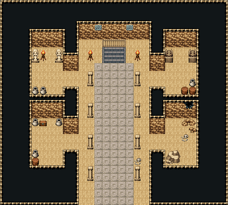

# 사막 피라미드 · 기둥 회랑

사암 기둥 두 줄이 받친 좁은 회랑. 가운데 무늬 석판 길이 입구에서 북쪽 벽 아래 내려가는 계단(쇠 난간 뒤, 양옆 화로)까지 곧고, 짧은 문으로 곁방 넷이 붙는다: 여신상 방, 가고일 방, 보물상자 벽감, 금 간 벽 아래 무너진 돌과 희생자 해골이 있는 방. 29×26, tilesetId=oprn_dungeon_desert. 입구 (14,25). 통행 검사 목표 [[14,8],[5,18],[23,19],[5,9],[22,9],[8,10],[20,17]].

출구: (14,7) → dungeon-pyramid-tomb (13,4) 북쪽 내려가는 계단 → 왕의 묘실 · (14,25) → outside 남쪽 → 사막



## 놓은 소품 (저작 순서)
(x,y)는 왼쪽 위, tiles는 행 단위 번호. 이식 칸(480~)은 공통 규칙 문서의 이식표.
```json
[
  {
    "prop": "계단 난간",
    "x": 13,
    "y": 5,
    "w": 3,
    "h": 1,
    "layer": "upper",
    "tiles": [
      [
        234,
        235,
        236
      ]
    ]
  },
  {
    "prop": "내려가는 돌계단",
    "x": 13,
    "y": 6,
    "w": 3,
    "h": 2,
    "layer": "lower",
    "tiles": [
      [
        483,
        484,
        485
      ],
      [
        483,
        484,
        485
      ]
    ]
  },
  {
    "prop": "화로",
    "x": 11,
    "y": 6,
    "w": 1,
    "h": 2,
    "layer": "upper",
    "tiles": [
      [
        263
      ],
      [
        293
      ]
    ]
  },
  {
    "prop": "화로",
    "x": 17,
    "y": 6,
    "w": 1,
    "h": 2,
    "layer": "upper",
    "tiles": [
      [
        263
      ],
      [
        293
      ]
    ]
  },
  {
    "prop": "석주",
    "x": 11,
    "y": 9,
    "w": 1,
    "h": 2,
    "layer": "upper",
    "tiles": [
      [
        446
      ],
      [
        476
      ]
    ]
  },
  {
    "prop": "석주",
    "x": 17,
    "y": 9,
    "w": 1,
    "h": 2,
    "layer": "upper",
    "tiles": [
      [
        446
      ],
      [
        476
      ]
    ]
  },
  {
    "prop": "석주",
    "x": 11,
    "y": 13,
    "w": 1,
    "h": 2,
    "layer": "upper",
    "tiles": [
      [
        446
      ],
      [
        476
      ]
    ]
  },
  {
    "prop": "석주",
    "x": 17,
    "y": 13,
    "w": 1,
    "h": 2,
    "layer": "upper",
    "tiles": [
      [
        446
      ],
      [
        476
      ]
    ]
  },
  {
    "prop": "석주",
    "x": 11,
    "y": 17,
    "w": 1,
    "h": 2,
    "layer": "upper",
    "tiles": [
      [
        446
      ],
      [
        476
      ]
    ]
  },
  {
    "prop": "석주",
    "x": 17,
    "y": 17,
    "w": 1,
    "h": 2,
    "layer": "upper",
    "tiles": [
      [
        446
      ],
      [
        476
      ]
    ]
  },
  {
    "prop": "석주",
    "x": 11,
    "y": 21,
    "w": 1,
    "h": 2,
    "layer": "upper",
    "tiles": [
      [
        446
      ],
      [
        476
      ]
    ]
  },
  {
    "prop": "석주",
    "x": 17,
    "y": 21,
    "w": 1,
    "h": 2,
    "layer": "upper",
    "tiles": [
      [
        446
      ],
      [
        476
      ]
    ]
  },
  {
    "prop": "여신 석상",
    "x": 4,
    "y": 6,
    "w": 1,
    "h": 2,
    "layer": "upper",
    "tiles": [
      [
        145
      ],
      [
        175
      ]
    ]
  },
  {
    "prop": "여신 석상",
    "x": 7,
    "y": 6,
    "w": 1,
    "h": 2,
    "layer": "upper",
    "tiles": [
      [
        145
      ],
      [
        175
      ]
    ]
  },
  {
    "prop": "화로",
    "x": 5,
    "y": 6,
    "w": 1,
    "h": 2,
    "layer": "upper",
    "tiles": [
      [
        263
      ],
      [
        293
      ]
    ]
  },
  {
    "prop": "항아리",
    "x": 4,
    "y": 11,
    "w": 1,
    "h": 1,
    "layer": "upper",
    "tiles": [
      [
        418
      ]
    ]
  },
  {
    "prop": "항아리",
    "x": 5,
    "y": 11,
    "w": 1,
    "h": 1,
    "layer": "upper",
    "tiles": [
      [
        418
      ]
    ]
  },
  {
    "prop": "가고일 석상",
    "x": 21,
    "y": 6,
    "w": 1,
    "h": 2,
    "layer": "upper",
    "tiles": [
      [
        146
      ],
      [
        176
      ]
    ]
  },
  {
    "prop": "가고일 석상",
    "x": 24,
    "y": 6,
    "w": 1,
    "h": 2,
    "layer": "upper",
    "tiles": [
      [
        146
      ],
      [
        176
      ]
    ]
  },
  {
    "prop": "나무통",
    "x": 24,
    "y": 11,
    "w": 1,
    "h": 1,
    "layer": "upper",
    "tiles": [
      [
        417
      ]
    ]
  },
  {
    "prop": "나무통",
    "x": 23,
    "y": 11,
    "w": 1,
    "h": 1,
    "layer": "upper",
    "tiles": [
      [
        417
      ]
    ]
  },
  {
    "prop": "항아리",
    "x": 24,
    "y": 10,
    "w": 1,
    "h": 1,
    "layer": "upper",
    "tiles": [
      [
        418
      ]
    ]
  },
  {
    "prop": "보물상자",
    "x": 5,
    "y": 15,
    "w": 1,
    "h": 1,
    "layer": "upper",
    "tiles": [
      [
        480
      ]
    ]
  },
  {
    "prop": "항아리",
    "x": 4,
    "y": 15,
    "w": 1,
    "h": 1,
    "layer": "upper",
    "tiles": [
      [
        418
      ]
    ]
  },
  {
    "prop": "항아리",
    "x": 7,
    "y": 15,
    "w": 1,
    "h": 1,
    "layer": "upper",
    "tiles": [
      [
        418
      ]
    ]
  },
  {
    "prop": "나무통",
    "x": 4,
    "y": 20,
    "w": 1,
    "h": 1,
    "layer": "upper",
    "tiles": [
      [
        417
      ]
    ]
  },
  {
    "prop": "항아리",
    "x": 4,
    "y": 19,
    "w": 1,
    "h": 1,
    "layer": "upper",
    "tiles": [
      [
        418
      ]
    ]
  },
  {
    "prop": "벽 균열 큰",
    "x": 23,
    "y": 13,
    "w": 2,
    "h": 1,
    "layer": "upper",
    "tiles": [
      [
        268,
        269
      ]
    ]
  },
  {
    "prop": "돌무더기",
    "x": 23,
    "y": 15,
    "w": 2,
    "h": 1,
    "layer": "upper",
    "tiles": [
      [
        259,
        260
      ]
    ]
  },
  {
    "prop": "갈색 잔돌",
    "x": 24,
    "y": 16,
    "w": 1,
    "h": 1,
    "layer": "upper",
    "tiles": [
      [
        412
      ]
    ]
  },
  {
    "prop": "큰 회색 바위",
    "x": 21,
    "y": 19,
    "w": 2,
    "h": 2,
    "layer": "upper",
    "tiles": [
      [
        322,
        323
      ],
      [
        352,
        353
      ]
    ]
  },
  {
    "prop": "해골과 뼈",
    "x": 23,
    "y": 17,
    "w": 1,
    "h": 1,
    "layer": "upper",
    "tiles": [
      [
        299
      ]
    ]
  },
  {
    "prop": "벽 석판",
    "x": 12,
    "y": 3,
    "w": 1,
    "h": 1,
    "layer": "upper",
    "tiles": [
      [
        265
      ]
    ]
  },
  {
    "prop": "벽 석판",
    "x": 16,
    "y": 3,
    "w": 1,
    "h": 1,
    "layer": "upper",
    "tiles": [
      [
        265
      ]
    ]
  },
  {
    "kind": "dressing",
    "note": "무너진 벽 곁·모서리에 몰아 둔 잔해 덩이(1~3곳) — 통로는 막지 않음",
    "clumps": [
      {
        "kind": "prop",
        "x": 17,
        "y": 20,
        "tiles": [
          [
            0,
            0,
            299
          ]
        ]
      }
    ]
  }
]
```

전체 두 레이어는 다음 배열 문서가 정답이다.
