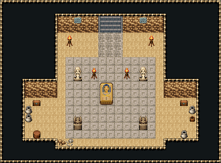

# 사막 피라미드 · 왕의 묘실

피라미드 맨 아래 왕의 묘실. 북쪽 벽의 오르는 계단(양옆 화로)에서 석판이 동심 석판 단으로 내려오고, 단 한가운데 황금 가면의 파라오 석관을 석상·가고일 넷과 머리맡 화로 둘이 지킨다. 좌우 벽감에 부장품 보물상자와 항아리 줄, 남서쪽 모서리에 먼저 들어온 도굴꾼의 해골. 27×20, tilesetId=oprn_dungeon_desert. 입구 (13,4), 주인·보스 자리 (13,14). 통행 검사 목표 [[13,14],[5,14],[21,14]].

출구: (13,3) → dungeon-pyramid-hall (14,8) 북쪽 오르는 계단 → 기둥 회랑



## 놓은 소품 (저작 순서)
(x,y)는 왼쪽 위, tiles는 행 단위 번호. 이식 칸(480~)은 공통 규칙 문서의 이식표.
```json
[
  {
    "prop": "오르는 돌계단(벽면)",
    "x": 12,
    "y": 2,
    "w": 3,
    "h": 2,
    "layer": "lower",
    "tiles": [
      [
        483,
        484,
        485
      ],
      [
        483,
        484,
        485
      ]
    ]
  },
  {
    "prop": "벽 석판",
    "x": 9,
    "y": 2,
    "w": 1,
    "h": 1,
    "layer": "upper",
    "tiles": [
      [
        265
      ]
    ]
  },
  {
    "prop": "벽 석판",
    "x": 17,
    "y": 2,
    "w": 1,
    "h": 1,
    "layer": "upper",
    "tiles": [
      [
        265
      ]
    ]
  },
  {
    "prop": "화로",
    "x": 8,
    "y": 4,
    "w": 1,
    "h": 2,
    "layer": "upper",
    "tiles": [
      [
        263
      ],
      [
        293
      ]
    ]
  },
  {
    "prop": "화로",
    "x": 18,
    "y": 4,
    "w": 1,
    "h": 2,
    "layer": "upper",
    "tiles": [
      [
        263
      ],
      [
        293
      ]
    ]
  },
  {
    "prop": "파라오 석관(사막 시트 전용)",
    "x": 12,
    "y": 10,
    "w": 2,
    "h": 3,
    "layer": "upper",
    "tiles": [
      [
        54,
        55
      ],
      [
        84,
        85
      ],
      [
        116,
        144
      ]
    ]
  },
  {
    "prop": "여신 석상",
    "x": 9,
    "y": 8,
    "w": 1,
    "h": 2,
    "layer": "upper",
    "tiles": [
      [
        145
      ],
      [
        175
      ]
    ]
  },
  {
    "prop": "여신 석상",
    "x": 17,
    "y": 8,
    "w": 1,
    "h": 2,
    "layer": "upper",
    "tiles": [
      [
        145
      ],
      [
        175
      ]
    ]
  },
  {
    "prop": "가고일 석상",
    "x": 9,
    "y": 14,
    "w": 1,
    "h": 2,
    "layer": "upper",
    "tiles": [
      [
        146
      ],
      [
        176
      ]
    ]
  },
  {
    "prop": "가고일 석상",
    "x": 17,
    "y": 14,
    "w": 1,
    "h": 2,
    "layer": "upper",
    "tiles": [
      [
        146
      ],
      [
        176
      ]
    ]
  },
  {
    "prop": "화로",
    "x": 11,
    "y": 8,
    "w": 1,
    "h": 2,
    "layer": "upper",
    "tiles": [
      [
        263
      ],
      [
        293
      ]
    ]
  },
  {
    "prop": "화로",
    "x": 15,
    "y": 8,
    "w": 1,
    "h": 2,
    "layer": "upper",
    "tiles": [
      [
        263
      ],
      [
        293
      ]
    ]
  },
  {
    "prop": "보물상자",
    "x": 4,
    "y": 12,
    "w": 1,
    "h": 1,
    "layer": "upper",
    "tiles": [
      [
        480
      ]
    ]
  },
  {
    "prop": "항아리",
    "x": 3,
    "y": 13,
    "w": 1,
    "h": 1,
    "layer": "upper",
    "tiles": [
      [
        418
      ]
    ]
  },
  {
    "prop": "항아리",
    "x": 3,
    "y": 14,
    "w": 1,
    "h": 1,
    "layer": "upper",
    "tiles": [
      [
        418
      ]
    ]
  },
  {
    "prop": "나무통",
    "x": 4,
    "y": 16,
    "w": 1,
    "h": 1,
    "layer": "upper",
    "tiles": [
      [
        417
      ]
    ]
  },
  {
    "prop": "보물상자",
    "x": 22,
    "y": 12,
    "w": 1,
    "h": 1,
    "layer": "upper",
    "tiles": [
      [
        480
      ]
    ]
  },
  {
    "prop": "항아리",
    "x": 23,
    "y": 13,
    "w": 1,
    "h": 1,
    "layer": "upper",
    "tiles": [
      [
        418
      ]
    ]
  },
  {
    "prop": "물통",
    "x": 23,
    "y": 14,
    "w": 1,
    "h": 1,
    "layer": "upper",
    "tiles": [
      [
        419
      ]
    ]
  },
  {
    "prop": "항아리",
    "x": 22,
    "y": 16,
    "w": 1,
    "h": 1,
    "layer": "upper",
    "tiles": [
      [
        418
      ]
    ]
  },
  {
    "prop": "해골과 뼈",
    "x": 8,
    "y": 17,
    "w": 1,
    "h": 1,
    "layer": "upper",
    "tiles": [
      [
        299
      ]
    ]
  },
  {
    "prop": "갈색 잔돌",
    "x": 7,
    "y": 17,
    "w": 1,
    "h": 1,
    "layer": "upper",
    "tiles": [
      [
        412
      ]
    ]
  }
]
```

전체 두 레이어는 다음 배열 문서가 정답이다.
