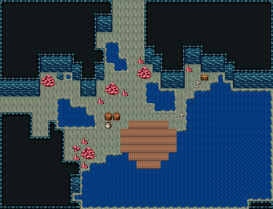

# 해저 동굴 · 난파선 해안

남쪽과 동쪽이 바다로 트인 석호. 뱃머리를 바다로 둔 난파선 갑판이 물가에 걸렸고, 모래밭엔 떠밀려 온 나무통·항아리와 쓰러진 선원. 벽은 청록 바다 바위, 바닥은 흰 모래 해저, 붉은 산호 무리 둘과 조수 웅덩이. 북동쪽 바위 틈에 해적의 보물상자가 숨겨진 막다른 곳. 34×26, tilesetId=oprn_dungeon_sea. 입구 (0,12). 통행 검사 목표 [[24,9],[15,1],[18,17],[6,13]].

출구: (0,12) → outside 서쪽 굴길 → 해안 절벽 · (15,0) → dungeon-sunken-gate (17,22) 북쪽 → 해저 신전 입구 회랑



## 놓은 소품 (저작 순서)
(x,y)는 왼쪽 위, tiles는 행 단위 번호. 이식 칸(480~)은 공통 규칙 문서의 이식표.
```json
[
  {
    "prop": "나무통",
    "x": 13,
    "y": 14,
    "w": 1,
    "h": 1,
    "layer": "upper",
    "tiles": [
      [
        417
      ]
    ]
  },
  {
    "prop": "나무통",
    "x": 14,
    "y": 14,
    "w": 1,
    "h": 1,
    "layer": "upper",
    "tiles": [
      [
        417
      ]
    ]
  },
  {
    "prop": "항아리",
    "x": 13,
    "y": 15,
    "w": 1,
    "h": 1,
    "layer": "upper",
    "tiles": [
      [
        418
      ]
    ]
  },
  {
    "prop": "해골과 뼈",
    "x": 22,
    "y": 14,
    "w": 1,
    "h": 1,
    "layer": "upper",
    "tiles": [
      [
        299
      ]
    ]
  },
  {
    "prop": "큰 갈색 바위",
    "x": 13,
    "y": 10,
    "w": 2,
    "h": 2,
    "layer": "upper",
    "tiles": [
      [
        318,
        319
      ],
      [
        348,
        349
      ]
    ]
  },
  {
    "prop": "작은 갈색 석순",
    "x": 15,
    "y": 11,
    "w": 1,
    "h": 1,
    "layer": "upper",
    "tiles": [
      [
        288
      ]
    ]
  },
  {
    "prop": "작은 갈색 석순",
    "x": 12,
    "y": 12,
    "w": 1,
    "h": 1,
    "layer": "upper",
    "tiles": [
      [
        288
      ]
    ]
  },
  {
    "prop": "작은 갈색 석순",
    "x": 23,
    "y": 8,
    "w": 1,
    "h": 1,
    "layer": "upper",
    "tiles": [
      [
        288
      ]
    ]
  },
  {
    "prop": "보물상자",
    "x": 25,
    "y": 9,
    "w": 1,
    "h": 1,
    "layer": "upper",
    "tiles": [
      [
        480
      ]
    ]
  },
  {
    "prop": "해골과 뼈",
    "x": 24,
    "y": 10,
    "w": 1,
    "h": 1,
    "layer": "upper",
    "tiles": [
      [
        299
      ]
    ]
  },
  {
    "kind": "dressing",
    "note": "무너진 벽 곁·모서리에 몰아 둔 잔해 덩이(1~3곳) — 통로는 막지 않음",
    "clumps": [
      {
        "kind": "prop",
        "x": 10,
        "y": 18,
        "tiles": [
          [
            0,
            0,
            318
          ],
          [
            1,
            0,
            319
          ],
          [
            0,
            1,
            348
          ],
          [
            1,
            1,
            349
          ]
        ]
      },
      {
        "kind": "prop",
        "x": 10,
        "y": 20,
        "tiles": [
          [
            0,
            0,
            288
          ]
        ]
      },
      {
        "kind": "prop",
        "x": 9,
        "y": 19,
        "tiles": [
          [
            0,
            0,
            288
          ]
        ]
      },
      {
        "kind": "prop",
        "x": 10,
        "y": 17,
        "tiles": [
          [
            0,
            0,
            288
          ]
        ]
      },
      {
        "kind": "prop",
        "x": 9,
        "y": 18,
        "tiles": [
          [
            0,
            0,
            412
          ]
        ]
      },
      {
        "kind": "prop",
        "x": 17,
        "y": 8,
        "tiles": [
          [
            0,
            0,
            318
          ],
          [
            1,
            0,
            319
          ],
          [
            0,
            1,
            348
          ],
          [
            1,
            1,
            349
          ]
        ]
      },
      {
        "kind": "prop",
        "x": 17,
        "y": 7,
        "tiles": [
          [
            0,
            0,
            288
          ]
        ]
      },
      {
        "kind": "prop",
        "x": 5,
        "y": 9,
        "tiles": [
          [
            0,
            0,
            318
          ],
          [
            1,
            0,
            319
          ],
          [
            0,
            1,
            348
          ],
          [
            1,
            1,
            349
          ]
        ]
      },
      {
        "kind": "prop",
        "x": 7,
        "y": 9,
        "tiles": [
          [
            0,
            0,
            382
          ]
        ]
      }
    ]
  }
]
```

전체 두 레이어는 다음 배열 문서가 정답이다.
