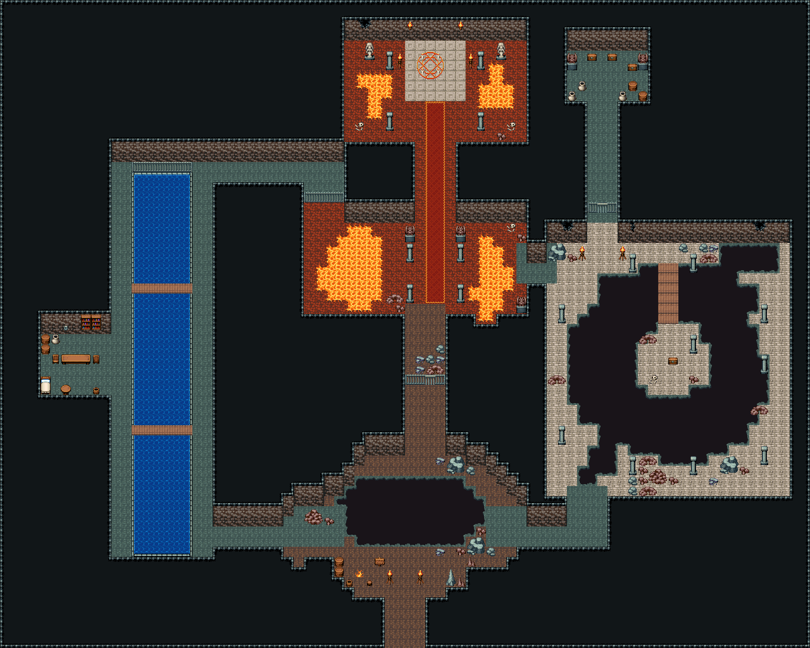

# 잊힌 수문 유적 · 큰 던전

네 구역을 잇는 큰 던전. 남쪽 입구 동굴(흙바닥, 앞선 모험가 야영지, 한가운데가 꺼진 큰 구덩이)에서 서쪽은 좁은 둑 사이 수문 수로(다리 둘, 서쪽 수문지기 방의 레버), 동쪽은 바닥이 무너져 섬을 두른 낭떠러지가 된 마름돌 대전(판자 다리 너머 섬에 열쇠 상자). 북쪽은 적암 전실과 보스방(카펫이 제단 마법진까지, 좌우 용암 틈). 한 바퀴: 입구 → 수로 → (레버로 여는 창살) → 전실 → 대전 → 입구. 지름길: 입구 북쪽 바위 문이 전실과 곧장 잇는다. 대전 북쪽 창살 문 너머 봉인 보물고(열쇠). 80×64, tilesetId=oprn_dungeon_stone. 입구 (39,63), 주인·보스 자리 (42,7). 통행 검사 목표 [[42,7],[66,34],[7,37],[15,28],[44,26],[30,52],[41,33],[58,50]].

출구: (39,63) → outside 남쪽 굴 어귀 → 바깥

닫힌 곳: 보물고(북동쪽 창살 문 안)는 열쇠로만 열린다. 수로 → 전실 창살과 지름길 바위 문도 레버·이벤트 몫이라 처음엔 닫혀 있다



## 놓은 소품 (저작 순서)
(x,y)는 왼쪽 위, tiles는 행 단위 번호. 이식 칸(480~)은 공통 규칙 문서의 이식표.
```json
[
  {
    "prop": "바닥 불길",
    "x": 35,
    "y": 56,
    "w": 1,
    "h": 1,
    "layer": "upper",
    "tiles": [
      [
        207
      ]
    ]
  },
  {
    "prop": "나무통",
    "x": 33,
    "y": 55,
    "w": 1,
    "h": 1,
    "layer": "upper",
    "tiles": [
      [
        417
      ]
    ]
  },
  {
    "prop": "나무통",
    "x": 33,
    "y": 56,
    "w": 1,
    "h": 1,
    "layer": "upper",
    "tiles": [
      [
        417
      ]
    ]
  },
  {
    "prop": "물통",
    "x": 34,
    "y": 57,
    "w": 1,
    "h": 1,
    "layer": "upper",
    "tiles": [
      [
        419
      ]
    ]
  },
  {
    "prop": "걸상",
    "x": 36,
    "y": 57,
    "w": 1,
    "h": 1,
    "layer": "upper",
    "tiles": [
      [
        356
      ]
    ]
  },
  {
    "prop": "표지판",
    "x": 37,
    "y": 55,
    "w": 1,
    "h": 1,
    "layer": "upper",
    "tiles": [
      [
        298
      ]
    ]
  },
  {
    "prop": "화로",
    "x": 38,
    "y": 56,
    "w": 1,
    "h": 2,
    "layer": "upper",
    "tiles": [
      [
        263
      ],
      [
        293
      ]
    ]
  },
  {
    "prop": "화로",
    "x": 41,
    "y": 56,
    "w": 1,
    "h": 2,
    "layer": "upper",
    "tiles": [
      [
        263
      ],
      [
        293
      ]
    ]
  },
  {
    "prop": "회색 석순",
    "x": 44,
    "y": 56,
    "w": 1,
    "h": 2,
    "layer": "upper",
    "tiles": [
      [
        261
      ],
      [
        291
      ]
    ]
  },
  {
    "prop": "작은 갈색 석순",
    "x": 45,
    "y": 57,
    "w": 1,
    "h": 1,
    "layer": "upper",
    "tiles": [
      [
        288
      ]
    ]
  },
  {
    "prop": "작은 갈색 석순",
    "x": 46,
    "y": 55,
    "w": 1,
    "h": 1,
    "layer": "upper",
    "tiles": [
      [
        288
      ]
    ]
  },
  {
    "prop": "큰 갈색 바위",
    "x": 30,
    "y": 50,
    "w": 2,
    "h": 2,
    "layer": "upper",
    "tiles": [
      [
        318,
        319
      ],
      [
        348,
        349
      ]
    ]
  },
  {
    "prop": "갈색 잔돌",
    "x": 32,
    "y": 51,
    "w": 1,
    "h": 1,
    "layer": "upper",
    "tiles": [
      [
        412
      ]
    ]
  },
  {
    "prop": "쇠창살 왼끝",
    "x": 40,
    "y": 37,
    "w": 1,
    "h": 1,
    "layer": "upper",
    "tiles": [
      [
        234
      ]
    ]
  },
  {
    "prop": "쇠창살",
    "x": 41,
    "y": 37,
    "w": 1,
    "h": 1,
    "layer": "upper",
    "tiles": [
      [
        235
      ]
    ]
  },
  {
    "prop": "창살 문",
    "x": 42,
    "y": 37,
    "w": 1,
    "h": 1,
    "layer": "upper",
    "tiles": [
      [
        205
      ]
    ]
  },
  {
    "prop": "쇠창살 오른끝",
    "x": 43,
    "y": 37,
    "w": 1,
    "h": 1,
    "layer": "upper",
    "tiles": [
      [
        236
      ]
    ]
  },
  {
    "prop": "쇠창살 왼끝",
    "x": 13,
    "y": 16,
    "w": 1,
    "h": 1,
    "layer": "upper",
    "tiles": [
      [
        234
      ]
    ]
  },
  {
    "prop": "쇠창살",
    "x": 14,
    "y": 16,
    "w": 1,
    "h": 1,
    "layer": "upper",
    "tiles": [
      [
        235
      ]
    ]
  },
  {
    "prop": "쇠창살",
    "x": 15,
    "y": 16,
    "w": 1,
    "h": 1,
    "layer": "upper",
    "tiles": [
      [
        235
      ]
    ]
  },
  {
    "prop": "쇠창살",
    "x": 16,
    "y": 16,
    "w": 1,
    "h": 1,
    "layer": "upper",
    "tiles": [
      [
        235
      ]
    ]
  },
  {
    "prop": "쇠창살",
    "x": 17,
    "y": 16,
    "w": 1,
    "h": 1,
    "layer": "upper",
    "tiles": [
      [
        235
      ]
    ]
  },
  {
    "prop": "쇠창살 오른끝",
    "x": 18,
    "y": 16,
    "w": 1,
    "h": 1,
    "layer": "upper",
    "tiles": [
      [
        236
      ]
    ]
  },
  {
    "prop": "벽 레버",
    "x": 6,
    "y": 32,
    "w": 1,
    "h": 1,
    "layer": "upper",
    "tiles": [
      [
        266
      ]
    ]
  },
  {
    "prop": "나무통",
    "x": 4,
    "y": 33,
    "w": 1,
    "h": 1,
    "layer": "upper",
    "tiles": [
      [
        417
      ]
    ]
  },
  {
    "prop": "나무통",
    "x": 4,
    "y": 34,
    "w": 1,
    "h": 1,
    "layer": "upper",
    "tiles": [
      [
        417
      ]
    ]
  },
  {
    "prop": "항아리",
    "x": 5,
    "y": 33,
    "w": 1,
    "h": 1,
    "layer": "upper",
    "tiles": [
      [
        418
      ]
    ]
  },
  {
    "prop": "긴 탁자",
    "x": 6,
    "y": 35,
    "w": 3,
    "h": 1,
    "layer": "upper",
    "tiles": [
      [
        385,
        386,
        387
      ]
    ]
  },
  {
    "prop": "의자(왼쪽 보기)",
    "x": 5,
    "y": 35,
    "w": 1,
    "h": 1,
    "layer": "upper",
    "tiles": [
      [
        327
      ]
    ]
  },
  {
    "prop": "의자(오른쪽 보기)",
    "x": 9,
    "y": 35,
    "w": 1,
    "h": 1,
    "layer": "upper",
    "tiles": [
      [
        328
      ]
    ]
  },
  {
    "prop": "침대",
    "x": 4,
    "y": 37,
    "w": 1,
    "h": 2,
    "layer": "upper",
    "tiles": [
      [
        384
      ],
      [
        414
      ]
    ]
  },
  {
    "prop": "둥근 탁자",
    "x": 6,
    "y": 38,
    "w": 1,
    "h": 1,
    "layer": "upper",
    "tiles": [
      [
        326
      ]
    ]
  },
  {
    "prop": "물통",
    "x": 9,
    "y": 38,
    "w": 1,
    "h": 1,
    "layer": "upper",
    "tiles": [
      [
        419
      ]
    ]
  },
  {
    "prop": "책장",
    "x": 8,
    "y": 31,
    "w": 1,
    "h": 2,
    "layer": "upper",
    "tiles": [
      [
        329
      ],
      [
        359
      ]
    ]
  },
  {
    "prop": "책장",
    "x": 9,
    "y": 31,
    "w": 1,
    "h": 2,
    "layer": "upper",
    "tiles": [
      [
        329
      ],
      [
        359
      ]
    ]
  },
  {
    "prop": "쇠창살 왼끝",
    "x": 30,
    "y": 19,
    "w": 1,
    "h": 1,
    "layer": "upper",
    "tiles": [
      [
        234
      ]
    ]
  },
  {
    "prop": "쇠창살",
    "x": 31,
    "y": 19,
    "w": 1,
    "h": 1,
    "layer": "upper",
    "tiles": [
      [
        235
      ]
    ]
  },
  {
    "prop": "쇠창살",
    "x": 32,
    "y": 19,
    "w": 1,
    "h": 1,
    "layer": "upper",
    "tiles": [
      [
        235
      ]
    ]
  },
  {
    "prop": "쇠창살 오른끝",
    "x": 33,
    "y": 19,
    "w": 1,
    "h": 1,
    "layer": "upper",
    "tiles": [
      [
        236
      ]
    ]
  },
  {
    "prop": "석주",
    "x": 40,
    "y": 24,
    "w": 1,
    "h": 2,
    "layer": "upper",
    "tiles": [
      [
        446
      ],
      [
        476
      ]
    ]
  },
  {
    "prop": "석주",
    "x": 45,
    "y": 24,
    "w": 1,
    "h": 2,
    "layer": "upper",
    "tiles": [
      [
        446
      ],
      [
        476
      ]
    ]
  },
  {
    "prop": "석주",
    "x": 40,
    "y": 28,
    "w": 1,
    "h": 2,
    "layer": "upper",
    "tiles": [
      [
        446
      ],
      [
        476
      ]
    ]
  },
  {
    "prop": "석주",
    "x": 45,
    "y": 28,
    "w": 1,
    "h": 2,
    "layer": "upper",
    "tiles": [
      [
        446
      ],
      [
        476
      ]
    ]
  },
  {
    "prop": "가고일 석상",
    "x": 40,
    "y": 22,
    "w": 1,
    "h": 2,
    "layer": "upper",
    "tiles": [
      [
        146
      ],
      [
        176
      ]
    ]
  },
  {
    "prop": "가고일 석상",
    "x": 45,
    "y": 22,
    "w": 1,
    "h": 2,
    "layer": "upper",
    "tiles": [
      [
        146
      ],
      [
        176
      ]
    ]
  },
  {
    "prop": "돌무더기",
    "x": 38,
    "y": 29,
    "w": 2,
    "h": 1,
    "layer": "upper",
    "tiles": [
      [
        259,
        260
      ]
    ]
  },
  {
    "prop": "갈색 잔돌",
    "x": 39,
    "y": 30,
    "w": 1,
    "h": 1,
    "layer": "upper",
    "tiles": [
      [
        412
      ]
    ]
  },
  {
    "prop": "가고일 석상",
    "x": 51,
    "y": 29,
    "w": 1,
    "h": 2,
    "layer": "upper",
    "tiles": [
      [
        146
      ],
      [
        176
      ]
    ]
  },
  {
    "prop": "해골과 뼈",
    "x": 50,
    "y": 22,
    "w": 1,
    "h": 1,
    "layer": "upper",
    "tiles": [
      [
        299
      ]
    ]
  },
  {
    "prop": "갈색 잔돌",
    "x": 51,
    "y": 23,
    "w": 1,
    "h": 1,
    "layer": "upper",
    "tiles": [
      [
        412
      ]
    ]
  },
  {
    "prop": "붉은 마법진",
    "x": 41,
    "y": 5,
    "w": 3,
    "h": 3,
    "layer": "upper",
    "tiles": [
      [
        441,
        442,
        443
      ],
      [
        471,
        472,
        473
      ],
      [
        27,
        28,
        29
      ]
    ]
  },
  {
    "prop": "화로",
    "x": 39,
    "y": 5,
    "w": 1,
    "h": 2,
    "layer": "upper",
    "tiles": [
      [
        263
      ],
      [
        293
      ]
    ]
  },
  {
    "prop": "화로",
    "x": 46,
    "y": 5,
    "w": 1,
    "h": 2,
    "layer": "upper",
    "tiles": [
      [
        263
      ],
      [
        293
      ]
    ]
  },
  {
    "prop": "여신 석상",
    "x": 36,
    "y": 4,
    "w": 1,
    "h": 2,
    "layer": "upper",
    "tiles": [
      [
        145
      ],
      [
        175
      ]
    ]
  },
  {
    "prop": "여신 석상",
    "x": 49,
    "y": 4,
    "w": 1,
    "h": 2,
    "layer": "upper",
    "tiles": [
      [
        145
      ],
      [
        175
      ]
    ]
  },
  {
    "prop": "석주",
    "x": 38,
    "y": 11,
    "w": 1,
    "h": 2,
    "layer": "upper",
    "tiles": [
      [
        446
      ],
      [
        476
      ]
    ]
  },
  {
    "prop": "석주",
    "x": 47,
    "y": 11,
    "w": 1,
    "h": 2,
    "layer": "upper",
    "tiles": [
      [
        446
      ],
      [
        476
      ]
    ]
  },
  {
    "prop": "석주",
    "x": 38,
    "y": 5,
    "w": 1,
    "h": 2,
    "layer": "upper",
    "tiles": [
      [
        446
      ],
      [
        476
      ]
    ]
  },
  {
    "prop": "석주",
    "x": 47,
    "y": 5,
    "w": 1,
    "h": 2,
    "layer": "upper",
    "tiles": [
      [
        446
      ],
      [
        476
      ]
    ]
  },
  {
    "prop": "해골과 뼈",
    "x": 50,
    "y": 12,
    "w": 1,
    "h": 1,
    "layer": "upper",
    "tiles": [
      [
        299
      ]
    ]
  },
  {
    "prop": "갈색 잔돌",
    "x": 49,
    "y": 13,
    "w": 1,
    "h": 1,
    "layer": "upper",
    "tiles": [
      [
        412
      ]
    ]
  },
  {
    "prop": "해골과 뼈",
    "x": 35,
    "y": 12,
    "w": 1,
    "h": 1,
    "layer": "upper",
    "tiles": [
      [
        299
      ]
    ]
  },
  {
    "prop": "벽 균열 큰",
    "x": 35,
    "y": 2,
    "w": 2,
    "h": 1,
    "layer": "upper",
    "tiles": [
      [
        268,
        269
      ]
    ]
  },
  {
    "prop": "벽 횃불",
    "x": 40,
    "y": 2,
    "w": 1,
    "h": 1,
    "layer": "upper",
    "tiles": [
      [
        264
      ]
    ]
  },
  {
    "prop": "벽 횃불",
    "x": 45,
    "y": 2,
    "w": 1,
    "h": 1,
    "layer": "upper",
    "tiles": [
      [
        264
      ]
    ]
  },
  {
    "prop": "쇠창살 왼끝",
    "x": 58,
    "y": 20,
    "w": 1,
    "h": 1,
    "layer": "upper",
    "tiles": [
      [
        234
      ]
    ]
  },
  {
    "prop": "창살 문",
    "x": 59,
    "y": 20,
    "w": 1,
    "h": 1,
    "layer": "upper",
    "tiles": [
      [
        205
      ]
    ]
  },
  {
    "prop": "쇠창살 오른끝",
    "x": 60,
    "y": 20,
    "w": 1,
    "h": 1,
    "layer": "upper",
    "tiles": [
      [
        236
      ]
    ]
  },
  {
    "prop": "화로",
    "x": 57,
    "y": 24,
    "w": 1,
    "h": 2,
    "layer": "upper",
    "tiles": [
      [
        263
      ],
      [
        293
      ]
    ]
  },
  {
    "prop": "화로",
    "x": 61,
    "y": 24,
    "w": 1,
    "h": 2,
    "layer": "upper",
    "tiles": [
      [
        263
      ],
      [
        293
      ]
    ]
  },
  {
    "prop": "가고일 석상",
    "x": 56,
    "y": 5,
    "w": 1,
    "h": 2,
    "layer": "upper",
    "tiles": [
      [
        146
      ],
      [
        176
      ]
    ]
  },
  {
    "prop": "가고일 석상",
    "x": 63,
    "y": 5,
    "w": 1,
    "h": 2,
    "layer": "upper",
    "tiles": [
      [
        146
      ],
      [
        176
      ]
    ]
  },
  {
    "prop": "보물상자",
    "x": 58,
    "y": 5,
    "w": 1,
    "h": 1,
    "layer": "upper",
    "tiles": [
      [
        480
      ]
    ]
  },
  {
    "prop": "보물상자",
    "x": 60,
    "y": 5,
    "w": 1,
    "h": 1,
    "layer": "upper",
    "tiles": [
      [
        480
      ]
    ]
  },
  {
    "prop": "보물상자",
    "x": 62,
    "y": 6,
    "w": 1,
    "h": 1,
    "layer": "upper",
    "tiles": [
      [
        480
      ]
    ]
  },
  {
    "prop": "항아리",
    "x": 57,
    "y": 8,
    "w": 1,
    "h": 1,
    "layer": "upper",
    "tiles": [
      [
        418
      ]
    ]
  },
  {
    "prop": "항아리",
    "x": 56,
    "y": 9,
    "w": 1,
    "h": 1,
    "layer": "upper",
    "tiles": [
      [
        418
      ]
    ]
  },
  {
    "prop": "나무통",
    "x": 62,
    "y": 8,
    "w": 1,
    "h": 1,
    "layer": "upper",
    "tiles": [
      [
        417
      ]
    ]
  },
  {
    "prop": "나무통",
    "x": 63,
    "y": 9,
    "w": 1,
    "h": 1,
    "layer": "upper",
    "tiles": [
      [
        417
      ]
    ]
  },
  {
    "prop": "항아리",
    "x": 61,
    "y": 9,
    "w": 1,
    "h": 1,
    "layer": "upper",
    "tiles": [
      [
        418
      ]
    ]
  },
  {
    "prop": "보물상자",
    "x": 66,
    "y": 35,
    "w": 1,
    "h": 1,
    "layer": "upper",
    "tiles": [
      [
        480
      ]
    ]
  },
  {
    "prop": "해골과 뼈",
    "x": 64,
    "y": 37,
    "w": 1,
    "h": 1,
    "layer": "upper",
    "tiles": [
      [
        299
      ]
    ]
  },
  {
    "prop": "돌무더기",
    "x": 63,
    "y": 33,
    "w": 2,
    "h": 1,
    "layer": "upper",
    "tiles": [
      [
        259,
        260
      ]
    ]
  },
  {
    "prop": "석주",
    "x": 68,
    "y": 33,
    "w": 1,
    "h": 2,
    "layer": "upper",
    "tiles": [
      [
        446
      ],
      [
        476
      ]
    ]
  },
  {
    "prop": "갈색 잔돌",
    "x": 68,
    "y": 37,
    "w": 1,
    "h": 1,
    "layer": "upper",
    "tiles": [
      [
        412
      ]
    ]
  },
  {
    "prop": "석주",
    "x": 55,
    "y": 30,
    "w": 1,
    "h": 2,
    "layer": "upper",
    "tiles": [
      [
        446
      ],
      [
        476
      ]
    ]
  },
  {
    "prop": "돌무더기",
    "x": 54,
    "y": 37,
    "w": 2,
    "h": 1,
    "layer": "upper",
    "tiles": [
      [
        259,
        260
      ]
    ]
  },
  {
    "prop": "석주",
    "x": 55,
    "y": 42,
    "w": 1,
    "h": 2,
    "layer": "upper",
    "tiles": [
      [
        446
      ],
      [
        476
      ]
    ]
  },
  {
    "prop": "석주",
    "x": 75,
    "y": 30,
    "w": 1,
    "h": 2,
    "layer": "upper",
    "tiles": [
      [
        446
      ],
      [
        476
      ]
    ]
  },
  {
    "prop": "석주",
    "x": 75,
    "y": 35,
    "w": 1,
    "h": 2,
    "layer": "upper",
    "tiles": [
      [
        446
      ],
      [
        476
      ]
    ]
  },
  {
    "prop": "돌무더기",
    "x": 74,
    "y": 40,
    "w": 2,
    "h": 1,
    "layer": "upper",
    "tiles": [
      [
        259,
        260
      ]
    ]
  },
  {
    "prop": "석주",
    "x": 75,
    "y": 44,
    "w": 1,
    "h": 2,
    "layer": "upper",
    "tiles": [
      [
        446
      ],
      [
        476
      ]
    ]
  },
  {
    "prop": "석주",
    "x": 62,
    "y": 45,
    "w": 1,
    "h": 2,
    "layer": "upper",
    "tiles": [
      [
        446
      ],
      [
        476
      ]
    ]
  },
  {
    "prop": "석주",
    "x": 68,
    "y": 45,
    "w": 1,
    "h": 2,
    "layer": "upper",
    "tiles": [
      [
        446
      ],
      [
        476
      ]
    ]
  },
  {
    "prop": "석주",
    "x": 62,
    "y": 25,
    "w": 1,
    "h": 2,
    "layer": "upper",
    "tiles": [
      [
        446
      ],
      [
        476
      ]
    ]
  },
  {
    "prop": "석주",
    "x": 68,
    "y": 25,
    "w": 1,
    "h": 2,
    "layer": "upper",
    "tiles": [
      [
        446
      ],
      [
        476
      ]
    ]
  },
  {
    "prop": "벽 균열 큰",
    "x": 74,
    "y": 22,
    "w": 2,
    "h": 1,
    "layer": "upper",
    "tiles": [
      [
        268,
        269
      ]
    ]
  },
  {
    "prop": "벽 균열",
    "x": 62,
    "y": 22,
    "w": 1,
    "h": 1,
    "layer": "upper",
    "tiles": [
      [
        267
      ]
    ]
  },
  {
    "prop": "벽 균열 큰",
    "x": 55,
    "y": 22,
    "w": 2,
    "h": 1,
    "layer": "upper",
    "tiles": [
      [
        268,
        269
      ]
    ]
  },
  {
    "prop": "큰 회색 바위",
    "x": 54,
    "y": 24,
    "w": 2,
    "h": 2,
    "layer": "upper",
    "tiles": [
      [
        322,
        323
      ],
      [
        352,
        353
      ]
    ]
  },
  {
    "prop": "갈색 잔돌",
    "x": 56,
    "y": 25,
    "w": 1,
    "h": 1,
    "layer": "upper",
    "tiles": [
      [
        412
      ]
    ]
  },
  {
    "prop": "큰 회색 바위",
    "x": 71,
    "y": 45,
    "w": 2,
    "h": 2,
    "layer": "upper",
    "tiles": [
      [
        322,
        323
      ],
      [
        352,
        353
      ]
    ]
  },
  {
    "prop": "갈색 잔돌",
    "x": 73,
    "y": 46,
    "w": 1,
    "h": 1,
    "layer": "upper",
    "tiles": [
      [
        412
      ]
    ]
  },
  {
    "prop": "잔돌 더미",
    "x": 70,
    "y": 47,
    "w": 1,
    "h": 1,
    "layer": "upper",
    "tiles": [
      [
        383
      ]
    ]
  },
  {
    "prop": "큰 갈색 바위",
    "x": 64,
    "y": 46,
    "w": 2,
    "h": 2,
    "layer": "upper",
    "tiles": [
      [
        318,
        319
      ],
      [
        348,
        349
      ]
    ]
  },
  {
    "prop": "갈색 잔돌",
    "x": 66,
    "y": 47,
    "w": 1,
    "h": 1,
    "layer": "upper",
    "tiles": [
      [
        412
      ]
    ]
  },
  {
    "kind": "dressing",
    "note": "무너진 벽 곁·모서리에 몰아 둔 잔해 덩이(1~3곳) — 통로는 막지 않음",
    "clumps": [
      {
        "kind": "prop",
        "x": 44,
        "y": 45,
        "tiles": [
          [
            0,
            0,
            322
          ],
          [
            1,
            0,
            323
          ],
          [
            0,
            1,
            352
          ],
          [
            1,
            1,
            353
          ]
        ]
      },
      {
        "kind": "prop",
        "x": 43,
        "y": 45,
        "tiles": [
          [
            0,
            0,
            383
          ]
        ]
      },
      {
        "kind": "prop",
        "x": 46,
        "y": 46,
        "tiles": [
          [
            0,
            0,
            382
          ]
        ]
      },
      {
        "kind": "prop",
        "x": 46,
        "y": 53,
        "tiles": [
          [
            0,
            0,
            322
          ],
          [
            1,
            0,
            323
          ],
          [
            0,
            1,
            352
          ],
          [
            1,
            1,
            353
          ]
        ]
      },
      {
        "kind": "prop",
        "x": 47,
        "y": 52,
        "tiles": [
          [
            0,
            0,
            412
          ]
        ]
      },
      {
        "kind": "prop",
        "x": 48,
        "y": 54,
        "tiles": [
          [
            0,
            0,
            382
          ]
        ]
      },
      {
        "kind": "prop",
        "x": 45,
        "y": 54,
        "tiles": [
          [
            0,
            0,
            412
          ]
        ]
      },
      {
        "kind": "prop",
        "x": 43,
        "y": 54,
        "tiles": [
          [
            0,
            0,
            383
          ]
        ]
      },
      {
        "kind": "prop",
        "x": 42,
        "y": 36,
        "tiles": [
          [
            0,
            0,
            259
          ],
          [
            1,
            0,
            260
          ]
        ]
      },
      {
        "kind": "prop",
        "x": 43,
        "y": 35,
        "tiles": [
          [
            0,
            0,
            383
          ]
        ]
      },
      {
        "kind": "prop",
        "x": 42,
        "y": 35,
        "tiles": [
          [
            0,
            0,
            382
          ]
        ]
      },
      {
        "kind": "prop",
        "x": 41,
        "y": 36,
        "tiles": [
          [
            0,
            0,
            383
          ]
        ]
      },
      {
        "kind": "prop",
        "x": 43,
        "y": 34,
        "tiles": [
          [
            0,
            0,
            382
          ]
        ]
      },
      {
        "kind": "prop",
        "x": 41,
        "y": 35,
        "tiles": [
          [
            0,
            0,
            383
          ]
        ]
      },
      {
        "kind": "prop",
        "x": 63,
        "y": 45,
        "tiles": [
          [
            0,
            0,
            259
          ],
          [
            1,
            0,
            260
          ]
        ]
      },
      {
        "kind": "prop",
        "x": 63,
        "y": 46,
        "tiles": [
          [
            0,
            0,
            412
          ]
        ]
      },
      {
        "kind": "prop",
        "x": 63,
        "y": 47,
        "tiles": [
          [
            0,
            0,
            412
          ]
        ]
      },
      {
        "kind": "prop",
        "x": 63,
        "y": 48,
        "tiles": [
          [
            0,
            0,
            259
          ],
          [
            1,
            0,
            260
          ]
        ]
      },
      {
        "kind": "prop",
        "x": 62,
        "y": 47,
        "tiles": [
          [
            0,
            0,
            382
          ]
        ]
      },
      {
        "kind": "prop",
        "x": 62,
        "y": 48,
        "tiles": [
          [
            0,
            0,
            382
          ]
        ]
      },
      {
        "kind": "prop",
        "x": 69,
        "y": 25,
        "tiles": [
          [
            0,
            0,
            259
          ],
          [
            1,
            0,
            260
          ]
        ]
      },
      {
        "kind": "prop",
        "x": 70,
        "y": 24,
        "tiles": [
          [
            0,
            0,
            383
          ]
        ]
      },
      {
        "kind": "prop",
        "x": 69,
        "y": 24,
        "tiles": [
          [
            0,
            0,
            382
          ]
        ]
      },
      {
        "kind": "prop",
        "x": 67,
        "y": 24,
        "tiles": [
          [
            0,
            0,
            382
          ]
        ]
      }
    ]
  }
]
```

전체 두 레이어는 다음 배열 문서가 정답이다.
