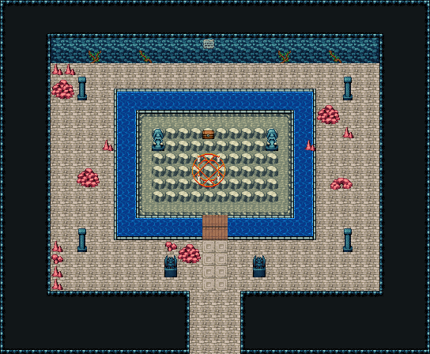

# 해저 신전 · 바다 여신 제단

신전 맨 안쪽 제단실. 물 해자가 바위 제단 섬을 두르고 남쪽 판자 다리 하나로만 건넌다. 섬 위엔 바다 여신상 둘 사이에 붉은 마법진, 그 뒤에 공물 상자가 놓였다(보스 자리 keeper는 다리 끝). 해자 바깥 네 모서리에 석주, 다리 앞 가고일 둘, 두 모서리엔 산호 무리, 북쪽 벽엔 해초와 석판. 34×28, tilesetId=oprn_dungeon_sea. 입구 (16,27), 주인·보스 자리 (16,15). 통행 검사 목표 [[16,15],[16,11],[5,20],[28,20]].

출구: (16,27) → dungeon-sunken-hall (19,1) 남쪽 → 산호 기둥 대전



## 놓은 소품 (저작 순서)
(x,y)는 왼쪽 위, tiles는 행 단위 번호. 이식 칸(480~)은 공통 규칙 문서의 이식표.
```json
[
  {
    "prop": "여신 석상",
    "x": 12,
    "y": 10,
    "w": 1,
    "h": 2,
    "layer": "upper",
    "tiles": [
      [
        145
      ],
      [
        175
      ]
    ]
  },
  {
    "prop": "여신 석상",
    "x": 21,
    "y": 10,
    "w": 1,
    "h": 2,
    "layer": "upper",
    "tiles": [
      [
        145
      ],
      [
        175
      ]
    ]
  },
  {
    "prop": "붉은 마법진",
    "x": 15,
    "y": 12,
    "w": 3,
    "h": 3,
    "layer": "upper",
    "tiles": [
      [
        441,
        442,
        443
      ],
      [
        471,
        472,
        473
      ],
      [
        27,
        28,
        29
      ]
    ]
  },
  {
    "prop": "보물상자",
    "x": 16,
    "y": 10,
    "w": 1,
    "h": 1,
    "layer": "upper",
    "tiles": [
      [
        480
      ]
    ]
  },
  {
    "prop": "석주",
    "x": 6,
    "y": 6,
    "w": 1,
    "h": 2,
    "layer": "upper",
    "tiles": [
      [
        446
      ],
      [
        476
      ]
    ]
  },
  {
    "prop": "석주",
    "x": 27,
    "y": 6,
    "w": 1,
    "h": 2,
    "layer": "upper",
    "tiles": [
      [
        446
      ],
      [
        476
      ]
    ]
  },
  {
    "prop": "석주",
    "x": 6,
    "y": 18,
    "w": 1,
    "h": 2,
    "layer": "upper",
    "tiles": [
      [
        446
      ],
      [
        476
      ]
    ]
  },
  {
    "prop": "석주",
    "x": 27,
    "y": 18,
    "w": 1,
    "h": 2,
    "layer": "upper",
    "tiles": [
      [
        446
      ],
      [
        476
      ]
    ]
  },
  {
    "prop": "가고일 석상",
    "x": 13,
    "y": 20,
    "w": 1,
    "h": 2,
    "layer": "upper",
    "tiles": [
      [
        146
      ],
      [
        176
      ]
    ]
  },
  {
    "prop": "가고일 석상",
    "x": 20,
    "y": 20,
    "w": 1,
    "h": 2,
    "layer": "upper",
    "tiles": [
      [
        146
      ],
      [
        176
      ]
    ]
  },
  {
    "prop": "큰 갈색 바위",
    "x": 25,
    "y": 8,
    "w": 2,
    "h": 2,
    "layer": "upper",
    "tiles": [
      [
        318,
        319
      ],
      [
        348,
        349
      ]
    ]
  },
  {
    "prop": "작은 갈색 석순",
    "x": 27,
    "y": 10,
    "w": 1,
    "h": 1,
    "layer": "upper",
    "tiles": [
      [
        288
      ]
    ]
  },
  {
    "prop": "작은 갈색 석순",
    "x": 24,
    "y": 11,
    "w": 1,
    "h": 1,
    "layer": "upper",
    "tiles": [
      [
        288
      ]
    ]
  },
  {
    "prop": "큰 갈색 바위",
    "x": 6,
    "y": 13,
    "w": 2,
    "h": 2,
    "layer": "upper",
    "tiles": [
      [
        318,
        319
      ],
      [
        348,
        349
      ]
    ]
  },
  {
    "prop": "작은 갈색 석순",
    "x": 8,
    "y": 11,
    "w": 1,
    "h": 1,
    "layer": "upper",
    "tiles": [
      [
        288
      ]
    ]
  },
  {
    "prop": "돌무더기",
    "x": 26,
    "y": 14,
    "w": 2,
    "h": 1,
    "layer": "upper",
    "tiles": [
      [
        259,
        260
      ]
    ]
  },
  {
    "prop": "덩굴",
    "x": 7,
    "y": 4,
    "w": 1,
    "h": 1,
    "layer": "upper",
    "tiles": [
      [
        177
      ]
    ]
  },
  {
    "prop": "덩굴 긴",
    "x": 11,
    "y": 4,
    "w": 1,
    "h": 1,
    "layer": "upper",
    "tiles": [
      [
        178
      ]
    ]
  },
  {
    "prop": "벽 석판",
    "x": 16,
    "y": 3,
    "w": 1,
    "h": 1,
    "layer": "upper",
    "tiles": [
      [
        265
      ]
    ]
  },
  {
    "prop": "덩굴",
    "x": 22,
    "y": 4,
    "w": 1,
    "h": 1,
    "layer": "upper",
    "tiles": [
      [
        177
      ]
    ]
  },
  {
    "prop": "덩굴 긴",
    "x": 26,
    "y": 4,
    "w": 1,
    "h": 1,
    "layer": "upper",
    "tiles": [
      [
        178
      ]
    ]
  },
  {
    "kind": "dressing",
    "note": "무너진 벽 곁·모서리에 몰아 둔 잔해 덩이(1~3곳) — 통로는 막지 않음",
    "clumps": [
      {
        "kind": "prop",
        "x": 14,
        "y": 19,
        "tiles": [
          [
            0,
            0,
            318
          ],
          [
            1,
            0,
            319
          ],
          [
            0,
            1,
            348
          ],
          [
            1,
            1,
            349
          ]
        ]
      },
      {
        "kind": "prop",
        "x": 13,
        "y": 19,
        "tiles": [
          [
            0,
            0,
            412
          ]
        ]
      },
      {
        "kind": "prop",
        "x": 4,
        "y": 22,
        "tiles": [
          [
            0,
            0,
            288
          ]
        ]
      },
      {
        "kind": "prop",
        "x": 4,
        "y": 21,
        "tiles": [
          [
            0,
            0,
            288
          ]
        ]
      },
      {
        "kind": "prop",
        "x": 4,
        "y": 20,
        "tiles": [
          [
            0,
            0,
            412
          ]
        ]
      },
      {
        "kind": "prop",
        "x": 4,
        "y": 19,
        "tiles": [
          [
            0,
            0,
            288
          ]
        ]
      },
      {
        "kind": "prop",
        "x": 4,
        "y": 5,
        "tiles": [
          [
            0,
            0,
            288
          ]
        ]
      },
      {
        "kind": "prop",
        "x": 4,
        "y": 6,
        "tiles": [
          [
            0,
            0,
            318
          ],
          [
            1,
            0,
            319
          ],
          [
            0,
            1,
            348
          ],
          [
            1,
            1,
            349
          ]
        ]
      },
      {
        "kind": "prop",
        "x": 5,
        "y": 5,
        "tiles": [
          [
            0,
            0,
            288
          ]
        ]
      }
    ]
  }
]
```

전체 두 레이어는 다음 배열 문서가 정답이다.
