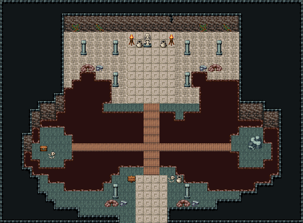

# 늪 신전 · 독늪에 잠긴 폐신전

독늪에 반쯤 잠긴 폐신전. 남쪽 문 틈에서 옛 참배길 석판이 늪가까지 오고, 경고 표지판과 늪에 빠졌던 모험가의 뼈·짐을 지나 널판 길이 검붉은 독늪(바닥이 꺼진 진창, pit-pale 오토타일)을 건너 신전 석판 바닥에 닿는다. 널판 길 허리에서 동서로 갈라진 널판이 늪 가운데 섬 둘(서쪽은 잠겼던 상자, 동쪽은 쓰러진 석주 밑동)로 간다. 신전 안쪽엔 무늬 석판 신랑 끝 늪의 여신상과 화로 둘·공물 항아리, 석주 두 줄 중 바깥 둘은 무너져 늪가에 돌무더기가 됐고 늪은 신전 바닥 양 모서리까지 스며들었다. 벽엔 덩굴. 38×28, tilesetId=oprn_dungeon_cave. 입구 (17,27). 통행 검사 목표 [[18,6],[9,6],[28,6],[6,18],[30,19]].

출구: (17,27) → outside 남쪽 입구 → 늪지대



## 놓은 소품 (저작 순서)
(x,y)는 왼쪽 위, tiles는 행 단위 번호. 이식 칸(480~)은 공통 규칙 문서의 이식표.
```json
[
  {
    "prop": "여신 석상",
    "x": 18,
    "y": 4,
    "w": 1,
    "h": 2,
    "layer": "upper",
    "tiles": [
      [
        145
      ],
      [
        175
      ]
    ]
  },
  {
    "prop": "화로",
    "x": 16,
    "y": 4,
    "w": 1,
    "h": 2,
    "layer": "upper",
    "tiles": [
      [
        263
      ],
      [
        293
      ]
    ]
  },
  {
    "prop": "화로",
    "x": 21,
    "y": 4,
    "w": 1,
    "h": 2,
    "layer": "upper",
    "tiles": [
      [
        263
      ],
      [
        293
      ]
    ]
  },
  {
    "prop": "항아리",
    "x": 17,
    "y": 5,
    "w": 1,
    "h": 1,
    "layer": "upper",
    "tiles": [
      [
        418
      ]
    ]
  },
  {
    "prop": "항아리",
    "x": 20,
    "y": 5,
    "w": 1,
    "h": 1,
    "layer": "upper",
    "tiles": [
      [
        418
      ]
    ]
  },
  {
    "prop": "석주",
    "x": 10,
    "y": 5,
    "w": 1,
    "h": 2,
    "layer": "upper",
    "tiles": [
      [
        446
      ],
      [
        476
      ]
    ]
  },
  {
    "prop": "석주",
    "x": 14,
    "y": 5,
    "w": 1,
    "h": 2,
    "layer": "upper",
    "tiles": [
      [
        446
      ],
      [
        476
      ]
    ]
  },
  {
    "prop": "석주",
    "x": 23,
    "y": 5,
    "w": 1,
    "h": 2,
    "layer": "upper",
    "tiles": [
      [
        446
      ],
      [
        476
      ]
    ]
  },
  {
    "prop": "석주",
    "x": 27,
    "y": 5,
    "w": 1,
    "h": 2,
    "layer": "upper",
    "tiles": [
      [
        446
      ],
      [
        476
      ]
    ]
  },
  {
    "prop": "석주",
    "x": 14,
    "y": 9,
    "w": 1,
    "h": 2,
    "layer": "upper",
    "tiles": [
      [
        446
      ],
      [
        476
      ]
    ]
  },
  {
    "prop": "석주",
    "x": 23,
    "y": 9,
    "w": 1,
    "h": 2,
    "layer": "upper",
    "tiles": [
      [
        446
      ],
      [
        476
      ]
    ]
  },
  {
    "prop": "돌무더기",
    "x": 10,
    "y": 8,
    "w": 2,
    "h": 1,
    "layer": "upper",
    "tiles": [
      [
        259,
        260
      ]
    ]
  },
  {
    "prop": "잔돌 더미",
    "x": 12,
    "y": 8,
    "w": 1,
    "h": 1,
    "layer": "upper",
    "tiles": [
      [
        383
      ]
    ]
  },
  {
    "prop": "돌무더기",
    "x": 26,
    "y": 8,
    "w": 2,
    "h": 1,
    "layer": "upper",
    "tiles": [
      [
        259,
        260
      ]
    ]
  },
  {
    "prop": "잔돌 더미",
    "x": 25,
    "y": 8,
    "w": 1,
    "h": 1,
    "layer": "upper",
    "tiles": [
      [
        383
      ]
    ]
  },
  {
    "prop": "덩굴",
    "x": 9,
    "y": 3,
    "w": 1,
    "h": 1,
    "layer": "upper",
    "tiles": [
      [
        177
      ]
    ]
  },
  {
    "prop": "덩굴 긴",
    "x": 12,
    "y": 3,
    "w": 1,
    "h": 1,
    "layer": "upper",
    "tiles": [
      [
        178
      ]
    ]
  },
  {
    "prop": "덩굴",
    "x": 25,
    "y": 3,
    "w": 1,
    "h": 1,
    "layer": "upper",
    "tiles": [
      [
        177
      ]
    ]
  },
  {
    "prop": "덩굴 긴",
    "x": 28,
    "y": 3,
    "w": 1,
    "h": 1,
    "layer": "upper",
    "tiles": [
      [
        178
      ]
    ]
  },
  {
    "prop": "벽 균열",
    "x": 21,
    "y": 2,
    "w": 1,
    "h": 1,
    "layer": "upper",
    "tiles": [
      [
        267
      ]
    ]
  },
  {
    "prop": "표지판",
    "x": 16,
    "y": 22,
    "w": 1,
    "h": 1,
    "layer": "upper",
    "tiles": [
      [
        298
      ]
    ]
  },
  {
    "prop": "해골과 뼈",
    "x": 21,
    "y": 22,
    "w": 1,
    "h": 1,
    "layer": "upper",
    "tiles": [
      [
        299
      ]
    ]
  },
  {
    "prop": "항아리",
    "x": 22,
    "y": 22,
    "w": 1,
    "h": 1,
    "layer": "upper",
    "tiles": [
      [
        418
      ]
    ]
  },
  {
    "prop": "석주",
    "x": 14,
    "y": 23,
    "w": 1,
    "h": 2,
    "layer": "upper",
    "tiles": [
      [
        446
      ],
      [
        476
      ]
    ]
  },
  {
    "prop": "석주",
    "x": 23,
    "y": 23,
    "w": 1,
    "h": 2,
    "layer": "upper",
    "tiles": [
      [
        446
      ],
      [
        476
      ]
    ]
  },
  {
    "prop": "돌무더기",
    "x": 13,
    "y": 25,
    "w": 2,
    "h": 1,
    "layer": "upper",
    "tiles": [
      [
        259,
        260
      ]
    ]
  },
  {
    "prop": "잔돌 더미",
    "x": 15,
    "y": 25,
    "w": 1,
    "h": 1,
    "layer": "upper",
    "tiles": [
      [
        383
      ]
    ]
  },
  {
    "prop": "돌무더기",
    "x": 22,
    "y": 25,
    "w": 2,
    "h": 1,
    "layer": "upper",
    "tiles": [
      [
        259,
        260
      ]
    ]
  },
  {
    "prop": "잔돌 더미",
    "x": 24,
    "y": 25,
    "w": 1,
    "h": 1,
    "layer": "upper",
    "tiles": [
      [
        383
      ]
    ]
  },
  {
    "prop": "보물상자",
    "x": 5,
    "y": 18,
    "w": 1,
    "h": 1,
    "layer": "upper",
    "tiles": [
      [
        480
      ]
    ]
  },
  {
    "prop": "해골과 뼈",
    "x": 6,
    "y": 19,
    "w": 1,
    "h": 1,
    "layer": "upper",
    "tiles": [
      [
        299
      ]
    ]
  },
  {
    "prop": "큰 회색 바위",
    "x": 31,
    "y": 17,
    "w": 2,
    "h": 2,
    "layer": "upper",
    "tiles": [
      [
        322,
        323
      ],
      [
        352,
        353
      ]
    ]
  }
]
```

전체 두 레이어는 다음 배열 문서가 정답이다.
