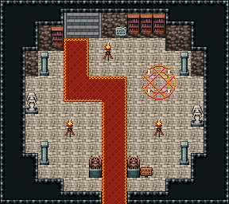

# 마법사 탑 · 1층 입구 홀

팔각 탑의 1층 입구 홀. 남쪽 문에서 붉은 카펫이 북쪽으로 올라가 서쪽으로 꺾여 북쪽 벽의 오르는 돌계단(x5~7)에 닿는다. 계단 옆 화로, 북쪽 벽 동쪽은 책장 셋, 동쪽 바닥엔 수호 마법진, 팔각 모서리마다 석주, 문 안쪽 가고일 둘, 서·동 벽에 여신상. 18×16, tilesetId=oprn_dungeon_stone. 입구 (8,15). 통행 검사 목표 [[6,3],[12,8],[3,9]].

출구: (6,2) → dungeon-tower-2f (6,6) 북쪽 벽 서쪽 돌계단 → 2층 · (8,15) → outside 남쪽 문 → 탑 밖



## 놓은 소품 (저작 순서)
(x,y)는 왼쪽 위, tiles는 행 단위 번호. 이식 칸(480~)은 공통 규칙 문서의 이식표.
```json
[
  {
    "prop": "오르는 돌계단(벽면)",
    "x": 5,
    "y": 1,
    "w": 3,
    "h": 2,
    "layer": "lower",
    "tiles": [
      [
        483,
        484,
        485
      ],
      [
        483,
        484,
        485
      ]
    ]
  },
  {
    "prop": "화로",
    "x": 8,
    "y": 3,
    "w": 1,
    "h": 2,
    "layer": "upper",
    "tiles": [
      [
        263
      ],
      [
        293
      ]
    ]
  },
  {
    "prop": "책장",
    "x": 10,
    "y": 1,
    "w": 1,
    "h": 2,
    "layer": "upper",
    "tiles": [
      [
        329
      ],
      [
        359
      ]
    ]
  },
  {
    "prop": "책장",
    "x": 11,
    "y": 1,
    "w": 1,
    "h": 2,
    "layer": "upper",
    "tiles": [
      [
        329
      ],
      [
        359
      ]
    ]
  },
  {
    "prop": "책장",
    "x": 12,
    "y": 1,
    "w": 1,
    "h": 2,
    "layer": "upper",
    "tiles": [
      [
        329
      ],
      [
        359
      ]
    ]
  },
  {
    "prop": "벽 석판",
    "x": 9,
    "y": 2,
    "w": 1,
    "h": 1,
    "layer": "upper",
    "tiles": [
      [
        265
      ]
    ]
  },
  {
    "prop": "석주",
    "x": 3,
    "y": 4,
    "w": 1,
    "h": 2,
    "layer": "upper",
    "tiles": [
      [
        446
      ],
      [
        476
      ]
    ]
  },
  {
    "prop": "석주",
    "x": 14,
    "y": 4,
    "w": 1,
    "h": 2,
    "layer": "upper",
    "tiles": [
      [
        446
      ],
      [
        476
      ]
    ]
  },
  {
    "prop": "석주",
    "x": 3,
    "y": 11,
    "w": 1,
    "h": 2,
    "layer": "upper",
    "tiles": [
      [
        446
      ],
      [
        476
      ]
    ]
  },
  {
    "prop": "석주",
    "x": 14,
    "y": 11,
    "w": 1,
    "h": 2,
    "layer": "upper",
    "tiles": [
      [
        446
      ],
      [
        476
      ]
    ]
  },
  {
    "prop": "가고일 석상",
    "x": 7,
    "y": 12,
    "w": 1,
    "h": 2,
    "layer": "upper",
    "tiles": [
      [
        146
      ],
      [
        176
      ]
    ]
  },
  {
    "prop": "가고일 석상",
    "x": 10,
    "y": 12,
    "w": 1,
    "h": 2,
    "layer": "upper",
    "tiles": [
      [
        146
      ],
      [
        176
      ]
    ]
  },
  {
    "prop": "붉은 마법진",
    "x": 11,
    "y": 5,
    "w": 3,
    "h": 3,
    "layer": "upper",
    "tiles": [
      [
        441,
        442,
        443
      ],
      [
        471,
        472,
        473
      ],
      [
        27,
        28,
        29
      ]
    ]
  },
  {
    "prop": "여신 석상",
    "x": 2,
    "y": 7,
    "w": 1,
    "h": 2,
    "layer": "upper",
    "tiles": [
      [
        145
      ],
      [
        175
      ]
    ]
  },
  {
    "prop": "여신 석상",
    "x": 15,
    "y": 8,
    "w": 1,
    "h": 2,
    "layer": "upper",
    "tiles": [
      [
        145
      ],
      [
        175
      ]
    ]
  },
  {
    "prop": "표지판",
    "x": 11,
    "y": 13,
    "w": 1,
    "h": 1,
    "layer": "upper",
    "tiles": [
      [
        298
      ]
    ]
  },
  {
    "prop": "화로",
    "x": 5,
    "y": 9,
    "w": 1,
    "h": 2,
    "layer": "upper",
    "tiles": [
      [
        263
      ],
      [
        293
      ]
    ]
  },
  {
    "prop": "화로",
    "x": 12,
    "y": 9,
    "w": 1,
    "h": 2,
    "layer": "upper",
    "tiles": [
      [
        263
      ],
      [
        293
      ]
    ]
  },
  {
    "prop": "책장",
    "x": 4,
    "y": 2,
    "w": 1,
    "h": 2,
    "layer": "upper",
    "tiles": [
      [
        329
      ],
      [
        359
      ]
    ]
  }
]
```

전체 두 레이어는 다음 배열 문서가 정답이다.
