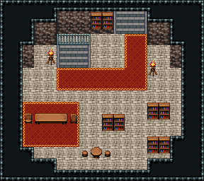

# 마법사 탑 · 2층 서고

서고 층. 1층에서 올라오면 북쪽 벽 서쪽의 내려가는 돌계단(난간 뒤) 앞에 선다. 붉은 카펫이 동쪽으로 가서 북쪽 벽 동쪽의 오르는 돌계단(x10~12)으로 꺾인다. 북쪽 벽 가운데 책장, 동쪽과 남쪽 바닥은 서가 세 줄(사이 통로), 서쪽 붉은 러그 위 독서 탁자와 의자 둘, 남쪽 둥근 탁자와 걸상 둘. 18×16, tilesetId=oprn_dungeon_stone. 입구 (6,6). 통행 검사 목표 [[11,3],[15,10],[4,12],[11,13]].

출구: (6,5) → dungeon-tower-1f (6,3) 내려가는 돌계단(x5~7) → 1층 · (11,2) → dungeon-tower-3f (11,6) 북쪽 벽 동쪽 돌계단 → 3층



## 놓은 소품 (저작 순서)
(x,y)는 왼쪽 위, tiles는 행 단위 번호. 이식 칸(480~)은 공통 규칙 문서의 이식표.
```json
[
  {
    "prop": "계단 난간",
    "x": 5,
    "y": 3,
    "w": 3,
    "h": 1,
    "layer": "upper",
    "tiles": [
      [
        234,
        235,
        236
      ]
    ]
  },
  {
    "prop": "내려가는 돌계단",
    "x": 5,
    "y": 4,
    "w": 3,
    "h": 2,
    "layer": "lower",
    "tiles": [
      [
        483,
        484,
        485
      ],
      [
        483,
        484,
        485
      ]
    ]
  },
  {
    "prop": "오르는 돌계단(벽면)",
    "x": 10,
    "y": 1,
    "w": 3,
    "h": 2,
    "layer": "lower",
    "tiles": [
      [
        483,
        484,
        485
      ],
      [
        483,
        484,
        485
      ]
    ]
  },
  {
    "prop": "책장",
    "x": 8,
    "y": 1,
    "w": 1,
    "h": 2,
    "layer": "upper",
    "tiles": [
      [
        329
      ],
      [
        359
      ]
    ]
  },
  {
    "prop": "책장",
    "x": 9,
    "y": 1,
    "w": 1,
    "h": 2,
    "layer": "upper",
    "tiles": [
      [
        329
      ],
      [
        359
      ]
    ]
  },
  {
    "prop": "책장",
    "x": 13,
    "y": 9,
    "w": 1,
    "h": 2,
    "layer": "upper",
    "tiles": [
      [
        329
      ],
      [
        359
      ]
    ]
  },
  {
    "prop": "책장",
    "x": 14,
    "y": 9,
    "w": 1,
    "h": 2,
    "layer": "upper",
    "tiles": [
      [
        329
      ],
      [
        359
      ]
    ]
  },
  {
    "prop": "책장",
    "x": 13,
    "y": 12,
    "w": 1,
    "h": 2,
    "layer": "upper",
    "tiles": [
      [
        329
      ],
      [
        359
      ]
    ]
  },
  {
    "prop": "책장",
    "x": 14,
    "y": 12,
    "w": 1,
    "h": 2,
    "layer": "upper",
    "tiles": [
      [
        329
      ],
      [
        359
      ]
    ]
  },
  {
    "prop": "책장",
    "x": 9,
    "y": 10,
    "w": 1,
    "h": 2,
    "layer": "upper",
    "tiles": [
      [
        329
      ],
      [
        359
      ]
    ]
  },
  {
    "prop": "책장",
    "x": 10,
    "y": 10,
    "w": 1,
    "h": 2,
    "layer": "upper",
    "tiles": [
      [
        329
      ],
      [
        359
      ]
    ]
  },
  {
    "prop": "긴 탁자",
    "x": 3,
    "y": 10,
    "w": 3,
    "h": 1,
    "layer": "upper",
    "tiles": [
      [
        385,
        386,
        387
      ]
    ]
  },
  {
    "prop": "의자(왼쪽 보기)",
    "x": 2,
    "y": 10,
    "w": 1,
    "h": 1,
    "layer": "upper",
    "tiles": [
      [
        327
      ]
    ]
  },
  {
    "prop": "의자(오른쪽 보기)",
    "x": 6,
    "y": 10,
    "w": 1,
    "h": 1,
    "layer": "upper",
    "tiles": [
      [
        328
      ]
    ]
  },
  {
    "prop": "둥근 탁자",
    "x": 8,
    "y": 13,
    "w": 1,
    "h": 1,
    "layer": "upper",
    "tiles": [
      [
        326
      ]
    ]
  },
  {
    "prop": "걸상",
    "x": 7,
    "y": 13,
    "w": 1,
    "h": 1,
    "layer": "upper",
    "tiles": [
      [
        356
      ]
    ]
  },
  {
    "prop": "걸상",
    "x": 9,
    "y": 13,
    "w": 1,
    "h": 1,
    "layer": "upper",
    "tiles": [
      [
        356
      ]
    ]
  },
  {
    "prop": "화로",
    "x": 4,
    "y": 4,
    "w": 1,
    "h": 2,
    "layer": "upper",
    "tiles": [
      [
        263
      ],
      [
        293
      ]
    ]
  },
  {
    "prop": "화로",
    "x": 13,
    "y": 5,
    "w": 1,
    "h": 2,
    "layer": "upper",
    "tiles": [
      [
        263
      ],
      [
        293
      ]
    ]
  }
]
```

전체 두 레이어는 다음 배열 문서가 정답이다.
