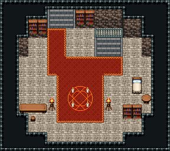

# 마법사 탑 · 3층 마법사의 방

탑 주인의 방. 2층에서 오르면 북쪽 벽 동쪽 내려가는 돌계단 앞, 카펫이 서쪽으로 가 북쪽 벽 서쪽의 옥상 돌계단(x5~7)에 닿는다. 가운데 붉은 러그 위 마법진과 화로 둘, 동쪽 벽 아래 침대와 둥근 협탁, 서쪽 벽 아래 필기 책상과 걸상, 북서쪽 책장, 남동쪽 책장 둘. 18×16, tilesetId=oprn_dungeon_stone. 입구 (11,6). 통행 검사 목표 [[6,3],[8,13],[3,10],[15,9]].

출구: (11,5) → dungeon-tower-2f (11,3) 내려가는 돌계단(x10~12) → 2층 · (6,2) → dungeon-tower-roof (6,6) 북쪽 벽 서쪽 돌계단 → 옥상



## 놓은 소품 (저작 순서)
(x,y)는 왼쪽 위, tiles는 행 단위 번호. 이식 칸(480~)은 공통 규칙 문서의 이식표.
```json
[
  {
    "prop": "계단 난간",
    "x": 10,
    "y": 3,
    "w": 3,
    "h": 1,
    "layer": "upper",
    "tiles": [
      [
        234,
        235,
        236
      ]
    ]
  },
  {
    "prop": "내려가는 돌계단",
    "x": 10,
    "y": 4,
    "w": 3,
    "h": 2,
    "layer": "lower",
    "tiles": [
      [
        483,
        484,
        485
      ],
      [
        483,
        484,
        485
      ]
    ]
  },
  {
    "prop": "오르는 돌계단(벽면)",
    "x": 5,
    "y": 1,
    "w": 3,
    "h": 2,
    "layer": "lower",
    "tiles": [
      [
        483,
        484,
        485
      ],
      [
        483,
        484,
        485
      ]
    ]
  },
  {
    "prop": "책장",
    "x": 8,
    "y": 1,
    "w": 1,
    "h": 2,
    "layer": "upper",
    "tiles": [
      [
        329
      ],
      [
        359
      ]
    ]
  },
  {
    "prop": "책장",
    "x": 9,
    "y": 1,
    "w": 1,
    "h": 2,
    "layer": "upper",
    "tiles": [
      [
        329
      ],
      [
        359
      ]
    ]
  },
  {
    "prop": "붉은 마법진",
    "x": 7,
    "y": 9,
    "w": 3,
    "h": 3,
    "layer": "upper",
    "tiles": [
      [
        441,
        442,
        443
      ],
      [
        471,
        472,
        473
      ],
      [
        27,
        28,
        29
      ]
    ]
  },
  {
    "prop": "화로",
    "x": 5,
    "y": 10,
    "w": 1,
    "h": 2,
    "layer": "upper",
    "tiles": [
      [
        263
      ],
      [
        293
      ]
    ]
  },
  {
    "prop": "화로",
    "x": 11,
    "y": 10,
    "w": 1,
    "h": 2,
    "layer": "upper",
    "tiles": [
      [
        263
      ],
      [
        293
      ]
    ]
  },
  {
    "prop": "침대",
    "x": 14,
    "y": 8,
    "w": 1,
    "h": 2,
    "layer": "upper",
    "tiles": [
      [
        384
      ],
      [
        414
      ]
    ]
  },
  {
    "prop": "둥근 탁자",
    "x": 15,
    "y": 10,
    "w": 1,
    "h": 1,
    "layer": "upper",
    "tiles": [
      [
        326
      ]
    ]
  },
  {
    "prop": "긴 탁자",
    "x": 2,
    "y": 11,
    "w": 3,
    "h": 1,
    "layer": "upper",
    "tiles": [
      [
        385,
        386,
        387
      ]
    ]
  },
  {
    "prop": "걸상",
    "x": 3,
    "y": 12,
    "w": 1,
    "h": 1,
    "layer": "upper",
    "tiles": [
      [
        356
      ]
    ]
  },
  {
    "prop": "책장",
    "x": 3,
    "y": 2,
    "w": 1,
    "h": 2,
    "layer": "upper",
    "tiles": [
      [
        329
      ],
      [
        359
      ]
    ]
  },
  {
    "prop": "책장",
    "x": 4,
    "y": 2,
    "w": 1,
    "h": 2,
    "layer": "upper",
    "tiles": [
      [
        329
      ],
      [
        359
      ]
    ]
  },
  {
    "prop": "책장",
    "x": 13,
    "y": 11,
    "w": 1,
    "h": 2,
    "layer": "upper",
    "tiles": [
      [
        329
      ],
      [
        359
      ]
    ]
  },
  {
    "prop": "책장",
    "x": 14,
    "y": 11,
    "w": 1,
    "h": 2,
    "layer": "upper",
    "tiles": [
      [
        329
      ],
      [
        359
      ]
    ]
  }
]
```

전체 두 레이어는 다음 배열 문서가 정답이다.
