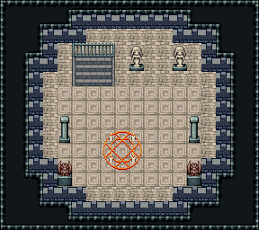

# 마법사 탑 · 옥상

하늘로 트인 탑 꼭대기. 가장자리를 흉벽이 두르고 그 너머는 허공이다. 3층에서 오르면 북쪽의 내려가는 돌계단(난간 뒤) 앞, 가운데 동심 석판 위 별 보는 마법진과 양옆 석주 둘. 벽·카펫·횃불 없음. 18×16, tilesetId=oprn_dungeon_stone. 입구 (6,6). 통행 검사 목표 [[8,12],[3,9],[13,5]].

출구: (6,5) → dungeon-tower-3f (6,3) 내려가는 돌계단(x5~7) → 3층



## 놓은 소품 (저작 순서)
(x,y)는 왼쪽 위, tiles는 행 단위 번호. 이식 칸(480~)은 공통 규칙 문서의 이식표.
```json
[
  {
    "prop": "계단 난간",
    "x": 5,
    "y": 3,
    "w": 3,
    "h": 1,
    "layer": "upper",
    "tiles": [
      [
        234,
        235,
        236
      ]
    ]
  },
  {
    "prop": "내려가는 돌계단",
    "x": 5,
    "y": 4,
    "w": 3,
    "h": 2,
    "layer": "lower",
    "tiles": [
      [
        483,
        484,
        485
      ],
      [
        483,
        484,
        485
      ]
    ]
  },
  {
    "prop": "붉은 마법진",
    "x": 7,
    "y": 9,
    "w": 3,
    "h": 3,
    "layer": "upper",
    "tiles": [
      [
        441,
        442,
        443
      ],
      [
        471,
        472,
        473
      ],
      [
        27,
        28,
        29
      ]
    ]
  },
  {
    "prop": "석주",
    "x": 4,
    "y": 8,
    "w": 1,
    "h": 2,
    "layer": "upper",
    "tiles": [
      [
        446
      ],
      [
        476
      ]
    ]
  },
  {
    "prop": "석주",
    "x": 13,
    "y": 8,
    "w": 1,
    "h": 2,
    "layer": "upper",
    "tiles": [
      [
        446
      ],
      [
        476
      ]
    ]
  },
  {
    "prop": "가고일 석상",
    "x": 4,
    "y": 11,
    "w": 1,
    "h": 2,
    "layer": "upper",
    "tiles": [
      [
        146
      ],
      [
        176
      ]
    ]
  },
  {
    "prop": "가고일 석상",
    "x": 13,
    "y": 11,
    "w": 1,
    "h": 2,
    "layer": "upper",
    "tiles": [
      [
        146
      ],
      [
        176
      ]
    ]
  },
  {
    "prop": "여신 석상",
    "x": 9,
    "y": 3,
    "w": 1,
    "h": 2,
    "layer": "upper",
    "tiles": [
      [
        145
      ],
      [
        175
      ]
    ]
  },
  {
    "prop": "여신 석상",
    "x": 12,
    "y": 3,
    "w": 1,
    "h": 2,
    "layer": "upper",
    "tiles": [
      [
        145
      ],
      [
        175
      ]
    ]
  }
]
```

전체 두 레이어는 다음 배열 문서가 정답이다.
