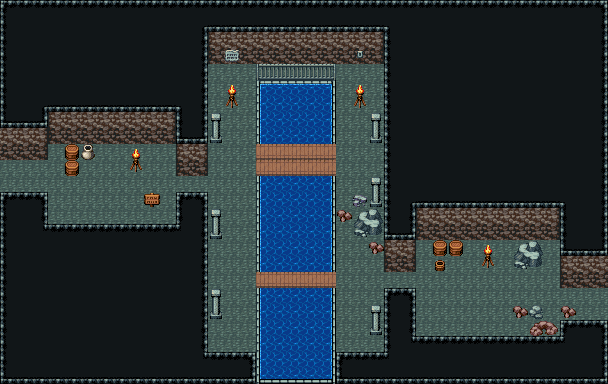

# 지하 수로 · 창살 수문

북쪽 벽의 창살 친 수문에서 본류가 남쪽으로 곧게 흘러 맵 밖으로 나간다. 양쪽 좁은 둑길에 석주가 서고 판자 다리 둘이 둑을 잇는다. 서쪽 입구 방은 수로지기의 나무통·항아리, 동쪽 작업 방은 수문 부품 통과 무너진 벽 아래 큰 바위. 서쪽 입구와 동쪽 출구가 수로 반대편이라 다리를 건너야 지나간다. 38×24, tilesetId=oprn_dungeon_stone. 입구 (0,10). 통행 검사 목표 [[18,9],[18,17],[5,12],[30,19],[14,20]].

출구: (0,10) → outside 서쪽 통로 → 지상 맨홀 · (37,18) → next 동쪽 통로 → 다음 구역



## 놓은 소품 (저작 순서)
(x,y)는 왼쪽 위, tiles는 행 단위 번호. 이식 칸(480~)은 공통 규칙 문서의 이식표.
```json
[
  {
    "prop": "쇠창살 왼끝",
    "x": 16,
    "y": 4,
    "w": 1,
    "h": 1,
    "layer": "upper",
    "tiles": [
      [
        234
      ]
    ]
  },
  {
    "prop": "쇠창살",
    "x": 17,
    "y": 4,
    "w": 1,
    "h": 1,
    "layer": "upper",
    "tiles": [
      [
        235
      ]
    ]
  },
  {
    "prop": "쇠창살",
    "x": 18,
    "y": 4,
    "w": 1,
    "h": 1,
    "layer": "upper",
    "tiles": [
      [
        235
      ]
    ]
  },
  {
    "prop": "쇠창살",
    "x": 19,
    "y": 4,
    "w": 1,
    "h": 1,
    "layer": "upper",
    "tiles": [
      [
        235
      ]
    ]
  },
  {
    "prop": "쇠창살 오른끝",
    "x": 20,
    "y": 4,
    "w": 1,
    "h": 1,
    "layer": "upper",
    "tiles": [
      [
        236
      ]
    ]
  },
  {
    "prop": "벽 레버",
    "x": 22,
    "y": 3,
    "w": 1,
    "h": 1,
    "layer": "upper",
    "tiles": [
      [
        266
      ]
    ]
  },
  {
    "prop": "벽 석판",
    "x": 14,
    "y": 3,
    "w": 1,
    "h": 1,
    "layer": "upper",
    "tiles": [
      [
        265
      ]
    ]
  },
  {
    "prop": "화로",
    "x": 14,
    "y": 5,
    "w": 1,
    "h": 2,
    "layer": "upper",
    "tiles": [
      [
        263
      ],
      [
        293
      ]
    ]
  },
  {
    "prop": "화로",
    "x": 22,
    "y": 5,
    "w": 1,
    "h": 2,
    "layer": "upper",
    "tiles": [
      [
        263
      ],
      [
        293
      ]
    ]
  },
  {
    "prop": "석주",
    "x": 13,
    "y": 7,
    "w": 1,
    "h": 2,
    "layer": "upper",
    "tiles": [
      [
        446
      ],
      [
        476
      ]
    ]
  },
  {
    "prop": "석주",
    "x": 23,
    "y": 7,
    "w": 1,
    "h": 2,
    "layer": "upper",
    "tiles": [
      [
        446
      ],
      [
        476
      ]
    ]
  },
  {
    "prop": "석주",
    "x": 13,
    "y": 13,
    "w": 1,
    "h": 2,
    "layer": "upper",
    "tiles": [
      [
        446
      ],
      [
        476
      ]
    ]
  },
  {
    "prop": "석주",
    "x": 23,
    "y": 11,
    "w": 1,
    "h": 2,
    "layer": "upper",
    "tiles": [
      [
        446
      ],
      [
        476
      ]
    ]
  },
  {
    "prop": "석주",
    "x": 13,
    "y": 18,
    "w": 1,
    "h": 2,
    "layer": "upper",
    "tiles": [
      [
        446
      ],
      [
        476
      ]
    ]
  },
  {
    "prop": "석주",
    "x": 23,
    "y": 19,
    "w": 1,
    "h": 2,
    "layer": "upper",
    "tiles": [
      [
        446
      ],
      [
        476
      ]
    ]
  },
  {
    "prop": "나무통",
    "x": 4,
    "y": 9,
    "w": 1,
    "h": 1,
    "layer": "upper",
    "tiles": [
      [
        417
      ]
    ]
  },
  {
    "prop": "나무통",
    "x": 4,
    "y": 10,
    "w": 1,
    "h": 1,
    "layer": "upper",
    "tiles": [
      [
        417
      ]
    ]
  },
  {
    "prop": "항아리",
    "x": 5,
    "y": 9,
    "w": 1,
    "h": 1,
    "layer": "upper",
    "tiles": [
      [
        418
      ]
    ]
  },
  {
    "prop": "표지판",
    "x": 9,
    "y": 12,
    "w": 1,
    "h": 1,
    "layer": "upper",
    "tiles": [
      [
        298
      ]
    ]
  },
  {
    "prop": "화로",
    "x": 8,
    "y": 9,
    "w": 1,
    "h": 2,
    "layer": "upper",
    "tiles": [
      [
        263
      ],
      [
        293
      ]
    ]
  },
  {
    "prop": "나무통",
    "x": 27,
    "y": 15,
    "w": 1,
    "h": 1,
    "layer": "upper",
    "tiles": [
      [
        417
      ]
    ]
  },
  {
    "prop": "나무통",
    "x": 28,
    "y": 15,
    "w": 1,
    "h": 1,
    "layer": "upper",
    "tiles": [
      [
        417
      ]
    ]
  },
  {
    "prop": "물통",
    "x": 27,
    "y": 16,
    "w": 1,
    "h": 1,
    "layer": "upper",
    "tiles": [
      [
        419
      ]
    ]
  },
  {
    "prop": "큰 회색 바위",
    "x": 32,
    "y": 15,
    "w": 2,
    "h": 2,
    "layer": "upper",
    "tiles": [
      [
        322,
        323
      ],
      [
        352,
        353
      ]
    ]
  },
  {
    "prop": "화로",
    "x": 30,
    "y": 15,
    "w": 1,
    "h": 2,
    "layer": "upper",
    "tiles": [
      [
        263
      ],
      [
        293
      ]
    ]
  },
  {
    "kind": "dressing",
    "note": "무너진 벽 곁·모서리에 몰아 둔 잔해 덩이(1~3곳) — 통로는 막지 않음",
    "clumps": [
      {
        "kind": "prop",
        "x": 33,
        "y": 20,
        "tiles": [
          [
            0,
            0,
            259
          ],
          [
            1,
            0,
            260
          ]
        ]
      },
      {
        "kind": "prop",
        "x": 33,
        "y": 19,
        "tiles": [
          [
            0,
            0,
            382
          ]
        ]
      },
      {
        "kind": "prop",
        "x": 35,
        "y": 19,
        "tiles": [
          [
            0,
            0,
            412
          ]
        ]
      },
      {
        "kind": "prop",
        "x": 32,
        "y": 19,
        "tiles": [
          [
            0,
            0,
            412
          ]
        ]
      },
      {
        "kind": "prop",
        "x": 22,
        "y": 13,
        "tiles": [
          [
            0,
            0,
            322
          ],
          [
            1,
            0,
            323
          ],
          [
            0,
            1,
            352
          ],
          [
            1,
            1,
            353
          ]
        ]
      },
      {
        "kind": "prop",
        "x": 22,
        "y": 12,
        "tiles": [
          [
            0,
            0,
            383
          ]
        ]
      },
      {
        "kind": "prop",
        "x": 21,
        "y": 13,
        "tiles": [
          [
            0,
            0,
            412
          ]
        ]
      },
      {
        "kind": "prop",
        "x": 23,
        "y": 15,
        "tiles": [
          [
            0,
            0,
            412
          ]
        ]
      }
    ]
  }
]
```

전체 두 레이어는 다음 배열 문서가 정답이다.
