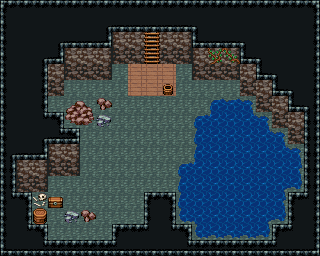

# 우물 밑 굴 · 첫 모험

마을 우물 밑 첫 모험용 작은 굴(20×16). 북쪽 벽 사다리로 내려오면 낡은 널판 디딤과 떨어진 두레박, 서쪽엔 무너져 내린 우물 돌. 동쪽 벽에서 물이 스며 바닥이 젖었고(짙은 돌 111) 물웅덩이가 고였으며 그 벽엔 이끼 덩굴. 남서쪽 굴 구석은 쥐 둥지 — 뼈·잔돌·부서진 통 사이에 잃어버린 상자. 20×16, tilesetId=oprn_dungeon_cave. 입구 (9,4). 통행 검사 목표 [[3,11],[8,12],[13,5],[10,9]].

출구: (9,4) → outside 사다리 → 마을 우물



## 놓은 소품 (저작 순서)
(x,y)는 왼쪽 위, tiles는 행 단위 번호. 이식 칸(480~)은 공통 규칙 문서의 이식표.
```json
[
  {
    "prop": "사다리 선반",
    "x": 9,
    "y": 2,
    "w": 1,
    "h": 1,
    "layer": "upper",
    "tiles": [
      [
        297
      ]
    ]
  },
  {
    "prop": "사다리 선반",
    "x": 9,
    "y": 3,
    "w": 1,
    "h": 1,
    "layer": "upper",
    "tiles": [
      [
        297
      ]
    ]
  },
  {
    "prop": "물통",
    "x": 10,
    "y": 5,
    "w": 1,
    "h": 1,
    "layer": "upper",
    "tiles": [
      [
        419
      ]
    ]
  },
  {
    "prop": "큰 갈색 바위",
    "x": 4,
    "y": 6,
    "w": 2,
    "h": 2,
    "layer": "upper",
    "tiles": [
      [
        318,
        319
      ],
      [
        348,
        349
      ]
    ]
  },
  {
    "prop": "잔돌 더미",
    "x": 6,
    "y": 7,
    "w": 1,
    "h": 1,
    "layer": "upper",
    "tiles": [
      [
        383
      ]
    ]
  },
  {
    "prop": "갈색 잔돌",
    "x": 6,
    "y": 6,
    "w": 1,
    "h": 1,
    "layer": "upper",
    "tiles": [
      [
        412
      ]
    ]
  },
  {
    "prop": "덩굴",
    "x": 13,
    "y": 3,
    "w": 1,
    "h": 1,
    "layer": "upper",
    "tiles": [
      [
        177
      ]
    ]
  },
  {
    "prop": "덩굴 긴",
    "x": 14,
    "y": 3,
    "w": 1,
    "h": 1,
    "layer": "upper",
    "tiles": [
      [
        178
      ]
    ]
  },
  {
    "prop": "보물상자",
    "x": 3,
    "y": 12,
    "w": 1,
    "h": 1,
    "layer": "upper",
    "tiles": [
      [
        480
      ]
    ]
  },
  {
    "prop": "해골과 뼈",
    "x": 2,
    "y": 12,
    "w": 1,
    "h": 1,
    "layer": "upper",
    "tiles": [
      [
        299
      ]
    ]
  },
  {
    "prop": "잔돌 더미",
    "x": 4,
    "y": 13,
    "w": 1,
    "h": 1,
    "layer": "upper",
    "tiles": [
      [
        383
      ]
    ]
  },
  {
    "prop": "갈색 잔돌",
    "x": 5,
    "y": 13,
    "w": 1,
    "h": 1,
    "layer": "upper",
    "tiles": [
      [
        412
      ]
    ]
  },
  {
    "prop": "나무통",
    "x": 2,
    "y": 13,
    "w": 1,
    "h": 1,
    "layer": "upper",
    "tiles": [
      [
        417
      ]
    ]
  }
]
```

전체 두 레이어는 다음 배열 문서가 정답이다.
