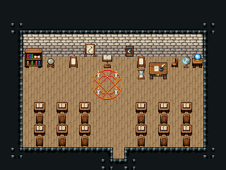

# 마법 학원 · 교실

마법 학원의 강의실. 선생은 앞(북쪽) 교탁과 교사 책상에서 가르치고 바닥 마법진에서 시범을 보이며, 학생은 책상 열두 개에 앉아 북쪽을 본다.

석벽·널 바닥 102, 16×8칸. 앞벽에 별자리 판·달 위상 벽판, 교탁(독서대)과 그 앞 마법진 381~443(3×3), 오른쪽 교사 책상(나무 상판 위 펼친 룬 서적·모래시계)과 학생 쪽을 보는 의자 267, 학생 독서 탁자와 등을 보인 의자 268 여섯 쌍×두 줄(가운데 통로 붉은 러너), 옆벽 쪽 두꺼운 책장·지구본·수정구 받침. 20×15, tilesetId=tibo_interior_expanded. 입구 (10,13), 주인·담당 자리 (9,6). 통행 검사 목표 [[9,6],[4,12],[15,12],[14,7]].



## 놓은 소품 (저작 순서)
tibo-kit은 tibo_interior_expanded의 structureKits id, tiles는 직접 놓은 번호 행렬, rug는 카펫 오토타일 섬, floor는 바닥 재질 칠. (x,y)는 왼쪽 위.
```json
[
  {
    "kind": "tibo-kit",
    "kitId": "tibo-library-220",
    "name": "직조 벽걸이",
    "x": 7,
    "y": 3,
    "w": 1,
    "h": 2,
    "role": "hang"
  },
  {
    "kind": "tibo-kit",
    "kitId": "tibo-library-163",
    "name": "달 위상 벽판",
    "x": 11,
    "y": 3,
    "w": 1,
    "h": 2,
    "role": "hang"
  },
  {
    "kind": "rug",
    "group": "harness-interior-house-v1-terrain-teal-carpet",
    "x": 3,
    "y": 5,
    "w": 4,
    "h": 3,
    "role": "rug"
  },
  {
    "kind": "tabletop",
    "group": "harness-interior-house-v1-terrain-deck",
    "x": 4,
    "y": 6,
    "w": 2,
    "h": 1,
    "role": "tabletop"
  },
  {
    "kind": "tibo-kit",
    "kitId": "tibo-library-165",
    "name": "수정 표본 쟁반",
    "x": 4,
    "y": 6,
    "w": 2,
    "h": 1,
    "role": "top"
  },
  {
    "kind": "tibo-kit",
    "kitId": "tibo-v11-1-3",
    "name": "천체망원경",
    "x": 4,
    "y": 4,
    "w": 1,
    "h": 2,
    "role": "furn"
  },
  {
    "kind": "tibo-kit",
    "kitId": "tibo-library-073",
    "name": "덮은 책 더미",
    "x": 5,
    "y": 6,
    "w": 1,
    "h": 1,
    "role": "top"
  },
  {
    "kind": "tibo-kit",
    "kitId": "tibo-lectern",
    "name": "독서대",
    "x": 9,
    "y": 4,
    "w": 1,
    "h": 2,
    "role": "furn"
  },
  {
    "kind": "tabletop",
    "group": "harness-interior-house-v1-terrain-deck",
    "x": 12,
    "y": 6,
    "w": 3,
    "h": 1,
    "role": "tabletop"
  },
  {
    "kind": "tibo-kit",
    "kitId": "tibo-library-158",
    "name": "펼친 룬 서적",
    "x": 12,
    "y": 6,
    "w": 2,
    "h": 1,
    "role": "top"
  },
  {
    "kind": "tibo-kit",
    "kitId": "tibo-v11-1-0",
    "name": "모래시계",
    "x": 14,
    "y": 6,
    "w": 1,
    "h": 1,
    "role": "top"
  },
  {
    "kind": "tiles",
    "layer": "upper",
    "x": 13,
    "y": 5,
    "w": 1,
    "h": 1,
    "rows": [
      [
        267
      ]
    ],
    "role": "seat"
  },
  {
    "kind": "tiles",
    "layer": "upper",
    "x": 8,
    "y": 6,
    "w": 3,
    "h": 3,
    "rows": [
      [
        381,
        382,
        383
      ],
      [
        411,
        412,
        413
      ],
      [
        441,
        442,
        443
      ]
    ],
    "role": "furn"
  },
  {
    "kind": "tibo-kit",
    "kitId": "tibo-v4-4-2",
    "name": "독서 탁자",
    "x": 3,
    "y": 9,
    "w": 1,
    "h": 1,
    "role": "table"
  },
  {
    "kind": "tiles",
    "layer": "upper",
    "x": 3,
    "y": 10,
    "w": 1,
    "h": 1,
    "rows": [
      [
        268
      ]
    ],
    "role": "seat"
  },
  {
    "kind": "tibo-kit",
    "kitId": "tibo-v4-4-2",
    "name": "독서 탁자",
    "x": 5,
    "y": 9,
    "w": 1,
    "h": 1,
    "role": "table"
  },
  {
    "kind": "tiles",
    "layer": "upper",
    "x": 5,
    "y": 10,
    "w": 1,
    "h": 1,
    "rows": [
      [
        268
      ]
    ],
    "role": "seat"
  },
  {
    "kind": "tibo-kit",
    "kitId": "tibo-v4-4-2",
    "name": "독서 탁자",
    "x": 7,
    "y": 9,
    "w": 1,
    "h": 1,
    "role": "table"
  },
  {
    "kind": "tiles",
    "layer": "upper",
    "x": 7,
    "y": 10,
    "w": 1,
    "h": 1,
    "rows": [
      [
        268
      ]
    ],
    "role": "seat"
  },
  {
    "kind": "tibo-kit",
    "kitId": "tibo-v4-4-2",
    "name": "독서 탁자",
    "x": 12,
    "y": 9,
    "w": 1,
    "h": 1,
    "role": "table"
  },
  {
    "kind": "tiles",
    "layer": "upper",
    "x": 12,
    "y": 10,
    "w": 1,
    "h": 1,
    "rows": [
      [
        268
      ]
    ],
    "role": "seat"
  },
  {
    "kind": "tibo-kit",
    "kitId": "tibo-v4-4-2",
    "name": "독서 탁자",
    "x": 14,
    "y": 9,
    "w": 1,
    "h": 1,
    "role": "table"
  },
  {
    "kind": "tiles",
    "layer": "upper",
    "x": 14,
    "y": 10,
    "w": 1,
    "h": 1,
    "rows": [
      [
        268
      ]
    ],
    "role": "seat"
  },
  {
    "kind": "tibo-kit",
    "kitId": "tibo-v4-4-2",
    "name": "독서 탁자",
    "x": 16,
    "y": 9,
    "w": 1,
    "h": 1,
    "role": "table"
  },
  {
    "kind": "tiles",
    "layer": "upper",
    "x": 16,
    "y": 10,
    "w": 1,
    "h": 1,
    "rows": [
      [
        268
      ]
    ],
    "role": "seat"
  },
  {
    "kind": "tibo-kit",
    "kitId": "tibo-v4-4-2",
    "name": "독서 탁자",
    "x": 3,
    "y": 11,
    "w": 1,
    "h": 1,
    "role": "table"
  },
  {
    "kind": "tiles",
    "layer": "upper",
    "x": 3,
    "y": 12,
    "w": 1,
    "h": 1,
    "rows": [
      [
        268
      ]
    ],
    "role": "seat"
  },
  {
    "kind": "tibo-kit",
    "kitId": "tibo-v4-4-2",
    "name": "독서 탁자",
    "x": 5,
    "y": 11,
    "w": 1,
    "h": 1,
    "role": "table"
  },
  {
    "kind": "tiles",
    "layer": "upper",
    "x": 5,
    "y": 12,
    "w": 1,
    "h": 1,
    "rows": [
      [
        268
      ]
    ],
    "role": "seat"
  },
  {
    "kind": "tibo-kit",
    "kitId": "tibo-v4-4-2",
    "name": "독서 탁자",
    "x": 7,
    "y": 11,
    "w": 1,
    "h": 1,
    "role": "table"
  },
  {
    "kind": "tiles",
    "layer": "upper",
    "x": 7,
    "y": 12,
    "w": 1,
    "h": 1,
    "rows": [
      [
        268
      ]
    ],
    "role": "seat"
  },
  {
    "kind": "tibo-kit",
    "kitId": "tibo-v4-4-2",
    "name": "독서 탁자",
    "x": 12,
    "y": 11,
    "w": 1,
    "h": 1,
    "role": "table"
  },
  {
    "kind": "tiles",
    "layer": "upper",
    "x": 12,
    "y": 12,
    "w": 1,
    "h": 1,
    "rows": [
      [
        268
      ]
    ],
    "role": "seat"
  },
  {
    "kind": "tibo-kit",
    "kitId": "tibo-v4-4-2",
    "name": "독서 탁자",
    "x": 14,
    "y": 11,
    "w": 1,
    "h": 1,
    "role": "table"
  },
  {
    "kind": "tiles",
    "layer": "upper",
    "x": 14,
    "y": 12,
    "w": 1,
    "h": 1,
    "rows": [
      [
        268
      ]
    ],
    "role": "seat"
  },
  {
    "kind": "tibo-kit",
    "kitId": "tibo-v4-4-2",
    "name": "독서 탁자",
    "x": 16,
    "y": 11,
    "w": 1,
    "h": 1,
    "role": "table"
  },
  {
    "kind": "tiles",
    "layer": "upper",
    "x": 16,
    "y": 12,
    "w": 1,
    "h": 1,
    "rows": [
      [
        268
      ]
    ],
    "role": "seat"
  },
  {
    "kind": "rug",
    "group": "harness-interior-house-v1-terrain-red-carpet",
    "x": 9,
    "y": 9,
    "w": 2,
    "h": 4,
    "role": "rug"
  },
  {
    "kind": "tibo-kit",
    "kitId": "tibo-fantasy-bookcase",
    "name": "두꺼운 책장",
    "x": 2,
    "y": 4,
    "w": 2,
    "h": 2,
    "role": "furn"
  },
  {
    "kind": "tibo-kit",
    "kitId": "tibo-fantasy-crystal-stand",
    "name": "수정구 받침",
    "x": 17,
    "y": 4,
    "w": 1,
    "h": 2,
    "role": "furn"
  },
  {
    "kind": "tibo-kit",
    "kitId": "tibo-v12-1-2",
    "name": "지구본",
    "x": 16,
    "y": 4,
    "w": 1,
    "h": 2,
    "role": "furn"
  },
  {
    "kind": "tibo-kit",
    "kitId": "tibo-library-215",
    "name": "둥근 관목 화분",
    "x": 2,
    "y": 12,
    "w": 1,
    "h": 1,
    "role": "furn"
  },
  {
    "kind": "tibo-kit",
    "kitId": "tibo-library-215",
    "name": "둥근 관목 화분",
    "x": 17,
    "y": 12,
    "w": 1,
    "h": 1,
    "role": "furn"
  }
]
```

전체 두 레이어는 다음 배열 문서가 정답이다.
