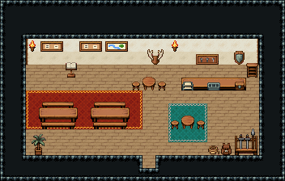

# 모험가 길드

모험가가 의뢰를 받고 보고하는 곳. 뒷벽 게시판에서 의뢰서를 고르고, 오른쪽 뒷벽을 등진 접수대에서 접수원에게 등록·보상 수령, 왼쪽 식탁에서 동료를 모은다.

크림 벽 18×7칸. 뒷벽에 의뢰 게시판 둘과 그 앞 의뢰 장부 독서대·강 지도 액자·사슴뿔 벽판·횃불, 오른쪽 뒷벽을 등진 접수 탁자(나무 상판 위 편지 쟁반·동전 쟁반·금고함)와 벽 열쇠판·방패 장식·문서 분류장(접수원 자리 (16,5)), 왼쪽 붉은 러그 위 긴 식탁과 벤치 두 벌, 가운데 원형 식탁과 걸상 둘, 앞 오른쪽 구석에 무기 거치대·배낭·밧줄 한 덩이, 앞 왼쪽 야자 화분. 22×14, tilesetId=tibo_interior_expanded. 입구 (11,12), 주인·담당 자리 (16,5). 통행 검사 목표 [[16,7],[5,6],[11,7]].



## 놓은 소품 (저작 순서)
tibo-kit은 tibo_interior_expanded의 structureKits id, tiles는 직접 놓은 번호 행렬, rug는 카펫 오토타일 섬, floor는 바닥 재질 칠. (x,y)는 왼쪽 위.
```json
[
  {
    "kind": "tibo-kit",
    "kitId": "tibo-v6-1-0",
    "name": "메모 게시판",
    "x": 3,
    "y": 3,
    "w": 2,
    "h": 1,
    "role": "hang"
  },
  {
    "kind": "tibo-kit",
    "kitId": "tibo-v6-1-0",
    "name": "메모 게시판",
    "x": 6,
    "y": 3,
    "w": 2,
    "h": 1,
    "role": "hang"
  },
  {
    "kind": "tibo-kit",
    "kitId": "tibo-lectern",
    "name": "독서대",
    "x": 5,
    "y": 4,
    "w": 1,
    "h": 2,
    "role": "furn"
  },
  {
    "kind": "tibo-kit",
    "kitId": "tibo-v6-2-0",
    "name": "강 지도 액자",
    "x": 8,
    "y": 3,
    "w": 2,
    "h": 1,
    "role": "hang"
  },
  {
    "kind": "tibo-kit",
    "kitId": "tibo-library-223",
    "name": "사슴뿔 벽판",
    "x": 11,
    "y": 3,
    "w": 2,
    "h": 2,
    "role": "hang"
  },
  {
    "kind": "tiles",
    "layer": "upper",
    "x": 2,
    "y": 3,
    "w": 1,
    "h": 1,
    "rows": [
      [
        24
      ]
    ],
    "role": "hang"
  },
  {
    "kind": "tiles",
    "layer": "upper",
    "x": 13,
    "y": 3,
    "w": 1,
    "h": 1,
    "rows": [
      [
        24
      ]
    ],
    "role": "hang"
  },
  {
    "kind": "tabletop",
    "group": "harness-interior-house-v1-terrain-deck",
    "x": 14,
    "y": 6,
    "w": 5,
    "h": 1,
    "role": "tabletop"
  },
  {
    "kind": "tibo-kit",
    "kitId": "tibo-library-079",
    "name": "편지 쟁반",
    "x": 14,
    "y": 6,
    "w": 1,
    "h": 1,
    "role": "top"
  },
  {
    "kind": "tibo-kit",
    "kitId": "tibo-library-122",
    "name": "동전 계산 쟁반",
    "x": 16,
    "y": 6,
    "w": 1,
    "h": 1,
    "role": "top"
  },
  {
    "kind": "tibo-kit",
    "kitId": "tibo-library-238",
    "name": "자물쇠 금고함",
    "x": 18,
    "y": 6,
    "w": 1,
    "h": 1,
    "role": "top"
  },
  {
    "kind": "tibo-kit",
    "kitId": "tibo-v8-1-0",
    "name": "열쇠판",
    "x": 15,
    "y": 4,
    "w": 2,
    "h": 1,
    "role": "hang"
  },
  {
    "kind": "tibo-kit",
    "kitId": "tibo-library-221",
    "name": "방패 벽 장식",
    "x": 18,
    "y": 3,
    "w": 1,
    "h": 2,
    "role": "hang"
  },
  {
    "kind": "tibo-kit",
    "kitId": "tibo-library-078",
    "name": "문서 분류장",
    "x": 19,
    "y": 4,
    "w": 1,
    "h": 2,
    "role": "furn"
  },
  {
    "kind": "rug",
    "group": "harness-interior-house-v1-terrain-red-carpet",
    "x": 2,
    "y": 7,
    "w": 9,
    "h": 3,
    "role": "rug"
  },
  {
    "kind": "tibo-kit",
    "kitId": "tibo-fantasy-dining-set",
    "name": "긴 식탁과 벤치",
    "x": 3,
    "y": 7,
    "w": 3,
    "h": 3,
    "role": "table"
  },
  {
    "kind": "tibo-kit",
    "kitId": "tibo-fantasy-dining-set",
    "name": "긴 식탁과 벤치",
    "x": 7,
    "y": 7,
    "w": 3,
    "h": 3,
    "role": "table"
  },
  {
    "kind": "rug",
    "group": "harness-interior-house-v1-terrain-teal-carpet",
    "x": 13,
    "y": 8,
    "w": 3,
    "h": 3,
    "role": "rug"
  },
  {
    "kind": "tibo-kit",
    "kitId": "tibo-library-025",
    "name": "원형 식탁",
    "x": 14,
    "y": 8,
    "w": 1,
    "h": 2,
    "role": "table"
  },
  {
    "kind": "tibo-kit",
    "kitId": "tibo-library-030",
    "name": "낮은 걸상",
    "x": 13,
    "y": 9,
    "w": 1,
    "h": 1,
    "role": "seat"
  },
  {
    "kind": "tibo-kit",
    "kitId": "tibo-library-030",
    "name": "낮은 걸상",
    "x": 15,
    "y": 9,
    "w": 1,
    "h": 1,
    "role": "seat"
  },
  {
    "kind": "tibo-kit",
    "kitId": "tibo-library-025",
    "name": "원형 식탁",
    "x": 11,
    "y": 5,
    "w": 1,
    "h": 2,
    "role": "table"
  },
  {
    "kind": "tibo-kit",
    "kitId": "tibo-library-030",
    "name": "낮은 걸상",
    "x": 10,
    "y": 6,
    "w": 1,
    "h": 1,
    "role": "seat"
  },
  {
    "kind": "tibo-kit",
    "kitId": "tibo-library-030",
    "name": "낮은 걸상",
    "x": 12,
    "y": 6,
    "w": 1,
    "h": 1,
    "role": "seat"
  },
  {
    "kind": "tibo-kit",
    "kitId": "tibo-fantasy-weapon-rack",
    "name": "무기 거치대",
    "x": 18,
    "y": 9,
    "w": 2,
    "h": 3,
    "role": "furn"
  },
  {
    "kind": "tibo-kit",
    "kitId": "tibo-library-194",
    "name": "가죽 배낭",
    "x": 17,
    "y": 11,
    "w": 1,
    "h": 1,
    "role": "furn"
  },
  {
    "kind": "tibo-kit",
    "kitId": "tibo-library-196",
    "name": "밧줄 뭉치",
    "x": 16,
    "y": 11,
    "w": 1,
    "h": 1,
    "role": "furn"
  },
  {
    "kind": "tibo-kit",
    "kitId": "tibo-library-209",
    "name": "키 큰 실내 야자",
    "x": 2,
    "y": 10,
    "w": 2,
    "h": 2,
    "role": "furn"
  }
]
```

전체 두 레이어는 다음 배열 문서가 정답이다.
