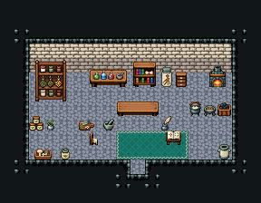

# 연금술 공방

연금술사가 약을 달이고 재료를 갈무리하는 작업실. 벽 쪽이 재료·도구, 오른쪽이 불(작은 화덕·가마솥·화로), 가운데 도마에서 재료를 썰고 빻는다.

석벽·돌바닥 42, 14×6칸. 뒷벽에 약초 건조장 3×3·연금술 작업대 3×2·두꺼운 책장·증류 유리병 받침·뿌리 표본병·약재 서랍장·작은 대장간 화덕(가마 불), 오른쪽 물약 가마솥·화로·석탄 통, 가운데 약초 도마·절구와 공이·의자, 왼쪽 앞 약초차 통·약초 단지·말린 버섯 쟁반·환약 단지, 잉크와 깃펜·펼친 룬 서적(처방 기록), 저장 옹기. 가운데 재료 손질용 긴 탁자와 그 앞 청록 러그. 18×14, tilesetId=tibo_interior_expanded. 입구 (9,11), 주인·담당 자리 (7,6). 통행 검사 목표 [[7,6],[12,7],[6,10]].



## 놓은 소품 (저작 순서)
tibo-kit은 tibo_interior_expanded의 structureKits id, tiles는 직접 놓은 번호 행렬, rug는 카펫 오토타일 섬, floor는 바닥 재질 칠. (x,y)는 왼쪽 위.
```json
[
  {
    "kind": "tibo-kit",
    "kitId": "tibo-medieval-herbal-cabinet",
    "name": "약초 건조장",
    "x": 2,
    "y": 4,
    "w": 3,
    "h": 3
  },
  {
    "kind": "tibo-kit",
    "kitId": "tibo-fantasy-alchemy-desk",
    "name": "연금술 작업대",
    "x": 6,
    "y": 4,
    "w": 3,
    "h": 2
  },
  {
    "kind": "tibo-kit",
    "kitId": "tibo-library-147",
    "name": "증류 유리병 받침",
    "x": 10,
    "y": 4,
    "w": 1,
    "h": 2
  },
  {
    "kind": "tibo-kit",
    "kitId": "tibo-library-151",
    "name": "뿌리 표본병",
    "x": 11,
    "y": 4,
    "w": 1,
    "h": 2
  },
  {
    "kind": "tibo-kit",
    "kitId": "tibo-library-145",
    "name": "약재 서랍장",
    "x": 12,
    "y": 4,
    "w": 1,
    "h": 2
  },
  {
    "kind": "tibo-kit",
    "kitId": "tibo-library-104",
    "name": "작은 대장간 화덕",
    "x": 14,
    "y": 4,
    "w": 2,
    "h": 2
  },
  {
    "kind": "tibo-kit",
    "kitId": "tibo-library-166",
    "name": "물약 가마솥",
    "x": 13,
    "y": 7,
    "w": 1,
    "h": 1
  },
  {
    "kind": "tibo-kit",
    "kitId": "tibo-brazier",
    "name": "화로",
    "x": 14,
    "y": 7,
    "w": 1,
    "h": 1
  },
  {
    "kind": "tibo-kit",
    "kitId": "tibo-library-098",
    "name": "석탄 통",
    "x": 15,
    "y": 7,
    "w": 1,
    "h": 1
  },
  {
    "kind": "tibo-kit",
    "kitId": "tibo-library-146",
    "name": "약초 도마",
    "x": 5,
    "y": 8,
    "w": 2,
    "h": 1
  },
  {
    "kind": "tibo-kit",
    "kitId": "tibo-library-003",
    "name": "절구와 공이",
    "x": 7,
    "y": 8,
    "w": 1,
    "h": 1
  },
  {
    "kind": "tibo-kit",
    "kitId": "tibo-v7-3-2",
    "name": "천을 걸친 의자",
    "x": 6,
    "y": 9,
    "w": 1,
    "h": 1
  },
  {
    "kind": "tibo-kit",
    "kitId": "tibo-library-150",
    "name": "말린 버섯 쟁반",
    "x": 2,
    "y": 10,
    "w": 2,
    "h": 1
  },
  {
    "kind": "tibo-kit",
    "kitId": "tibo-library-155",
    "name": "환약 단지",
    "x": 4,
    "y": 10,
    "w": 1,
    "h": 1
  },
  {
    "kind": "tibo-kit",
    "kitId": "tibo-library-153",
    "name": "약초차 통",
    "x": 2,
    "y": 8,
    "w": 1,
    "h": 1
  },
  {
    "kind": "tibo-kit",
    "kitId": "tibo-v4-4-1",
    "name": "약초 단지",
    "x": 3,
    "y": 8,
    "w": 1,
    "h": 1
  },
  {
    "kind": "tibo-kit",
    "kitId": "tibo-fantasy-bookcase",
    "name": "두꺼운 책장",
    "x": 9,
    "y": 4,
    "w": 2,
    "h": 2
  },
  {
    "kind": "tibo-kit",
    "kitId": "tibo-library-076",
    "name": "잉크와 깃펜",
    "x": 11,
    "y": 8,
    "w": 1,
    "h": 1
  },
  {
    "kind": "tibo-kit",
    "kitId": "tibo-library-158",
    "name": "펼친 룬 서적",
    "x": 11,
    "y": 9,
    "w": 2,
    "h": 1
  },
  {
    "kind": "tibo-kit",
    "kitId": "tibo-library-234",
    "name": "저장 옹기",
    "x": 15,
    "y": 9,
    "w": 1,
    "h": 2
  },
  {
    "kind": "tiles",
    "layer": "upper",
    "x": 8,
    "y": 7,
    "w": 3,
    "h": 1,
    "rows": [
      [
        325,
        326,
        327
      ]
    ]
  },
  {
    "kind": "rug",
    "group": "harness-interior-house-v1-terrain-teal-carpet",
    "x": 8,
    "y": 9,
    "w": 5,
    "h": 2
  }
]
```

전체 두 레이어는 다음 배열 문서가 정답이다.
