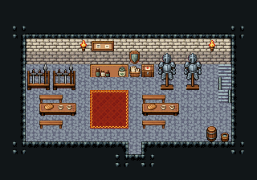

# 투기장 · 대기실

투사가 경기 전에 무장하고 기다리는 방. 문으로 들어와 벽의 무기·갑옷으로 채비하고, 탁자에 앉아 순서를 기다리다 동벽 계단으로 경기장에 오른다. 뒷벽 약상은 경기 뒤 치료용.

석벽·돌바닥 42, 16×6칸. 뒷벽 왼쪽 무기 거치대 둘, 오른쪽 갑옷 거치대 둘, 동벽 앞 경기장으로 오르는 계단 111/141/171(바닥 위)과 횃불, 가운데 뒤 대진표·방패 장식과 약상(나무 상판 위 약병·환약 단지)·붕대 바구니·약품함, 대기용 식사 탁자 둘과 위아래 긴 벤치, 가운데 몸풀기 붉은 매트, 계단 옆 수건 걸이·물 양동이. 20×14, tilesetId=tibo_interior_expanded. 입구 (10,11). 통행 검사 목표 [[17,8],[6,8],[14,8],[8,6]].



## 놓은 소품 (저작 순서)
tibo-kit은 tibo_interior_expanded의 structureKits id, tiles는 직접 놓은 번호 행렬, rug는 카펫 오토타일 섬, floor는 바닥 재질 칠. (x,y)는 왼쪽 위.
```json
[
  {
    "kind": "tibo-kit",
    "kitId": "tibo-fantasy-weapon-rack",
    "name": "무기 거치대",
    "x": 2,
    "y": 4,
    "w": 2,
    "h": 3,
    "role": "furn"
  },
  {
    "kind": "tibo-kit",
    "kitId": "tibo-fantasy-weapon-rack",
    "name": "무기 거치대",
    "x": 4,
    "y": 4,
    "w": 2,
    "h": 3,
    "role": "furn"
  },
  {
    "kind": "tibo-kit",
    "kitId": "tibo-medieval-armor-stand",
    "name": "갑옷 거치대",
    "x": 12,
    "y": 4,
    "w": 2,
    "h": 3,
    "role": "furn"
  },
  {
    "kind": "tibo-kit",
    "kitId": "tibo-medieval-armor-stand",
    "name": "갑옷 거치대",
    "x": 14,
    "y": 4,
    "w": 2,
    "h": 3,
    "role": "furn"
  },
  {
    "kind": "tiles",
    "layer": "lower",
    "x": 17,
    "y": 5,
    "w": 1,
    "h": 3,
    "rows": [
      [
        111
      ],
      [
        141
      ],
      [
        171
      ]
    ],
    "role": "stairs"
  },
  {
    "kind": "tiles",
    "layer": "upper",
    "x": 16,
    "y": 3,
    "w": 1,
    "h": 1,
    "rows": [
      [
        24
      ]
    ],
    "role": "hang"
  },
  {
    "kind": "tibo-kit",
    "kitId": "tibo-library-221",
    "name": "방패 벽 장식",
    "x": 10,
    "y": 3,
    "w": 1,
    "h": 2,
    "role": "hang"
  },
  {
    "kind": "tibo-kit",
    "kitId": "tibo-v6-1-0",
    "name": "메모 게시판",
    "x": 7,
    "y": 3,
    "w": 2,
    "h": 1,
    "role": "hang"
  },
  {
    "kind": "tiles",
    "layer": "upper",
    "x": 6,
    "y": 3,
    "w": 1,
    "h": 1,
    "rows": [
      [
        24
      ]
    ],
    "role": "hang"
  },
  {
    "kind": "tabletop",
    "group": "harness-interior-house-v1-terrain-deck",
    "x": 7,
    "y": 5,
    "w": 3,
    "h": 1,
    "role": "tabletop"
  },
  {
    "kind": "tibo-kit",
    "kitId": "tibo-library-148",
    "name": "약병 세 개",
    "x": 7,
    "y": 5,
    "w": 2,
    "h": 1,
    "role": "top"
  },
  {
    "kind": "tibo-kit",
    "kitId": "tibo-library-155",
    "name": "환약 단지",
    "x": 9,
    "y": 5,
    "w": 1,
    "h": 1,
    "role": "top"
  },
  {
    "kind": "tibo-kit",
    "kitId": "tibo-library-149",
    "name": "붕대 바구니",
    "x": 10,
    "y": 5,
    "w": 1,
    "h": 1,
    "role": "furn"
  },
  {
    "kind": "tibo-kit",
    "kitId": "tibo-v9-1-1",
    "name": "약품함",
    "x": 11,
    "y": 5,
    "w": 1,
    "h": 1,
    "role": "furn"
  },
  {
    "kind": "tibo-kit",
    "kitId": "tibo-v4-4-0",
    "name": "식사 탁자",
    "x": 3,
    "y": 8,
    "w": 3,
    "h": 1,
    "role": "table"
  },
  {
    "kind": "tibo-kit",
    "kitId": "tibo-library-028",
    "name": "긴 벤치",
    "x": 3,
    "y": 7,
    "w": 2,
    "h": 1,
    "role": "seat"
  },
  {
    "kind": "tibo-kit",
    "kitId": "tibo-library-028",
    "name": "긴 벤치",
    "x": 3,
    "y": 9,
    "w": 2,
    "h": 1,
    "role": "seat"
  },
  {
    "kind": "tibo-kit",
    "kitId": "tibo-v4-4-0",
    "name": "식사 탁자",
    "x": 11,
    "y": 8,
    "w": 3,
    "h": 1,
    "role": "table"
  },
  {
    "kind": "tibo-kit",
    "kitId": "tibo-library-028",
    "name": "긴 벤치",
    "x": 11,
    "y": 7,
    "w": 2,
    "h": 1,
    "role": "seat"
  },
  {
    "kind": "tibo-kit",
    "kitId": "tibo-library-028",
    "name": "긴 벤치",
    "x": 11,
    "y": 9,
    "w": 2,
    "h": 1,
    "role": "seat"
  },
  {
    "kind": "rug",
    "group": "harness-interior-house-v1-terrain-red-carpet",
    "x": 7,
    "y": 7,
    "w": 3,
    "h": 3,
    "role": "rug"
  },
  {
    "kind": "tibo-kit",
    "kitId": "tibo-library-229",
    "name": "뚜껑 둥근 통",
    "x": 16,
    "y": 9,
    "w": 1,
    "h": 2,
    "role": "furn"
  },
  {
    "kind": "tibo-kit",
    "kitId": "tibo-v6-1-1",
    "name": "물 양동이",
    "x": 17,
    "y": 10,
    "w": 1,
    "h": 1,
    "role": "furn"
  }
]
```

전체 두 레이어는 다음 배열 문서가 정답이다.
