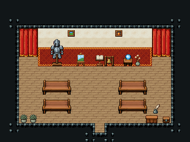

# 경매장

귀한 물건을 경매로 파는 홀. 앞쪽 붉은 카펫 무대에 오늘의 물건(갑옷·그림·수정구)이 놓이고 경매인은 독서대 앞에서 호가를 부르며, 손님은 긴 의자에 앉아 값을 부른다. 낙찰되면 동벽을 등진 계산대에서 치른다.

크림 벽 16×8칸. 뒷벽 양 끝 커튼 142/143·172/173·202/203, 앞쪽 붉은 카펫 무대 12×2에 갑옷 거치대·그림 이젤·수정구 받침·말린 꽃병, 벽에 그림 84·85, 경매인 독서대(경매인 자리 (10,7)), 가운데 통로 붉은 러너를 두고 무대를 향해 앉는 뒷모습 긴 의자 4×2(2070~2077) 두 줄씩, 동벽을 등진 세로 계산대(나무 상판 위 잉크와 깃펜·동전 쟁반·금고함, 점원 자리 x=17), 문 옆 둥근 관목 화분 둘. 20×15, tilesetId=tibo_interior_expanded. 입구 (10,13), 주인·담당 자리 (10,7). 통행 검사 목표 [[10,7],[3,9],[17,10]].



## 놓은 소품 (저작 순서)
tibo-kit은 tibo_interior_expanded의 structureKits id, tiles는 직접 놓은 번호 행렬, rug는 카펫 오토타일 섬, floor는 바닥 재질 칠. (x,y)는 왼쪽 위.
```json
[
  {
    "kind": "rug",
    "group": "harness-interior-house-v1-terrain-red-carpet",
    "x": 4,
    "y": 5,
    "w": 12,
    "h": 2,
    "role": "rug"
  },
  {
    "kind": "tiles",
    "layer": "upper",
    "x": 2,
    "y": 3,
    "w": 2,
    "h": 3,
    "rows": [
      [
        142,
        143
      ],
      [
        172,
        173
      ],
      [
        202,
        203
      ]
    ],
    "role": "furn"
  },
  {
    "kind": "tiles",
    "layer": "upper",
    "x": 16,
    "y": 3,
    "w": 2,
    "h": 3,
    "rows": [
      [
        142,
        143
      ],
      [
        172,
        173
      ],
      [
        202,
        203
      ]
    ],
    "role": "furn"
  },
  {
    "kind": "tibo-kit",
    "kitId": "tibo-lectern",
    "name": "독서대",
    "x": 10,
    "y": 5,
    "w": 1,
    "h": 2,
    "role": "furn"
  },
  {
    "kind": "tibo-kit",
    "kitId": "tibo-medieval-armor-stand",
    "name": "갑옷 거치대",
    "x": 5,
    "y": 4,
    "w": 2,
    "h": 3,
    "role": "furn"
  },
  {
    "kind": "tibo-kit",
    "kitId": "tibo-easel",
    "name": "그림 이젤",
    "x": 8,
    "y": 5,
    "w": 1,
    "h": 2,
    "role": "furn"
  },
  {
    "kind": "rug",
    "group": "harness-interior-house-v1-terrain-red-carpet",
    "x": 9,
    "y": 7,
    "w": 2,
    "h": 6,
    "role": "rug"
  },
  {
    "kind": "tibo-kit",
    "kitId": "tibo-fantasy-crystal-stand",
    "name": "수정구 받침",
    "x": 13,
    "y": 5,
    "w": 1,
    "h": 2,
    "role": "furn"
  },
  {
    "kind": "tibo-kit",
    "kitId": "tibo-library-214",
    "name": "말린 꽃병",
    "x": 14,
    "y": 5,
    "w": 1,
    "h": 2,
    "role": "furn"
  },
  {
    "kind": "tiles",
    "layer": "upper",
    "x": 7,
    "y": 3,
    "w": 1,
    "h": 1,
    "rows": [
      [
        84
      ]
    ],
    "role": "hang"
  },
  {
    "kind": "tiles",
    "layer": "upper",
    "x": 12,
    "y": 3,
    "w": 1,
    "h": 1,
    "rows": [
      [
        85
      ]
    ],
    "role": "hang"
  },
  {
    "kind": "tibo-kit",
    "kitId": "tibo-atlas-pew-back",
    "name": "뒷모습 긴 의자(북쪽을 봄)",
    "x": 4,
    "y": 8,
    "w": 4,
    "h": 2,
    "role": "furn"
  },
  {
    "kind": "tibo-kit",
    "kitId": "tibo-atlas-pew-back",
    "name": "뒷모습 긴 의자(북쪽을 봄)",
    "x": 11,
    "y": 8,
    "w": 4,
    "h": 2,
    "role": "furn"
  },
  {
    "kind": "tibo-kit",
    "kitId": "tibo-atlas-pew-back",
    "name": "뒷모습 긴 의자(북쪽을 봄)",
    "x": 4,
    "y": 10,
    "w": 4,
    "h": 2,
    "role": "furn"
  },
  {
    "kind": "tibo-kit",
    "kitId": "tibo-atlas-pew-back",
    "name": "뒷모습 긴 의자(북쪽을 봄)",
    "x": 11,
    "y": 10,
    "w": 4,
    "h": 2,
    "role": "furn"
  },
  {
    "kind": "tabletop",
    "group": "harness-interior-house-v1-terrain-deck",
    "x": 16,
    "y": 9,
    "w": 1,
    "h": 3,
    "role": "tabletop"
  },
  {
    "kind": "tibo-kit",
    "kitId": "tibo-library-076",
    "name": "잉크와 깃펜",
    "x": 16,
    "y": 9,
    "w": 1,
    "h": 1,
    "role": "top"
  },
  {
    "kind": "tibo-kit",
    "kitId": "tibo-library-122",
    "name": "동전 계산 쟁반",
    "x": 16,
    "y": 10,
    "w": 1,
    "h": 1,
    "role": "top"
  },
  {
    "kind": "tibo-kit",
    "kitId": "tibo-library-238",
    "name": "자물쇠 금고함",
    "x": 16,
    "y": 11,
    "w": 1,
    "h": 1,
    "role": "top"
  },
  {
    "kind": "tibo-kit",
    "kitId": "tibo-library-215",
    "name": "둥근 관목 화분",
    "x": 2,
    "y": 12,
    "w": 1,
    "h": 1,
    "role": "furn"
  },
  {
    "kind": "tibo-kit",
    "kitId": "tibo-library-215",
    "name": "둥근 관목 화분",
    "x": 3,
    "y": 12,
    "w": 1,
    "h": 1,
    "role": "furn"
  }
]
```

전체 두 레이어는 다음 배열 문서가 정답이다.
