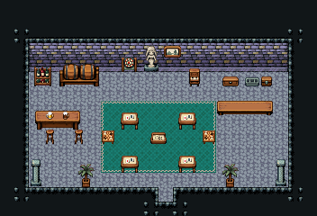

# 카지노

돈을 걸고 노는 도박장. 들어오면 오른쪽 환전 창구(카운터 뒤 돈 서랍·동전 쟁반·금고)에서 칩을 바꾸고, 청록 카펫 위 카드 탁자·주사위 판에서 놀고, 왼쪽 뒤 바에서 술을 마신다.

금벽돌 벽·돌바닥 42, 18×8칸. 가운데 청록 카펫 8×5 위 카드 탁자 2×2 넷·주사위 쟁반·체스판 둘, 오른쪽 환전 카운터 325·326·327(점원 자리 (16,6))와 돈 서랍·동전 계산 쟁반·금고함, 왼쪽 뒤 포도주 선반·술통 선반 앞에 바 카운터 4×2(바텐더 줄 y=6)와 높은 걸상, 뒷벽에 여자 흉상·다트판·풍경화, 업라이트 피아노, 문 양옆 기둥 89/119와 야자 화분. 22×15, tilesetId=tibo_interior_expanded. 입구 (11,13), 주인·담당 자리 (16,6). 통행 검사 목표 [[16,8],[10,8],[3,6]].



## 놓은 소품 (저작 순서)
tibo-kit은 tibo_interior_expanded의 structureKits id, tiles는 직접 놓은 번호 행렬, rug는 카펫 오토타일 섬, floor는 바닥 재질 칠. (x,y)는 왼쪽 위.
```json
[
  {
    "kind": "rug",
    "group": "harness-interior-house-v1-terrain-teal-carpet",
    "x": 7,
    "y": 7,
    "w": 8,
    "h": 5
  },
  {
    "kind": "tibo-kit",
    "kitId": "tibo-library-140",
    "name": "카드 탁자",
    "x": 8,
    "y": 7,
    "w": 2,
    "h": 2
  },
  {
    "kind": "tibo-kit",
    "kitId": "tibo-library-140",
    "name": "카드 탁자",
    "x": 12,
    "y": 7,
    "w": 2,
    "h": 2
  },
  {
    "kind": "tibo-kit",
    "kitId": "tibo-library-140",
    "name": "카드 탁자",
    "x": 8,
    "y": 10,
    "w": 2,
    "h": 2
  },
  {
    "kind": "tibo-kit",
    "kitId": "tibo-library-140",
    "name": "카드 탁자",
    "x": 12,
    "y": 10,
    "w": 2,
    "h": 2
  },
  {
    "kind": "tibo-kit",
    "kitId": "tibo-library-139",
    "name": "주사위 쟁반",
    "x": 10,
    "y": 9,
    "w": 2,
    "h": 1
  },
  {
    "kind": "tibo-kit",
    "kitId": "tibo-chessboard",
    "name": "체스판",
    "x": 14,
    "y": 9,
    "w": 1,
    "h": 1
  },
  {
    "kind": "tibo-kit",
    "kitId": "tibo-chessboard",
    "name": "체스판",
    "x": 7,
    "y": 9,
    "w": 1,
    "h": 1
  },
  {
    "kind": "tiles",
    "layer": "upper",
    "x": 15,
    "y": 7,
    "w": 4,
    "h": 1,
    "rows": [
      [
        325,
        326,
        326,
        327
      ]
    ]
  },
  {
    "kind": "tibo-kit",
    "kitId": "tibo-library-121",
    "name": "돈 서랍",
    "x": 15,
    "y": 5,
    "w": 2,
    "h": 1
  },
  {
    "kind": "tibo-kit",
    "kitId": "tibo-library-122",
    "name": "동전 계산 쟁반",
    "x": 17,
    "y": 5,
    "w": 1,
    "h": 1
  },
  {
    "kind": "tibo-kit",
    "kitId": "tibo-library-238",
    "name": "자물쇠 금고함",
    "x": 18,
    "y": 5,
    "w": 1,
    "h": 1
  },
  {
    "kind": "tibo-kit",
    "kitId": "tibo-library-134",
    "name": "포도주 병 선반",
    "x": 2,
    "y": 4,
    "w": 2,
    "h": 2
  },
  {
    "kind": "tibo-kit",
    "kitId": "tibo-fantasy-ale-rack",
    "name": "술통 선반",
    "x": 4,
    "y": 4,
    "w": 3,
    "h": 2
  },
  {
    "kind": "tibo-kit",
    "kitId": "tibo-fantasy-bar-counter",
    "name": "바 카운터",
    "x": 2,
    "y": 7,
    "w": 4,
    "h": 2
  },
  {
    "kind": "tibo-kit",
    "kitId": "tibo-library-029",
    "name": "높은 걸상",
    "x": 3,
    "y": 9,
    "w": 1,
    "h": 1
  },
  {
    "kind": "tibo-kit",
    "kitId": "tibo-library-029",
    "name": "높은 걸상",
    "x": 5,
    "y": 9,
    "w": 1,
    "h": 1
  },
  {
    "kind": "tibo-kit",
    "kitId": "tibo-library-169",
    "name": "작은 업라이트 피아노",
    "x": 13,
    "y": 4,
    "w": 1,
    "h": 2
  },
  {
    "kind": "tiles",
    "layer": "upper",
    "x": 10,
    "y": 3,
    "w": 1,
    "h": 2,
    "rows": [
      [
        88
      ],
      [
        118
      ]
    ]
  },
  {
    "kind": "tibo-kit",
    "kitId": "tibo-library-138",
    "name": "술집 다트판",
    "x": 8,
    "y": 3,
    "w": 2,
    "h": 2
  },
  {
    "kind": "tibo-kit",
    "kitId": "tibo-library-217",
    "name": "풍경화",
    "x": 11,
    "y": 3,
    "w": 2,
    "h": 1
  },
  {
    "kind": "tibo-kit",
    "kitId": "tibo-library-209",
    "name": "키 큰 실내 야자",
    "x": 15,
    "y": 11,
    "w": 2,
    "h": 2
  },
  {
    "kind": "tibo-kit",
    "kitId": "tibo-library-209",
    "name": "키 큰 실내 야자",
    "x": 5,
    "y": 11,
    "w": 2,
    "h": 2
  },
  {
    "kind": "tiles",
    "layer": "upper",
    "x": 2,
    "y": 11,
    "w": 1,
    "h": 2,
    "rows": [
      [
        89
      ],
      [
        119
      ]
    ]
  },
  {
    "kind": "tiles",
    "layer": "upper",
    "x": 19,
    "y": 11,
    "w": 1,
    "h": 2,
    "rows": [
      [
        89
      ],
      [
        119
      ]
    ]
  }
]
```

전체 두 레이어는 다음 배열 문서가 정답이다.
