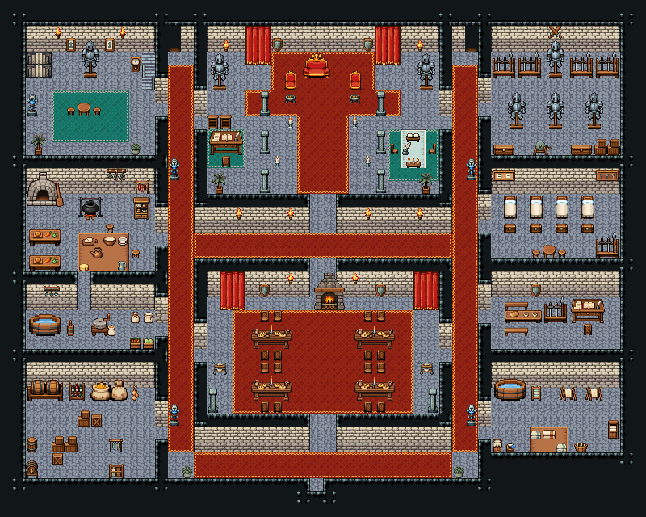

# 성 · 1층 (알현실과 대연회장)

성의 1층 전체. 정문으로 들어오면 남쪽 복도, 가운데 대연회장을 복도 고리가 둘러 어느 쪽으로 돌아도 이어진다. 북쪽 알현실에 왕좌, 서쪽에 계단실(오르막 → 성 침실, 내리막 → 성 보물고)·주방·식료 창고, 동쪽에 무기고·경비 초소·세탁실. 서쪽 복도 북쪽 끝 문 틈은 성 식당, 동쪽 복도 북쪽 끝 문 틈은 성 병영으로 이어진다.

석벽·돌바닥 42, 50×40(비취 대계곡급 대형 실내). 방 12개(계단실 10×8·주방 10×12·식료 창고 10×7·서복도 2×33·알현실 18×11·북복도 20×2·대연회장 18×9·남복도 20×2·동복도 2×33·무기고 10×8·경비 초소 10×12·세탁실 10×7)를 파이프라인 칸막이로 나누고 세로 칸막이 천장을 북쪽 천장까지 이었다. 복도 고리: 서복도(x=13~14)↔북복도(y=18~19)↔동복도(x=35~36)↔남복도(y=35~36), 대연회장 사방 문과 알현실 양옆·남쪽 문이 고리를 더 잇는다. 알현실: 무늬 석판 단상 위 큰 왕좌 3×2와 붉은 의자 둘, 붉은 카펫, 기둥 두 줄·커튼·방패·화로·갑옷 거치대·촛대. 계단실: 동벽 앞 오르막 111/141/171, 서쪽 내리막 474|475, 초상화·청록 러그·갑옷 거치대·화분. 주방: 석조 빵 화덕·불 피운 솥 걸이(돌바닥)·약초·소시지 걸이·조리대 둘·나무 상판 큰 작업 탁자(빵 도마·반죽 그릇·접시·치즈·주전자·피처)와 걸상 둘·식기장·물통·자루와 채소 상자 한 덩이. 식료 창고: 술통 선반·포도주 선반·식재료 자루·쌓인 상자·통·양파·마늘 꾸러미. 대연회장: 붉은 카펫 위 연회 식탁 네 개와 의자, 북벽 벽난로·커튼·방패·횃불, 남쪽 모서리 기둥. 무기고: 무기 거치대 넷·갑옷 거치대·연습검 걸이·긴 공구 상자·쌓인 상자. 경비 초소: 침대 넷과 궤짝, 대진표·열쇠판, 식사 탁자 둘과 벤치, 부대장 책상과 의자, 무기 거치대. 세탁실: 물통·빨래판·빨래 건조대 둘·빨래통·빨래 바구니·빨래집게 바구니·린넨 장. 50×40, tilesetId=tibo_interior_expanded. 입구 (24,37), 주인·담당 자리 (24,7). 통행 검사 목표 [[24,7],[24,27],[8,6],[11,7],[3,6],[6,26],[3,32],[42,7],[42,25],[42,31],[13,5],[36,5],[14,20],[35,30]].



## 놓은 소품 (저작 순서)
tibo-kit은 tibo_interior_expanded의 structureKits id, tiles는 직접 놓은 번호 행렬, rug는 카펫 오토타일 섬, floor는 바닥 재질 칠. (x,y)는 왼쪽 위.
```json
[
  {
    "kind": "doorway",
    "x": 13,
    "y": 2,
    "w": 1,
    "h": 2,
    "role": "doorway"
  },
  {
    "kind": "doorway",
    "x": 36,
    "y": 2,
    "w": 1,
    "h": 2,
    "role": "doorway"
  },
  {
    "kind": "rug",
    "group": "harness-interior-house-v1-terrain-red-carpet",
    "x": 21,
    "y": 4,
    "w": 8,
    "h": 3,
    "role": "rug"
  },
  {
    "kind": "rug",
    "group": "harness-interior-house-v1-terrain-red-carpet",
    "x": 19,
    "y": 7,
    "w": 12,
    "h": 2,
    "role": "rug"
  },
  {
    "kind": "rug",
    "group": "harness-interior-house-v1-terrain-red-carpet",
    "x": 23,
    "y": 9,
    "w": 4,
    "h": 6,
    "role": "rug"
  },
  {
    "kind": "tiles",
    "layer": "upper",
    "x": 23,
    "y": 4,
    "w": 3,
    "h": 2,
    "rows": [
      [
        447,
        448,
        449
      ],
      [
        477,
        478,
        479
      ]
    ],
    "role": "furn"
  },
  {
    "kind": "tiles",
    "layer": "upper",
    "x": 22,
    "y": 5,
    "w": 1,
    "h": 2,
    "rows": [
      [
        446
      ],
      [
        476
      ]
    ],
    "role": "furn"
  },
  {
    "kind": "tiles",
    "layer": "upper",
    "x": 27,
    "y": 5,
    "w": 1,
    "h": 2,
    "rows": [
      [
        446
      ],
      [
        476
      ]
    ],
    "role": "furn"
  },
  {
    "kind": "tiles",
    "layer": "upper",
    "x": 19,
    "y": 2,
    "w": 2,
    "h": 3,
    "rows": [
      [
        142,
        143
      ],
      [
        172,
        173
      ],
      [
        202,
        203
      ]
    ],
    "role": "furn"
  },
  {
    "kind": "tiles",
    "layer": "upper",
    "x": 29,
    "y": 2,
    "w": 2,
    "h": 3,
    "rows": [
      [
        142,
        143
      ],
      [
        172,
        173
      ],
      [
        202,
        203
      ]
    ],
    "role": "furn"
  },
  {
    "kind": "tiles",
    "layer": "upper",
    "x": 20,
    "y": 7,
    "w": 1,
    "h": 2,
    "rows": [
      [
        89
      ],
      [
        119
      ]
    ],
    "role": "furn"
  },
  {
    "kind": "tiles",
    "layer": "upper",
    "x": 29,
    "y": 7,
    "w": 1,
    "h": 2,
    "rows": [
      [
        89
      ],
      [
        119
      ]
    ],
    "role": "furn"
  },
  {
    "kind": "tiles",
    "layer": "upper",
    "x": 20,
    "y": 10,
    "w": 1,
    "h": 2,
    "rows": [
      [
        89
      ],
      [
        119
      ]
    ],
    "role": "furn"
  },
  {
    "kind": "tiles",
    "layer": "upper",
    "x": 29,
    "y": 10,
    "w": 1,
    "h": 2,
    "rows": [
      [
        89
      ],
      [
        119
      ]
    ],
    "role": "furn"
  },
  {
    "kind": "tiles",
    "layer": "upper",
    "x": 20,
    "y": 13,
    "w": 1,
    "h": 2,
    "rows": [
      [
        89
      ],
      [
        119
      ]
    ],
    "role": "furn"
  },
  {
    "kind": "tiles",
    "layer": "upper",
    "x": 29,
    "y": 13,
    "w": 1,
    "h": 2,
    "rows": [
      [
        89
      ],
      [
        119
      ]
    ],
    "role": "furn"
  },
  {
    "kind": "tiles",
    "layer": "upper",
    "x": 17,
    "y": 3,
    "w": 1,
    "h": 1,
    "rows": [
      [
        24
      ]
    ],
    "role": "hang"
  },
  {
    "kind": "tiles",
    "layer": "upper",
    "x": 32,
    "y": 3,
    "w": 1,
    "h": 1,
    "rows": [
      [
        24
      ]
    ],
    "role": "hang"
  },
  {
    "kind": "tibo-kit",
    "kitId": "tibo-library-221",
    "name": "방패 벽 장식",
    "x": 21,
    "y": 2,
    "w": 1,
    "h": 2,
    "role": "hang"
  },
  {
    "kind": "tibo-kit",
    "kitId": "tibo-library-221",
    "name": "방패 벽 장식",
    "x": 28,
    "y": 2,
    "w": 1,
    "h": 2,
    "role": "hang"
  },
  {
    "kind": "tibo-kit",
    "kitId": "tibo-brazier",
    "name": "화로",
    "x": 22,
    "y": 7,
    "w": 1,
    "h": 1,
    "role": "furn"
  },
  {
    "kind": "tibo-kit",
    "kitId": "tibo-brazier",
    "name": "화로",
    "x": 27,
    "y": 7,
    "w": 1,
    "h": 1,
    "role": "furn"
  },
  {
    "kind": "tibo-kit",
    "kitId": "tibo-medieval-armor-stand",
    "name": "갑옷 거치대",
    "x": 16,
    "y": 4,
    "w": 2,
    "h": 3,
    "role": "furn"
  },
  {
    "kind": "tibo-kit",
    "kitId": "tibo-medieval-armor-stand",
    "name": "갑옷 거치대",
    "x": 32,
    "y": 4,
    "w": 2,
    "h": 3,
    "role": "furn"
  },
  {
    "kind": "rug",
    "group": "harness-interior-house-v1-terrain-teal-carpet",
    "x": 16,
    "y": 10,
    "w": 3,
    "h": 3,
    "role": "rug"
  },
  {
    "kind": "tibo-kit",
    "kitId": "tibo-medieval-scribe-desk",
    "name": "필경사 책상",
    "x": 16,
    "y": 10,
    "w": 3,
    "h": 2,
    "role": "table"
  },
  {
    "kind": "tiles",
    "layer": "upper",
    "x": 17,
    "y": 12,
    "w": 1,
    "h": 1,
    "rows": [
      [
        268
      ]
    ],
    "role": "seat"
  },
  {
    "kind": "tibo-kit",
    "kitId": "tibo-library-078",
    "name": "문서 분류장",
    "x": 16,
    "y": 8,
    "w": 1,
    "h": 2,
    "role": "furn"
  },
  {
    "kind": "tibo-kit",
    "kitId": "tibo-library-078",
    "name": "문서 분류장",
    "x": 17,
    "y": 8,
    "w": 1,
    "h": 2,
    "role": "furn"
  },
  {
    "kind": "rug",
    "group": "harness-interior-house-v1-terrain-teal-carpet",
    "x": 30,
    "y": 10,
    "w": 4,
    "h": 4,
    "role": "rug"
  },
  {
    "kind": "tabletop",
    "group": "harness-interior-house-v1-terrain-white-table",
    "x": 31,
    "y": 10,
    "w": 2,
    "h": 3,
    "role": "tabletop"
  },
  {
    "kind": "tibo-kit",
    "kitId": "tibo-library-160",
    "name": "봉인 주문 두루마리",
    "x": 31,
    "y": 10,
    "w": 2,
    "h": 1,
    "role": "top"
  },
  {
    "kind": "tibo-kit",
    "kitId": "tibo-library-076",
    "name": "잉크와 깃펜",
    "x": 31,
    "y": 11,
    "w": 1,
    "h": 1,
    "role": "top"
  },
  {
    "kind": "tibo-kit",
    "kitId": "tibo-library-168",
    "name": "의식 초 세 개",
    "x": 31,
    "y": 12,
    "w": 2,
    "h": 1,
    "role": "top"
  },
  {
    "kind": "tiles",
    "layer": "upper",
    "x": 30,
    "y": 11,
    "w": 1,
    "h": 1,
    "rows": [
      [
        297
      ]
    ],
    "role": "seat"
  },
  {
    "kind": "tiles",
    "layer": "upper",
    "x": 33,
    "y": 11,
    "w": 1,
    "h": 1,
    "rows": [
      [
        298
      ]
    ],
    "role": "seat"
  },
  {
    "kind": "tibo-kit",
    "kitId": "tibo-library-209",
    "name": "키 큰 실내 야자",
    "x": 16,
    "y": 13,
    "w": 2,
    "h": 2,
    "role": "furn"
  },
  {
    "kind": "tibo-kit",
    "kitId": "tibo-library-209",
    "name": "키 큰 실내 야자",
    "x": 32,
    "y": 13,
    "w": 2,
    "h": 2,
    "role": "furn"
  },
  {
    "kind": "tiles",
    "layer": "upper",
    "x": 21,
    "y": 12,
    "w": 1,
    "h": 1,
    "rows": [
      [
        204
      ]
    ],
    "role": "furn"
  },
  {
    "kind": "tiles",
    "layer": "upper",
    "x": 28,
    "y": 12,
    "w": 1,
    "h": 1,
    "rows": [
      [
        204
      ]
    ],
    "role": "furn"
  },
  {
    "kind": "tiles",
    "layer": "upper",
    "x": 22,
    "y": 9,
    "w": 1,
    "h": 1,
    "rows": [
      [
        204
      ]
    ],
    "role": "furn"
  },
  {
    "kind": "tiles",
    "layer": "upper",
    "x": 27,
    "y": 9,
    "w": 1,
    "h": 1,
    "rows": [
      [
        204
      ]
    ],
    "role": "furn"
  },
  {
    "kind": "tiles",
    "layer": "lower",
    "x": 11,
    "y": 4,
    "w": 1,
    "h": 3,
    "rows": [
      [
        111
      ],
      [
        141
      ],
      [
        171
      ]
    ],
    "role": "stairs"
  },
  {
    "kind": "tiles",
    "layer": "upper",
    "x": 2,
    "y": 4,
    "w": 2,
    "h": 2,
    "rows": [
      [
        474,
        475
      ],
      [
        474,
        475
      ]
    ],
    "role": "stairs"
  },
  {
    "kind": "tibo-kit",
    "kitId": "tibo-library-218",
    "name": "초상화",
    "x": 5,
    "y": 2,
    "w": 1,
    "h": 2,
    "role": "hang"
  },
  {
    "kind": "tibo-kit",
    "kitId": "tibo-library-218",
    "name": "초상화",
    "x": 8,
    "y": 2,
    "w": 1,
    "h": 2,
    "role": "hang"
  },
  {
    "kind": "tiles",
    "layer": "upper",
    "x": 4,
    "y": 2,
    "w": 1,
    "h": 1,
    "rows": [
      [
        24
      ]
    ],
    "role": "hang"
  },
  {
    "kind": "tiles",
    "layer": "upper",
    "x": 9,
    "y": 2,
    "w": 1,
    "h": 1,
    "rows": [
      [
        24
      ]
    ],
    "role": "hang"
  },
  {
    "kind": "tiles",
    "layer": "upper",
    "x": 10,
    "y": 4,
    "w": 1,
    "h": 2,
    "rows": [
      [
        389
      ],
      [
        419
      ]
    ],
    "role": "furn"
  },
  {
    "kind": "tibo-kit",
    "kitId": "tibo-medieval-armor-stand",
    "name": "갑옷 거치대",
    "x": 6,
    "y": 3,
    "w": 2,
    "h": 3,
    "role": "furn"
  },
  {
    "kind": "rug",
    "group": "harness-interior-house-v1-terrain-teal-carpet",
    "x": 4,
    "y": 7,
    "w": 6,
    "h": 4,
    "role": "rug"
  },
  {
    "kind": "tibo-kit",
    "kitId": "tibo-library-025",
    "name": "원형 식탁",
    "x": 6,
    "y": 7,
    "w": 1,
    "h": 2,
    "role": "table"
  },
  {
    "kind": "tibo-kit",
    "kitId": "tibo-library-030",
    "name": "낮은 걸상",
    "x": 5,
    "y": 8,
    "w": 1,
    "h": 1,
    "role": "seat"
  },
  {
    "kind": "tibo-kit",
    "kitId": "tibo-library-030",
    "name": "낮은 걸상",
    "x": 7,
    "y": 8,
    "w": 1,
    "h": 1,
    "role": "seat"
  },
  {
    "kind": "tiles",
    "layer": "upper",
    "x": 2,
    "y": 7,
    "w": 1,
    "h": 2,
    "rows": [
      [
        87
      ],
      [
        117
      ]
    ],
    "role": "furn"
  },
  {
    "kind": "tibo-kit",
    "kitId": "tibo-library-209",
    "name": "키 큰 실내 야자",
    "x": 2,
    "y": 10,
    "w": 2,
    "h": 2,
    "role": "furn"
  },
  {
    "kind": "tibo-kit",
    "kitId": "tibo-library-215",
    "name": "둥근 관목 화분",
    "x": 10,
    "y": 11,
    "w": 1,
    "h": 1,
    "role": "furn"
  },
  {
    "kind": "tibo-kit",
    "kitId": "tibo-medieval-bread-oven",
    "name": "석조 빵 화덕",
    "x": 2,
    "y": 13,
    "w": 3,
    "h": 3,
    "role": "furn"
  },
  {
    "kind": "tibo-kit",
    "kitId": "tibo-fantasy-hanging-pot",
    "name": "솥 걸이",
    "x": 6,
    "y": 15,
    "w": 2,
    "h": 2,
    "role": "furn"
  },
  {
    "kind": "tibo-kit",
    "kitId": "tibo-hanging-herbs",
    "name": "말린 약초 걸이",
    "x": 8,
    "y": 13,
    "w": 2,
    "h": 1,
    "role": "hang"
  },
  {
    "kind": "tibo-kit",
    "kitId": "tibo-library-021",
    "name": "소시지 걸이",
    "x": 10,
    "y": 13,
    "w": 2,
    "h": 2,
    "role": "hang"
  },
  {
    "kind": "tibo-kit",
    "kitId": "tibo-warm-crockery",
    "name": "따뜻한 목재 식기장",
    "x": 10,
    "y": 15,
    "w": 2,
    "h": 2,
    "role": "furn"
  },
  {
    "kind": "tibo-kit",
    "kitId": "tibo-fantasy-prep-table",
    "name": "조리대",
    "x": 2,
    "y": 17,
    "w": 3,
    "h": 2,
    "role": "table"
  },
  {
    "kind": "tibo-kit",
    "kitId": "tibo-fantasy-prep-table",
    "name": "조리대",
    "x": 2,
    "y": 19,
    "w": 3,
    "h": 2,
    "role": "table"
  },
  {
    "kind": "tabletop",
    "group": "harness-interior-house-v1-terrain-deck",
    "x": 6,
    "y": 18,
    "w": 4,
    "h": 3,
    "role": "tabletop"
  },
  {
    "kind": "tibo-kit",
    "kitId": "tibo-library-001",
    "name": "빵 도마",
    "x": 6,
    "y": 18,
    "w": 2,
    "h": 1,
    "role": "furn"
  },
  {
    "kind": "tibo-kit",
    "kitId": "tibo-library-004",
    "name": "반죽 그릇",
    "x": 8,
    "y": 18,
    "w": 1,
    "h": 1,
    "role": "top"
  },
  {
    "kind": "tibo-kit",
    "kitId": "tibo-library-008",
    "name": "접시 더미",
    "x": 9,
    "y": 18,
    "w": 1,
    "h": 1,
    "role": "top"
  },
  {
    "kind": "tibo-kit",
    "kitId": "tibo-library-020",
    "name": "치즈 덩이",
    "x": 6,
    "y": 20,
    "w": 1,
    "h": 1,
    "role": "top"
  },
  {
    "kind": "tibo-kit",
    "kitId": "tibo-library-005",
    "name": "구리 주전자",
    "x": 7,
    "y": 19,
    "w": 1,
    "h": 1,
    "role": "top"
  },
  {
    "kind": "tibo-kit",
    "kitId": "tibo-library-036",
    "name": "물 피처",
    "x": 9,
    "y": 20,
    "w": 1,
    "h": 1,
    "role": "top"
  },
  {
    "kind": "tibo-kit",
    "kitId": "tibo-library-030",
    "name": "낮은 걸상",
    "x": 8,
    "y": 17,
    "w": 1,
    "h": 1,
    "role": "seat"
  },
  {
    "kind": "tibo-kit",
    "kitId": "tibo-library-030",
    "name": "낮은 걸상",
    "x": 10,
    "y": 19,
    "w": 1,
    "h": 1,
    "role": "seat"
  },
  {
    "kind": "tibo-kit",
    "kitId": "tibo-fantasy-water-tub",
    "name": "물통",
    "x": 2,
    "y": 24,
    "w": 3,
    "h": 2,
    "role": "furn"
  },
  {
    "kind": "tibo-kit",
    "kitId": "tibo-butter-churn",
    "name": "버터 교반통",
    "x": 5,
    "y": 24,
    "w": 1,
    "h": 2,
    "role": "furn"
  },
  {
    "kind": "tibo-kit",
    "kitId": "tibo-medieval-grain-mill",
    "name": "손맷돌",
    "x": 7,
    "y": 24,
    "w": 2,
    "h": 2,
    "role": "furn"
  },
  {
    "kind": "tibo-kit",
    "kitId": "tibo-library-012",
    "name": "국자 걸이",
    "x": 3,
    "y": 22,
    "w": 2,
    "h": 1,
    "role": "hang"
  },
  {
    "kind": "tibo-kit",
    "kitId": "tibo-library-013",
    "name": "밀가루 포대",
    "x": 10,
    "y": 24,
    "w": 1,
    "h": 1,
    "role": "furn"
  },
  {
    "kind": "tibo-kit",
    "kitId": "tibo-library-014",
    "name": "쌀 포대",
    "x": 11,
    "y": 24,
    "w": 1,
    "h": 1,
    "role": "furn"
  },
  {
    "kind": "tibo-kit",
    "kitId": "tibo-library-018",
    "name": "당근 상자",
    "x": 10,
    "y": 26,
    "w": 1,
    "h": 1,
    "role": "furn"
  },
  {
    "kind": "tibo-kit",
    "kitId": "tibo-library-019",
    "name": "양배추 상자",
    "x": 11,
    "y": 26,
    "w": 1,
    "h": 1,
    "role": "furn"
  },
  {
    "kind": "tibo-kit",
    "kitId": "tibo-fantasy-ale-rack",
    "name": "술통 선반",
    "x": 2,
    "y": 29,
    "w": 3,
    "h": 2,
    "role": "furn"
  },
  {
    "kind": "tibo-kit",
    "kitId": "tibo-library-134",
    "name": "포도주 병 선반",
    "x": 5,
    "y": 29,
    "w": 2,
    "h": 2,
    "role": "furn"
  },
  {
    "kind": "tibo-kit",
    "kitId": "tibo-fantasy-grain-sacks",
    "name": "식재료 자루",
    "x": 7,
    "y": 29,
    "w": 3,
    "h": 2,
    "role": "furn"
  },
  {
    "kind": "tibo-kit",
    "kitId": "tibo-library-016",
    "name": "양파 꾸러미",
    "x": 10,
    "y": 29,
    "w": 1,
    "h": 2,
    "role": "furn"
  },
  {
    "kind": "tibo-kit",
    "kitId": "tibo-library-232",
    "name": "쌓인 나무 상자",
    "x": 4,
    "y": 33,
    "w": 1,
    "h": 2,
    "role": "furn"
  },
  {
    "kind": "tibo-kit",
    "kitId": "tibo-library-232",
    "name": "쌓인 나무 상자",
    "x": 5,
    "y": 33,
    "w": 1,
    "h": 2,
    "role": "furn"
  },
  {
    "kind": "tibo-kit",
    "kitId": "tibo-library-230",
    "name": "정사각 보관 상자",
    "x": 4,
    "y": 35,
    "w": 1,
    "h": 1,
    "role": "furn"
  },
  {
    "kind": "tibo-kit",
    "kitId": "tibo-library-229",
    "name": "뚜껑 둥근 통",
    "x": 2,
    "y": 33,
    "w": 1,
    "h": 2,
    "role": "furn"
  },
  {
    "kind": "tibo-kit",
    "kitId": "tibo-library-133",
    "name": "받침대 맥주통",
    "x": 2,
    "y": 35,
    "w": 1,
    "h": 2,
    "role": "furn"
  },
  {
    "kind": "tibo-kit",
    "kitId": "tibo-library-022",
    "name": "생선 건조대",
    "x": 8,
    "y": 33,
    "w": 2,
    "h": 2,
    "role": "furn"
  },
  {
    "kind": "tibo-kit",
    "kitId": "tibo-library-132",
    "name": "잡화 선반",
    "x": 8,
    "y": 35,
    "w": 2,
    "h": 2,
    "role": "furn"
  },
  {
    "kind": "tibo-kit",
    "kitId": "tibo-library-232",
    "name": "쌓인 나무 상자",
    "x": 6,
    "y": 31,
    "w": 1,
    "h": 2,
    "role": "furn"
  },
  {
    "kind": "tibo-kit",
    "kitId": "tibo-library-230",
    "name": "정사각 보관 상자",
    "x": 7,
    "y": 32,
    "w": 1,
    "h": 1,
    "role": "furn"
  },
  {
    "kind": "rug",
    "group": "harness-interior-house-v1-terrain-red-carpet",
    "x": 18,
    "y": 24,
    "w": 14,
    "h": 8,
    "role": "rug"
  },
  {
    "kind": "tibo-kit",
    "kitId": "tibo-medieval-banquet-table",
    "name": "연회용 긴 식탁",
    "x": 19,
    "y": 25,
    "w": 4,
    "h": 2,
    "role": "table"
  },
  {
    "kind": "tibo-kit",
    "kitId": "tibo-medieval-banquet-table",
    "name": "연회용 긴 식탁",
    "x": 27,
    "y": 25,
    "w": 4,
    "h": 2,
    "role": "table"
  },
  {
    "kind": "tiles",
    "layer": "upper",
    "x": 20,
    "y": 24,
    "w": 1,
    "h": 1,
    "rows": [
      [
        267
      ]
    ],
    "role": "seat"
  },
  {
    "kind": "tiles",
    "layer": "upper",
    "x": 20,
    "y": 27,
    "w": 1,
    "h": 1,
    "rows": [
      [
        268
      ]
    ],
    "role": "seat"
  },
  {
    "kind": "tiles",
    "layer": "upper",
    "x": 21,
    "y": 24,
    "w": 1,
    "h": 1,
    "rows": [
      [
        267
      ]
    ],
    "role": "seat"
  },
  {
    "kind": "tiles",
    "layer": "upper",
    "x": 21,
    "y": 27,
    "w": 1,
    "h": 1,
    "rows": [
      [
        268
      ]
    ],
    "role": "seat"
  },
  {
    "kind": "tiles",
    "layer": "upper",
    "x": 28,
    "y": 24,
    "w": 1,
    "h": 1,
    "rows": [
      [
        267
      ]
    ],
    "role": "seat"
  },
  {
    "kind": "tiles",
    "layer": "upper",
    "x": 28,
    "y": 27,
    "w": 1,
    "h": 1,
    "rows": [
      [
        268
      ]
    ],
    "role": "seat"
  },
  {
    "kind": "tiles",
    "layer": "upper",
    "x": 29,
    "y": 24,
    "w": 1,
    "h": 1,
    "rows": [
      [
        267
      ]
    ],
    "role": "seat"
  },
  {
    "kind": "tiles",
    "layer": "upper",
    "x": 29,
    "y": 27,
    "w": 1,
    "h": 1,
    "rows": [
      [
        268
      ]
    ],
    "role": "seat"
  },
  {
    "kind": "tibo-kit",
    "kitId": "tibo-medieval-banquet-table",
    "name": "연회용 긴 식탁",
    "x": 19,
    "y": 29,
    "w": 4,
    "h": 2,
    "role": "table"
  },
  {
    "kind": "tibo-kit",
    "kitId": "tibo-medieval-banquet-table",
    "name": "연회용 긴 식탁",
    "x": 27,
    "y": 29,
    "w": 4,
    "h": 2,
    "role": "table"
  },
  {
    "kind": "tiles",
    "layer": "upper",
    "x": 20,
    "y": 28,
    "w": 1,
    "h": 1,
    "rows": [
      [
        267
      ]
    ],
    "role": "seat"
  },
  {
    "kind": "tiles",
    "layer": "upper",
    "x": 20,
    "y": 31,
    "w": 1,
    "h": 1,
    "rows": [
      [
        268
      ]
    ],
    "role": "seat"
  },
  {
    "kind": "tiles",
    "layer": "upper",
    "x": 21,
    "y": 28,
    "w": 1,
    "h": 1,
    "rows": [
      [
        267
      ]
    ],
    "role": "seat"
  },
  {
    "kind": "tiles",
    "layer": "upper",
    "x": 21,
    "y": 31,
    "w": 1,
    "h": 1,
    "rows": [
      [
        268
      ]
    ],
    "role": "seat"
  },
  {
    "kind": "tiles",
    "layer": "upper",
    "x": 28,
    "y": 28,
    "w": 1,
    "h": 1,
    "rows": [
      [
        267
      ]
    ],
    "role": "seat"
  },
  {
    "kind": "tiles",
    "layer": "upper",
    "x": 28,
    "y": 31,
    "w": 1,
    "h": 1,
    "rows": [
      [
        268
      ]
    ],
    "role": "seat"
  },
  {
    "kind": "tiles",
    "layer": "upper",
    "x": 29,
    "y": 28,
    "w": 1,
    "h": 1,
    "rows": [
      [
        267
      ]
    ],
    "role": "seat"
  },
  {
    "kind": "tiles",
    "layer": "upper",
    "x": 29,
    "y": 31,
    "w": 1,
    "h": 1,
    "rows": [
      [
        268
      ]
    ],
    "role": "seat"
  },
  {
    "kind": "tibo-kit",
    "kitId": "tibo-medieval-stone-fireplace",
    "name": "장작 벽난로",
    "x": 24,
    "y": 21,
    "w": 3,
    "h": 3,
    "role": "furn"
  },
  {
    "kind": "tiles",
    "layer": "upper",
    "x": 17,
    "y": 21,
    "w": 2,
    "h": 3,
    "rows": [
      [
        142,
        143
      ],
      [
        172,
        173
      ],
      [
        202,
        203
      ]
    ],
    "role": "furn"
  },
  {
    "kind": "tiles",
    "layer": "upper",
    "x": 32,
    "y": 21,
    "w": 2,
    "h": 3,
    "rows": [
      [
        142,
        143
      ],
      [
        172,
        173
      ],
      [
        202,
        203
      ]
    ],
    "role": "furn"
  },
  {
    "kind": "tibo-kit",
    "kitId": "tibo-library-221",
    "name": "방패 벽 장식",
    "x": 20,
    "y": 21,
    "w": 1,
    "h": 2,
    "role": "hang"
  },
  {
    "kind": "tibo-kit",
    "kitId": "tibo-library-221",
    "name": "방패 벽 장식",
    "x": 29,
    "y": 21,
    "w": 1,
    "h": 2,
    "role": "hang"
  },
  {
    "kind": "tiles",
    "layer": "upper",
    "x": 22,
    "y": 21,
    "w": 1,
    "h": 1,
    "rows": [
      [
        24
      ]
    ],
    "role": "hang"
  },
  {
    "kind": "tiles",
    "layer": "upper",
    "x": 27,
    "y": 21,
    "w": 1,
    "h": 1,
    "rows": [
      [
        24
      ]
    ],
    "role": "hang"
  },
  {
    "kind": "tibo-kit",
    "kitId": "tibo-library-031",
    "name": "음식 운반대",
    "x": 16,
    "y": 27,
    "w": 2,
    "h": 2,
    "role": "furn"
  },
  {
    "kind": "tibo-kit",
    "kitId": "tibo-library-031",
    "name": "음식 운반대",
    "x": 32,
    "y": 27,
    "w": 2,
    "h": 2,
    "role": "furn"
  },
  {
    "kind": "tiles",
    "layer": "upper",
    "x": 16,
    "y": 30,
    "w": 1,
    "h": 2,
    "rows": [
      [
        89
      ],
      [
        119
      ]
    ],
    "role": "furn"
  },
  {
    "kind": "tiles",
    "layer": "upper",
    "x": 33,
    "y": 30,
    "w": 1,
    "h": 2,
    "rows": [
      [
        89
      ],
      [
        119
      ]
    ],
    "role": "furn"
  },
  {
    "kind": "rug",
    "group": "harness-interior-house-v1-terrain-red-carpet",
    "x": 15,
    "y": 18,
    "w": 20,
    "h": 2,
    "role": "rug"
  },
  {
    "kind": "rug",
    "group": "harness-interior-house-v1-terrain-red-carpet",
    "x": 15,
    "y": 35,
    "w": 20,
    "h": 2,
    "role": "rug"
  },
  {
    "kind": "rug",
    "group": "harness-interior-house-v1-terrain-red-carpet",
    "x": 13,
    "y": 5,
    "w": 2,
    "h": 30,
    "role": "rug"
  },
  {
    "kind": "rug",
    "group": "harness-interior-house-v1-terrain-red-carpet",
    "x": 35,
    "y": 5,
    "w": 2,
    "h": 30,
    "role": "rug"
  },
  {
    "kind": "tiles",
    "layer": "upper",
    "x": 18,
    "y": 16,
    "w": 1,
    "h": 1,
    "rows": [
      [
        24
      ]
    ],
    "role": "hang"
  },
  {
    "kind": "tiles",
    "layer": "upper",
    "x": 22,
    "y": 16,
    "w": 1,
    "h": 1,
    "rows": [
      [
        24
      ]
    ],
    "role": "hang"
  },
  {
    "kind": "tiles",
    "layer": "upper",
    "x": 28,
    "y": 16,
    "w": 1,
    "h": 1,
    "rows": [
      [
        24
      ]
    ],
    "role": "hang"
  },
  {
    "kind": "tiles",
    "layer": "upper",
    "x": 32,
    "y": 16,
    "w": 1,
    "h": 1,
    "rows": [
      [
        24
      ]
    ],
    "role": "hang"
  },
  {
    "kind": "tiles",
    "layer": "upper",
    "x": 13,
    "y": 12,
    "w": 1,
    "h": 2,
    "rows": [
      [
        87
      ],
      [
        117
      ]
    ],
    "role": "furn"
  },
  {
    "kind": "tiles",
    "layer": "upper",
    "x": 36,
    "y": 12,
    "w": 1,
    "h": 2,
    "rows": [
      [
        87
      ],
      [
        117
      ]
    ],
    "role": "furn"
  },
  {
    "kind": "tiles",
    "layer": "upper",
    "x": 13,
    "y": 31,
    "w": 1,
    "h": 2,
    "rows": [
      [
        87
      ],
      [
        117
      ]
    ],
    "role": "furn"
  },
  {
    "kind": "tiles",
    "layer": "upper",
    "x": 36,
    "y": 31,
    "w": 1,
    "h": 2,
    "rows": [
      [
        87
      ],
      [
        117
      ]
    ],
    "role": "furn"
  },
  {
    "kind": "tibo-kit",
    "kitId": "tibo-library-215",
    "name": "둥근 관목 화분",
    "x": 14,
    "y": 36,
    "w": 1,
    "h": 1,
    "role": "furn"
  },
  {
    "kind": "tibo-kit",
    "kitId": "tibo-library-215",
    "name": "둥근 관목 화분",
    "x": 35,
    "y": 36,
    "w": 1,
    "h": 1,
    "role": "furn"
  },
  {
    "kind": "tibo-kit",
    "kitId": "tibo-fantasy-weapon-rack",
    "name": "무기 거치대",
    "x": 38,
    "y": 3,
    "w": 2,
    "h": 3,
    "role": "furn"
  },
  {
    "kind": "tibo-kit",
    "kitId": "tibo-fantasy-weapon-rack",
    "name": "무기 거치대",
    "x": 40,
    "y": 3,
    "w": 2,
    "h": 3,
    "role": "furn"
  },
  {
    "kind": "tibo-kit",
    "kitId": "tibo-fantasy-weapon-rack",
    "name": "무기 거치대",
    "x": 44,
    "y": 3,
    "w": 2,
    "h": 3,
    "role": "furn"
  },
  {
    "kind": "tibo-kit",
    "kitId": "tibo-fantasy-weapon-rack",
    "name": "무기 거치대",
    "x": 46,
    "y": 3,
    "w": 2,
    "h": 3,
    "role": "furn"
  },
  {
    "kind": "tibo-kit",
    "kitId": "tibo-medieval-armor-stand",
    "name": "갑옷 거치대",
    "x": 42,
    "y": 3,
    "w": 2,
    "h": 3,
    "role": "furn"
  },
  {
    "kind": "tibo-kit",
    "kitId": "tibo-library-222",
    "name": "교차 나무 연습검",
    "x": 42,
    "y": 2,
    "w": 2,
    "h": 1,
    "role": "hang"
  },
  {
    "kind": "tibo-kit",
    "kitId": "tibo-medieval-armor-stand",
    "name": "갑옷 거치대",
    "x": 39,
    "y": 7,
    "w": 2,
    "h": 3,
    "role": "furn"
  },
  {
    "kind": "tibo-kit",
    "kitId": "tibo-medieval-armor-stand",
    "name": "갑옷 거치대",
    "x": 42,
    "y": 7,
    "w": 2,
    "h": 3,
    "role": "furn"
  },
  {
    "kind": "tibo-kit",
    "kitId": "tibo-medieval-armor-stand",
    "name": "갑옷 거치대",
    "x": 45,
    "y": 7,
    "w": 2,
    "h": 3,
    "role": "furn"
  },
  {
    "kind": "tibo-kit",
    "kitId": "tibo-grindstone",
    "name": "숫돌",
    "x": 41,
    "y": 10,
    "w": 2,
    "h": 2,
    "role": "furn"
  },
  {
    "kind": "tibo-kit",
    "kitId": "tibo-library-231",
    "name": "긴 공구 상자",
    "x": 38,
    "y": 11,
    "w": 2,
    "h": 1,
    "role": "furn"
  },
  {
    "kind": "tibo-kit",
    "kitId": "tibo-library-231",
    "name": "긴 공구 상자",
    "x": 44,
    "y": 11,
    "w": 2,
    "h": 1,
    "role": "furn"
  },
  {
    "kind": "tibo-kit",
    "kitId": "tibo-library-232",
    "name": "쌓인 나무 상자",
    "x": 47,
    "y": 10,
    "w": 1,
    "h": 2,
    "role": "furn"
  },
  {
    "kind": "tibo-kit",
    "kitId": "tibo-library-232",
    "name": "쌓인 나무 상자",
    "x": 46,
    "y": 10,
    "w": 1,
    "h": 2,
    "role": "furn"
  },
  {
    "kind": "tiles",
    "layer": "upper",
    "x": 39,
    "y": 15,
    "w": 1,
    "h": 2,
    "rows": [
      [
        324
      ],
      [
        354
      ]
    ],
    "role": "furn"
  },
  {
    "kind": "tibo-kit",
    "kitId": "tibo-library-045",
    "name": "여행용 궤짝",
    "x": 39,
    "y": 17,
    "w": 1,
    "h": 1,
    "role": "furn"
  },
  {
    "kind": "tiles",
    "layer": "upper",
    "x": 41,
    "y": 15,
    "w": 1,
    "h": 2,
    "rows": [
      [
        324
      ],
      [
        354
      ]
    ],
    "role": "furn"
  },
  {
    "kind": "tibo-kit",
    "kitId": "tibo-library-045",
    "name": "여행용 궤짝",
    "x": 41,
    "y": 17,
    "w": 1,
    "h": 1,
    "role": "furn"
  },
  {
    "kind": "tiles",
    "layer": "upper",
    "x": 43,
    "y": 15,
    "w": 1,
    "h": 2,
    "rows": [
      [
        324
      ],
      [
        354
      ]
    ],
    "role": "furn"
  },
  {
    "kind": "tibo-kit",
    "kitId": "tibo-library-045",
    "name": "여행용 궤짝",
    "x": 43,
    "y": 17,
    "w": 1,
    "h": 1,
    "role": "furn"
  },
  {
    "kind": "tiles",
    "layer": "upper",
    "x": 45,
    "y": 15,
    "w": 1,
    "h": 2,
    "rows": [
      [
        324
      ],
      [
        354
      ]
    ],
    "role": "furn"
  },
  {
    "kind": "tibo-kit",
    "kitId": "tibo-library-045",
    "name": "여행용 궤짝",
    "x": 45,
    "y": 17,
    "w": 1,
    "h": 1,
    "role": "furn"
  },
  {
    "kind": "tibo-kit",
    "kitId": "tibo-v6-1-0",
    "name": "메모 게시판",
    "x": 38,
    "y": 13,
    "w": 2,
    "h": 1,
    "role": "hang"
  },
  {
    "kind": "tibo-kit",
    "kitId": "tibo-v8-1-0",
    "name": "열쇠판",
    "x": 46,
    "y": 13,
    "w": 2,
    "h": 1,
    "role": "hang"
  },
  {
    "kind": "tibo-kit",
    "kitId": "tibo-library-025",
    "name": "원형 식탁",
    "x": 42,
    "y": 18,
    "w": 1,
    "h": 2,
    "role": "table"
  },
  {
    "kind": "tibo-kit",
    "kitId": "tibo-library-030",
    "name": "낮은 걸상",
    "x": 41,
    "y": 19,
    "w": 1,
    "h": 1,
    "role": "seat"
  },
  {
    "kind": "tibo-kit",
    "kitId": "tibo-library-030",
    "name": "낮은 걸상",
    "x": 43,
    "y": 19,
    "w": 1,
    "h": 1,
    "role": "seat"
  },
  {
    "kind": "tibo-kit",
    "kitId": "tibo-fantasy-weapon-rack",
    "name": "무기 거치대",
    "x": 46,
    "y": 17,
    "w": 2,
    "h": 3,
    "role": "furn"
  },
  {
    "kind": "tibo-kit",
    "kitId": "tibo-v4-4-0",
    "name": "식사 탁자",
    "x": 39,
    "y": 24,
    "w": 3,
    "h": 1,
    "role": "table"
  },
  {
    "kind": "tibo-kit",
    "kitId": "tibo-library-028",
    "name": "긴 벤치",
    "x": 39,
    "y": 23,
    "w": 2,
    "h": 1,
    "role": "seat"
  },
  {
    "kind": "tibo-kit",
    "kitId": "tibo-library-028",
    "name": "긴 벤치",
    "x": 39,
    "y": 25,
    "w": 2,
    "h": 1,
    "role": "seat"
  },
  {
    "kind": "tibo-kit",
    "kitId": "tibo-library-221",
    "name": "방패 벽 장식",
    "x": 41,
    "y": 21,
    "w": 1,
    "h": 2,
    "role": "hang"
  },
  {
    "kind": "tibo-kit",
    "kitId": "tibo-library-221",
    "name": "방패 벽 장식",
    "x": 43,
    "y": 21,
    "w": 1,
    "h": 2,
    "role": "hang"
  },
  {
    "kind": "tibo-kit",
    "kitId": "tibo-medieval-scribe-desk",
    "name": "필경사 책상",
    "x": 44,
    "y": 23,
    "w": 3,
    "h": 2,
    "role": "table"
  },
  {
    "kind": "tiles",
    "layer": "upper",
    "x": 45,
    "y": 25,
    "w": 1,
    "h": 1,
    "rows": [
      [
        268
      ]
    ],
    "role": "seat"
  },
  {
    "kind": "tibo-kit",
    "kitId": "tibo-fantasy-weapon-rack",
    "name": "무기 거치대",
    "x": 42,
    "y": 22,
    "w": 2,
    "h": 3,
    "role": "furn"
  },
  {
    "kind": "tibo-kit",
    "kitId": "tibo-fantasy-water-tub",
    "name": "물통",
    "x": 38,
    "y": 29,
    "w": 3,
    "h": 2,
    "role": "furn"
  },
  {
    "kind": "tibo-kit",
    "kitId": "tibo-library-060",
    "name": "빨래판",
    "x": 41,
    "y": 29,
    "w": 1,
    "h": 2,
    "role": "furn"
  },
  {
    "kind": "tibo-kit",
    "kitId": "tibo-library-069",
    "name": "빨래 건조대",
    "x": 43,
    "y": 29,
    "w": 2,
    "h": 2,
    "role": "furn"
  },
  {
    "kind": "tibo-kit",
    "kitId": "tibo-library-069",
    "name": "빨래 건조대",
    "x": 45,
    "y": 29,
    "w": 2,
    "h": 2,
    "role": "furn"
  },
  {
    "kind": "tabletop",
    "group": "harness-interior-house-v1-terrain-deck",
    "x": 41,
    "y": 33,
    "w": 3,
    "h": 2,
    "role": "tabletop"
  },
  {
    "kind": "tibo-kit",
    "kitId": "tibo-library-054",
    "name": "접은 수건",
    "x": 41,
    "y": 33,
    "w": 1,
    "h": 1,
    "role": "furn"
  },
  {
    "kind": "tibo-kit",
    "kitId": "tibo-library-037",
    "name": "접은 이불 더미",
    "x": 42,
    "y": 33,
    "w": 1,
    "h": 1,
    "role": "furn"
  },
  {
    "kind": "tibo-kit",
    "kitId": "tibo-library-054",
    "name": "접은 수건",
    "x": 43,
    "y": 34,
    "w": 1,
    "h": 1,
    "role": "furn"
  },
  {
    "kind": "tibo-kit",
    "kitId": "tibo-library-048",
    "name": "옷 빨래통",
    "x": 38,
    "y": 34,
    "w": 1,
    "h": 1,
    "role": "furn"
  },
  {
    "kind": "tibo-kit",
    "kitId": "tibo-v9-1-2",
    "name": "빨래 바구니",
    "x": 39,
    "y": 34,
    "w": 1,
    "h": 1,
    "role": "furn"
  },
  {
    "kind": "tibo-kit",
    "kitId": "tibo-library-070",
    "name": "빨래집게 바구니",
    "x": 44,
    "y": 34,
    "w": 2,
    "h": 1,
    "role": "furn"
  },
  {
    "kind": "tibo-kit",
    "kitId": "tibo-library-059",
    "name": "린넨 장",
    "x": 47,
    "y": 32,
    "w": 1,
    "h": 2,
    "role": "furn"
  }
]
```

전체 두 레이어는 다음 배열 문서가 정답이다.
