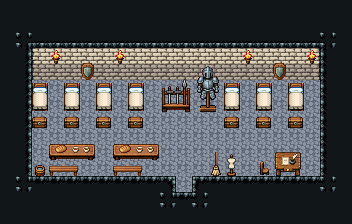

# 성 · 병영

성 경비병이 자고 무장하는 병영. 뒷벽을 따라 침대와 발치 궤짝이 줄지어 있고, 가운데 뒤 무기·갑옷 거치대에서 무장, 앞 왼쪽 식탁에서 먹고, 앞 오른쪽이 부대장 책상과 훈련용 허수아비.

석벽·돌바닥 42, 18×6칸. 침대 324/354 일곱 개와 발치 여행용 궤짝, 가운데 뒤 무기 거치대·갑옷 거치대, 벽 횃불 넷·방패 벽 장식 둘, 침대 사이는 한 칸 통로, 궤짝 앞 줄(y=8)은 비운 복도, 앞 왼쪽 식사 탁자와 그 아래 긴 벤치 두 벌, 앞 오른쪽 필경사 책상·의자·재봉 마네킹(허수아비), 물 양동이·기댄 빗자루. 22×14, tilesetId=tibo_interior_expanded. 입구 (11,11). 통행 검사 목표 [[11,7],[3,6],[5,8],[19,10]].



## 놓은 소품 (저작 순서)
tibo-kit은 tibo_interior_expanded의 structureKits id, tiles는 직접 놓은 번호 행렬, rug는 카펫 오토타일 섬, floor는 바닥 재질 칠. (x,y)는 왼쪽 위.
```json
[
  {
    "kind": "tiles",
    "layer": "upper",
    "x": 2,
    "y": 5,
    "w": 1,
    "h": 2,
    "rows": [
      [
        324
      ],
      [
        354
      ]
    ]
  },
  {
    "kind": "tibo-kit",
    "kitId": "tibo-library-045",
    "name": "여행용 궤짝",
    "x": 2,
    "y": 7,
    "w": 1,
    "h": 1
  },
  {
    "kind": "tiles",
    "layer": "upper",
    "x": 4,
    "y": 5,
    "w": 1,
    "h": 2,
    "rows": [
      [
        324
      ],
      [
        354
      ]
    ]
  },
  {
    "kind": "tibo-kit",
    "kitId": "tibo-library-045",
    "name": "여행용 궤짝",
    "x": 4,
    "y": 7,
    "w": 1,
    "h": 1
  },
  {
    "kind": "tiles",
    "layer": "upper",
    "x": 6,
    "y": 5,
    "w": 1,
    "h": 2,
    "rows": [
      [
        324
      ],
      [
        354
      ]
    ]
  },
  {
    "kind": "tibo-kit",
    "kitId": "tibo-library-045",
    "name": "여행용 궤짝",
    "x": 6,
    "y": 7,
    "w": 1,
    "h": 1
  },
  {
    "kind": "tiles",
    "layer": "upper",
    "x": 8,
    "y": 5,
    "w": 1,
    "h": 2,
    "rows": [
      [
        324
      ],
      [
        354
      ]
    ]
  },
  {
    "kind": "tibo-kit",
    "kitId": "tibo-library-045",
    "name": "여행용 궤짝",
    "x": 8,
    "y": 7,
    "w": 1,
    "h": 1
  },
  {
    "kind": "tiles",
    "layer": "upper",
    "x": 14,
    "y": 5,
    "w": 1,
    "h": 2,
    "rows": [
      [
        324
      ],
      [
        354
      ]
    ]
  },
  {
    "kind": "tibo-kit",
    "kitId": "tibo-library-045",
    "name": "여행용 궤짝",
    "x": 14,
    "y": 7,
    "w": 1,
    "h": 1
  },
  {
    "kind": "tiles",
    "layer": "upper",
    "x": 16,
    "y": 5,
    "w": 1,
    "h": 2,
    "rows": [
      [
        324
      ],
      [
        354
      ]
    ]
  },
  {
    "kind": "tibo-kit",
    "kitId": "tibo-library-045",
    "name": "여행용 궤짝",
    "x": 16,
    "y": 7,
    "w": 1,
    "h": 1
  },
  {
    "kind": "tiles",
    "layer": "upper",
    "x": 18,
    "y": 5,
    "w": 1,
    "h": 2,
    "rows": [
      [
        324
      ],
      [
        354
      ]
    ]
  },
  {
    "kind": "tibo-kit",
    "kitId": "tibo-library-045",
    "name": "여행용 궤짝",
    "x": 18,
    "y": 7,
    "w": 1,
    "h": 1
  },
  {
    "kind": "tibo-kit",
    "kitId": "tibo-fantasy-weapon-rack",
    "name": "무기 거치대",
    "x": 10,
    "y": 4,
    "w": 2,
    "h": 3
  },
  {
    "kind": "tibo-kit",
    "kitId": "tibo-medieval-armor-stand",
    "name": "갑옷 거치대",
    "x": 12,
    "y": 4,
    "w": 2,
    "h": 3
  },
  {
    "kind": "tiles",
    "layer": "upper",
    "x": 3,
    "y": 3,
    "w": 1,
    "h": 1,
    "rows": [
      [
        24
      ]
    ]
  },
  {
    "kind": "tiles",
    "layer": "upper",
    "x": 7,
    "y": 3,
    "w": 1,
    "h": 1,
    "rows": [
      [
        24
      ]
    ]
  },
  {
    "kind": "tiles",
    "layer": "upper",
    "x": 15,
    "y": 3,
    "w": 1,
    "h": 1,
    "rows": [
      [
        24
      ]
    ]
  },
  {
    "kind": "tiles",
    "layer": "upper",
    "x": 19,
    "y": 3,
    "w": 1,
    "h": 1,
    "rows": [
      [
        24
      ]
    ]
  },
  {
    "kind": "tibo-kit",
    "kitId": "tibo-library-221",
    "name": "방패 벽 장식",
    "x": 5,
    "y": 3,
    "w": 1,
    "h": 2
  },
  {
    "kind": "tibo-kit",
    "kitId": "tibo-library-221",
    "name": "방패 벽 장식",
    "x": 17,
    "y": 3,
    "w": 1,
    "h": 2
  },
  {
    "kind": "tibo-kit",
    "kitId": "tibo-v4-4-0",
    "name": "식사 탁자",
    "x": 3,
    "y": 9,
    "w": 3,
    "h": 1
  },
  {
    "kind": "tibo-kit",
    "kitId": "tibo-library-028",
    "name": "긴 벤치",
    "x": 3,
    "y": 10,
    "w": 2,
    "h": 1
  },
  {
    "kind": "tibo-kit",
    "kitId": "tibo-v4-4-0",
    "name": "식사 탁자",
    "x": 7,
    "y": 9,
    "w": 3,
    "h": 1
  },
  {
    "kind": "tibo-kit",
    "kitId": "tibo-library-028",
    "name": "긴 벤치",
    "x": 7,
    "y": 10,
    "w": 2,
    "h": 1
  },
  {
    "kind": "tibo-kit",
    "kitId": "tibo-warm-scribe-desk",
    "name": "필경사 책상",
    "x": 17,
    "y": 9,
    "w": 2,
    "h": 2
  },
  {
    "kind": "tiles",
    "layer": "upper",
    "x": 16,
    "y": 10,
    "w": 1,
    "h": 1,
    "rows": [
      [
        297
      ]
    ]
  },
  {
    "kind": "tibo-kit",
    "kitId": "tibo-library-111",
    "name": "재봉 마네킹",
    "x": 14,
    "y": 9,
    "w": 1,
    "h": 2
  },
  {
    "kind": "tibo-kit",
    "kitId": "tibo-v6-1-1",
    "name": "물 양동이",
    "x": 2,
    "y": 10,
    "w": 1,
    "h": 1
  },
  {
    "kind": "tibo-kit",
    "kitId": "tibo-library-061",
    "name": "기댄 빗자루",
    "x": 13,
    "y": 9,
    "w": 1,
    "h": 2
  }
]
```

전체 두 레이어는 다음 배열 문서가 정답이다.
