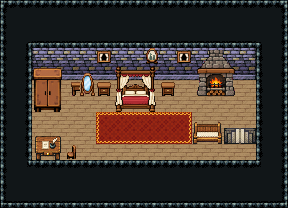

# 성 · 침실

왕족의 침실. 성 1층 계단실의 오르막 계단으로 올라오면 동벽 계단 앞. 가운데 천개 침대 양옆에 협탁, 왼쪽 옷장·화장대(몸단장), 오른쪽 벽난로와 쿠션 의자(휴식), 앞 왼쪽 책상에서 편지를 쓴다.

금벽돌 벽·나무 바닥 72, 14×5칸. 남쪽 문을 닫고 동벽 앞에 내려가는 돌계단 474|475(성 1층 계단실과 짝). 천개 침대 3×3 양옆 협탁, 커튼 창 56 둘·타원 가족 초상화, 침대 앞 붉은 러그, 왼쪽 옷장 2×3·화장대·전신 거울, 오른쪽 장작 벽난로·쿠션 긴 의자, 앞 왼쪽 필경사 책상과 의자. 18×13, tilesetId=tibo_interior_expanded. 입구 (14,7). 통행 검사 목표 [[9,7],[3,7],[13,9]].



## 놓은 소품 (저작 순서)
tibo-kit은 tibo_interior_expanded의 structureKits id, tiles는 직접 놓은 번호 행렬, rug는 카펫 오토타일 섬, floor는 바닥 재질 칠. (x,y)는 왼쪽 위.
```json
[
  {
    "kind": "rug",
    "group": "harness-interior-house-v1-terrain-red-carpet",
    "x": 6,
    "y": 7,
    "w": 6,
    "h": 2,
    "role": "rug"
  },
  {
    "kind": "tibo-kit",
    "kitId": "tibo-medieval-canopy-bed",
    "name": "천개 침대",
    "x": 7,
    "y": 4,
    "w": 3,
    "h": 3,
    "role": "furn"
  },
  {
    "kind": "tibo-kit",
    "kitId": "tibo-library-039",
    "name": "침대 옆 협탁",
    "x": 6,
    "y": 5,
    "w": 1,
    "h": 1,
    "role": "furn"
  },
  {
    "kind": "tibo-kit",
    "kitId": "tibo-library-039",
    "name": "침대 옆 협탁",
    "x": 10,
    "y": 5,
    "w": 1,
    "h": 1,
    "role": "furn"
  },
  {
    "kind": "tibo-kit",
    "kitId": "tibo-fantasy-wardrobe",
    "name": "옷장",
    "x": 2,
    "y": 4,
    "w": 2,
    "h": 3,
    "role": "furn"
  },
  {
    "kind": "tibo-kit",
    "kitId": "tibo-library-040",
    "name": "화장대",
    "x": 4,
    "y": 5,
    "w": 2,
    "h": 1,
    "role": "table"
  },
  {
    "kind": "tibo-kit",
    "kitId": "tibo-library-041",
    "name": "타원 전신 거울",
    "x": 5,
    "y": 4,
    "w": 1,
    "h": 2,
    "role": "furn"
  },
  {
    "kind": "tibo-kit",
    "kitId": "tibo-medieval-stone-fireplace",
    "name": "장작 벽난로",
    "x": 12,
    "y": 3,
    "w": 3,
    "h": 3,
    "role": "furn"
  },
  {
    "kind": "tibo-kit",
    "kitId": "tibo-warm-scribe-desk",
    "name": "필경사 책상",
    "x": 2,
    "y": 8,
    "w": 2,
    "h": 2,
    "role": "table"
  },
  {
    "kind": "tiles",
    "layer": "upper",
    "x": 4,
    "y": 9,
    "w": 1,
    "h": 1,
    "rows": [
      [
        298
      ]
    ],
    "role": "seat"
  },
  {
    "kind": "tibo-kit",
    "kitId": "tibo-warm-bench",
    "name": "쿠션 긴 의자",
    "x": 12,
    "y": 7,
    "w": 2,
    "h": 2,
    "role": "furn"
  },
  {
    "kind": "tiles",
    "layer": "upper",
    "x": 14,
    "y": 8,
    "w": 2,
    "h": 1,
    "rows": [
      [
        474,
        475
      ]
    ],
    "role": "stairs"
  },
  {
    "kind": "tiles",
    "layer": "upper",
    "x": 11,
    "y": 3,
    "w": 1,
    "h": 1,
    "rows": [
      [
        56
      ]
    ],
    "role": "hang"
  },
  {
    "kind": "tiles",
    "layer": "upper",
    "x": 6,
    "y": 3,
    "w": 1,
    "h": 1,
    "rows": [
      [
        56
      ]
    ],
    "role": "hang"
  },
  {
    "kind": "tibo-kit",
    "kitId": "tibo-library-219",
    "name": "타원 가족 초상화",
    "x": 9,
    "y": 3,
    "w": 1,
    "h": 1,
    "role": "hang"
  }
]
```

전체 두 레이어는 다음 배열 문서가 정답이다.
