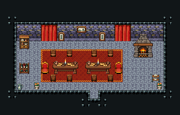

# 성 · 식당

왕과 손님이 식사하는 성의 큰 식당. 붉은 카펫 위 긴 연회 식탁 양 끝에 왕·왕비의 붉은 의자, 벽난로와 식기장, 시종은 오른쪽 음식 운반대로 나른다.

금벽돌 벽·돌바닥 42, 18×6칸. 붉은 카펫 10×4 위에 연회용 긴 식탁 4×2 두 개를 이어 8칸 식탁을 만들고 위쪽은 식탁을 보는 의자 267, 아래쪽은 등을 보인 의자 268 넷씩, 양 끝 붉은 의자 446/476(왕·왕비), 뒷벽에 초상화 둘·풍경화·붉은 커튼 142/143·172/173 두 쌍, 왼쪽 식기장·포도주 선반, 오른쪽 뒤 장작 벽난로, 앞 오른쪽 음식 운반대·왼쪽 물 피처·화분 둘. 식탁 뒤 줄(y=5)도 양 끝으로 돌아 들어갈 수 있다. 22×14, tilesetId=tibo_interior_expanded. 입구 (11,11). 통행 검사 목표 [[10,6],[7,5],[15,8],[4,7]].



## 놓은 소품 (저작 순서)
tibo-kit은 tibo_interior_expanded의 structureKits id, tiles는 직접 놓은 번호 행렬, rug는 카펫 오토타일 섬, floor는 바닥 재질 칠. (x,y)는 왼쪽 위.
```json
[
  {
    "kind": "rug",
    "group": "harness-interior-house-v1-terrain-red-carpet",
    "x": 5,
    "y": 6,
    "w": 10,
    "h": 4
  },
  {
    "kind": "tibo-kit",
    "kitId": "tibo-medieval-banquet-table",
    "name": "연회용 긴 식탁",
    "x": 6,
    "y": 7,
    "w": 4,
    "h": 2
  },
  {
    "kind": "tibo-kit",
    "kitId": "tibo-medieval-banquet-table",
    "name": "연회용 긴 식탁",
    "x": 10,
    "y": 7,
    "w": 4,
    "h": 2
  },
  {
    "kind": "tiles",
    "layer": "upper",
    "x": 6,
    "y": 6,
    "w": 1,
    "h": 1,
    "rows": [
      [
        267
      ]
    ]
  },
  {
    "kind": "tiles",
    "layer": "upper",
    "x": 6,
    "y": 9,
    "w": 1,
    "h": 1,
    "rows": [
      [
        268
      ]
    ]
  },
  {
    "kind": "tiles",
    "layer": "upper",
    "x": 8,
    "y": 6,
    "w": 1,
    "h": 1,
    "rows": [
      [
        267
      ]
    ]
  },
  {
    "kind": "tiles",
    "layer": "upper",
    "x": 8,
    "y": 9,
    "w": 1,
    "h": 1,
    "rows": [
      [
        268
      ]
    ]
  },
  {
    "kind": "tiles",
    "layer": "upper",
    "x": 11,
    "y": 6,
    "w": 1,
    "h": 1,
    "rows": [
      [
        267
      ]
    ]
  },
  {
    "kind": "tiles",
    "layer": "upper",
    "x": 11,
    "y": 9,
    "w": 1,
    "h": 1,
    "rows": [
      [
        268
      ]
    ]
  },
  {
    "kind": "tiles",
    "layer": "upper",
    "x": 13,
    "y": 6,
    "w": 1,
    "h": 1,
    "rows": [
      [
        267
      ]
    ]
  },
  {
    "kind": "tiles",
    "layer": "upper",
    "x": 13,
    "y": 9,
    "w": 1,
    "h": 1,
    "rows": [
      [
        268
      ]
    ]
  },
  {
    "kind": "tiles",
    "layer": "upper",
    "x": 5,
    "y": 7,
    "w": 1,
    "h": 2,
    "rows": [
      [
        446
      ],
      [
        476
      ]
    ]
  },
  {
    "kind": "tiles",
    "layer": "upper",
    "x": 14,
    "y": 7,
    "w": 1,
    "h": 2,
    "rows": [
      [
        446
      ],
      [
        476
      ]
    ]
  },
  {
    "kind": "tibo-kit",
    "kitId": "tibo-medieval-stone-fireplace",
    "name": "장작 벽난로",
    "x": 16,
    "y": 4,
    "w": 3,
    "h": 3
  },
  {
    "kind": "tibo-kit",
    "kitId": "tibo-warm-crockery",
    "name": "따뜻한 목재 식기장",
    "x": 2,
    "y": 4,
    "w": 2,
    "h": 2
  },
  {
    "kind": "tibo-kit",
    "kitId": "tibo-library-134",
    "name": "포도주 병 선반",
    "x": 2,
    "y": 7,
    "w": 2,
    "h": 2
  },
  {
    "kind": "tibo-kit",
    "kitId": "tibo-library-218",
    "name": "초상화",
    "x": 7,
    "y": 3,
    "w": 1,
    "h": 2
  },
  {
    "kind": "tibo-kit",
    "kitId": "tibo-library-218",
    "name": "초상화",
    "x": 12,
    "y": 3,
    "w": 1,
    "h": 2
  },
  {
    "kind": "tibo-kit",
    "kitId": "tibo-library-217",
    "name": "풍경화",
    "x": 9,
    "y": 3,
    "w": 2,
    "h": 1
  },
  {
    "kind": "tiles",
    "layer": "upper",
    "x": 5,
    "y": 3,
    "w": 2,
    "h": 2,
    "rows": [
      [
        142,
        143
      ],
      [
        172,
        173
      ]
    ]
  },
  {
    "kind": "tiles",
    "layer": "upper",
    "x": 14,
    "y": 3,
    "w": 2,
    "h": 2,
    "rows": [
      [
        142,
        143
      ],
      [
        172,
        173
      ]
    ]
  },
  {
    "kind": "tibo-kit",
    "kitId": "tibo-library-031",
    "name": "음식 운반대",
    "x": 18,
    "y": 8,
    "w": 2,
    "h": 2
  },
  {
    "kind": "tibo-kit",
    "kitId": "tibo-library-036",
    "name": "물 피처",
    "x": 2,
    "y": 10,
    "w": 1,
    "h": 1
  },
  {
    "kind": "tiles",
    "layer": "upper",
    "x": 19,
    "y": 10,
    "w": 1,
    "h": 1,
    "rows": [
      [
        288
      ]
    ]
  },
  {
    "kind": "tiles",
    "layer": "upper",
    "x": 4,
    "y": 10,
    "w": 1,
    "h": 1,
    "rows": [
      [
        288
      ]
    ]
  }
]
```

전체 두 레이어는 다음 배열 문서가 정답이다.
