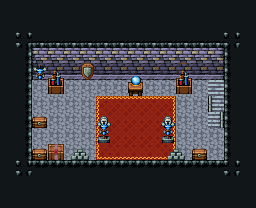

# 성 · 보물고

왕실 보물을 넣어 두는 지하 방. 성 1층 계단실의 내리막 계단으로 내려오면 동벽 계단 앞. 붉은 카펫 끝 수정구 받침이 가장 귀한 보물, 양옆에 전설의 검·방패, 갑옷 전시대가 지키고 벽을 따라 궤짝과 주괴.

금벽돌 벽·돌바닥 42, 12×5칸(작다). 남쪽 문을 닫고 동벽에 오르막 계단 111/141/171(성 1층 계단실과 짝). 뒷벽 가운데 수정구 받침과 방패 벽 장식 둘, 검 진열대 263/293 둘, 벽에 건 갑옷 290, 붉은 카펫 양옆 갑옷 전시대 87/117, 왼쪽 궤짝 둘·봉인 상자·주괴 더미, 오른쪽 궤짝·주괴 더미. 16×13, tilesetId=tibo_interior_expanded. 입구 (13,8). 통행 검사 목표 [[8,6],[3,6],[11,8]].



## 놓은 소품 (저작 순서)
tibo-kit은 tibo_interior_expanded의 structureKits id, tiles는 직접 놓은 번호 행렬, rug는 카펫 오토타일 섬, floor는 바닥 재질 칠. (x,y)는 왼쪽 위.
```json
[
  {
    "kind": "rug",
    "group": "harness-interior-house-v1-terrain-red-carpet",
    "x": 6,
    "y": 6,
    "w": 5,
    "h": 4,
    "role": "rug"
  },
  {
    "kind": "tibo-kit",
    "kitId": "tibo-fantasy-crystal-stand",
    "name": "수정구 받침",
    "x": 8,
    "y": 4,
    "w": 1,
    "h": 2,
    "role": "furn"
  },
  {
    "kind": "tibo-kit",
    "kitId": "tibo-library-221",
    "name": "방패 벽 장식",
    "x": 5,
    "y": 3,
    "w": 1,
    "h": 2,
    "role": "hang"
  },
  {
    "kind": "tibo-kit",
    "kitId": "tibo-library-221",
    "name": "방패 벽 장식",
    "x": 11,
    "y": 3,
    "w": 1,
    "h": 2,
    "role": "hang"
  },
  {
    "kind": "tiles",
    "layer": "upper",
    "x": 3,
    "y": 4,
    "w": 1,
    "h": 2,
    "rows": [
      [
        263
      ],
      [
        293
      ]
    ],
    "role": "furn"
  },
  {
    "kind": "tiles",
    "layer": "upper",
    "x": 11,
    "y": 4,
    "w": 1,
    "h": 2,
    "rows": [
      [
        263
      ],
      [
        293
      ]
    ],
    "role": "furn"
  },
  {
    "kind": "tiles",
    "layer": "upper",
    "x": 2,
    "y": 4,
    "w": 1,
    "h": 1,
    "rows": [
      [
        290
      ]
    ],
    "role": "hang"
  },
  {
    "kind": "tibo-kit",
    "kitId": "tibo-library-045",
    "name": "여행용 궤짝",
    "x": 2,
    "y": 7,
    "w": 1,
    "h": 1,
    "role": "furn"
  },
  {
    "kind": "tibo-kit",
    "kitId": "tibo-library-045",
    "name": "여행용 궤짝",
    "x": 2,
    "y": 9,
    "w": 1,
    "h": 1,
    "role": "furn"
  },
  {
    "kind": "tibo-kit",
    "kitId": "tibo-v10-1-0",
    "name": "봉인 상자",
    "x": 3,
    "y": 9,
    "w": 1,
    "h": 1,
    "role": "furn"
  },
  {
    "kind": "tibo-kit",
    "kitId": "tibo-library-100",
    "name": "금속 주괴 더미",
    "x": 4,
    "y": 9,
    "w": 2,
    "h": 1,
    "role": "furn"
  },
  {
    "kind": "tibo-kit",
    "kitId": "tibo-library-045",
    "name": "여행용 궤짝",
    "x": 12,
    "y": 9,
    "w": 1,
    "h": 1,
    "role": "furn"
  },
  {
    "kind": "tibo-kit",
    "kitId": "tibo-library-100",
    "name": "금속 주괴 더미",
    "x": 10,
    "y": 9,
    "w": 2,
    "h": 1,
    "role": "furn"
  },
  {
    "kind": "tiles",
    "layer": "upper",
    "x": 6,
    "y": 7,
    "w": 1,
    "h": 2,
    "rows": [
      [
        87
      ],
      [
        117
      ]
    ],
    "role": "furn"
  },
  {
    "kind": "tiles",
    "layer": "upper",
    "x": 10,
    "y": 7,
    "w": 1,
    "h": 2,
    "rows": [
      [
        87
      ],
      [
        117
      ]
    ],
    "role": "furn"
  },
  {
    "kind": "tiles",
    "layer": "lower",
    "x": 13,
    "y": 5,
    "w": 1,
    "h": 3,
    "rows": [
      [
        111
      ],
      [
        141
      ],
      [
        171
      ]
    ],
    "role": "stairs"
  }
]
```

전체 두 레이어는 다음 배열 문서가 정답이다.
