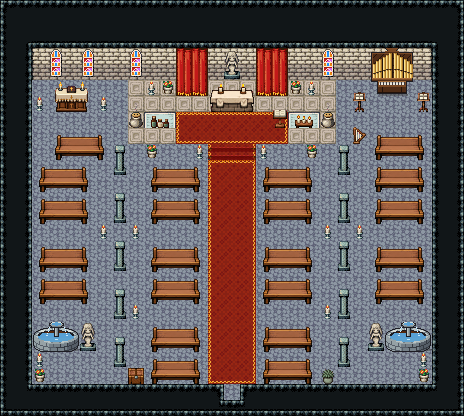

# 대성당 · 신랑과 제단

도시의 대성당. 문으로 들어와 성수반을 지나 붉은 카펫 통로를 걸어 제단 앞 계단에 오르면 사제가 상처를 치유하고, 쓰러진 동료를 되살리며, 모험을 기록(저장)해 준다. 신자는 양쪽 긴 의자에 앉아 기도하고, 옆 통로 북쪽 끝에 성유물 예배소(서)와 오르간 성가대석(동)이 있다.

석벽·돌바닥 42, 25×19칸. 북쪽 무늬 석판 163 제단부(x=8~20, y=5~8) 위 제단 3×2와 뒤 벽 성녀상 88/118·양옆 붉은 대형 커튼 142~203, 제단 앞 무릎 꿇는 붉은 카펫, 촛대·화분·향로 한 쌍씩, 흰 천 탁자 위 약병(치유)·의식 초, 설교 독서대. 뒷벽 긴 스테인드글라스 창 2060/2061 넷. 제단부 앞 붉은 카펫 계단 465|466|467과 양옆 촛대·화분, 문까지 폭3 붉은 카펫, 양쪽 긴 의자 4×2 여섯 줄씩(두 줄씩 붙이고 한 줄 띄움), 기둥 89/119 두 줄(x=7·21)과 통로 촛대. 서쪽 옆 통로: 목조 성유물 제단과 촛대 둘·무릎 꿇는 긴 의자, 옆 긴 의자 넷, 문 곁 돌 성수반 3×2(2044~2049)와 성인상·촛대·화분. 동쪽 옆 통로: 파이프 오르간 3×3(2051~2059)과 악보 받침대 둘·작은 하프·성가대 긴 의자, 옆 긴 의자 넷, 돌 성수반과 성인상. 문 곁 헌금 상자·화분. 29×26, tilesetId=tibo_interior_expanded. 입구 (14,24), 주인·담당 자리 (14,7). 통행 검사 목표 [[14,7],[4,7],[24,7],[8,16],[20,16],[4,19]].



## 놓은 소품 (저작 순서)
tibo-kit은 tibo_interior_expanded의 structureKits id, tiles는 직접 놓은 번호 행렬, rug는 카펫 오토타일 섬, floor는 바닥 재질 칠. (x,y)는 왼쪽 위.
```json
[
  {
    "kind": "floor",
    "tile": 163,
    "x": 8,
    "y": 5,
    "w": 13,
    "h": 4,
    "role": "floor"
  },
  {
    "kind": "tibo-kit",
    "kitId": "tibo-fantasy-altar",
    "name": "제단",
    "x": 13,
    "y": 5,
    "w": 3,
    "h": 2,
    "role": "furn"
  },
  {
    "kind": "tiles",
    "layer": "upper",
    "x": 14,
    "y": 3,
    "w": 1,
    "h": 2,
    "rows": [
      [
        88
      ],
      [
        118
      ]
    ],
    "role": "hang"
  },
  {
    "kind": "tiles",
    "layer": "upper",
    "x": 11,
    "y": 3,
    "w": 2,
    "h": 3,
    "rows": [
      [
        142,
        143
      ],
      [
        172,
        173
      ],
      [
        202,
        203
      ]
    ],
    "role": "furn"
  },
  {
    "kind": "tiles",
    "layer": "upper",
    "x": 16,
    "y": 3,
    "w": 2,
    "h": 3,
    "rows": [
      [
        142,
        143
      ],
      [
        172,
        173
      ],
      [
        202,
        203
      ]
    ],
    "role": "furn"
  },
  {
    "kind": "tiles",
    "layer": "upper",
    "x": 3,
    "y": 3,
    "w": 1,
    "h": 2,
    "rows": [
      [
        2060
      ],
      [
        2061
      ]
    ],
    "role": "hang"
  },
  {
    "kind": "tiles",
    "layer": "upper",
    "x": 5,
    "y": 3,
    "w": 1,
    "h": 2,
    "rows": [
      [
        2060
      ],
      [
        2061
      ]
    ],
    "role": "hang"
  },
  {
    "kind": "tiles",
    "layer": "upper",
    "x": 8,
    "y": 3,
    "w": 1,
    "h": 2,
    "rows": [
      [
        2060
      ],
      [
        2061
      ]
    ],
    "role": "hang"
  },
  {
    "kind": "tiles",
    "layer": "upper",
    "x": 20,
    "y": 3,
    "w": 1,
    "h": 2,
    "rows": [
      [
        2060
      ],
      [
        2061
      ]
    ],
    "role": "hang"
  },
  {
    "kind": "tiles",
    "layer": "upper",
    "x": 9,
    "y": 5,
    "w": 1,
    "h": 1,
    "rows": [
      [
        204
      ]
    ],
    "role": "furn"
  },
  {
    "kind": "tiles",
    "layer": "upper",
    "x": 19,
    "y": 5,
    "w": 1,
    "h": 1,
    "rows": [
      [
        204
      ]
    ],
    "role": "furn"
  },
  {
    "kind": "tiles",
    "layer": "upper",
    "x": 10,
    "y": 5,
    "w": 1,
    "h": 1,
    "rows": [
      [
        288
      ]
    ],
    "role": "furn"
  },
  {
    "kind": "tiles",
    "layer": "upper",
    "x": 18,
    "y": 5,
    "w": 1,
    "h": 1,
    "rows": [
      [
        288
      ]
    ],
    "role": "furn"
  },
  {
    "kind": "tibo-kit",
    "kitId": "tibo-v9-1-3",
    "name": "향로",
    "x": 8,
    "y": 6,
    "w": 1,
    "h": 2,
    "role": "furn"
  },
  {
    "kind": "tibo-kit",
    "kitId": "tibo-v9-1-3",
    "name": "향로",
    "x": 20,
    "y": 6,
    "w": 1,
    "h": 2,
    "role": "furn"
  },
  {
    "kind": "rug",
    "group": "harness-interior-house-v1-terrain-red-carpet",
    "x": 11,
    "y": 7,
    "w": 7,
    "h": 2,
    "role": "rug"
  },
  {
    "kind": "tibo-kit",
    "kitId": "tibo-lectern",
    "name": "독서대",
    "x": 17,
    "y": 6,
    "w": 1,
    "h": 2,
    "role": "furn"
  },
  {
    "kind": "tabletop",
    "group": "harness-interior-house-v1-terrain-white-table",
    "x": 9,
    "y": 7,
    "w": 2,
    "h": 1,
    "role": "tabletop"
  },
  {
    "kind": "tibo-kit",
    "kitId": "tibo-library-148",
    "name": "약병 세 개",
    "x": 9,
    "y": 7,
    "w": 2,
    "h": 1,
    "role": "top"
  },
  {
    "kind": "tabletop",
    "group": "harness-interior-house-v1-terrain-white-table",
    "x": 18,
    "y": 7,
    "w": 2,
    "h": 1,
    "role": "tabletop"
  },
  {
    "kind": "tibo-kit",
    "kitId": "tibo-library-168",
    "name": "의식 초 세 개",
    "x": 18,
    "y": 7,
    "w": 2,
    "h": 1,
    "role": "top"
  },
  {
    "kind": "tiles",
    "layer": "lower",
    "x": 13,
    "y": 9,
    "w": 3,
    "h": 1,
    "rows": [
      [
        465,
        466,
        467
      ]
    ],
    "role": "floor"
  },
  {
    "kind": "rug",
    "group": "harness-interior-house-v1-terrain-red-carpet",
    "x": 13,
    "y": 10,
    "w": 3,
    "h": 14,
    "role": "rug"
  },
  {
    "kind": "tibo-kit",
    "kitId": "tibo-fantasy-pew",
    "name": "긴 의자",
    "x": 9,
    "y": 10,
    "w": 4,
    "h": 2,
    "role": "furn"
  },
  {
    "kind": "tibo-kit",
    "kitId": "tibo-fantasy-pew",
    "name": "긴 의자",
    "x": 16,
    "y": 10,
    "w": 4,
    "h": 2,
    "role": "furn"
  },
  {
    "kind": "tibo-kit",
    "kitId": "tibo-fantasy-pew",
    "name": "긴 의자",
    "x": 9,
    "y": 12,
    "w": 4,
    "h": 2,
    "role": "furn"
  },
  {
    "kind": "tibo-kit",
    "kitId": "tibo-fantasy-pew",
    "name": "긴 의자",
    "x": 16,
    "y": 12,
    "w": 4,
    "h": 2,
    "role": "furn"
  },
  {
    "kind": "tibo-kit",
    "kitId": "tibo-fantasy-pew",
    "name": "긴 의자",
    "x": 9,
    "y": 15,
    "w": 4,
    "h": 2,
    "role": "furn"
  },
  {
    "kind": "tibo-kit",
    "kitId": "tibo-fantasy-pew",
    "name": "긴 의자",
    "x": 16,
    "y": 15,
    "w": 4,
    "h": 2,
    "role": "furn"
  },
  {
    "kind": "tibo-kit",
    "kitId": "tibo-fantasy-pew",
    "name": "긴 의자",
    "x": 9,
    "y": 17,
    "w": 4,
    "h": 2,
    "role": "furn"
  },
  {
    "kind": "tibo-kit",
    "kitId": "tibo-fantasy-pew",
    "name": "긴 의자",
    "x": 16,
    "y": 17,
    "w": 4,
    "h": 2,
    "role": "furn"
  },
  {
    "kind": "tibo-kit",
    "kitId": "tibo-fantasy-pew",
    "name": "긴 의자",
    "x": 9,
    "y": 20,
    "w": 4,
    "h": 2,
    "role": "furn"
  },
  {
    "kind": "tibo-kit",
    "kitId": "tibo-fantasy-pew",
    "name": "긴 의자",
    "x": 16,
    "y": 20,
    "w": 4,
    "h": 2,
    "role": "furn"
  },
  {
    "kind": "tibo-kit",
    "kitId": "tibo-fantasy-pew",
    "name": "긴 의자",
    "x": 9,
    "y": 22,
    "w": 4,
    "h": 2,
    "role": "furn"
  },
  {
    "kind": "tibo-kit",
    "kitId": "tibo-fantasy-pew",
    "name": "긴 의자",
    "x": 16,
    "y": 22,
    "w": 4,
    "h": 2,
    "role": "furn"
  },
  {
    "kind": "tiles",
    "layer": "upper",
    "x": 7,
    "y": 9,
    "w": 1,
    "h": 2,
    "rows": [
      [
        89
      ],
      [
        119
      ]
    ],
    "role": "furn"
  },
  {
    "kind": "tiles",
    "layer": "upper",
    "x": 21,
    "y": 9,
    "w": 1,
    "h": 2,
    "rows": [
      [
        89
      ],
      [
        119
      ]
    ],
    "role": "furn"
  },
  {
    "kind": "tiles",
    "layer": "upper",
    "x": 7,
    "y": 12,
    "w": 1,
    "h": 2,
    "rows": [
      [
        89
      ],
      [
        119
      ]
    ],
    "role": "furn"
  },
  {
    "kind": "tiles",
    "layer": "upper",
    "x": 21,
    "y": 12,
    "w": 1,
    "h": 2,
    "rows": [
      [
        89
      ],
      [
        119
      ]
    ],
    "role": "furn"
  },
  {
    "kind": "tiles",
    "layer": "upper",
    "x": 7,
    "y": 15,
    "w": 1,
    "h": 2,
    "rows": [
      [
        89
      ],
      [
        119
      ]
    ],
    "role": "furn"
  },
  {
    "kind": "tiles",
    "layer": "upper",
    "x": 21,
    "y": 15,
    "w": 1,
    "h": 2,
    "rows": [
      [
        89
      ],
      [
        119
      ]
    ],
    "role": "furn"
  },
  {
    "kind": "tiles",
    "layer": "upper",
    "x": 7,
    "y": 18,
    "w": 1,
    "h": 2,
    "rows": [
      [
        89
      ],
      [
        119
      ]
    ],
    "role": "furn"
  },
  {
    "kind": "tiles",
    "layer": "upper",
    "x": 21,
    "y": 18,
    "w": 1,
    "h": 2,
    "rows": [
      [
        89
      ],
      [
        119
      ]
    ],
    "role": "furn"
  },
  {
    "kind": "tiles",
    "layer": "upper",
    "x": 7,
    "y": 21,
    "w": 1,
    "h": 2,
    "rows": [
      [
        89
      ],
      [
        119
      ]
    ],
    "role": "furn"
  },
  {
    "kind": "tiles",
    "layer": "upper",
    "x": 21,
    "y": 21,
    "w": 1,
    "h": 2,
    "rows": [
      [
        89
      ],
      [
        119
      ]
    ],
    "role": "furn"
  },
  {
    "kind": "tibo-kit",
    "kitId": "tibo-medieval-reliquary",
    "name": "목조 제단",
    "x": 3,
    "y": 5,
    "w": 3,
    "h": 2,
    "role": "furn"
  },
  {
    "kind": "tiles",
    "layer": "upper",
    "x": 2,
    "y": 6,
    "w": 1,
    "h": 1,
    "rows": [
      [
        204
      ]
    ],
    "role": "furn"
  },
  {
    "kind": "tiles",
    "layer": "upper",
    "x": 6,
    "y": 6,
    "w": 1,
    "h": 1,
    "rows": [
      [
        204
      ]
    ],
    "role": "furn"
  },
  {
    "kind": "tibo-kit",
    "kitId": "tibo-fantasy-pew",
    "name": "긴 의자",
    "x": 3,
    "y": 8,
    "w": 4,
    "h": 2,
    "role": "furn"
  },
  {
    "kind": "tibo-kit",
    "kitId": "tibo-fantasy-pew",
    "name": "긴 의자",
    "x": 2,
    "y": 10,
    "w": 4,
    "h": 2,
    "role": "furn"
  },
  {
    "kind": "tibo-kit",
    "kitId": "tibo-fantasy-pew",
    "name": "긴 의자",
    "x": 2,
    "y": 12,
    "w": 4,
    "h": 2,
    "role": "furn"
  },
  {
    "kind": "tibo-kit",
    "kitId": "tibo-fantasy-pew",
    "name": "긴 의자",
    "x": 2,
    "y": 15,
    "w": 4,
    "h": 2,
    "role": "furn"
  },
  {
    "kind": "tibo-kit",
    "kitId": "tibo-fantasy-pew",
    "name": "긴 의자",
    "x": 2,
    "y": 17,
    "w": 4,
    "h": 2,
    "role": "furn"
  },
  {
    "kind": "tiles",
    "layer": "upper",
    "x": 2,
    "y": 20,
    "w": 3,
    "h": 2,
    "rows": [
      [
        2044,
        2045,
        2046
      ],
      [
        2047,
        2048,
        2049
      ]
    ],
    "role": "furn"
  },
  {
    "kind": "tiles",
    "layer": "upper",
    "x": 5,
    "y": 20,
    "w": 1,
    "h": 2,
    "rows": [
      [
        88
      ],
      [
        118
      ]
    ],
    "role": "furn"
  },
  {
    "kind": "tiles",
    "layer": "upper",
    "x": 6,
    "y": 14,
    "w": 1,
    "h": 1,
    "rows": [
      [
        204
      ]
    ],
    "role": "furn"
  },
  {
    "kind": "tiles",
    "layer": "upper",
    "x": 2,
    "y": 22,
    "w": 1,
    "h": 1,
    "rows": [
      [
        204
      ]
    ],
    "role": "furn"
  },
  {
    "kind": "tiles",
    "layer": "upper",
    "x": 2,
    "y": 23,
    "w": 1,
    "h": 1,
    "rows": [
      [
        288
      ]
    ],
    "role": "furn"
  },
  {
    "kind": "tiles",
    "layer": "upper",
    "x": 23,
    "y": 3,
    "w": 3,
    "h": 3,
    "rows": [
      [
        2051,
        2052,
        2053
      ],
      [
        2054,
        2055,
        2056
      ],
      [
        2057,
        2058,
        2059
      ]
    ],
    "role": "furn"
  },
  {
    "kind": "tibo-kit",
    "kitId": "tibo-library-173",
    "name": "악보 받침대",
    "x": 22,
    "y": 5,
    "w": 1,
    "h": 2,
    "role": "furn"
  },
  {
    "kind": "tibo-kit",
    "kitId": "tibo-library-173",
    "name": "악보 받침대",
    "x": 26,
    "y": 5,
    "w": 1,
    "h": 2,
    "role": "furn"
  },
  {
    "kind": "tibo-kit",
    "kitId": "tibo-v12-1-3",
    "name": "작은 하프",
    "x": 22,
    "y": 7,
    "w": 1,
    "h": 2,
    "role": "furn"
  },
  {
    "kind": "tibo-kit",
    "kitId": "tibo-fantasy-pew",
    "name": "긴 의자",
    "x": 23,
    "y": 8,
    "w": 4,
    "h": 2,
    "role": "furn"
  },
  {
    "kind": "tibo-kit",
    "kitId": "tibo-fantasy-pew",
    "name": "긴 의자",
    "x": 23,
    "y": 10,
    "w": 4,
    "h": 2,
    "role": "furn"
  },
  {
    "kind": "tibo-kit",
    "kitId": "tibo-fantasy-pew",
    "name": "긴 의자",
    "x": 23,
    "y": 12,
    "w": 4,
    "h": 2,
    "role": "furn"
  },
  {
    "kind": "tibo-kit",
    "kitId": "tibo-fantasy-pew",
    "name": "긴 의자",
    "x": 23,
    "y": 15,
    "w": 4,
    "h": 2,
    "role": "furn"
  },
  {
    "kind": "tibo-kit",
    "kitId": "tibo-fantasy-pew",
    "name": "긴 의자",
    "x": 23,
    "y": 17,
    "w": 4,
    "h": 2,
    "role": "furn"
  },
  {
    "kind": "tiles",
    "layer": "upper",
    "x": 24,
    "y": 20,
    "w": 3,
    "h": 2,
    "rows": [
      [
        2044,
        2045,
        2046
      ],
      [
        2047,
        2048,
        2049
      ]
    ],
    "role": "furn"
  },
  {
    "kind": "tiles",
    "layer": "upper",
    "x": 23,
    "y": 20,
    "w": 1,
    "h": 2,
    "rows": [
      [
        88
      ],
      [
        118
      ]
    ],
    "role": "furn"
  },
  {
    "kind": "tiles",
    "layer": "upper",
    "x": 22,
    "y": 14,
    "w": 1,
    "h": 1,
    "rows": [
      [
        204
      ]
    ],
    "role": "furn"
  },
  {
    "kind": "tiles",
    "layer": "upper",
    "x": 26,
    "y": 22,
    "w": 1,
    "h": 1,
    "rows": [
      [
        204
      ]
    ],
    "role": "furn"
  },
  {
    "kind": "tiles",
    "layer": "upper",
    "x": 26,
    "y": 23,
    "w": 1,
    "h": 1,
    "rows": [
      [
        288
      ]
    ],
    "role": "furn"
  },
  {
    "kind": "tiles",
    "layer": "upper",
    "x": 12,
    "y": 9,
    "w": 1,
    "h": 1,
    "rows": [
      [
        204
      ]
    ],
    "role": "furn"
  },
  {
    "kind": "tiles",
    "layer": "upper",
    "x": 16,
    "y": 9,
    "w": 1,
    "h": 1,
    "rows": [
      [
        204
      ]
    ],
    "role": "furn"
  },
  {
    "kind": "tiles",
    "layer": "upper",
    "x": 9,
    "y": 9,
    "w": 1,
    "h": 1,
    "rows": [
      [
        288
      ]
    ],
    "role": "furn"
  },
  {
    "kind": "tiles",
    "layer": "upper",
    "x": 19,
    "y": 9,
    "w": 1,
    "h": 1,
    "rows": [
      [
        288
      ]
    ],
    "role": "furn"
  },
  {
    "kind": "tiles",
    "layer": "upper",
    "x": 8,
    "y": 14,
    "w": 1,
    "h": 1,
    "rows": [
      [
        204
      ]
    ],
    "role": "furn"
  },
  {
    "kind": "tiles",
    "layer": "upper",
    "x": 20,
    "y": 14,
    "w": 1,
    "h": 1,
    "rows": [
      [
        204
      ]
    ],
    "role": "furn"
  },
  {
    "kind": "tiles",
    "layer": "upper",
    "x": 8,
    "y": 19,
    "w": 1,
    "h": 1,
    "rows": [
      [
        204
      ]
    ],
    "role": "furn"
  },
  {
    "kind": "tiles",
    "layer": "upper",
    "x": 20,
    "y": 19,
    "w": 1,
    "h": 1,
    "rows": [
      [
        204
      ]
    ],
    "role": "furn"
  },
  {
    "kind": "tibo-kit",
    "kitId": "tibo-v6-2-2",
    "name": "걸쇠 상자",
    "x": 8,
    "y": 23,
    "w": 1,
    "h": 1,
    "role": "furn"
  },
  {
    "kind": "tibo-kit",
    "kitId": "tibo-library-215",
    "name": "둥근 관목 화분",
    "x": 20,
    "y": 23,
    "w": 1,
    "h": 1,
    "role": "furn"
  }
]
```

전체 두 레이어는 다음 배열 문서가 정답이다.
