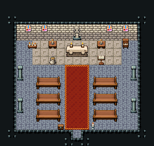

# 교회 · 예배당

사제가 예배를 올리고 마을 사람이 앉아 기도하는 곳. 교구마을 「교회 언덕」의 석벽 교회(스테인드글라스 두 장, 가운데 문)와 짝을 이룬다.

석벽·회색 돌바닥 42. 앞쪽(북쪽) 제단부를 아이보리 대리석 오토타일로 깔고 제단 3×2 뒤 벽에 성녀 석상 88/118, 벽에 스테인드글라스 144 넷, 양옆 촛대 탁자·향로·독서대(설교대)·작은 오르간(업라이트 피아노)·의식 초. 문에서 제단까지 폭3 붉은 카펫, 좌우로 긴 의자 4×2 세 줄씩, 옆 통로에 기둥 89/119, 문 옆 헌금함(자물쇠 금고함)과 촛대. 19×18, tilesetId=tibo_interior_expanded. 입구 (9,16), 주인·담당 자리 (9,7). 통행 검사 목표 [[9,7],[3,9],[15,14]].



## 놓은 소품 (저작 순서)
tibo-kit은 tibo_interior_expanded의 structureKits id, tiles는 직접 놓은 번호 행렬, rug는 카펫 오토타일 섬, floor는 바닥 재질 칠. (x,y)는 왼쪽 위.
```json
[
  {
    "kind": "floor",
    "tile": 163,
    "x": 4,
    "y": 5,
    "w": 11,
    "h": 3
  },
  {
    "kind": "rug",
    "group": "harness-interior-house-v1-terrain-red-carpet",
    "x": 8,
    "y": 8,
    "w": 3,
    "h": 8
  },
  {
    "kind": "tibo-kit",
    "kitId": "tibo-fantasy-altar",
    "name": "제단",
    "x": 8,
    "y": 5,
    "w": 3,
    "h": 2
  },
  {
    "kind": "tiles",
    "layer": "upper",
    "x": 9,
    "y": 3,
    "w": 1,
    "h": 2,
    "rows": [
      [
        88
      ],
      [
        118
      ]
    ]
  },
  {
    "kind": "tiles",
    "layer": "upper",
    "x": 3,
    "y": 3,
    "w": 1,
    "h": 1,
    "rows": [
      [
        144
      ]
    ]
  },
  {
    "kind": "tiles",
    "layer": "upper",
    "x": 5,
    "y": 3,
    "w": 1,
    "h": 1,
    "rows": [
      [
        144
      ]
    ]
  },
  {
    "kind": "tiles",
    "layer": "upper",
    "x": 13,
    "y": 3,
    "w": 1,
    "h": 1,
    "rows": [
      [
        144
      ]
    ]
  },
  {
    "kind": "tiles",
    "layer": "upper",
    "x": 15,
    "y": 3,
    "w": 1,
    "h": 1,
    "rows": [
      [
        144
      ]
    ]
  },
  {
    "kind": "tibo-kit",
    "kitId": "tibo-v4-5-2",
    "name": "촛대 탁자",
    "x": 6,
    "y": 4,
    "w": 1,
    "h": 2
  },
  {
    "kind": "tibo-kit",
    "kitId": "tibo-v4-5-2",
    "name": "촛대 탁자",
    "x": 12,
    "y": 4,
    "w": 1,
    "h": 2
  },
  {
    "kind": "tibo-kit",
    "kitId": "tibo-lectern",
    "name": "독서대",
    "x": 12,
    "y": 6,
    "w": 1,
    "h": 2
  },
  {
    "kind": "tibo-kit",
    "kitId": "tibo-v9-1-3",
    "name": "향로",
    "x": 6,
    "y": 6,
    "w": 1,
    "h": 2
  },
  {
    "kind": "tibo-kit",
    "kitId": "tibo-library-169",
    "name": "작은 업라이트 피아노",
    "x": 15,
    "y": 4,
    "w": 1,
    "h": 2
  },
  {
    "kind": "tibo-kit",
    "kitId": "tibo-library-168",
    "name": "의식 초 세 개",
    "x": 3,
    "y": 5,
    "w": 2,
    "h": 1
  },
  {
    "kind": "tibo-kit",
    "kitId": "tibo-fantasy-pew",
    "name": "긴 의자",
    "x": 4,
    "y": 9,
    "w": 4,
    "h": 2
  },
  {
    "kind": "tibo-kit",
    "kitId": "tibo-fantasy-pew",
    "name": "긴 의자",
    "x": 11,
    "y": 9,
    "w": 4,
    "h": 2
  },
  {
    "kind": "tibo-kit",
    "kitId": "tibo-fantasy-pew",
    "name": "긴 의자",
    "x": 4,
    "y": 11,
    "w": 4,
    "h": 2
  },
  {
    "kind": "tibo-kit",
    "kitId": "tibo-fantasy-pew",
    "name": "긴 의자",
    "x": 11,
    "y": 11,
    "w": 4,
    "h": 2
  },
  {
    "kind": "tibo-kit",
    "kitId": "tibo-fantasy-pew",
    "name": "긴 의자",
    "x": 4,
    "y": 13,
    "w": 4,
    "h": 2
  },
  {
    "kind": "tibo-kit",
    "kitId": "tibo-fantasy-pew",
    "name": "긴 의자",
    "x": 11,
    "y": 13,
    "w": 4,
    "h": 2
  },
  {
    "kind": "tiles",
    "layer": "upper",
    "x": 2,
    "y": 8,
    "w": 1,
    "h": 2,
    "rows": [
      [
        89
      ],
      [
        119
      ]
    ]
  },
  {
    "kind": "tiles",
    "layer": "upper",
    "x": 16,
    "y": 8,
    "w": 1,
    "h": 2,
    "rows": [
      [
        89
      ],
      [
        119
      ]
    ]
  },
  {
    "kind": "tiles",
    "layer": "upper",
    "x": 2,
    "y": 12,
    "w": 1,
    "h": 2,
    "rows": [
      [
        89
      ],
      [
        119
      ]
    ]
  },
  {
    "kind": "tiles",
    "layer": "upper",
    "x": 16,
    "y": 12,
    "w": 1,
    "h": 2,
    "rows": [
      [
        89
      ],
      [
        119
      ]
    ]
  },
  {
    "kind": "tibo-kit",
    "kitId": "tibo-library-238",
    "name": "자물쇠 금고함",
    "x": 7,
    "y": 15,
    "w": 1,
    "h": 1
  },
  {
    "kind": "tiles",
    "layer": "upper",
    "x": 11,
    "y": 15,
    "w": 1,
    "h": 1,
    "rows": [
      [
        204
      ]
    ]
  }
]
```

전체 두 레이어는 다음 배열 문서가 정답이다.
