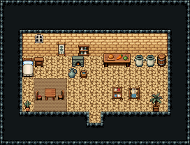

# 사막 · 흙벽돌 민가

사막 마을 사람이 사는 한 칸 집. 서늘한 사암 벽 안에서 왼쪽 침대에서 자고, 뒷벽 작은 화덕과 조리대에서 밥하고, 짚 돗자리 위 식탁에서 먹고, 오른쪽 베틀로 천을 짠다. 물은 항아리·옹기에 받아 둔다.

사암 벽 1986~1991·사암 바닥 1999, 13×5칸. 왼쪽 침대 324/354·협탁·창 54, 뒷벽 직조 벽걸이, 작은 빵 화덕과 향신료 선반, 화덕 앞 물 항아리·물 양동이, 조리대, 저장 옹기 둘·뚜껑 통(물·곡식), 짚 돗자리 108~170 위 정사각 식탁과 의자 둘, 오른쪽 베틀·실패 걸이, 문 옆 실내 야자, 구석 선인장 화분. 17×13, tilesetId=tibo_interior_expanded. 입구 (8,10). 통행 검사 목표 [[4,9],[8,6],[12,9],[2,7]].



## 놓은 소품 (저작 순서)
tibo-kit은 tibo_interior_expanded의 structureKits id, tiles는 직접 놓은 번호 행렬, rug는 카펫 오토타일 섬, floor는 바닥 재질 칠. (x,y)는 왼쪽 위.
```json
[
  {
    "kind": "tiles",
    "layer": "upper",
    "x": 2,
    "y": 5,
    "w": 1,
    "h": 2,
    "rows": [
      [
        324
      ],
      [
        354
      ]
    ],
    "role": "furn"
  },
  {
    "kind": "tibo-kit",
    "kitId": "tibo-library-039",
    "name": "침대 옆 협탁",
    "x": 3,
    "y": 5,
    "w": 1,
    "h": 1,
    "role": "furn"
  },
  {
    "kind": "tiles",
    "layer": "upper",
    "x": 3,
    "y": 3,
    "w": 1,
    "h": 1,
    "rows": [
      [
        54
      ]
    ],
    "role": "hang"
  },
  {
    "kind": "tibo-kit",
    "kitId": "tibo-library-220",
    "name": "직조 벽걸이",
    "x": 5,
    "y": 3,
    "w": 1,
    "h": 2,
    "role": "hang"
  },
  {
    "kind": "tibo-kit",
    "kitId": "tibo-bread-oven",
    "name": "작은 빵 화덕",
    "x": 6,
    "y": 5,
    "w": 2,
    "h": 1,
    "role": "furn"
  },
  {
    "kind": "tibo-kit",
    "kitId": "tibo-library-011",
    "name": "향신료 선반",
    "x": 7,
    "y": 4,
    "w": 1,
    "h": 1,
    "role": "hang"
  },
  {
    "kind": "tibo-kit",
    "kitId": "tibo-library-055",
    "name": "목욕 물 항아리",
    "x": 6,
    "y": 6,
    "w": 1,
    "h": 1,
    "role": "furn"
  },
  {
    "kind": "tibo-kit",
    "kitId": "tibo-v6-1-1",
    "name": "물 양동이",
    "x": 7,
    "y": 6,
    "w": 1,
    "h": 1,
    "role": "furn"
  },
  {
    "kind": "tibo-kit",
    "kitId": "tibo-fantasy-prep-table",
    "name": "조리대",
    "x": 9,
    "y": 4,
    "w": 3,
    "h": 2,
    "role": "table"
  },
  {
    "kind": "tibo-kit",
    "kitId": "tibo-library-234",
    "name": "저장 옹기",
    "x": 12,
    "y": 4,
    "w": 1,
    "h": 2,
    "role": "furn"
  },
  {
    "kind": "tibo-kit",
    "kitId": "tibo-library-234",
    "name": "저장 옹기",
    "x": 13,
    "y": 4,
    "w": 1,
    "h": 2,
    "role": "furn"
  },
  {
    "kind": "tibo-kit",
    "kitId": "tibo-library-229",
    "name": "뚜껑 둥근 통",
    "x": 14,
    "y": 4,
    "w": 1,
    "h": 2,
    "role": "furn"
  },
  {
    "kind": "rug",
    "tiles": 139,
    "x": 3,
    "y": 7,
    "w": 3,
    "h": 3,
    "role": "rug"
  },
  {
    "kind": "tibo-kit",
    "kitId": "tibo-library-026",
    "name": "정사각 식탁",
    "x": 4,
    "y": 7,
    "w": 1,
    "h": 2,
    "role": "table"
  },
  {
    "kind": "tibo-kit",
    "kitId": "tibo-v7-1-2",
    "name": "붉은 방석 의자",
    "x": 3,
    "y": 8,
    "w": 1,
    "h": 1,
    "role": "seat"
  },
  {
    "kind": "tiles",
    "layer": "upper",
    "x": 5,
    "y": 8,
    "w": 1,
    "h": 1,
    "rows": [
      [
        298
      ]
    ],
    "role": "seat"
  },
  {
    "kind": "tibo-kit",
    "kitId": "tibo-loom",
    "name": "작은 베틀",
    "x": 11,
    "y": 7,
    "w": 2,
    "h": 2,
    "role": "furn"
  },
  {
    "kind": "tibo-kit",
    "kitId": "tibo-thread-rack",
    "name": "실패 걸이",
    "x": 10,
    "y": 7,
    "w": 1,
    "h": 2,
    "role": "furn"
  },
  {
    "kind": "tibo-kit",
    "kitId": "tibo-library-209",
    "name": "키 큰 실내 야자",
    "x": 13,
    "y": 8,
    "w": 2,
    "h": 2,
    "role": "furn"
  },
  {
    "kind": "tibo-kit",
    "kitId": "tibo-library-206",
    "name": "선인장 화분",
    "x": 2,
    "y": 9,
    "w": 1,
    "h": 1,
    "role": "furn"
  }
]
```

전체 두 레이어는 다음 배열 문서가 정답이다.
