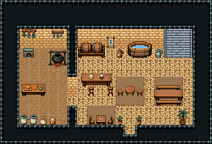

# 사막 · 오아시스 여관 주점

오아시스 곁 사막 여관의 1층. 대상(隊商)이 문으로 들어와 바에서 물과 술을 받고, 짚 돗자리 위 식탁에서 쉬며, 뒷벽 물통에서 물을 긷는다. 왼쪽 흙바닥 주방에서 요리하고 동쪽 계단으로 2층 객실에 오른다.

사암 벽·사암 바닥 1999, 주방 5×8(흙바닥 192)과 홀 12×8을 칸막이로 나눴다(문 (7,10)). 주방: 작은 빵 화덕·불 피운 솥 걸이·말린 약초 걸이·국자 걸이·조리대·저장 옹기 둘·밀가루 포대·꿀 항아리. 홀: 뒷벽 술통 선반과 바 카운터·높은 걸상 둘(주인 자리 (9,6)), 직조 벽걸이·술 항아리·뒷벽 물통 3×2와 물 항아리, 동쪽 3칸 폭 돌계단 141|111|171(x=17~19, 첫 바닥 줄 y=5에서 벽면 두 줄을 타고 오름), 짚 돗자리 셋 위 원형 식탁과 걸상 둘·긴 식탁과 벤치·사과 접시 탁자와 의자 둘, 문 양옆 선인장 화분과 앞 오른쪽 야자. 22×15, tilesetId=tibo_interior_expanded. 입구 (13,13), 주인·담당 자리 (9,6). 통행 검사 목표 [[9,6],[18,6],[4,7],[13,11],[15,9]].



## 놓은 소품 (저작 순서)
tibo-kit은 tibo_interior_expanded의 structureKits id, tiles는 직접 놓은 번호 행렬, rug는 카펫 오토타일 섬, floor는 바닥 재질 칠. (x,y)는 왼쪽 위.
```json
[
  {
    "kind": "tibo-kit",
    "kitId": "tibo-bread-oven",
    "name": "작은 빵 화덕",
    "x": 2,
    "y": 5,
    "w": 2,
    "h": 1,
    "role": "furn"
  },
  {
    "kind": "tibo-kit",
    "kitId": "tibo-fantasy-hanging-pot",
    "name": "솥 걸이",
    "x": 5,
    "y": 5,
    "w": 2,
    "h": 2,
    "role": "furn"
  },
  {
    "kind": "tibo-kit",
    "kitId": "tibo-hanging-herbs",
    "name": "말린 약초 걸이",
    "x": 2,
    "y": 3,
    "w": 2,
    "h": 1,
    "role": "hang"
  },
  {
    "kind": "tibo-kit",
    "kitId": "tibo-library-012",
    "name": "국자 걸이",
    "x": 5,
    "y": 3,
    "w": 2,
    "h": 1,
    "role": "hang"
  },
  {
    "kind": "tibo-kit",
    "kitId": "tibo-fantasy-prep-table",
    "name": "조리대",
    "x": 2,
    "y": 8,
    "w": 3,
    "h": 2,
    "role": "table"
  },
  {
    "kind": "tibo-kit",
    "kitId": "tibo-library-234",
    "name": "저장 옹기",
    "x": 2,
    "y": 11,
    "w": 1,
    "h": 2,
    "role": "furn"
  },
  {
    "kind": "tibo-kit",
    "kitId": "tibo-library-234",
    "name": "저장 옹기",
    "x": 3,
    "y": 11,
    "w": 1,
    "h": 2,
    "role": "furn"
  },
  {
    "kind": "tibo-kit",
    "kitId": "tibo-library-013",
    "name": "밀가루 포대",
    "x": 4,
    "y": 12,
    "w": 1,
    "h": 1,
    "role": "furn"
  },
  {
    "kind": "tibo-kit",
    "kitId": "tibo-library-024",
    "name": "꿀 항아리",
    "x": 5,
    "y": 12,
    "w": 1,
    "h": 1,
    "role": "furn"
  },
  {
    "kind": "tibo-kit",
    "kitId": "tibo-fantasy-ale-rack",
    "name": "술통 선반",
    "x": 8,
    "y": 4,
    "w": 3,
    "h": 2,
    "role": "furn"
  },
  {
    "kind": "tibo-kit",
    "kitId": "tibo-fantasy-bar-counter",
    "name": "바 카운터",
    "x": 8,
    "y": 7,
    "w": 4,
    "h": 2,
    "role": "table"
  },
  {
    "kind": "tibo-kit",
    "kitId": "tibo-library-029",
    "name": "높은 걸상",
    "x": 9,
    "y": 9,
    "w": 1,
    "h": 1,
    "role": "seat"
  },
  {
    "kind": "tibo-kit",
    "kitId": "tibo-library-029",
    "name": "높은 걸상",
    "x": 11,
    "y": 9,
    "w": 1,
    "h": 1,
    "role": "seat"
  },
  {
    "kind": "tibo-kit",
    "kitId": "tibo-library-220",
    "name": "직조 벽걸이",
    "x": 11,
    "y": 3,
    "w": 1,
    "h": 2,
    "role": "hang"
  },
  {
    "kind": "tibo-kit",
    "kitId": "tibo-fantasy-water-tub",
    "name": "물통",
    "x": 13,
    "y": 4,
    "w": 3,
    "h": 2,
    "role": "furn"
  },
  {
    "kind": "tibo-kit",
    "kitId": "tibo-library-137",
    "name": "술 항아리",
    "x": 12,
    "y": 5,
    "w": 1,
    "h": 1,
    "role": "furn"
  },
  {
    "kind": "tibo-kit",
    "kitId": "tibo-library-055",
    "name": "목욕 물 항아리",
    "x": 16,
    "y": 5,
    "w": 1,
    "h": 1,
    "role": "furn"
  },
  {
    "kind": "tiles",
    "layer": "lower",
    "x": 17,
    "y": 3,
    "w": 3,
    "h": 3,
    "rows": [
      [
        141,
        111,
        171
      ],
      [
        141,
        111,
        171
      ],
      [
        141,
        111,
        171
      ]
    ],
    "role": "stairs"
  },
  {
    "kind": "rug",
    "tiles": 139,
    "x": 12,
    "y": 8,
    "w": 3,
    "h": 3,
    "role": "rug"
  },
  {
    "kind": "tibo-kit",
    "kitId": "tibo-library-025",
    "name": "원형 식탁",
    "x": 13,
    "y": 8,
    "w": 1,
    "h": 2,
    "role": "table"
  },
  {
    "kind": "tibo-kit",
    "kitId": "tibo-library-030",
    "name": "낮은 걸상",
    "x": 12,
    "y": 9,
    "w": 1,
    "h": 1,
    "role": "seat"
  },
  {
    "kind": "tibo-kit",
    "kitId": "tibo-library-030",
    "name": "낮은 걸상",
    "x": 14,
    "y": 9,
    "w": 1,
    "h": 1,
    "role": "seat"
  },
  {
    "kind": "rug",
    "tiles": 139,
    "x": 16,
    "y": 8,
    "w": 3,
    "h": 3,
    "role": "rug"
  },
  {
    "kind": "tibo-kit",
    "kitId": "tibo-fantasy-dining-set",
    "name": "긴 식탁과 벤치",
    "x": 16,
    "y": 8,
    "w": 3,
    "h": 3,
    "role": "table"
  },
  {
    "kind": "rug",
    "tiles": 139,
    "x": 9,
    "y": 11,
    "w": 3,
    "h": 2,
    "role": "rug"
  },
  {
    "kind": "tibo-kit",
    "kitId": "tibo-v7-3-3",
    "name": "사과 접시 탁자",
    "x": 10,
    "y": 12,
    "w": 1,
    "h": 1,
    "role": "table"
  },
  {
    "kind": "tiles",
    "layer": "upper",
    "x": 9,
    "y": 12,
    "w": 1,
    "h": 1,
    "rows": [
      [
        297
      ]
    ],
    "role": "seat"
  },
  {
    "kind": "tiles",
    "layer": "upper",
    "x": 11,
    "y": 12,
    "w": 1,
    "h": 1,
    "rows": [
      [
        298
      ]
    ],
    "role": "seat"
  },
  {
    "kind": "tibo-kit",
    "kitId": "tibo-library-209",
    "name": "키 큰 실내 야자",
    "x": 18,
    "y": 11,
    "w": 2,
    "h": 2,
    "role": "furn"
  },
  {
    "kind": "tibo-kit",
    "kitId": "tibo-library-206",
    "name": "선인장 화분",
    "x": 14,
    "y": 12,
    "w": 1,
    "h": 1,
    "role": "furn"
  },
  {
    "kind": "tibo-kit",
    "kitId": "tibo-library-206",
    "name": "선인장 화분",
    "x": 12,
    "y": 12,
    "w": 1,
    "h": 1,
    "role": "furn"
  }
]
```

전체 두 레이어는 다음 배열 문서가 정답이다.
