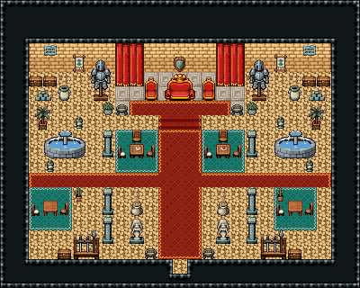

# 사막 궁전 · 왕좌의 방

사막 왕국 술탄의 왕좌의 방. 문 양옆 경비 초소를 지나 붉은 카펫을 따라 올라가면 무늬 석판 단 위 큰 왕좌 — 알현하러 온 사절은 통로 양옆 청록 깔개의 찻상에 방석을 깔고 앉아 차례를 기다리고, 좌우 돌 분수가 뜨거운 공기를 식힌다.

사암 벽 1986~1991·사암 바닥 1999, 21×13칸. 북쪽 무늬 석판 163 단(x=8~16, y=5~7) 위 대형 왕좌 447~479와 붉은 의자 446/476 둘, 단 앞줄 붉은 카펫, 양옆 붉은 대형 커튼 142~203, 뒷벽 방패 장식·직조 벽걸이 둘(깃발)·격자 창 174 둘, 단 모서리 화로 둘·화분 둘, 갑옷 거치대 둘(근위병 자리). 붉은 카펫 계단 465|466|467, 문까지 폭3 붉은 카펫과 두 분수 사이를 가로지르는 띠(한 섬으로 성형), 기둥 89/119 두 줄 셋씩, 양옆 돌 분수 3×2(2044~2049)와 바닥 등불. 통로 양옆 청록 깔개 위 찻상(찻잔·사과 접시)과 방석·의자, 벽 곁 청록 깔개 위 정사각 식탁과 방석·의자, 단 곁 보물 구석(궤짝 둘·금속 주괴·저장 옹기·실내 야자), 통로 향로 둘·성인상 둘, 문 곁 무기 거치대와 궤짝·화로. 25×20, tilesetId=tibo_interior_expanded. 입구 (12,18), 주인·담당 자리 (12,7). 통행 검사 목표 [[12,7],[9,8],[5,11],[19,11],[12,15],[3,16]].



## 놓은 소품 (저작 순서)
tibo-kit은 tibo_interior_expanded의 structureKits id, tiles는 직접 놓은 번호 행렬, rug는 카펫 오토타일 섬, floor는 바닥 재질 칠. (x,y)는 왼쪽 위.
```json
[
  {
    "kind": "floor",
    "tile": 163,
    "x": 8,
    "y": 5,
    "w": 9,
    "h": 3,
    "role": "floor"
  },
  {
    "kind": "tiles",
    "layer": "upper",
    "x": 11,
    "y": 5,
    "w": 3,
    "h": 2,
    "rows": [
      [
        447,
        448,
        449
      ],
      [
        477,
        478,
        479
      ]
    ],
    "role": "furn"
  },
  {
    "kind": "tiles",
    "layer": "upper",
    "x": 10,
    "y": 5,
    "w": 1,
    "h": 2,
    "rows": [
      [
        446
      ],
      [
        476
      ]
    ],
    "role": "furn"
  },
  {
    "kind": "tiles",
    "layer": "upper",
    "x": 14,
    "y": 5,
    "w": 1,
    "h": 2,
    "rows": [
      [
        446
      ],
      [
        476
      ]
    ],
    "role": "furn"
  },
  {
    "kind": "tiles",
    "layer": "upper",
    "x": 8,
    "y": 3,
    "w": 2,
    "h": 3,
    "rows": [
      [
        142,
        143
      ],
      [
        172,
        173
      ],
      [
        202,
        203
      ]
    ],
    "role": "furn"
  },
  {
    "kind": "tiles",
    "layer": "upper",
    "x": 15,
    "y": 3,
    "w": 2,
    "h": 3,
    "rows": [
      [
        142,
        143
      ],
      [
        172,
        173
      ],
      [
        202,
        203
      ]
    ],
    "role": "furn"
  },
  {
    "kind": "tibo-kit",
    "kitId": "tibo-library-221",
    "name": "방패 벽 장식",
    "x": 12,
    "y": 3,
    "w": 1,
    "h": 2,
    "role": "hang"
  },
  {
    "kind": "tibo-kit",
    "kitId": "tibo-library-220",
    "name": "직조 벽걸이",
    "x": 5,
    "y": 3,
    "w": 1,
    "h": 2,
    "role": "hang"
  },
  {
    "kind": "tibo-kit",
    "kitId": "tibo-library-220",
    "name": "직조 벽걸이",
    "x": 19,
    "y": 3,
    "w": 1,
    "h": 2,
    "role": "hang"
  },
  {
    "kind": "tiles",
    "layer": "upper",
    "x": 3,
    "y": 3,
    "w": 1,
    "h": 1,
    "rows": [
      [
        174
      ]
    ],
    "role": "hang"
  },
  {
    "kind": "tiles",
    "layer": "upper",
    "x": 21,
    "y": 3,
    "w": 1,
    "h": 1,
    "rows": [
      [
        174
      ]
    ],
    "role": "hang"
  },
  {
    "kind": "tibo-kit",
    "kitId": "tibo-brazier",
    "name": "화로",
    "x": 8,
    "y": 7,
    "w": 1,
    "h": 1,
    "role": "furn"
  },
  {
    "kind": "tibo-kit",
    "kitId": "tibo-brazier",
    "name": "화로",
    "x": 16,
    "y": 7,
    "w": 1,
    "h": 1,
    "role": "furn"
  },
  {
    "kind": "tibo-kit",
    "kitId": "tibo-medieval-armor-stand",
    "name": "갑옷 거치대",
    "x": 6,
    "y": 4,
    "w": 2,
    "h": 3,
    "role": "furn"
  },
  {
    "kind": "tibo-kit",
    "kitId": "tibo-medieval-armor-stand",
    "name": "갑옷 거치대",
    "x": 17,
    "y": 4,
    "w": 2,
    "h": 3,
    "role": "furn"
  },
  {
    "kind": "tiles",
    "layer": "lower",
    "x": 11,
    "y": 8,
    "w": 3,
    "h": 1,
    "rows": [
      [
        465,
        466,
        467
      ]
    ],
    "role": "floor"
  },
  {
    "kind": "rug",
    "group": "harness-interior-house-v1-terrain-red-carpet",
    "x": 11,
    "y": 9,
    "w": 3,
    "h": 9,
    "role": "rug"
  },
  {
    "kind": "rug",
    "group": "harness-interior-house-v1-terrain-red-carpet",
    "x": 2,
    "y": 12,
    "w": 21,
    "h": 1,
    "role": "rug"
  },
  {
    "kind": "rug",
    "group": "harness-interior-house-v1-terrain-red-carpet",
    "x": 9,
    "y": 7,
    "w": 7,
    "h": 1,
    "role": "rug"
  },
  {
    "kind": "tiles",
    "layer": "upper",
    "x": 7,
    "y": 9,
    "w": 1,
    "h": 2,
    "rows": [
      [
        89
      ],
      [
        119
      ]
    ],
    "role": "furn"
  },
  {
    "kind": "tiles",
    "layer": "upper",
    "x": 17,
    "y": 9,
    "w": 1,
    "h": 2,
    "rows": [
      [
        89
      ],
      [
        119
      ]
    ],
    "role": "furn"
  },
  {
    "kind": "tiles",
    "layer": "upper",
    "x": 7,
    "y": 13,
    "w": 1,
    "h": 2,
    "rows": [
      [
        89
      ],
      [
        119
      ]
    ],
    "role": "furn"
  },
  {
    "kind": "tiles",
    "layer": "upper",
    "x": 17,
    "y": 13,
    "w": 1,
    "h": 2,
    "rows": [
      [
        89
      ],
      [
        119
      ]
    ],
    "role": "furn"
  },
  {
    "kind": "tiles",
    "layer": "upper",
    "x": 7,
    "y": 15,
    "w": 1,
    "h": 2,
    "rows": [
      [
        89
      ],
      [
        119
      ]
    ],
    "role": "furn"
  },
  {
    "kind": "tiles",
    "layer": "upper",
    "x": 17,
    "y": 15,
    "w": 1,
    "h": 2,
    "rows": [
      [
        89
      ],
      [
        119
      ]
    ],
    "role": "furn"
  },
  {
    "kind": "tiles",
    "layer": "upper",
    "x": 3,
    "y": 9,
    "w": 3,
    "h": 2,
    "rows": [
      [
        2044,
        2045,
        2046
      ],
      [
        2047,
        2048,
        2049
      ]
    ],
    "role": "furn"
  },
  {
    "kind": "tiles",
    "layer": "upper",
    "x": 19,
    "y": 9,
    "w": 3,
    "h": 2,
    "rows": [
      [
        2044,
        2045,
        2046
      ],
      [
        2047,
        2048,
        2049
      ]
    ],
    "role": "furn"
  },
  {
    "kind": "rug",
    "group": "harness-interior-house-v1-terrain-teal-carpet",
    "x": 8,
    "y": 9,
    "w": 3,
    "h": 3,
    "role": "rug"
  },
  {
    "kind": "tibo-kit",
    "kitId": "tibo-v7-1-3",
    "name": "찻잔 탁자",
    "x": 9,
    "y": 10,
    "w": 1,
    "h": 1,
    "role": "table"
  },
  {
    "kind": "tibo-kit",
    "kitId": "tibo-v3-3-1",
    "name": "방석 의자",
    "x": 8,
    "y": 10,
    "w": 1,
    "h": 1,
    "role": "seat"
  },
  {
    "kind": "tiles",
    "layer": "upper",
    "x": 10,
    "y": 10,
    "w": 1,
    "h": 1,
    "rows": [
      [
        298
      ]
    ],
    "role": "seat"
  },
  {
    "kind": "tiles",
    "layer": "upper",
    "x": 9,
    "y": 9,
    "w": 1,
    "h": 1,
    "rows": [
      [
        267
      ]
    ],
    "role": "seat"
  },
  {
    "kind": "rug",
    "group": "harness-interior-house-v1-terrain-teal-carpet",
    "x": 14,
    "y": 9,
    "w": 3,
    "h": 3,
    "role": "rug"
  },
  {
    "kind": "tibo-kit",
    "kitId": "tibo-v7-3-3",
    "name": "사과 접시 탁자",
    "x": 15,
    "y": 10,
    "w": 1,
    "h": 1,
    "role": "table"
  },
  {
    "kind": "tibo-kit",
    "kitId": "tibo-v3-3-1",
    "name": "방석 의자",
    "x": 14,
    "y": 10,
    "w": 1,
    "h": 1,
    "role": "seat"
  },
  {
    "kind": "tiles",
    "layer": "upper",
    "x": 16,
    "y": 10,
    "w": 1,
    "h": 1,
    "rows": [
      [
        298
      ]
    ],
    "role": "seat"
  },
  {
    "kind": "tiles",
    "layer": "upper",
    "x": 15,
    "y": 9,
    "w": 1,
    "h": 1,
    "rows": [
      [
        267
      ]
    ],
    "role": "seat"
  },
  {
    "kind": "tibo-kit",
    "kitId": "tibo-library-045",
    "name": "여행용 궤짝",
    "x": 2,
    "y": 5,
    "w": 1,
    "h": 1,
    "role": "furn"
  },
  {
    "kind": "tibo-kit",
    "kitId": "tibo-library-045",
    "name": "여행용 궤짝",
    "x": 3,
    "y": 5,
    "w": 1,
    "h": 1,
    "role": "furn"
  },
  {
    "kind": "tibo-kit",
    "kitId": "tibo-library-100",
    "name": "금속 주괴 더미",
    "x": 2,
    "y": 6,
    "w": 2,
    "h": 1,
    "role": "furn"
  },
  {
    "kind": "tibo-kit",
    "kitId": "tibo-library-234",
    "name": "저장 옹기",
    "x": 4,
    "y": 5,
    "w": 1,
    "h": 2,
    "role": "furn"
  },
  {
    "kind": "tibo-kit",
    "kitId": "tibo-library-045",
    "name": "여행용 궤짝",
    "x": 21,
    "y": 5,
    "w": 1,
    "h": 1,
    "role": "furn"
  },
  {
    "kind": "tibo-kit",
    "kitId": "tibo-library-045",
    "name": "여행용 궤짝",
    "x": 22,
    "y": 5,
    "w": 1,
    "h": 1,
    "role": "furn"
  },
  {
    "kind": "tibo-kit",
    "kitId": "tibo-library-100",
    "name": "금속 주괴 더미",
    "x": 21,
    "y": 6,
    "w": 2,
    "h": 1,
    "role": "furn"
  },
  {
    "kind": "tibo-kit",
    "kitId": "tibo-library-234",
    "name": "저장 옹기",
    "x": 20,
    "y": 5,
    "w": 1,
    "h": 2,
    "role": "furn"
  },
  {
    "kind": "tibo-kit",
    "kitId": "tibo-library-209",
    "name": "키 큰 실내 야자",
    "x": 2,
    "y": 7,
    "w": 2,
    "h": 2,
    "role": "furn"
  },
  {
    "kind": "tibo-kit",
    "kitId": "tibo-library-209",
    "name": "키 큰 실내 야자",
    "x": 21,
    "y": 7,
    "w": 2,
    "h": 2,
    "role": "furn"
  },
  {
    "kind": "tiles",
    "layer": "upper",
    "x": 5,
    "y": 8,
    "w": 1,
    "h": 1,
    "rows": [
      [
        206
      ]
    ],
    "role": "furn"
  },
  {
    "kind": "tiles",
    "layer": "upper",
    "x": 19,
    "y": 8,
    "w": 1,
    "h": 1,
    "rows": [
      [
        206
      ]
    ],
    "role": "furn"
  },
  {
    "kind": "tiles",
    "layer": "upper",
    "x": 3,
    "y": 11,
    "w": 1,
    "h": 1,
    "rows": [
      [
        206
      ]
    ],
    "role": "furn"
  },
  {
    "kind": "tiles",
    "layer": "upper",
    "x": 21,
    "y": 11,
    "w": 1,
    "h": 1,
    "rows": [
      [
        206
      ]
    ],
    "role": "furn"
  },
  {
    "kind": "tibo-kit",
    "kitId": "tibo-library-215",
    "name": "둥근 관목 화분",
    "x": 7,
    "y": 7,
    "w": 1,
    "h": 1,
    "role": "furn"
  },
  {
    "kind": "tibo-kit",
    "kitId": "tibo-library-215",
    "name": "둥근 관목 화분",
    "x": 17,
    "y": 7,
    "w": 1,
    "h": 1,
    "role": "furn"
  },
  {
    "kind": "rug",
    "group": "harness-interior-house-v1-terrain-teal-carpet",
    "x": 2,
    "y": 13,
    "w": 3,
    "h": 3,
    "role": "rug"
  },
  {
    "kind": "tibo-kit",
    "kitId": "tibo-library-026",
    "name": "정사각 식탁",
    "x": 3,
    "y": 13,
    "w": 1,
    "h": 2,
    "role": "table"
  },
  {
    "kind": "tibo-kit",
    "kitId": "tibo-v3-3-1",
    "name": "방석 의자",
    "x": 2,
    "y": 14,
    "w": 1,
    "h": 1,
    "role": "seat"
  },
  {
    "kind": "tiles",
    "layer": "upper",
    "x": 4,
    "y": 14,
    "w": 1,
    "h": 1,
    "rows": [
      [
        298
      ]
    ],
    "role": "seat"
  },
  {
    "kind": "rug",
    "group": "harness-interior-house-v1-terrain-teal-carpet",
    "x": 19,
    "y": 13,
    "w": 3,
    "h": 3,
    "role": "rug"
  },
  {
    "kind": "tibo-kit",
    "kitId": "tibo-library-026",
    "name": "정사각 식탁",
    "x": 20,
    "y": 13,
    "w": 1,
    "h": 2,
    "role": "table"
  },
  {
    "kind": "tibo-kit",
    "kitId": "tibo-v3-3-1",
    "name": "방석 의자",
    "x": 19,
    "y": 14,
    "w": 1,
    "h": 1,
    "role": "seat"
  },
  {
    "kind": "tiles",
    "layer": "upper",
    "x": 21,
    "y": 14,
    "w": 1,
    "h": 1,
    "rows": [
      [
        298
      ]
    ],
    "role": "seat"
  },
  {
    "kind": "tibo-kit",
    "kitId": "tibo-library-206",
    "name": "선인장 화분",
    "x": 5,
    "y": 13,
    "w": 1,
    "h": 1,
    "role": "furn"
  },
  {
    "kind": "tibo-kit",
    "kitId": "tibo-library-206",
    "name": "선인장 화분",
    "x": 19,
    "y": 13,
    "w": 1,
    "h": 1,
    "role": "furn"
  },
  {
    "kind": "tibo-kit",
    "kitId": "tibo-v9-1-3",
    "name": "향로",
    "x": 9,
    "y": 13,
    "w": 1,
    "h": 2,
    "role": "furn"
  },
  {
    "kind": "tibo-kit",
    "kitId": "tibo-v9-1-3",
    "name": "향로",
    "x": 15,
    "y": 13,
    "w": 1,
    "h": 2,
    "role": "furn"
  },
  {
    "kind": "tiles",
    "layer": "upper",
    "x": 9,
    "y": 15,
    "w": 1,
    "h": 2,
    "rows": [
      [
        88
      ],
      [
        118
      ]
    ],
    "role": "furn"
  },
  {
    "kind": "tiles",
    "layer": "upper",
    "x": 15,
    "y": 15,
    "w": 1,
    "h": 2,
    "rows": [
      [
        88
      ],
      [
        118
      ]
    ],
    "role": "furn"
  },
  {
    "kind": "tibo-kit",
    "kitId": "tibo-fantasy-weapon-rack",
    "name": "무기 거치대",
    "x": 5,
    "y": 15,
    "w": 2,
    "h": 3,
    "role": "furn"
  },
  {
    "kind": "tibo-kit",
    "kitId": "tibo-fantasy-weapon-rack",
    "name": "무기 거치대",
    "x": 18,
    "y": 15,
    "w": 2,
    "h": 3,
    "role": "furn"
  },
  {
    "kind": "tibo-kit",
    "kitId": "tibo-library-045",
    "name": "여행용 궤짝",
    "x": 4,
    "y": 17,
    "w": 1,
    "h": 1,
    "role": "furn"
  },
  {
    "kind": "tibo-kit",
    "kitId": "tibo-library-045",
    "name": "여행용 궤짝",
    "x": 20,
    "y": 17,
    "w": 1,
    "h": 1,
    "role": "furn"
  },
  {
    "kind": "tibo-kit",
    "kitId": "tibo-brazier",
    "name": "화로",
    "x": 10,
    "y": 17,
    "w": 1,
    "h": 1,
    "role": "furn"
  },
  {
    "kind": "tibo-kit",
    "kitId": "tibo-brazier",
    "name": "화로",
    "x": 14,
    "y": 17,
    "w": 1,
    "h": 1,
    "role": "furn"
  }
]
```

전체 두 레이어는 다음 배열 문서가 정답이다.
