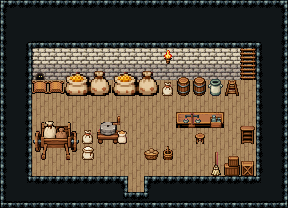

# 곡물 창고

마을 곡물 창고. 문으로 들어와 계량 탁자에서 창고지기가 저울로 곡식을 달아 장부에 적고, 뒷벽 자루 더미·통에 쌓는다. 동쪽 벽 사다리로 다락에 오르고, 손수레에 자루를 실어 방앗간에 나른다. 서쪽 구석 쥐구멍 앞 자루가 갉아 먹혔다 — 첫 의뢰 「창고 쥐 사냥」 자리.

석벽·널 바닥 102, 14×6칸. 서쪽 벽면 아랫줄 쥐구멍 2050과 곡물 자루 471 둘, 뒷벽 식재료 자루 3×2 둘·밀가루 포대·뚜껑 둥근 통 둘·저장 옹기, 동쪽 벽면에 걸친 다락 사다리 472(두 줄)와 접이 사다리, 횃불. 나무 상판 계량 탁자 위 상인 저울·저울추 상자와 창고지기 걸상, 문서 분류장. 서쪽 목제 손수레 3×3와 쌀·밀가루 포대, 손맷돌 2×2·감자 바구니·막대 양동이, 동쪽 앞 쌓인 나무 상자·정사각 상자, 기댄 빗자루. 18×13, tilesetId=tibo_interior_expanded. 입구 (8,11), 주인·담당 자리 (12,9). 통행 검사 목표 [[12,9],[3,6],[14,6],[8,7],[10,7]].



## 놓은 소품 (저작 순서)
tibo-kit은 tibo_interior_expanded의 structureKits id, tiles는 직접 놓은 번호 행렬, rug는 카펫 오토타일 섬, floor는 바닥 재질 칠. (x,y)는 왼쪽 위.
```json
[
  {
    "kind": "tiles",
    "layer": "upper",
    "x": 2,
    "y": 4,
    "w": 1,
    "h": 1,
    "rows": [
      [
        2050
      ]
    ],
    "role": "hang"
  },
  {
    "kind": "tiles",
    "layer": "upper",
    "x": 2,
    "y": 5,
    "w": 1,
    "h": 1,
    "rows": [
      [
        471
      ]
    ],
    "role": "furn"
  },
  {
    "kind": "tiles",
    "layer": "upper",
    "x": 3,
    "y": 5,
    "w": 1,
    "h": 1,
    "rows": [
      [
        471
      ]
    ],
    "role": "furn"
  },
  {
    "kind": "tibo-kit",
    "kitId": "tibo-fantasy-grain-sacks",
    "name": "식재료 자루",
    "x": 4,
    "y": 4,
    "w": 3,
    "h": 2,
    "role": "furn"
  },
  {
    "kind": "tibo-kit",
    "kitId": "tibo-fantasy-grain-sacks",
    "name": "식재료 자루",
    "x": 7,
    "y": 4,
    "w": 3,
    "h": 2,
    "role": "furn"
  },
  {
    "kind": "tibo-kit",
    "kitId": "tibo-library-013",
    "name": "밀가루 포대",
    "x": 10,
    "y": 5,
    "w": 1,
    "h": 1,
    "role": "furn"
  },
  {
    "kind": "tibo-kit",
    "kitId": "tibo-library-229",
    "name": "뚜껑 둥근 통",
    "x": 11,
    "y": 4,
    "w": 1,
    "h": 2,
    "role": "furn"
  },
  {
    "kind": "tibo-kit",
    "kitId": "tibo-library-229",
    "name": "뚜껑 둥근 통",
    "x": 12,
    "y": 4,
    "w": 1,
    "h": 2,
    "role": "furn"
  },
  {
    "kind": "tibo-kit",
    "kitId": "tibo-library-234",
    "name": "저장 옹기",
    "x": 13,
    "y": 4,
    "w": 1,
    "h": 2,
    "role": "furn"
  },
  {
    "kind": "tiles",
    "layer": "upper",
    "x": 15,
    "y": 3,
    "w": 1,
    "h": 2,
    "rows": [
      [
        472
      ],
      [
        472
      ]
    ],
    "role": "hang"
  },
  {
    "kind": "tibo-kit",
    "kitId": "tibo-library-240",
    "name": "접이 사다리",
    "x": 14,
    "y": 5,
    "w": 1,
    "h": 1,
    "role": "furn"
  },
  {
    "kind": "tiles",
    "layer": "upper",
    "x": 10,
    "y": 3,
    "w": 1,
    "h": 1,
    "rows": [
      [
        24
      ]
    ],
    "role": "hang"
  },
  {
    "kind": "tabletop",
    "group": "harness-interior-house-v1-terrain-deck",
    "x": 11,
    "y": 7,
    "w": 3,
    "h": 1,
    "role": "tabletop"
  },
  {
    "kind": "tibo-kit",
    "kitId": "tibo-balance-scale",
    "name": "상인 저울",
    "x": 11,
    "y": 7,
    "w": 2,
    "h": 1,
    "role": "top"
  },
  {
    "kind": "tibo-kit",
    "kitId": "tibo-library-128",
    "name": "저울추 상자",
    "x": 13,
    "y": 7,
    "w": 1,
    "h": 1,
    "role": "top"
  },
  {
    "kind": "tibo-kit",
    "kitId": "tibo-library-030",
    "name": "낮은 걸상",
    "x": 12,
    "y": 8,
    "w": 1,
    "h": 1,
    "role": "seat"
  },
  {
    "kind": "tibo-kit",
    "kitId": "tibo-library-078",
    "name": "문서 분류장",
    "x": 15,
    "y": 7,
    "w": 1,
    "h": 2,
    "role": "furn"
  },
  {
    "kind": "tibo-kit",
    "kitId": "tibo-medieval-handcart",
    "name": "목제 손수레",
    "x": 2,
    "y": 7,
    "w": 3,
    "h": 3,
    "role": "furn"
  },
  {
    "kind": "tibo-kit",
    "kitId": "tibo-library-014",
    "name": "쌀 포대",
    "x": 5,
    "y": 9,
    "w": 1,
    "h": 1,
    "role": "furn"
  },
  {
    "kind": "tibo-kit",
    "kitId": "tibo-library-013",
    "name": "밀가루 포대",
    "x": 5,
    "y": 8,
    "w": 1,
    "h": 1,
    "role": "furn"
  },
  {
    "kind": "tibo-kit",
    "kitId": "tibo-medieval-grain-mill",
    "name": "손맷돌",
    "x": 6,
    "y": 7,
    "w": 2,
    "h": 2,
    "role": "furn"
  },
  {
    "kind": "tibo-kit",
    "kitId": "tibo-library-015",
    "name": "감자 바구니",
    "x": 9,
    "y": 9,
    "w": 1,
    "h": 1,
    "role": "furn"
  },
  {
    "kind": "tibo-kit",
    "kitId": "tibo-v6-2-1",
    "name": "막대 양동이",
    "x": 10,
    "y": 9,
    "w": 1,
    "h": 1,
    "role": "furn"
  },
  {
    "kind": "tibo-kit",
    "kitId": "tibo-library-232",
    "name": "쌓인 나무 상자",
    "x": 14,
    "y": 9,
    "w": 1,
    "h": 2,
    "role": "furn"
  },
  {
    "kind": "tibo-kit",
    "kitId": "tibo-library-230",
    "name": "정사각 보관 상자",
    "x": 15,
    "y": 10,
    "w": 1,
    "h": 1,
    "role": "furn"
  },
  {
    "kind": "tibo-kit",
    "kitId": "tibo-library-061",
    "name": "기댄 빗자루",
    "x": 13,
    "y": 9,
    "w": 1,
    "h": 2,
    "role": "furn"
  }
]
```

전체 두 레이어는 다음 배열 문서가 정답이다.
