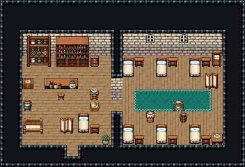

# 치료소

상처 입은 모험가와 마을 사람을 돌보는 치료소. 문으로 들어오면 서쪽 진료실 — 치유사가 진료대 앞 걸상에 앉아 약병·환약을 내 주고, 약초장·물약 진열장에서 약을 꺼낸다. 기다리는 사람은 쿠션 의자에 앉는다. 칸막이 문 너머 동쪽 병실에 침대 여섯이 두 줄로 놓여 환자가 눕는다.

석벽·진료실 나무 바닥 72, 병실 널 바닥 102, 진료실 8×8과 병실 9×8을 칸막이로 나눴다(문 (10,9)). 진료실: 뒷벽 약초 건조장 3×3·물약 진열장 3×3·약재 서랍장, 나무 상판 진료대(약병 세 개·환약 단지)와 치유사 걸상(자리 (5,9) 앞), 대야 받침대·붕대 바구니·약품함·물약 가마솥, 대기용 쿠션 긴 의자, 앞쪽 진찰 침대와 접이식 가림막·협탁, 문 곁 둥근 관목 화분. 병실: 침대 324/354와 협탁 세 쌍씩 위아래 두 줄, 린넨 장, 창 54 둘, 가운데 청록 러너와 음식 운반대, 동쪽 끝 접이식 가림막, 침대 곁 빨래통·청소 양동이, 세면대. 22×15, tilesetId=tibo_interior_expanded. 입구 (6,13), 주인·담당 자리 (5,9). 통행 검사 목표 [[5,9],[10,9],[13,7],[15,10],[3,8]].



## 놓은 소품 (저작 순서)
tibo-kit은 tibo_interior_expanded의 structureKits id, tiles는 직접 놓은 번호 행렬, rug는 카펫 오토타일 섬, floor는 바닥 재질 칠. (x,y)는 왼쪽 위.
```json
[
  {
    "kind": "tibo-kit",
    "kitId": "tibo-medieval-herbal-cabinet",
    "name": "약초 건조장",
    "x": 2,
    "y": 3,
    "w": 3,
    "h": 3,
    "role": "furn"
  },
  {
    "kind": "tibo-kit",
    "kitId": "tibo-v4-2-0",
    "name": "물약 진열장",
    "x": 5,
    "y": 3,
    "w": 3,
    "h": 3,
    "role": "furn"
  },
  {
    "kind": "tibo-kit",
    "kitId": "tibo-library-145",
    "name": "약재 서랍장",
    "x": 8,
    "y": 4,
    "w": 1,
    "h": 2,
    "role": "furn"
  },
  {
    "kind": "tabletop",
    "group": "harness-interior-house-v1-terrain-deck",
    "x": 4,
    "y": 7,
    "w": 3,
    "h": 1,
    "role": "tabletop"
  },
  {
    "kind": "tibo-kit",
    "kitId": "tibo-library-148",
    "name": "약병 세 개",
    "x": 4,
    "y": 7,
    "w": 2,
    "h": 1,
    "role": "top"
  },
  {
    "kind": "tibo-kit",
    "kitId": "tibo-library-155",
    "name": "환약 단지",
    "x": 6,
    "y": 7,
    "w": 1,
    "h": 1,
    "role": "top"
  },
  {
    "kind": "tibo-kit",
    "kitId": "tibo-library-030",
    "name": "낮은 걸상",
    "x": 5,
    "y": 8,
    "w": 1,
    "h": 1,
    "role": "seat"
  },
  {
    "kind": "tibo-kit",
    "kitId": "tibo-library-050",
    "name": "대야 받침대",
    "x": 8,
    "y": 7,
    "w": 1,
    "h": 2,
    "role": "furn"
  },
  {
    "kind": "tibo-kit",
    "kitId": "tibo-library-149",
    "name": "붕대 바구니",
    "x": 8,
    "y": 9,
    "w": 1,
    "h": 1,
    "role": "furn"
  },
  {
    "kind": "tibo-kit",
    "kitId": "tibo-v9-1-1",
    "name": "약품함",
    "x": 2,
    "y": 7,
    "w": 1,
    "h": 1,
    "role": "furn"
  },
  {
    "kind": "tibo-kit",
    "kitId": "tibo-warm-bench",
    "name": "쿠션 긴 의자",
    "x": 2,
    "y": 10,
    "w": 2,
    "h": 2,
    "role": "furn"
  },
  {
    "kind": "tibo-kit",
    "kitId": "tibo-library-215",
    "name": "둥근 관목 화분",
    "x": 9,
    "y": 12,
    "w": 1,
    "h": 1,
    "role": "furn"
  },
  {
    "kind": "tibo-kit",
    "kitId": "tibo-library-166",
    "name": "물약 가마솥",
    "x": 2,
    "y": 9,
    "w": 1,
    "h": 1,
    "role": "furn"
  },
  {
    "kind": "tiles",
    "layer": "upper",
    "x": 7,
    "y": 10,
    "w": 1,
    "h": 2,
    "rows": [
      [
        324
      ],
      [
        354
      ]
    ],
    "role": "furn"
  },
  {
    "kind": "tibo-kit",
    "kitId": "tibo-library-236",
    "name": "접이식 가림막",
    "x": 5,
    "y": 10,
    "w": 2,
    "h": 2,
    "role": "furn"
  },
  {
    "kind": "tibo-kit",
    "kitId": "tibo-library-039",
    "name": "침대 옆 협탁",
    "x": 8,
    "y": 11,
    "w": 1,
    "h": 1,
    "role": "furn"
  },
  {
    "kind": "tiles",
    "layer": "upper",
    "x": 11,
    "y": 5,
    "w": 1,
    "h": 2,
    "rows": [
      [
        324
      ],
      [
        354
      ]
    ],
    "role": "furn"
  },
  {
    "kind": "tibo-kit",
    "kitId": "tibo-library-039",
    "name": "침대 옆 협탁",
    "x": 12,
    "y": 5,
    "w": 1,
    "h": 1,
    "role": "furn"
  },
  {
    "kind": "tiles",
    "layer": "upper",
    "x": 11,
    "y": 11,
    "w": 1,
    "h": 2,
    "rows": [
      [
        324
      ],
      [
        354
      ]
    ],
    "role": "furn"
  },
  {
    "kind": "tibo-kit",
    "kitId": "tibo-library-039",
    "name": "침대 옆 협탁",
    "x": 12,
    "y": 12,
    "w": 1,
    "h": 1,
    "role": "furn"
  },
  {
    "kind": "tiles",
    "layer": "upper",
    "x": 14,
    "y": 5,
    "w": 1,
    "h": 2,
    "rows": [
      [
        324
      ],
      [
        354
      ]
    ],
    "role": "furn"
  },
  {
    "kind": "tibo-kit",
    "kitId": "tibo-library-039",
    "name": "침대 옆 협탁",
    "x": 15,
    "y": 5,
    "w": 1,
    "h": 1,
    "role": "furn"
  },
  {
    "kind": "tiles",
    "layer": "upper",
    "x": 14,
    "y": 11,
    "w": 1,
    "h": 2,
    "rows": [
      [
        324
      ],
      [
        354
      ]
    ],
    "role": "furn"
  },
  {
    "kind": "tibo-kit",
    "kitId": "tibo-library-039",
    "name": "침대 옆 협탁",
    "x": 15,
    "y": 12,
    "w": 1,
    "h": 1,
    "role": "furn"
  },
  {
    "kind": "tiles",
    "layer": "upper",
    "x": 17,
    "y": 5,
    "w": 1,
    "h": 2,
    "rows": [
      [
        324
      ],
      [
        354
      ]
    ],
    "role": "furn"
  },
  {
    "kind": "tibo-kit",
    "kitId": "tibo-library-039",
    "name": "침대 옆 협탁",
    "x": 18,
    "y": 5,
    "w": 1,
    "h": 1,
    "role": "furn"
  },
  {
    "kind": "tiles",
    "layer": "upper",
    "x": 17,
    "y": 11,
    "w": 1,
    "h": 2,
    "rows": [
      [
        324
      ],
      [
        354
      ]
    ],
    "role": "furn"
  },
  {
    "kind": "tibo-kit",
    "kitId": "tibo-library-039",
    "name": "침대 옆 협탁",
    "x": 18,
    "y": 12,
    "w": 1,
    "h": 1,
    "role": "furn"
  },
  {
    "kind": "tibo-kit",
    "kitId": "tibo-library-059",
    "name": "린넨 장",
    "x": 19,
    "y": 4,
    "w": 1,
    "h": 2,
    "role": "furn"
  },
  {
    "kind": "tiles",
    "layer": "upper",
    "x": 13,
    "y": 3,
    "w": 1,
    "h": 1,
    "rows": [
      [
        54
      ]
    ],
    "role": "hang"
  },
  {
    "kind": "tiles",
    "layer": "upper",
    "x": 16,
    "y": 3,
    "w": 1,
    "h": 1,
    "rows": [
      [
        54
      ]
    ],
    "role": "hang"
  },
  {
    "kind": "rug",
    "group": "harness-interior-house-v1-terrain-teal-carpet",
    "x": 12,
    "y": 8,
    "w": 7,
    "h": 2,
    "role": "rug"
  },
  {
    "kind": "tibo-kit",
    "kitId": "tibo-library-031",
    "name": "음식 운반대",
    "x": 15,
    "y": 8,
    "w": 2,
    "h": 2,
    "role": "furn"
  },
  {
    "kind": "tibo-kit",
    "kitId": "tibo-v8-1-3",
    "name": "세면대",
    "x": 19,
    "y": 12,
    "w": 1,
    "h": 1,
    "role": "furn"
  },
  {
    "kind": "tibo-kit",
    "kitId": "tibo-library-236",
    "name": "접이식 가림막",
    "x": 18,
    "y": 6,
    "w": 2,
    "h": 2,
    "role": "furn"
  },
  {
    "kind": "tibo-kit",
    "kitId": "tibo-library-048",
    "name": "옷 빨래통",
    "x": 13,
    "y": 10,
    "w": 1,
    "h": 1,
    "role": "furn"
  },
  {
    "kind": "tibo-kit",
    "kitId": "tibo-library-065",
    "name": "청소 양동이",
    "x": 16,
    "y": 10,
    "w": 1,
    "h": 1,
    "role": "furn"
  }
]
```

전체 두 레이어는 다음 배열 문서가 정답이다.
