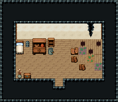

# 민가 · 폐가

오래 비어 있던 집. 한 칸 집과 같은 틀에 가구는 먼지를 쓰고, 북동 모서리는 천장이 새서 바닥이 무너졌다 — 조사·귀신 이야기·숨은 물건 자리.

한 칸 집 껍데기를 그대로 두고 벽 조립은 건드리지 않았다(폐성과 같은 규칙). 무너진 곳은 북동 모서리 4×4 한 곳에만: 바닥 구멍 73·부서진 널 102/103·새싹 222/223·세운 판자 386·판자 더미 387 둘·그 위 벽 균열 388/418. 나머지 바닥은 멀쩡한 널. 낡은 침대·꺼진 등불, 먼지 앉은 찬장·빈 벽장·재 양동이, 말린 꽃병·나무 궤짝(불 꺼진 집이라 벽난로는 두지 않음). 15×13, tilesetId=tibo_interior_expanded. 입구 (7,10). 통행 검사 목표 [[7,7],[3,7],[10,9]].



## 놓은 소품 (저작 순서)
tibo-kit은 tibo_interior_expanded의 structureKits id, tiles는 직접 놓은 번호 행렬, rug는 카펫 오토타일 섬, floor는 바닥 재질 칠. (x,y)는 왼쪽 위.
```json
[
  {
    "kind": "floor",
    "note": "collapsed corner",
    "x": 9,
    "y": 5,
    "w": 4,
    "h": 4,
    "role": "floor"
  },
  {
    "kind": "tiles",
    "layer": "upper",
    "x": 11,
    "y": 3,
    "w": 1,
    "h": 1,
    "rows": [
      [
        388
      ]
    ],
    "role": "hang"
  },
  {
    "kind": "tiles",
    "layer": "upper",
    "x": 11,
    "y": 4,
    "w": 1,
    "h": 1,
    "rows": [
      [
        418
      ]
    ],
    "role": "hang"
  },
  {
    "kind": "tiles",
    "layer": "upper",
    "x": 9,
    "y": 6,
    "w": 1,
    "h": 1,
    "rows": [
      [
        386
      ]
    ],
    "role": "furn"
  },
  {
    "kind": "tiles",
    "layer": "upper",
    "x": 10,
    "y": 8,
    "w": 1,
    "h": 1,
    "rows": [
      [
        387
      ]
    ],
    "role": "furn"
  },
  {
    "kind": "tiles",
    "layer": "upper",
    "x": 9,
    "y": 7,
    "w": 1,
    "h": 1,
    "rows": [
      [
        387
      ]
    ],
    "role": "furn"
  },
  {
    "kind": "tiles",
    "layer": "upper",
    "x": 2,
    "y": 5,
    "w": 1,
    "h": 2,
    "rows": [
      [
        324
      ],
      [
        354
      ]
    ],
    "role": "furn"
  },
  {
    "kind": "tibo-kit",
    "kitId": "tibo-fantasy-cupboard",
    "name": "찬장",
    "x": 4,
    "y": 4,
    "w": 2,
    "h": 3,
    "role": "furn"
  },
  {
    "kind": "tibo-kit",
    "kitId": "tibo-library-237",
    "name": "빈 벽장",
    "x": 6,
    "y": 4,
    "w": 1,
    "h": 2,
    "role": "furn"
  },
  {
    "kind": "tibo-kit",
    "kitId": "tibo-v6-2-3",
    "name": "꺼진 등불",
    "x": 3,
    "y": 5,
    "w": 1,
    "h": 1,
    "role": "furn"
  },
  {
    "kind": "tibo-kit",
    "kitId": "tibo-library-071",
    "name": "재 양동이",
    "x": 6,
    "y": 6,
    "w": 1,
    "h": 1,
    "role": "furn"
  },
  {
    "kind": "tibo-kit",
    "kitId": "tibo-library-214",
    "name": "말린 꽃병",
    "x": 2,
    "y": 8,
    "w": 1,
    "h": 2,
    "role": "furn"
  },
  {
    "kind": "tibo-kit",
    "kitId": "tibo-library-045",
    "name": "여행용 궤짝",
    "x": 3,
    "y": 9,
    "w": 1,
    "h": 1,
    "role": "furn"
  }
]
```

전체 두 레이어는 다음 배열 문서가 정답이다.
