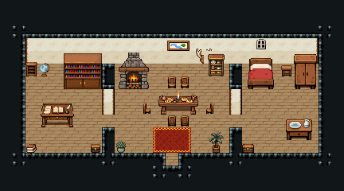

# 민가 · 촌장집

마을 촌장이 사는 집. 가운데 응접실에서 마을 사람을 맞고 회의를 하며(긴 식탁·마을 지도), 왼쪽 서재에서 장부를 보고, 오른쪽이 촌장 부부의 침실.

방 셋(서재 6×7·응접실 9×7·침실 6×7)을 칸막이로 나누고 칸막이 가운데 줄을 틔웠다. 서재에 문서 분류장·지구본·책장 수납장 3×3·필경사 책상 3×2와 의자·금고함·책 더미, 응접실에 장작 벽난로·강 지도 액자·사슴뿔 벽판·연회용 긴 식탁 4×2와 의자·식기장·붉은 러그·야자 화분, 침실에 목제 침대·협탁·옷장·세면대·궤짝. 27×15, tilesetId=tibo_interior_expanded. 입구 (13,12), 주인·담당 자리 (4,7). 통행 검사 목표 [[4,7],[13,10],[21,8]].



## 놓은 소품 (저작 순서)
tibo-kit은 tibo_interior_expanded의 structureKits id, tiles는 직접 놓은 번호 행렬, rug는 카펫 오토타일 섬, floor는 바닥 재질 칠. (x,y)는 왼쪽 위.
```json
[
  {
    "kind": "tibo-kit",
    "kitId": "tibo-library-078",
    "name": "문서 분류장",
    "x": 2,
    "y": 4,
    "w": 1,
    "h": 2
  },
  {
    "kind": "tibo-kit",
    "kitId": "tibo-v12-1-2",
    "name": "지구본",
    "x": 3,
    "y": 4,
    "w": 1,
    "h": 2
  },
  {
    "kind": "tibo-kit",
    "kitId": "tibo-v3-1-0",
    "name": "책장 수납장",
    "x": 5,
    "y": 4,
    "w": 3,
    "h": 3
  },
  {
    "kind": "tibo-kit",
    "kitId": "tibo-medieval-scribe-desk",
    "name": "필경사 책상",
    "x": 3,
    "y": 8,
    "w": 3,
    "h": 2
  },
  {
    "kind": "tibo-kit",
    "kitId": "tibo-library-238",
    "name": "자물쇠 금고함",
    "x": 7,
    "y": 11,
    "w": 1,
    "h": 1
  },
  {
    "kind": "tibo-kit",
    "kitId": "tibo-library-073",
    "name": "덮은 책 더미",
    "x": 2,
    "y": 11,
    "w": 1,
    "h": 1
  },
  {
    "kind": "tibo-kit",
    "kitId": "tibo-medieval-stone-fireplace",
    "name": "장작 벽난로",
    "x": 9,
    "y": 4,
    "w": 3,
    "h": 3
  },
  {
    "kind": "tibo-kit",
    "kitId": "tibo-v6-2-0",
    "name": "강 지도 액자",
    "x": 13,
    "y": 3,
    "w": 2,
    "h": 1
  },
  {
    "kind": "tibo-kit",
    "kitId": "tibo-library-223",
    "name": "사슴뿔 벽판",
    "x": 15,
    "y": 3,
    "w": 2,
    "h": 2
  },
  {
    "kind": "tibo-kit",
    "kitId": "tibo-medieval-banquet-table",
    "name": "연회용 긴 식탁",
    "x": 12,
    "y": 7,
    "w": 4,
    "h": 2
  },
  {
    "kind": "tiles",
    "layer": "upper",
    "x": 13,
    "y": 6,
    "w": 1,
    "h": 1,
    "rows": [
      [
        267
      ]
    ]
  },
  {
    "kind": "tiles",
    "layer": "upper",
    "x": 13,
    "y": 9,
    "w": 1,
    "h": 1,
    "rows": [
      [
        268
      ]
    ]
  },
  {
    "kind": "tiles",
    "layer": "upper",
    "x": 14,
    "y": 6,
    "w": 1,
    "h": 1,
    "rows": [
      [
        267
      ]
    ]
  },
  {
    "kind": "tiles",
    "layer": "upper",
    "x": 14,
    "y": 9,
    "w": 1,
    "h": 1,
    "rows": [
      [
        268
      ]
    ]
  },
  {
    "kind": "tiles",
    "layer": "upper",
    "x": 11,
    "y": 8,
    "w": 1,
    "h": 1,
    "rows": [
      [
        297
      ]
    ]
  },
  {
    "kind": "tiles",
    "layer": "upper",
    "x": 16,
    "y": 8,
    "w": 1,
    "h": 1,
    "rows": [
      [
        298
      ]
    ]
  },
  {
    "kind": "rug",
    "group": "harness-interior-house-v1-terrain-red-carpet",
    "x": 12,
    "y": 10,
    "w": 3,
    "h": 2
  },
  {
    "kind": "tibo-kit",
    "kitId": "tibo-library-209",
    "name": "키 큰 실내 야자",
    "x": 16,
    "y": 10,
    "w": 2,
    "h": 2
  },
  {
    "kind": "tibo-kit",
    "kitId": "tibo-library-215",
    "name": "둥근 관목 화분",
    "x": 9,
    "y": 11,
    "w": 1,
    "h": 1
  },
  {
    "kind": "tibo-kit",
    "kitId": "tibo-warm-crockery",
    "name": "따뜻한 목재 식기장",
    "x": 16,
    "y": 4,
    "w": 2,
    "h": 2
  },
  {
    "kind": "tibo-kit",
    "kitId": "tibo-fantasy-bed",
    "name": "목제 침대",
    "x": 19,
    "y": 4,
    "w": 3,
    "h": 3
  },
  {
    "kind": "tibo-kit",
    "kitId": "tibo-library-039",
    "name": "침대 옆 협탁",
    "x": 22,
    "y": 5,
    "w": 1,
    "h": 1
  },
  {
    "kind": "tibo-kit",
    "kitId": "tibo-fantasy-wardrobe",
    "name": "옷장",
    "x": 23,
    "y": 4,
    "w": 2,
    "h": 3
  },
  {
    "kind": "tibo-kit",
    "kitId": "tibo-fantasy-washstand",
    "name": "세면대",
    "x": 22,
    "y": 9,
    "w": 3,
    "h": 2
  },
  {
    "kind": "tibo-kit",
    "kitId": "tibo-library-045",
    "name": "여행용 궤짝",
    "x": 19,
    "y": 11,
    "w": 1,
    "h": 1
  },
  {
    "kind": "tiles",
    "layer": "upper",
    "x": 20,
    "y": 3,
    "w": 1,
    "h": 1,
    "rows": [
      [
        54
      ]
    ]
  }
]
```

전체 두 레이어는 다음 배열 문서가 정답이다.
