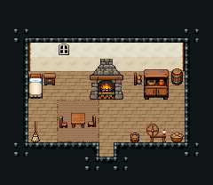

# 민가 · 한 칸 집

농부 부부가 사는 한 칸짜리 집. 한 방에서 자고(왼쪽), 불 때 밥하고(가운데 벽난로), 먹고(짚 돗자리 위 식탁), 실을 잣는다(오른쪽 물레).

크림 벽 11×5칸. 왼쪽 침대 324/354·협탁·창 54, 가운데 장작 벽난로와 장작 옆 항아리, 오른쪽 찬장 2×3·뚜껑 통, 짚 돗자리 108~170 위 정사각 식탁과 의자 둘, 앞쪽 물레·감자 바구니·물 양동이·기댄 빗자루. 15×13, tilesetId=tibo_interior_expanded. 입구 (7,10). 통행 검사 목표 [[3,6],[5,9],[9,7]].



## 놓은 소품 (저작 순서)
tibo-kit은 tibo_interior_expanded의 structureKits id, tiles는 직접 놓은 번호 행렬, rug는 카펫 오토타일 섬, floor는 바닥 재질 칠. (x,y)는 왼쪽 위.
```json
[
  {
    "kind": "tiles",
    "layer": "upper",
    "x": 2,
    "y": 5,
    "w": 1,
    "h": 2,
    "rows": [
      [
        324
      ],
      [
        354
      ]
    ]
  },
  {
    "kind": "tibo-kit",
    "kitId": "tibo-library-039",
    "name": "침대 옆 협탁",
    "x": 3,
    "y": 5,
    "w": 1,
    "h": 1
  },
  {
    "kind": "tiles",
    "layer": "upper",
    "x": 4,
    "y": 3,
    "w": 1,
    "h": 1,
    "rows": [
      [
        54
      ]
    ]
  },
  {
    "kind": "tibo-kit",
    "kitId": "tibo-medieval-stone-fireplace",
    "name": "장작 벽난로",
    "x": 6,
    "y": 4,
    "w": 3,
    "h": 3
  },
  {
    "kind": "tibo-kit",
    "kitId": "tibo-library-235",
    "name": "장작 받침대",
    "x": 9,
    "y": 5,
    "w": 2,
    "h": 1
  },
  {
    "kind": "tibo-kit",
    "kitId": "tibo-fantasy-cupboard",
    "name": "찬장",
    "x": 10,
    "y": 4,
    "w": 2,
    "h": 3
  },
  {
    "kind": "tibo-kit",
    "kitId": "tibo-library-229",
    "name": "뚜껑 둥근 통",
    "x": 12,
    "y": 4,
    "w": 1,
    "h": 2
  },
  {
    "kind": "tiles",
    "layer": "lower",
    "x": 4,
    "y": 7,
    "w": 3,
    "h": 3,
    "rows": [
      [
        108,
        109,
        110
      ],
      [
        138,
        139,
        140
      ],
      [
        168,
        169,
        170
      ]
    ]
  },
  {
    "kind": "tibo-kit",
    "kitId": "tibo-library-026",
    "name": "정사각 식탁",
    "x": 5,
    "y": 7,
    "w": 1,
    "h": 2
  },
  {
    "kind": "tibo-kit",
    "kitId": "tibo-v7-1-2",
    "name": "붉은 방석 의자",
    "x": 4,
    "y": 8,
    "w": 1,
    "h": 1
  },
  {
    "kind": "tiles",
    "layer": "upper",
    "x": 6,
    "y": 8,
    "w": 1,
    "h": 1,
    "rows": [
      [
        298
      ]
    ]
  },
  {
    "kind": "tibo-kit",
    "kitId": "tibo-v11-1-2",
    "name": "물레",
    "x": 10,
    "y": 8,
    "w": 2,
    "h": 2
  },
  {
    "kind": "tibo-kit",
    "kitId": "tibo-library-015",
    "name": "감자 바구니",
    "x": 12,
    "y": 9,
    "w": 1,
    "h": 1
  },
  {
    "kind": "tibo-kit",
    "kitId": "tibo-library-061",
    "name": "기댄 빗자루",
    "x": 2,
    "y": 8,
    "w": 1,
    "h": 2
  },
  {
    "kind": "tibo-kit",
    "kitId": "tibo-v6-1-1",
    "name": "물 양동이",
    "x": 9,
    "y": 9,
    "w": 1,
    "h": 1
  }
]
```

전체 두 레이어는 다음 배열 문서가 정답이다.
