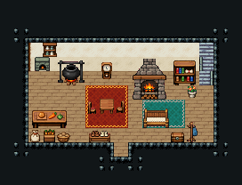

# 민가 · 2층 집 1층

네 식구가 사는 2층 집의 아래층. 왼쪽이 부엌(화덕·솥·조리대), 가운데 식탁, 오른쪽 거실(벽난로·책장·쿠션 의자), 오른쪽 뒤 계단으로 2층 침실에 오른다.

크림 벽 13×5칸. 부엌에 작은 빵 화덕·솥 걸이·향신료 선반·조리대·밀가루 포대·당근 상자, 식탁 1×2와 의자 둘·괘종시계 389, 거실에 장작 벽난로·두꺼운 책장·청록 러그 위 쿠션 긴 의자, 문 옆 옷걸이·신발 받침대, 벽 계단 111/141/171(x=14). 식탁 아래 붉은 러그, 부엌 앞 감자 바구니, 거실 화분·궤짝. 17×13, tilesetId=tibo_interior_expanded. 입구 (8,10). 통행 검사 목표 [[7,8],[14,5],[11,9]].



## 놓은 소품 (저작 순서)
tibo-kit은 tibo_interior_expanded의 structureKits id, tiles는 직접 놓은 번호 행렬, rug는 카펫 오토타일 섬, floor는 바닥 재질 칠. (x,y)는 왼쪽 위.
```json
[
  {
    "kind": "tibo-kit",
    "kitId": "tibo-bread-oven",
    "name": "작은 빵 화덕",
    "x": 2,
    "y": 4,
    "w": 2,
    "h": 1
  },
  {
    "kind": "tibo-kit",
    "kitId": "tibo-fantasy-hanging-pot",
    "name": "솥 걸이",
    "x": 4,
    "y": 4,
    "w": 2,
    "h": 2
  },
  {
    "kind": "tibo-kit",
    "kitId": "tibo-library-011",
    "name": "향신료 선반",
    "x": 3,
    "y": 3,
    "w": 1,
    "h": 1
  },
  {
    "kind": "tibo-kit",
    "kitId": "tibo-fantasy-prep-table",
    "name": "조리대",
    "x": 2,
    "y": 7,
    "w": 3,
    "h": 2
  },
  {
    "kind": "tibo-kit",
    "kitId": "tibo-library-013",
    "name": "밀가루 포대",
    "x": 2,
    "y": 9,
    "w": 1,
    "h": 1
  },
  {
    "kind": "tibo-kit",
    "kitId": "tibo-library-018",
    "name": "당근 상자",
    "x": 3,
    "y": 9,
    "w": 1,
    "h": 1
  },
  {
    "kind": "tibo-kit",
    "kitId": "tibo-library-026",
    "name": "정사각 식탁",
    "x": 7,
    "y": 6,
    "w": 1,
    "h": 2
  },
  {
    "kind": "tibo-kit",
    "kitId": "tibo-v7-1-2",
    "name": "붉은 방석 의자",
    "x": 6,
    "y": 7,
    "w": 1,
    "h": 1
  },
  {
    "kind": "tiles",
    "layer": "upper",
    "x": 8,
    "y": 7,
    "w": 1,
    "h": 1,
    "rows": [
      [
        298
      ]
    ]
  },
  {
    "kind": "tiles",
    "layer": "upper",
    "x": 7,
    "y": 4,
    "w": 1,
    "h": 2,
    "rows": [
      [
        389
      ],
      [
        419
      ]
    ]
  },
  {
    "kind": "tibo-kit",
    "kitId": "tibo-medieval-stone-fireplace",
    "name": "장작 벽난로",
    "x": 9,
    "y": 4,
    "w": 3,
    "h": 3
  },
  {
    "kind": "tibo-kit",
    "kitId": "tibo-fantasy-bookcase",
    "name": "두꺼운 책장",
    "x": 12,
    "y": 4,
    "w": 2,
    "h": 2
  },
  {
    "kind": "rug",
    "group": "harness-interior-house-v1-terrain-teal-carpet",
    "x": 10,
    "y": 7,
    "w": 3,
    "h": 2
  },
  {
    "kind": "tibo-kit",
    "kitId": "tibo-warm-bench",
    "name": "쿠션 긴 의자",
    "x": 10,
    "y": 7,
    "w": 2,
    "h": 2
  },
  {
    "kind": "tiles",
    "layer": "lower",
    "x": 14,
    "y": 3,
    "w": 1,
    "h": 3,
    "rows": [
      [
        111
      ],
      [
        141
      ],
      [
        171
      ]
    ]
  },
  {
    "kind": "tibo-kit",
    "kitId": "tibo-coat-rack",
    "name": "옷걸이",
    "x": 13,
    "y": 8,
    "w": 1,
    "h": 2
  },
  {
    "kind": "tibo-kit",
    "kitId": "tibo-boot-rack",
    "name": "신발 받침대",
    "x": 6,
    "y": 9,
    "w": 2,
    "h": 1
  },
  {
    "kind": "rug",
    "group": "harness-interior-house-v1-terrain-red-carpet",
    "x": 6,
    "y": 6,
    "w": 3,
    "h": 3
  },
  {
    "kind": "tibo-kit",
    "kitId": "tibo-library-015",
    "name": "감자 바구니",
    "x": 4,
    "y": 9,
    "w": 1,
    "h": 1
  },
  {
    "kind": "tibo-kit",
    "kitId": "tibo-library-045",
    "name": "여행용 궤짝",
    "x": 12,
    "y": 9,
    "w": 1,
    "h": 1
  },
  {
    "kind": "tiles",
    "layer": "upper",
    "x": 13,
    "y": 6,
    "w": 1,
    "h": 1,
    "rows": [
      [
        288
      ]
    ]
  }
]
```

전체 두 레이어는 다음 배열 문서가 정답이다.
