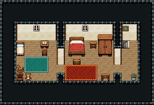

# 민가 · 2층 집 2층

2층 집의 위층 침실. 계단을 오르면 동쪽 계단참, 가운데가 부부 방(큰 침대·옷장·화장대), 서쪽이 아이 방(작은 침대·독서 탁자·장난감).

방 셋(아이 5×5·부부 6×5·계단참 2×5)을 세로 칸막이로 나누고 칸막이 천장을 북쪽 천장까지 이었다(문 (7,8)·(14,8)). 계단참에 1층 계단 가운데 자리의 1×1 내려가는 돌계단 474·그림·화분, 부부 방 목제 침대 3×3·협탁·옷장 2×3·침대 발치 궤짝·붉은 러그·화장대, 아이 방 침대·독서 탁자와 의자·청록 러그·목마·장난감 상자·곰 인형. 19×13, tilesetId=tibo_interior_expanded. 입구 (16,7). 통행 검사 목표 [[4,7],[10,8],[15,8]].



## 놓은 소품 (저작 순서)
tibo-kit은 tibo_interior_expanded의 structureKits id, tiles는 직접 놓은 번호 행렬, rug는 카펫 오토타일 섬, floor는 바닥 재질 칠. (x,y)는 왼쪽 위.
```json
[
  {
    "kind": "tiles",
    "layer": "upper",
    "x": 15,
    "y": 5,
    "w": 1,
    "h": 1,
    "rows": [
      [
        474
      ]
    ],
    "role": "stairs"
  },
  {
    "kind": "tibo-kit",
    "kitId": "tibo-library-215",
    "name": "둥근 관목 화분",
    "x": 16,
    "y": 9,
    "w": 1,
    "h": 1,
    "role": "furn"
  },
  {
    "kind": "tiles",
    "layer": "upper",
    "x": 15,
    "y": 3,
    "w": 1,
    "h": 1,
    "rows": [
      [
        84
      ]
    ],
    "role": "hang"
  },
  {
    "kind": "tiles",
    "layer": "upper",
    "x": 2,
    "y": 5,
    "w": 1,
    "h": 2,
    "rows": [
      [
        324
      ],
      [
        354
      ]
    ],
    "role": "furn"
  },
  {
    "kind": "tibo-kit",
    "kitId": "tibo-v4-4-2",
    "name": "독서 탁자",
    "x": 5,
    "y": 5,
    "w": 1,
    "h": 1,
    "role": "table"
  },
  {
    "kind": "tiles",
    "layer": "upper",
    "x": 5,
    "y": 6,
    "w": 1,
    "h": 1,
    "rows": [
      [
        268
      ]
    ],
    "role": "seat"
  },
  {
    "kind": "tiles",
    "layer": "upper",
    "x": 4,
    "y": 3,
    "w": 1,
    "h": 1,
    "rows": [
      [
        54
      ]
    ],
    "role": "hang"
  },
  {
    "kind": "rug",
    "group": "harness-interior-house-v1-terrain-teal-carpet",
    "x": 3,
    "y": 7,
    "w": 3,
    "h": 2,
    "role": "rug"
  },
  {
    "kind": "tibo-kit",
    "kitId": "tibo-library-181",
    "name": "목마",
    "x": 2,
    "y": 8,
    "w": 1,
    "h": 1,
    "role": "furn"
  },
  {
    "kind": "tibo-kit",
    "kitId": "tibo-library-186",
    "name": "열린 장난감 상자",
    "x": 2,
    "y": 9,
    "w": 1,
    "h": 1,
    "role": "furn"
  },
  {
    "kind": "tibo-kit",
    "kitId": "tibo-library-184",
    "name": "곰 인형",
    "x": 3,
    "y": 9,
    "w": 1,
    "h": 1,
    "role": "furn"
  },
  {
    "kind": "tibo-kit",
    "kitId": "tibo-fantasy-bed",
    "name": "목제 침대",
    "x": 8,
    "y": 4,
    "w": 3,
    "h": 3,
    "role": "furn"
  },
  {
    "kind": "tibo-kit",
    "kitId": "tibo-library-039",
    "name": "침대 옆 협탁",
    "x": 11,
    "y": 5,
    "w": 1,
    "h": 1,
    "role": "furn"
  },
  {
    "kind": "tibo-kit",
    "kitId": "tibo-fantasy-wardrobe",
    "name": "옷장",
    "x": 12,
    "y": 4,
    "w": 2,
    "h": 3,
    "role": "furn"
  },
  {
    "kind": "tiles",
    "layer": "upper",
    "x": 10,
    "y": 3,
    "w": 1,
    "h": 1,
    "rows": [
      [
        54
      ]
    ],
    "role": "hang"
  },
  {
    "kind": "rug",
    "group": "harness-interior-house-v1-terrain-red-carpet",
    "x": 8,
    "y": 8,
    "w": 4,
    "h": 2,
    "role": "rug"
  },
  {
    "kind": "tibo-kit",
    "kitId": "tibo-library-045",
    "name": "여행용 궤짝",
    "x": 9,
    "y": 7,
    "w": 1,
    "h": 1,
    "role": "furn"
  },
  {
    "kind": "tibo-kit",
    "kitId": "tibo-library-040",
    "name": "화장대",
    "x": 12,
    "y": 9,
    "w": 2,
    "h": 1,
    "role": "table"
  }
]
```

전체 두 레이어는 다음 배열 문서가 정답이다.
