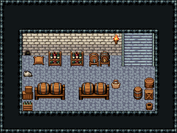

# 여관 지하 · 술창고

여관 1층 아래 술창고. 동벽 계단으로 내려오면 뒷벽 포도주 선반과 술통 꼭지에서 주인이 술을 받고, 가운데 술통 선반 두 줄 사이로 짐을 나른다. 서쪽 구석 벽의 쥐구멍 곁 자루가 찢겨 있고 흰 고양이가 그 앞을 지킨다 — 첫 의뢰 「지하실 쥐 잡기」 자리.

석벽 134~136/164~166·돌바닥 42, 12×5칸. 남쪽 문을 닫고 동벽 3칸 폭 돌계단 141|111|171(x=11~13, 첫 바닥 줄 y=5에서 벽면 두 줄을 타고 오름) → 여관 1층. 뒷벽 포도주 병 선반 둘·술통 꼭지 받침·받침대 맥주통·횃불, 서쪽 벽면 아랫줄 쥐구멍 2050과 곡물 자루 471·흰 고양이 385, 가운데 술통 선반 3×2 둘, 쌓인 나무 상자·병 상자·코르크 바구니·뚜껑 둥근 통·정사각 상자·큰 나무 통 205·나무 물통 265. 16×12, tilesetId=tibo_interior_expanded. 입구 (12,6). 통행 검사 목표 [[12,6],[4,6],[6,6],[10,9],[2,7]].



## 놓은 소품 (저작 순서)
tibo-kit은 tibo_interior_expanded의 structureKits id, tiles는 직접 놓은 번호 행렬, rug는 카펫 오토타일 섬, floor는 바닥 재질 칠. (x,y)는 왼쪽 위.
```json
[
  {
    "kind": "tiles",
    "layer": "lower",
    "x": 11,
    "y": 3,
    "w": 3,
    "h": 3,
    "rows": [
      [
        141,
        111,
        171
      ],
      [
        141,
        111,
        171
      ],
      [
        141,
        111,
        171
      ]
    ],
    "role": "stairs"
  },
  {
    "kind": "tiles",
    "layer": "upper",
    "x": 2,
    "y": 4,
    "w": 1,
    "h": 1,
    "rows": [
      [
        2050
      ]
    ],
    "role": "hang"
  },
  {
    "kind": "tiles",
    "layer": "upper",
    "x": 3,
    "y": 5,
    "w": 1,
    "h": 1,
    "rows": [
      [
        471
      ]
    ],
    "role": "furn"
  },
  {
    "kind": "tiles",
    "layer": "upper",
    "x": 2,
    "y": 6,
    "w": 1,
    "h": 1,
    "rows": [
      [
        385
      ]
    ],
    "role": "furn"
  },
  {
    "kind": "tibo-kit",
    "kitId": "tibo-library-134",
    "name": "포도주 병 선반",
    "x": 4,
    "y": 4,
    "w": 2,
    "h": 2,
    "role": "furn"
  },
  {
    "kind": "tibo-kit",
    "kitId": "tibo-library-134",
    "name": "포도주 병 선반",
    "x": 6,
    "y": 4,
    "w": 2,
    "h": 2,
    "role": "furn"
  },
  {
    "kind": "tibo-kit",
    "kitId": "tibo-library-143",
    "name": "술통 꼭지 받침",
    "x": 8,
    "y": 4,
    "w": 1,
    "h": 2,
    "role": "furn"
  },
  {
    "kind": "tibo-kit",
    "kitId": "tibo-library-133",
    "name": "받침대 맥주통",
    "x": 9,
    "y": 4,
    "w": 1,
    "h": 2,
    "role": "furn"
  },
  {
    "kind": "tiles",
    "layer": "upper",
    "x": 10,
    "y": 3,
    "w": 1,
    "h": 1,
    "rows": [
      [
        24
      ]
    ],
    "role": "hang"
  },
  {
    "kind": "tibo-kit",
    "kitId": "tibo-fantasy-ale-rack",
    "name": "술통 선반",
    "x": 3,
    "y": 7,
    "w": 3,
    "h": 2,
    "role": "furn"
  },
  {
    "kind": "tibo-kit",
    "kitId": "tibo-fantasy-ale-rack",
    "name": "술통 선반",
    "x": 7,
    "y": 7,
    "w": 3,
    "h": 2,
    "role": "furn"
  },
  {
    "kind": "tibo-kit",
    "kitId": "tibo-library-232",
    "name": "쌓인 나무 상자",
    "x": 2,
    "y": 7,
    "w": 1,
    "h": 2,
    "role": "furn"
  },
  {
    "kind": "tibo-kit",
    "kitId": "tibo-library-141",
    "name": "병 상자",
    "x": 2,
    "y": 9,
    "w": 1,
    "h": 1,
    "role": "furn"
  },
  {
    "kind": "tibo-kit",
    "kitId": "tibo-library-142",
    "name": "코르크 바구니",
    "x": 10,
    "y": 7,
    "w": 1,
    "h": 1,
    "role": "furn"
  },
  {
    "kind": "tibo-kit",
    "kitId": "tibo-library-229",
    "name": "뚜껑 둥근 통",
    "x": 12,
    "y": 7,
    "w": 1,
    "h": 2,
    "role": "furn"
  },
  {
    "kind": "tibo-kit",
    "kitId": "tibo-library-230",
    "name": "정사각 보관 상자",
    "x": 13,
    "y": 8,
    "w": 1,
    "h": 1,
    "role": "furn"
  },
  {
    "kind": "tiles",
    "layer": "upper",
    "x": 13,
    "y": 7,
    "w": 1,
    "h": 1,
    "rows": [
      [
        205
      ]
    ],
    "role": "furn"
  },
  {
    "kind": "tiles",
    "layer": "upper",
    "x": 13,
    "y": 9,
    "w": 1,
    "h": 1,
    "rows": [
      [
        265
      ]
    ],
    "role": "furn"
  }
]
```

전체 두 레이어는 다음 배열 문서가 정답이다.
