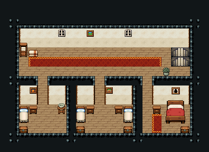

# 여관 2층 · 객실

여관 손님이 묵는 2층. 1층 동벽 계단을 오르면 복도 오른쪽 끝으로 나오고, 복도에서 뒷벽 문 틈으로 1인실·2인실·특실에 들어간다.

위 복도 18×3과 아래 객실 셋(1인실 5×3·2인실 6×3·특실 5×3)을 파이프라인 가로 칸막이(천장 한 줄+벽면 두 줄)와 세로 칸막이로 나눴다. 세로 칸막이 천장은 북쪽 천장까지 이어 붙였다. 복도: 1층 계단 자리(동벽 x=18~19)에 내려가는 돌계단 474|475, 붉은 러너, 린넨 장·이불 더미, 창 둘·그림, 화분. 1인실 침대·협탁·대야 받침·궤짝, 2인실 침대 둘·협탁 둘·궤짝 둘, 특실 목제 침대 3×3·화장대·붉은 깔개·커튼 창. 22×16, tilesetId=tibo_interior_expanded. 입구 (18,7). 통행 검사 목표 [[4,12],[10,12],[15,12],[3,6]].



## 놓은 소품 (저작 순서)
tibo-kit은 tibo_interior_expanded의 structureKits id, tiles는 직접 놓은 번호 행렬, rug는 카펫 오토타일 섬, floor는 바닥 재질 칠. (x,y)는 왼쪽 위.
```json
[
  {
    "kind": "tiles",
    "layer": "upper",
    "x": 18,
    "y": 5,
    "w": 2,
    "h": 2,
    "rows": [
      [
        474,
        475
      ],
      [
        474,
        475
      ]
    ],
    "role": "stairs"
  },
  {
    "kind": "rug",
    "group": "harness-interior-house-v1-terrain-red-carpet",
    "x": 3,
    "y": 6,
    "w": 14,
    "h": 1,
    "role": "rug"
  },
  {
    "kind": "tibo-kit",
    "kitId": "tibo-library-059",
    "name": "린넨 장",
    "x": 2,
    "y": 4,
    "w": 1,
    "h": 2,
    "role": "furn"
  },
  {
    "kind": "tibo-kit",
    "kitId": "tibo-library-037",
    "name": "접은 이불 더미",
    "x": 3,
    "y": 5,
    "w": 1,
    "h": 1,
    "role": "furn"
  },
  {
    "kind": "tiles",
    "layer": "upper",
    "x": 6,
    "y": 3,
    "w": 1,
    "h": 1,
    "rows": [
      [
        54
      ]
    ],
    "role": "hang"
  },
  {
    "kind": "tiles",
    "layer": "upper",
    "x": 13,
    "y": 3,
    "w": 1,
    "h": 1,
    "rows": [
      [
        54
      ]
    ],
    "role": "hang"
  },
  {
    "kind": "tiles",
    "layer": "upper",
    "x": 9,
    "y": 3,
    "w": 1,
    "h": 1,
    "rows": [
      [
        84
      ]
    ],
    "role": "hang"
  },
  {
    "kind": "tibo-kit",
    "kitId": "tibo-library-215",
    "name": "둥근 관목 화분",
    "x": 17,
    "y": 7,
    "w": 1,
    "h": 1,
    "role": "furn"
  },
  {
    "kind": "tiles",
    "layer": "upper",
    "x": 2,
    "y": 11,
    "w": 1,
    "h": 2,
    "rows": [
      [
        324
      ],
      [
        354
      ]
    ],
    "role": "furn"
  },
  {
    "kind": "tibo-kit",
    "kitId": "tibo-library-039",
    "name": "침대 옆 협탁",
    "x": 3,
    "y": 11,
    "w": 1,
    "h": 1,
    "role": "furn"
  },
  {
    "kind": "tibo-kit",
    "kitId": "tibo-library-050",
    "name": "대야 받침대",
    "x": 6,
    "y": 10,
    "w": 1,
    "h": 2,
    "role": "furn"
  },
  {
    "kind": "tibo-kit",
    "kitId": "tibo-library-045",
    "name": "여행용 궤짝",
    "x": 2,
    "y": 13,
    "w": 1,
    "h": 1,
    "role": "furn"
  },
  {
    "kind": "tiles",
    "layer": "upper",
    "x": 3,
    "y": 9,
    "w": 1,
    "h": 1,
    "rows": [
      [
        85
      ]
    ],
    "role": "hang"
  },
  {
    "kind": "tiles",
    "layer": "upper",
    "x": 8,
    "y": 11,
    "w": 1,
    "h": 2,
    "rows": [
      [
        324
      ],
      [
        354
      ]
    ],
    "role": "furn"
  },
  {
    "kind": "tibo-kit",
    "kitId": "tibo-library-039",
    "name": "침대 옆 협탁",
    "x": 9,
    "y": 11,
    "w": 1,
    "h": 1,
    "role": "furn"
  },
  {
    "kind": "tiles",
    "layer": "upper",
    "x": 13,
    "y": 11,
    "w": 1,
    "h": 2,
    "rows": [
      [
        324
      ],
      [
        354
      ]
    ],
    "role": "furn"
  },
  {
    "kind": "tibo-kit",
    "kitId": "tibo-library-039",
    "name": "침대 옆 협탁",
    "x": 12,
    "y": 11,
    "w": 1,
    "h": 1,
    "role": "furn"
  },
  {
    "kind": "tibo-kit",
    "kitId": "tibo-library-045",
    "name": "여행용 궤짝",
    "x": 8,
    "y": 13,
    "w": 1,
    "h": 1,
    "role": "furn"
  },
  {
    "kind": "tibo-kit",
    "kitId": "tibo-library-045",
    "name": "여행용 궤짝",
    "x": 13,
    "y": 13,
    "w": 1,
    "h": 1,
    "role": "furn"
  },
  {
    "kind": "tiles",
    "layer": "upper",
    "x": 11,
    "y": 9,
    "w": 1,
    "h": 1,
    "rows": [
      [
        86
      ]
    ],
    "role": "hang"
  },
  {
    "kind": "tibo-kit",
    "kitId": "tibo-fantasy-bed",
    "name": "목제 침대",
    "x": 17,
    "y": 10,
    "w": 3,
    "h": 3,
    "role": "furn"
  },
  {
    "kind": "tibo-kit",
    "kitId": "tibo-library-039",
    "name": "침대 옆 협탁",
    "x": 16,
    "y": 11,
    "w": 1,
    "h": 1,
    "role": "furn"
  },
  {
    "kind": "tibo-kit",
    "kitId": "tibo-library-045",
    "name": "여행용 궤짝",
    "x": 19,
    "y": 13,
    "w": 1,
    "h": 1,
    "role": "furn"
  },
  {
    "kind": "rug",
    "group": "harness-interior-house-v1-terrain-red-carpet",
    "x": 16,
    "y": 12,
    "w": 1,
    "h": 2,
    "role": "rug"
  },
  {
    "kind": "tiles",
    "layer": "upper",
    "x": 18,
    "y": 9,
    "w": 1,
    "h": 1,
    "rows": [
      [
        56
      ]
    ],
    "role": "hang"
  }
]
```

전체 두 레이어는 다음 배열 문서가 정답이다.
